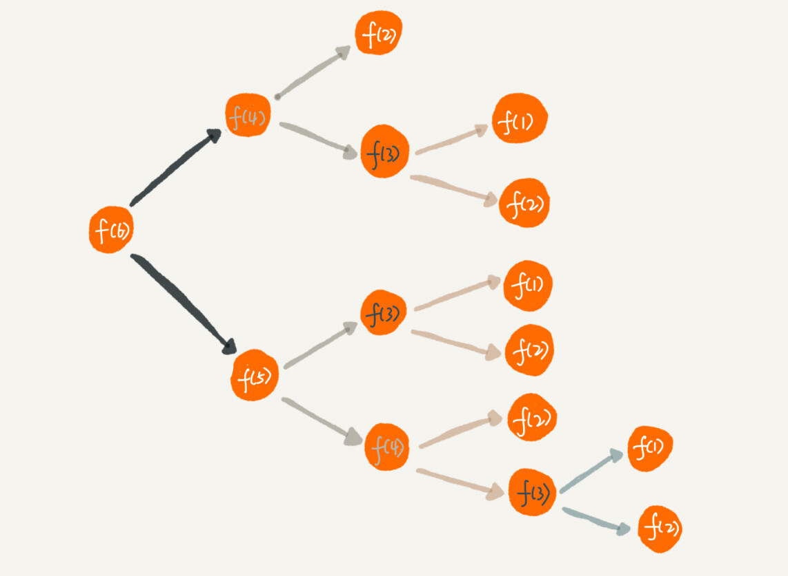

# 递归思想

---

## 如何理解“递归”

> 举一个生活中的例子：在电影院看电影时，想知道自己是第几排，于是你就问前面一排的人他是第几排，你想只要在他的数字上加一，就知道自己在哪一排了。但是，前面的人也不知道自己是第几排，所以他也问他前面的人。就这样一排一排往前问，直到问到第一排的人，说我在第一排，然后再这样一排一排再把数字传回来。直到你前面的人告诉你他在哪一排，于是你就知道答案了。

这就是一个非常标准的递归求解问题的分解过程，**去的过程叫“递”**，**回来的过程叫“归”**。基本上，所有的递归问题都可以用递推公式来表示。刚刚这个生活中的例子，我们用递推公式将它表示出来就是这样的：

~~~java
	f(n)=f(n-1)+1 其中，f(1)=1
~~~

f(n) 表示你想知道自己在哪一排，f(n-1) 表示前面一排所在的排数，f(1)=1 表示第一排的人知道自己在第一排。有了这个递推公式，我们就可以很轻松地将它改为递归代码，如下：

~~~java
    int f(int n) {
      if (n == 1) return 1;
      return f(n-1) + 1;
    }
~~~

## 递归需要满足的三个条件

### 1. 一个问题的解可以分解为几个子问题的解

子问题就是数据规模更小的问题。在电影院的例子中，“自己在哪一排”的问题，可以分解为“前一排的人在哪一排这样一个子问题。

### 2. 这个问题与分解之后的子问题，除了数据规模不同，求解思路完全一致

在电影院的例子中，你求解“自己在哪一排”的思路，和前面一排人求解“自己在哪一排”的思路，是完全一致的。

### 3. 存在递归终止条件

把问题分解为子问题，把子问题再分解为子子问题，一层一层分解下去，不能存在无限循环，这就需要有终止条件。

在电影院的例子中，第一排的人不需要再继续询问任何人，就知道自己在哪一排，也就是 f(1)=1，这就是递归的终止条件。

## 如何编写递归代码

* 写递归代码最关键的是找到如何==**将大问题分解为小问题**==的规律，并且基于此==**写出递推公式**==，然后再推敲==**终止条件**==，最后将递推公式和终止条件翻译成代码。

### 正确的思维方式

计算机擅长做重复的事情，所以递归正合它的胃口。而我们人脑更喜欢平铺直叙的思维方式。当我们看到递归时，如果总想把递归平铺展开，用人脑进行压栈，试图想搞清楚计算机每一步都是怎么执行的，就很容易被绕进去。对于递归代码，这种试图想清楚整个递和归过程的做法，实际上是进入了一个思维误区。

**正确的思维方式**如下：

* 如果一个问题 A 可以分解为若干子问题 B、C、D，你可以假设子问题 B、C、D 已经解决，在此基础上思考如何解决问题 A。而且，你只需要思考问题 A 与子问题 B、C、D 两层之间的关系即可，不需要一层一层往下思考子问题与子子问题，子子问题与子子子问题之间的关系。
* 编写递归代码的关键是，只要遇到递归，我们就把它==抽象成一个递推公式==，不用想一层层的调用关系，不要试图用人脑去分解递归的每个步骤。

#### 举例分析

假如这里有 n 个台阶，每次你可以跨 1 个台阶或者 2 个台阶，请问走这 n 个台阶有多少种走法？如果有 7 个台阶，你可以 2，2，2，1 这样走，也可以 1，2，1，1，2 这样走，如何用编程求得总共有多少种走法？

* 可以根据第一步的走法把所有走法分为两类，第一类是第一步走了 1 个台阶，另一类是第一步走了 2 个台阶。所以 n 个台阶的走法就等于先走 1 阶后，n-1 个台阶的走法 加上先走 2 阶后，n-2 个台阶的走法。所以**递推公式**如下：

  ~~~ java
  	f(n) = f(n-1)+f(n-2)
  ~~~

* 再来看**终止条件**。当有一个台阶时，我们不需要再继续递归，就只有一种走法。所以 f(1)=1。这个递归终止条件足够吗？我们可以用 n=2，n=3 这样比较小的数试验一下。n=2 时，f(2)=f(1)+f(0)。如果递归终止条件只有一个 f(1)=1，那 f(2) 就无法求解了。所以除了 f(1)=1 这一个递归终止条件外，还要有 f(0)=1，表示走 0 个台阶有一种走法，不过这样看起来不符合正常的逻辑思维。所以，我们可以把 f(2)=2 作为一种终止条件，表示走 2 个台阶，有两种走法，一步走完或者分两步来走。所以，**递归终止条件**就是 f(1)=1，f(2)=2。将递归终止条件和刚刚得到的递推公式放到一起：

  ~~~java
      f(1) = 1;
      f(2) = 2;
      f(n) = f(n-1)+f(n-2)
  ~~~

* **转化成递归代码**

  ~~~java
      int f(int n) {
        if (n == 1) return 1;
        if (n == 2) return 2;
        return f(n-1) + f(n-2);
      }
  ~~~

  

## 递归代码警惕堆栈溢出

函数调用会使用栈来保存临时变量。每调用一个函数，都会将临时变量封装为栈帧压入内存栈，等函数执行完成返回时，才出栈。系统栈或者虚拟机栈空间一般都不大。如果递归求解的数据规模很大，调用层次很深，一直压入栈，就会有堆栈溢出的风险。

## 递归代码警惕重复计算

以台阶的题目为例：

从图中，我们可以直观地看到，想要计算 f(5)，需要先计算 f(4) 和 f(3)，而计算 f(4) 还需要计算 f(3)，因此，f(3) 就被计算了很多次，这就是重复计算问题。

为了避免重复计算，我们可以通过一个数据结构（比如散列表）来保存已经求解过的 f(k)。当递归调用到 f(k) 时，先看下是否已经求解过了。如果是，则直接从散列表中取值返回，不需要重复计算，这样就能避免刚讲的问题了。

按照上面的思路，修改代码实现：

~~~java
    public int f(int n) {
      if (n == 1) return 1;
      if (n == 2) return 2;

      // hasSolvedList可以理解成一个Map，key是n，value是f(n)
      if (hasSolvedList.containsKey(n)) {
        return hasSolvedList.get(n);
      }

      int ret = f(n-1) + f(n-2);
      hasSolvedList.put(n, ret);
      return ret;
    }
~~~

## 实际场景分析——如何用三行代码找到“最终推荐人”

现在很多 App 都有推荐注册返佣金的这个功能。该功能中，用户 A 推荐用户 B 来注册，用户 B 又推荐了用户 C 来注册。我们可以说，用户 C 的“最终推荐人”为用户 A，用户 B 的“最终推荐人”也为用户 A，而用户 A 没有“最终推荐人”。一般来说，我们会通过**数据库**来记录这种推荐关系。在数据库表中，我们可以记录两行数据，其中 actor_id 表示用户 id，referrer_id 表示推荐人 id。

基于这个背景，问题是，==给定一个用户 ID，如何查找这个用户的“最终推荐人”==？

递归代码实现如下：

~~~java
    long findRootReferrerId(long actorId) {
      Long referrerId = select referrer_id from [table] where actor_id = actorId;
      if (referrerId == null) return actorId;
      return findRootReferrerId(referrerId);
    }
~~~

实现起来很简洁，用三行代码就能搞定，不过在实际项目中，上面的代码并不能工作，因为存在两个问题。

1. 如果递归很深，可能会有**堆栈溢出**的问题。
   * 以用限制递归深度来解决。
2. 如果数据库里存在**脏数据**，我们还需要处理由此产生的无限递归问题。比如 demo 环境下数据库中，测试工程师为了方便测试，会人为地插入一些数据，就会出现脏数据。如果 A 的推荐人是 B，B 的推荐人是 C，C 的推荐人是 A，这样就会发生死循环。
   * 也可以用限制递归深度来解决。
   * 更高级的处理办法是：自动检测 A-B-C-A 这种“环”的存在。

## 总结

* 递归是一种非常高效、简洁的编码技巧。只要是满足“三个条件”的问题就可以通过递归代码来解决。
* 不过递归代码也比较难写、难理解。编写递归代码的关键是：
  1. 写出递推公式。
  2. 找出终止条件。
  3. 翻译成递归代码。
* 递归代码虽然简洁高效，但是，递归代码也有很多弊端。比如，堆栈溢出、重复计算、函数调用耗时多、空间复杂度高等，所以，在编写递归代码的时候，一定要控制好这些副作用。

## 附

规模比较大、递归层次很深的递归代码，几乎无法使用 IDE 的单步跟踪调试方式。对于递归代码，有什么好的调试方法？

> 1. 打印日志发现，递归值。
> 2. 结合==条件断点==进行调试。
