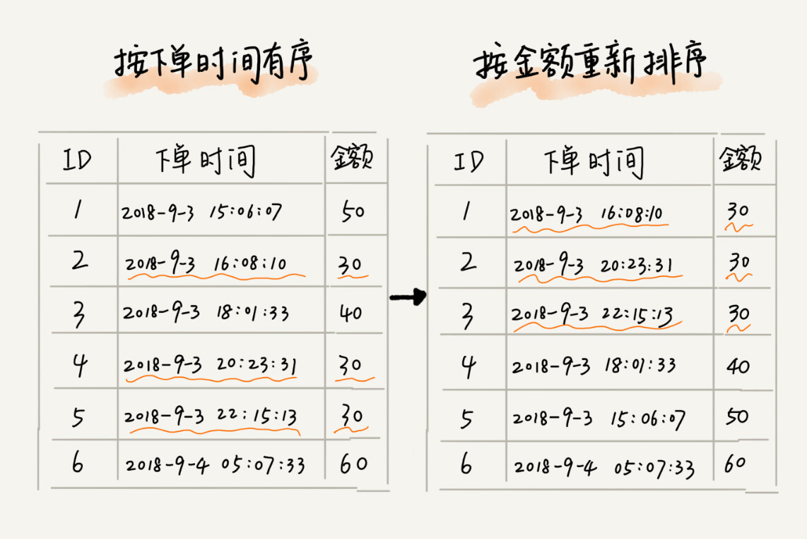
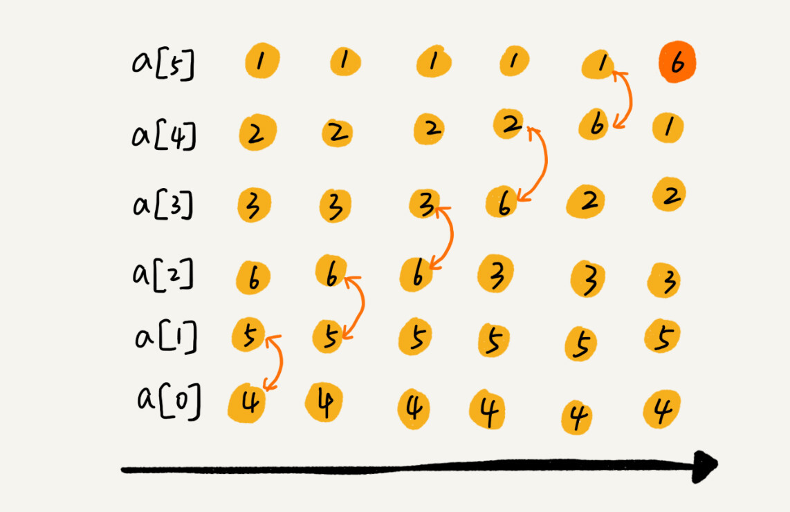
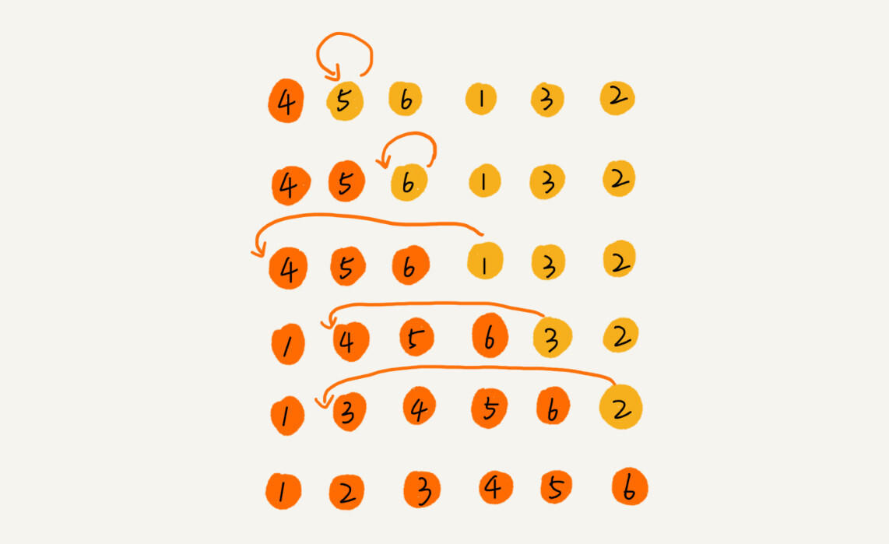
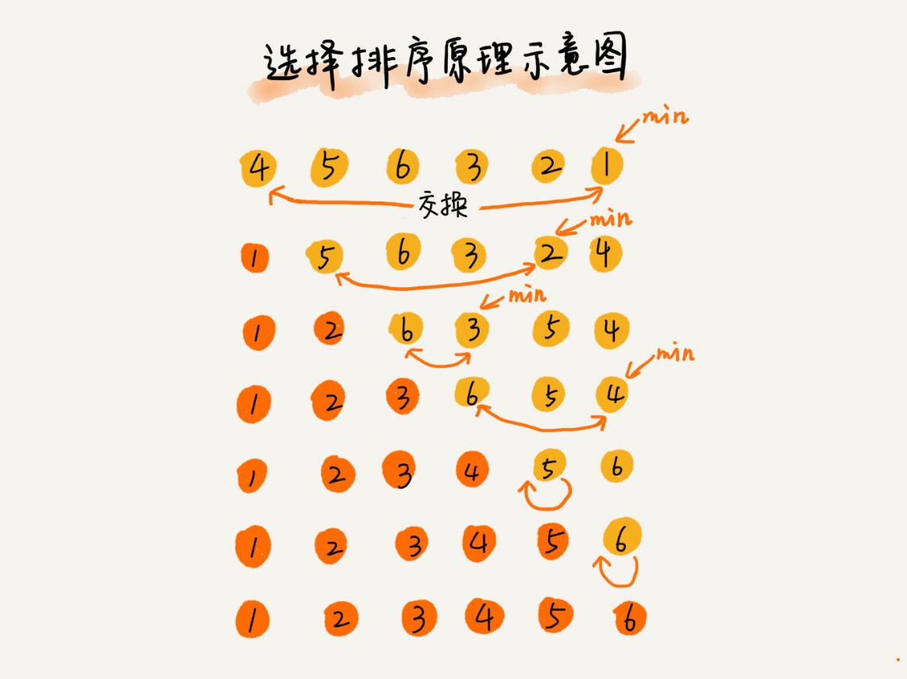

# 冒泡排序、插入排序、选择排序

---

排序算法 | 时间复杂度 | 是否基于比较
--- | --- | ---
冒泡、插入、选择 | O(n^2) | 是
快速排序、归并 | O(nlogn) | 是
桶、计数、基数 | O(n) | 否

## 

## Preview_如何分析一个“排序算法”

### 排序算法的执行效率

排序算法执行效率的分析，一般从三个方面衡量：

1. **最好情况、最坏情况、平均情况时间复杂度**
   * 对于要排序的数据，有的接近有序，有的完全无序。有序度不同的数据，对于排序的执行时间可能会有影响。
2. **时间复杂度的系数、常数 、低阶**
   * 时间复杂度反映的是数据规模 n 很大的时候的一个增长趋势，所以它表示的时候会忽略系数、常数、低阶。但是实际的软件开发中，我们排序的可能是 10 个、100 个、1000 个这样规模很小的数据，所以，在对同一阶时间复杂度的排序算法性能对比的时候，我们就要把系数、常数、低阶也考虑进来。
3. **比较次数和交换（或移动）次数**
   * 基于比较的排序算法的执行过程，会涉及两种操作，一种是元素比较大小，另一种是元素交换或移动。在分析排序算法的执行效率时，应该把比较次数和交换（或移动）次数也考虑进去。

### 排序算法的内存消耗

算法的内存消耗可以通过空间复杂度来衡量。针对排序算法的空间复杂度，引入了一个新的概念，**原地排序**（Sorted in place）。原地排序算法，就是特指空间复杂度是 O(1) 的排序算法。

> 冒泡、插入、选择三种排序算法都是原地排序算法。

### 排序算法的稳定性

判断排序算法稳定性的标准：待排序的序列中存在值相等的元素，经过排序之后，**相等元素之间原有的先后顺序不变**。

> 应用举例：要给电商交易系统中的“订单”排序。订单有两个属性，一个是下单时间，另一个是订单金额。如果我们现在有 10 万条订单数据，我们希望按照金额从小到大对订单数据排序。对于金额相同的订单，我们希望按照下单时间从早到晚有序。
>
> 解决办法：先按照下单时间给订单排序。排序完成之后，我们用**稳定排序算法**，按照订单金额重新排序。两遍排序之后，我们得到的订单数据就是按照金额从小到大排序，金额相同的订单按照下单时间从早到晚排序的。
>
> 

---

## 冒泡排序（Bubble Sort）

### 算法思想

冒泡排序只会操作相邻的两个数据。每次冒泡操作都会对相邻的两个元素进行比较，看是否满足大小关系要求。如果不满足就让它俩互换。一次冒泡会让至少一个元素移动到它应该在的位置，重复 n 次，就完成了 n 个数据的排序工作。

举例：4，5，6，3，2，1，从小到大进行排序。

第一趟排序过程如下：

全过程如下：

### 过程优化

当某次冒泡操作已经没有数据交换时，说明已经达到完全有序，不用再继续执行后续的冒泡操作。可以通过一个 boolean 值作为 flag 标记实现。

### 算法实现

~~~ java
	// 冒泡排序，a表示数组，n表示数组大小
	public void bubbleSort(int[] a, int n) {
        if (n <= 1) return;
        
        for (int i = 1; i < n; i++) {
            boolean flag = false;	// 提前退出冒泡循环的标志位
            for (int j = 0; j < n - i - 1; j++) {
                if (a[j] > a[j + 1]) {
                    // 交换
                    int temp = a[j];
                    a[j] = a[j + 1];
                    a[j + 1] = temp;
                    flag = true;	// 表示有数据交换
                }
            }
            if (!flag) break;	// 没有数据交换，提前退出
        }
    }
~~~

### 算法分析

* 空间复杂度：冒泡的过程只涉及相邻数据的交换操作，只需要常量级的临时空间，所以它的空间复杂度为 O(1)，是一个原地排序算法。
* 是否是稳定的：可以是稳定的。在冒泡排序中，只有交换才可以改变两个元素的前后顺序。为了保证冒泡排序算法的稳定性，设置交换条件——当有相邻的两个元素大小相等的时，不做交换。
* 时间复杂度：
  * 最好的情况下，要排序的数据已经是有序的了，我们只需进行一次冒泡操作，就可以判断结束。所以最好情况时间复杂度是 O(n)。
  * 最坏的情况下，要排序的数据刚好是倒序排列的，我们需要进行 n 次冒泡操作，所以最坏情况时间复杂度为 O(n2)。
  * 平均情况（这里不采用概率论的定量分析），考虑有序度，对于包含 n 个数据的数组进行冒泡排序，最坏情况下，初始状态的有序度是 0，所以要进行 n(n-1)/2 次交换。最好情况下，初始状态的有序度是 n(n-1)/2，就不需要进行交换。我们可以取个中间值 n(n-1)/4，来表示初始有序度既不是很高也不是很低的平均情况。

> **有序度**、**逆序度**、**满有序度**
>
> **有序度**是数组中具有有序关系的元素对的个数。有序元素对用数学表达式表示如下
>
> ~~~
> 有序元素对：a[i] <= a[j], 如果i < j。
> ~~~
>
> 对于一个倒序排列的数组，比如 6，5，4，3，2，1，有序度是 0；对于一个完全有序的数组，比如 1，2，3，4，5，6，有序度就是 n*(n-1)/2，也就是 15。我们把这种完全有序的数组的有序度叫作**满有序度**。
>
> **逆序度**的定义正好跟有序度相反（默认从小到大为有序）
>
> ~~~ 
> 逆序元素对：a[i] > a[j], 如果i < j。
> ~~~
>
> 所以三个概念的关系为：**逆序度 = 满有序度 - 有序度**

## 插入排序（Insertion Sort）

### 算法思想

首先，将数组中的数据分为两个区间，**已排序区间**和**未排序区间**。初始已排序区间只有一个元素，就是数组的第一个元素。插入算法的**核心思想**是==取**未排序区间**中的**首元素**，在**已排序区间**中找到**合适的插入位置**将其插入，并保证已排序区间数据一直有序==。重复这个过程，直到未排序区间中元素为空，算法结束。

举例：要排序的数据是 4，5，6，1，3，2，其中左侧为已排序区间，右侧是未排序区间。

### 算法实现

~~~java
	// 插入排序，a表示数组，n表示数组大小
	public void insertionSort(int[] a, int n) {
        if (n <= 1) return;
        
        for (int i = 1; i < n; i++) {
            int value = a[i];	// 每一趟要插入到有序部分的数据
            int j = i - 1;
            // 从后向前寻找插入位置
            for (; j>= 0; j--) {
                if (a[j] > value) {
                    a[j + 1] = a[j];	// 大的数据向后移动
                } else {
                    break;	// 此时 a[j] 为插入位置的前驱元素
                }
            }
            a[j + 1] = value;	// 插入数据
        }
    }
~~~

### 复杂度分析

* 空间复杂度：O(1)，是原地排序算法。
* 是否是稳定的：可以是稳定的。对于值相同的元素，可以选择将后面出现的元素，插入到前面出现元素的后面，保证原有的前后顺序不变。
* 时间复杂度：
  * 最好情况：O(n)。数组有序，一趟遍历。
  * 最坏情况：O(n2)。数组倒序。
  * 平均情况：O(n2)。数组中插入一个数据的平均时间复杂度取 O(n)，所以整体为O(n2)。

## 选择排序（Selection Sort）

### 算法思想

选择排序算法的实现思路有点类似插入排序，也分已排序区间和未排序区间。但是==选择排序每次会从**未排序区间**中找到**最小的元素**，将其放到**已排序区间的末尾**==。

### 算法实现

~~~java
     // 将a[]按升序排列
	public static void selectionSort(int[] a, int n) {
        int N = a.length;	// 数组长度
        for (int i = 0; i < N; i++) {
            // 将a[i]和a[i+1...N-1]中最小的元素交换
            int min = i;
            // 找到无序部分最小元素下标
            for (int j = i + 1; j < N; j++) {
                if (a[j] < a[min]) min = j;
            }
            // 交换
            int temp = a[i];
            a[i] = a[min];
            a[min] = a[i];
        }
    }
~~~

### 复杂度分析

* 空间复杂度：O(1)，是原地排序算法。
* 是否是稳定的：不稳定。比如 5，8，5，2，9 这样一组数据，使用选择排序算法来排序的话，第一次找到最小元素 2，与第一个 5 交换位置，则第一个 5 和中间的 5 顺序发生改变。正是因此，相对于冒泡排序和插入排序，选择排序稍显逊色。
* 时间复杂度：本算法时间开销与待排序元素初始状态无关。
  * 最好情况：O(n2)。
  * 最坏情况：O(n2)。
  * 平均情况：O(n2)。

---

## 小结

分析、评价一个排序算法，需要从**执行效率**、**内存消耗**和**稳定性**三个方面来看。

本篇涉及的三种排序算法分析结果如下：

| 排序算法 | 是否为原地排序 | 是否稳定 | 最好	最坏	平均  |
| -------- | -------------- | -------- | --------------------- |
| 冒泡排序 | 是             | 是       | O(n)   O(n2)   O(n2)  |
| 插入排序 | 是             | 是       | O(n)   O(n2)   O(n2)  |
| 选择排序 | 是             | 否       | O(n2)   O(n2)   O(n2) |

这三种时间复杂度为 O(n2) 的排序算法中，冒泡排序、选择排序，可能纯粹停留在理论的层面，学习的目的主要是为了开拓思维，实际开发中应用并不多，但插入排序有一定应用，例如有些编程语言中的排序函数的实现原理会用到插入排序算法。对于小规模数据的排序，这三种算法实现代码非常简单，用起来比较高效。但是在大规模数据排序的时候，O(n2)的时间复杂度还是偏高。

## 附加问题

* 为什么插入排序要比冒泡排序更受欢迎？

> 答：冒泡排序不管怎么优化，元素交换的次数是一个固定值，是原始数据的逆序度；同样的，插入排序不管怎么优化，元素移动的次数也等于原始数据的逆序度。但是，从代码实现上来看，冒泡排序的数据交换要比插入排序的数据移动要复杂，冒泡排序需要 3 个赋值操作，而插入排序只需要 1 个。所以从理论上分析，**冒泡排序所花费的时间要比插入排序长得多**。虽然冒泡排序和插入排序在时间复杂度上是一样的，都是 O(n2)，但如果希望把**性能优化**做到极致，==**首选插入排序**==。

~~~java
// 冒泡排序中数据的交换操作：
if (a[j] > a[j+1]) { // 交换
   int tmp = a[j];
   a[j] = a[j+1];
   a[j+1] = tmp;
   flag = true;
}

// 插入排序中数据的移动操作：
if (a[j] > value) {
  a[j+1] = a[j];  // 数据移动
} else {
  break;
}
~~~

> 插入排序有很大的优化空间，如**希尔排序**算法。

* 本篇的三种排序算法，都是基于数组实现的。如果数据存储在链表中，这三种排序算法还能工作吗？如果能，那相应的时间、空间复杂度又是多少呢？

> 答：只能改变节点位置，冒泡排序相比于数组实现，比较次数一致，但交换时操作更复杂；插入排序，比较次数一致，不需要再有后移操作，找到位置后可以直接插入，但排序完毕后可能需要倒置链表；选择排序比较次数一致，交换操作同样比较麻烦。综上，时间复杂度和空间复杂度并无明显变化，若追求极致性能，冒泡排序的时间复杂度系数会变大，插入排序系数会减小，选择排序无明显变化。
