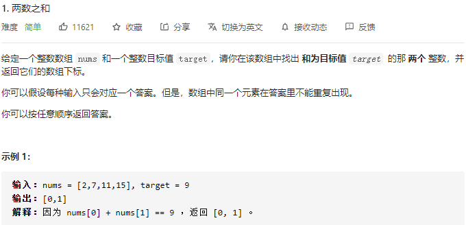
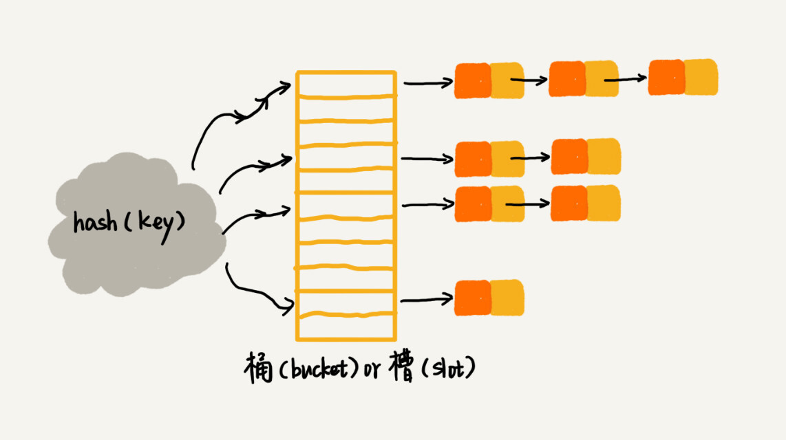
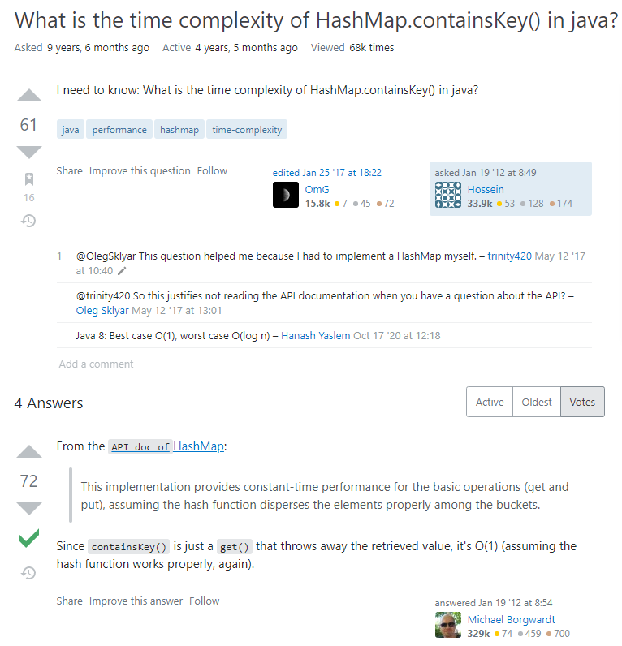
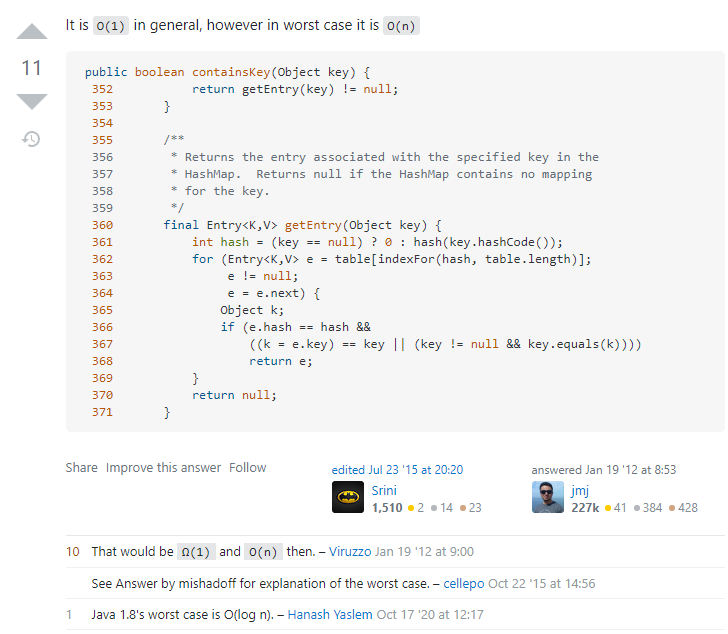

# LeetCode_1_两数之和

难度（easy）

---

   

## 方法1：枚举

 

### 思路

最简单的方法是枚举数组中的每一个数 x，寻找数组中是否存在 target - x。使用冒泡排序的框架，令每两个元素之间比较一次即可。

### 复杂度分析

* 时间复杂度：O(n2)，所需时间为等差数列（1 ... n）之和，时间开销二阶。
* 空间复杂度：O(1)，只需一个变量存储数组长度。

优点：思路简单，空间最优。

缺点：枚举时间效率较低。

### 代码实现

~~~java
    public int[] twoSum_Violent(int[] nums, int target) {
        int n = nums.length;
        for (int i = 0; i < n; ++i) {
            for (int j = i + 1; j < n; ++j) {
                if (nums[i] + nums[j] == target) {
                    return new int[]{i, j};
                }
            }
        }
        return new int[0];
    }
~~~

      

---

      

## 方法2：HashTable

### 思路

构造哈希表，采用空间换时间的方法。对于每一个数 x，想知道数组中是否存在 target - x ，遍历查找的时间复杂度都为 O(n)，用哈希表可将每一次查找的效率降至 O(1)。

  

### 哈希表键 / 值的设计

查找的目标是已知数组元素值来查找对应下标，所以哈希表的键（key）设为数组元素值；哈希表的值（value）设置为该元素值对应的下标。

  

### 遍历过程

1. 从下标 0 开始遍历数组，对于每一个元素 nums[i]，先查看哈希表中是否存在一个**键**（**key**）== target - nums[i]
2. 如果有说明 key + nums[i] == target，即找到了数组中的两个数nums[i], key，其和 == target，此时前者的下标为 i，后者 key 的下标可通过哈希映射在 O(1)时间内访问，所以直接返回即可
3. 如果哈希表中不存在 key == target - nums[i]，则将当前的 nums[i], i 作为 **键** **/** **值** 对加入哈希表。之后的循环过程中，每个元素将继续搜索是否含有目标键（key） == target - nums[i]
4. 如果全部遍历后没有合法结果，返回空数组 new int[0]

  

### 代码实现

~~~java
    /**
     * 两数之和_HashTable
     * Version 2.0 2021-07-20 by XCJ
     * @param nums int[] 数组，存储全部元素
     * @param target int 两个数的目标之和
     * @return 两个数在数组中的下标
     */
    public int[] twoSum(int[] nums, int target) {
        Map<Integer, Integer> hashTable = new HashMap<Integer, Integer>();
        // 最外层循环，对数组 nums[] 进行遍历
        for (int i = 0; i < nums.length; ++i) {
            // 查找 hashTable 是否存在键 target - nums[i])
            if (hashTable.containsKey(target - nums[i])) {
                return new int[] { hashTable.get(target - nums[i]), i };
            }
            // 如果不存在，则将 nums[i] / i 作为 键/值 对加入HashTable
            hashTable.put(nums[i], i);
        }
        return new int[0];
    }
~~~

  

### 复杂度分析

* 空间复杂度：O(n)，其中 n 是数组中的元素数量。主要为哈希表的开销。
* 时间复杂度：最好情况为O(n)，最坏情况为O(n2)。这里做一下详细分析。首先最外层的循环是对数组 nums[] 的遍历，总体时间复杂度取决于每个元素的处理时间是否为 O(1)。**处理每个元素时，调用了** **hashTable.containsKey()** 方法查看键 **target - nums[i]** **是否存在哈希表中。**其它所有的判断、插入操作均可以在 O(1)时间内实现，==所以问题关键在于 **hashTable.containsKey()** **的执行效率**==。

~~~java
        Map<Integer, Integer> hashTable = new HashMap<Integer, Integer>();
        // 最外层循环，对数组 nums[] 进行遍历
        for (int i = 0; i < nums.length; ++i) {
            // 查找 hashTable 是否存在键 target - nums[i])
            if (hashTable.containsKey(target - nums[i])) {
                return new int[] { hashTable.get(target - nums[i]), i };
            }
            // 如果不存在，则将 nums[i] / i 作为 键/值 对加入HashTable
            hashTable.put(nums[i], i);
        }
        return new int[0];
    }
~~~

 

> 国内网站我没有找到对该方法的详细分析，朋友在国外的** **stackoverflow** **网站上搜到了一些解答（截图附在最后），但讲得都比较笼统，所以我自己翻源码试着解析了一下。具体说明如下。

 HashMap.containsKey() 的源码如下，**该方法调用了****getNode(key)** **方法，并根据返回值是否为** **null** **判断是否含有键** **key****。

下面我们来分析被调用的 **getNode()** 方法，（这个源码把各种变量初始化操作全塞到判断语句里面简直是骚的飞起，我这辈子从没这么玩过）。大概可以看出它先**判断哈希表是否为空**，不空的话通过参数 key **计算** 出 key 对应的**哈希值**（存储索引），然后将索引赋值给临时变量 **first**，此时 **first** 保存的是由参数 **key** 计算所得的**键值对首元素**。

由源码后序 e = e.next; 等迭代操作不难推测，这里实现的哈希表是以链式存储的方式解决哈希冲突的。刚才通过一系列计算得到的键值对 **first**，是==**参数** **key** **所映射的桶的首元素**==。接下来想要返回以 key 为键的键值对，只需要**遍历以** **first** **为首元的链表，将每个键值对节点的** **key** **与参数传入的目标** **key** **进行比较：**

* 如果找到**非空相等键值**说明找到目标键值对，则返回该键值对

* 如果遍历至链表末尾，则说明不存在以 key 为键的键值对，此时返回 null。

再回到调用 **getNode()** 方法的 **containsKey(Object key)** 方法，containsKey(Object key) 方法的目的只是为了判断**是否存在以** **key** **为键的键值对**。此时该方法的设计思路自然可以理解：

* 如果 getNode() 方法返回了非空引用，说明找到了目标键值对，此时 **containsKey()** **返回** **true**；

* 如果 getNode() 方法返回了 null，说明没有找到，此时 **containsKey()** **返回** **false**。

> HashMap.containsKey() 源码如下 JDK版本为 jdk-16.0.1

~~~java
    /**
     * Implements Map.get and related methods.
     *
     * @param key the key
     * @return the node, or null if none
     */
    final Node<K,V> getNode(Object key) {
        Node<K,V>[] tab; Node<K,V> first, e; int n, hash; K k;
        if ((tab = table) != null && (n = tab.length) > 0 &&
            (first = tab[(n - 1) & (hash = hash(key))]) != null) {
            if (first.hash == hash && // always check first node
                ((k = first.key) == key || (key != null && key.equals(k))))
                return first;
            if ((e = first.next) != null) {
                if (first instanceof TreeNode)
                    return ((TreeNode<K,V>)first).getTreeNode(hash, key);
                do {
                    if (e.hash == hash &&
                        ((k = e.key) == key || (key != null && key.equals(k))))
                        return e;
                } while ((e = e.next) != null);
            }
        }
        return null;
    }

    /**
     * Returns {@code true} if this map contains a mapping for the
     * specified key.
     *
     * @param   key   The key whose presence in this map is to be tested
     * @return {@code true} if this map contains a mapping for the specified
     * key.
     */
    public boolean containsKey(Object key) {
        return getNode(key) != null;
    }
~~~

> 链表法解决哈希冲突结构如下图

综上所述，我们已经明确了 containsKey()方法如何判断哈希表是否包含键 key，即使用 hash 编码的方法，==时间效率与哈希表的结构有关（**与冲突情况有关**）==：

* 如果不存在哈希冲突，则通过计算一次便可访问目标键值对，判断在 **O(1)** 时间内完成。

* 如果存在哈希冲突，最坏的情况下所有的键值对都集中在一个桶内，此时需要 **O(n)** 的时间进行判断。

此时，整个函数内部循环体的时间复杂度已确定：最好为 O(1)，最坏为 O(n)，由于外层循环时间开销固定为 O(n)，所以函数总体时间复杂度为——**最好：O(n)，最坏：O(n2)**

      

---

      

## 涉及方法参考 Java8 API

>java.util
>
>**Class HashMap<K,V>**
>
>java.lang.Object
>
>java.util.AbstractMap<K,V>
>
>java.util.HashMap<K,V>
>
>**参数类型**
>
>K - 由该地图维护的键的类型
>
>V - 映射值的类型
>
>All Implemented Interfaces:
>
>Serializable ， Cloneable ， Map <K，V>
>
>**从以下版本开始**：
>
>1.2

> **HashMap.containsKey**
>
> **public boolean containsKey(Object key)**
>
> 如果此映射包含指定键的映射，则返回 true 。
>
> Specified by:
>
> containsKey在界面 Map<K,V>
>
> 重写：
>
> containsKey在类别 AbstractMap<K,V>
>
> 参数
>
> key - 要在这个地图上存在的密钥是要测试的
>
> 结果
>
> true如果此映射包含指定键的映射。

      

## 附：stackoverflow 前辈关于  **containsKey()**  方法的性能分析

[原文链接](https://stackoverflow.com/questions/8923251/what-is-the-time-complexity-of-hashmap-containskey-in-java#comment11496241_8923300)

### 部分截图

