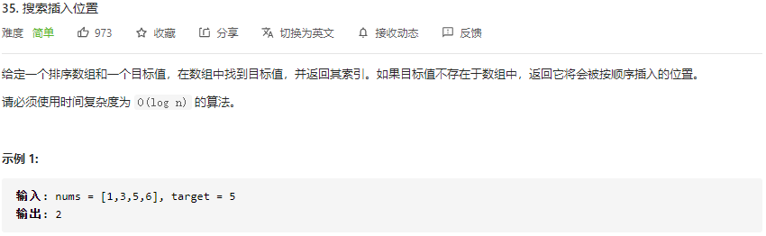

# LeetCode_35_搜索插入位置

难度（easy）

---

## 分析

标准的二分搜索。在 O(logn) 时间内实现。定义两个指针指向数组双端，以二分的方式逼近目标值。

## 优化

计算中点时使用速度更快的位运算替代算术运算

~~~java
	int mid = (right - left) / 2 + left  ->  int mid = ((right - left) >> 1) + left
~~~

## 复杂度分析

* 时间复杂度：O(logn)，二分法。
* 空间复杂度：O(1)，常数阶临时变量。

## 代码实现

~~~java
    /**
     * 寻找数组中心下标_遍历
     * Version 1.0 2021-07-21 by XCJ
     * Time: O(logn), Space: O(1)
     * @param nums 查找数组
     * @param target 目标值
     * @return 插入位置下标
     */
    public int searchInsert(int[] nums, int target) {
        int left = 0, right = nums.length - 1, res = nums.length;
        while (left <= right) {
            int mid = ((right - left) >> 1) + left; // (right - left) / 2 + left
            if (target <= nums[mid]) {
                res = mid;
                right = mid - 1;
            }
            else {
                left = mid + 1;
            }
        }
        return res;
    }
~~~

