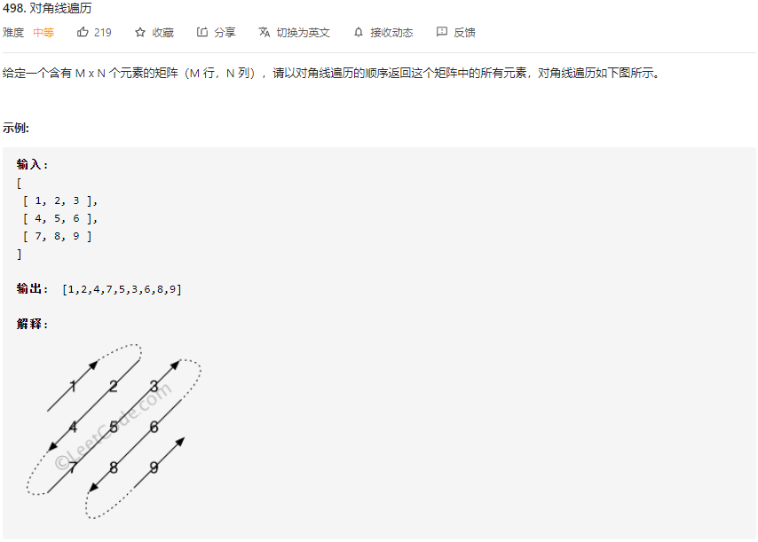

# LeetCode_498_对角线遍历

---

难度（medium）

## 方法1：使用两个标志位

### 思路

题目要求以对角线遍历的顺序进行访问，所以考虑使用两个顶点（四个坐标）定位当前对角线的位置。算法思路如下：

1. 右上坐标 (tR, tC) 初始位置为 (0, 0)，先沿着矩阵第一行向右移动 (tC++)，当到达第一行最右边的元素后，再沿着矩阵最后一列向下移动 (tR++)。
2. 左下坐标 (dR, dC) 初始位置为 (0, 0)，先沿着矩阵第一列向下移动 (dR++)，当到达第一列最下边的元素后，再沿着矩阵最后一行向右移动 (tR++)。
3. 右上顶点与左下顶点同步移动，每次移动后的右上顶点与左下顶点连线即为矩阵中的一条斜线，按顺序访问斜线上的元素即可。
4. 如果上次斜线是从左下向右上访问的，这一次一定从右上向左下访问，反之亦然。因此，可以把打印方向用一个 boolean 标识表示，每次更新对角线时取反。

### 注意

更新对角线时，横纵坐标的更新顺序具有依赖关系，不可随意颠倒。（否则会导致**数组下标越界**）

* 右上顶点是否向下移动取决于**当前**是否已到达最右侧。（tR 依赖 tC 的当前状态）
  * 所以先更新行 tR 再更新列 tC。
* 坐下顶点是否向右移动取决于**当前**是否已到达最下方。（dC 依赖 dR 的当前状态）
  * 所以先更新列 dC 再更新行 dR。

### 复杂度分析

* 时间复杂度：O(mn)，m 为矩阵行数，n 为矩阵列数
* 空间复杂度：O(1)

### 代码实现

~~~java
    private int k = 0;	// 返回结果res[]的下标指针

    /**
     * 方法1：两个标志位
     * Version 1.0 2021-07-27 by XCJ
     * @param matrix 待遍历数组
     * @return 对角线遍历结果
     */
    public int[] findDiagonalOrder(int[][] matrix) {
        if (matrix == null || matrix.length == 0) {
            return new int[]{};
        }
        int tR = 0;     // 右上标志位横坐标
        int tC = 0;     // 右上标志位纵坐标
        int dR = 0;     // 左下标志位横坐标
        int dC = 0;     // 左下标志位纵坐标
        int endR = matrix.length -1;
        int endC = matrix[0].length - 1;
        int[] res = new int[(endR + 1) * (endC + 1)];
        boolean fromUp = false;
        while  (tR != endR + 1) {
            traverseDiagonal(matrix, tR, tC, dR, dC, fromUp, res);   // 遍历一个对角线
            tR = tC == endC ? tR + 1 : tR; 		// 注意更新顺序
            tC = tC == endC ? tC : tC + 1;
            dC = dR == endR ? dC + 1 : dC;
            dR = dR == endR ? dR : dR + 1;
            fromUp = !fromUp;   // 方向取反
        }
        return res;
    }

    // 访问一条对角线的元素，并将访问结果按顺序存储在 res[] 中
    public void traverseDiagonal(int[][] m, int tR, int tC, int dR, int dC, boolean fromUp, int[] res) {
        if (fromUp) {
            // 自右上向左下访问对角线元素
            while (tR != dR + 1) {
                res[k++] = m[tR++][tC--];
            }
        }
        else {
            // 自左下向右上访问对角线元素
            while (dR != tR - 1) {
                res[k++] = m[dR--][dC++];
            }
        }
    }
~~~

---

## 方法2：找规律（from LeetCode comments）

### 思路

设每个对角线为一层。观察规律可知，遍历方向由层数决定，而层数即为横纵坐标之和。分遍历过程分情况进行讨论。

### 复杂度分析

* 时间复杂度：O(mn)，m 为矩阵行数，n 为矩阵列数
* 空间复杂度：O(1)

### 代码实现

~~~java
/**
     * 方法2：找规律
     * Version 1.0 2021-07-27 from LeetCode comments
     * @param matrix 待遍历数组
     * @return 对角线遍历结果
     */
public int[] findDiagonalOrder_2(int[][] matrix) {
    if (matrix == null || matrix.length == 0) {
        return new int[]{};
    }
    int r = 0, c = 0;
    int row = matrix.length, col = matrix[0].length;
    int[] res = new int[row * col];
    for (int i = 0; i < res.length; i++) {
        res[i] = matrix[r][c];
        // r + c == 当前层数，偶数向右上遍历，奇数向左下遍历
        if ((r + c) % 2 == 0) {
            if (c == col - 1) {
                // 下移一格准备向下遍历
                r++;
            } else if (r == 0) {
                // 向右移动一格准备向下遍历
                c++;
            } else {
                // 向右上方移动
                r--;
                c++;
            }
        } else {
            if (r == row - 1) {
                // 移一格准备向上遍历
                c++;
            } else if (c == 0) {
                // 向下移动一格准备向上遍历
                r++;
            } else {
                // 向下移动
                r++;
                c--;
            }
        }
    }
    return res;
}
~~~