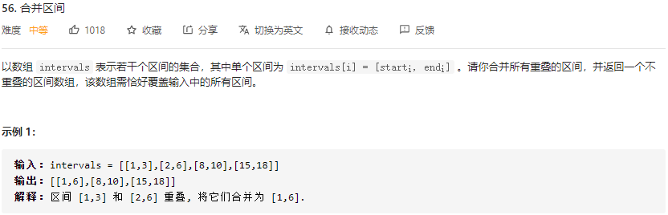

# LeetCode_56_合并区间

难度（medium）

---

## 分析

整体思路为 排序 + 遍历合并。排序直接调库。第二趟合并时通过比较区间上界决定是否合并。判断合并时方法如下：

 	1. 如果有重叠，找到满足条件的最大起点（合并后的最大上界由 high 保存，减少判断次数）
 	2.  如果没有重叠，直接将区间加入结果数组

## 注意

1. 调用库函数时使用对**象比较器接口** **Comparator** ，需要**重写** **compare()** 方法。可选择可**重写接口对应的** **compare()** **方法** 或**使用** **lambda** **表达式**

   重写接口方法：（注意重写的方法的位置，是直接作为参数传入 Arrays.sort()）

   ~~~java
   Arrays.sort(intervals, new Comparator<int []>() {
   	public int compare(int[] interval1, int[] interval2) {
   			return interval1[0] -  interval2[0];
   		}
   });
   ~~~

   使用 lambda 表达式：（简洁一些，但不太常见）

   ~~~java
   Arrays.sort(intervals, (a, b) -> a[0] - b[0])
   ~~~

2. **List.toArray()** 调用的时候一般要传一个数组指定类型，如果不传参数会默认返回 **Object** **类型** 数组。toArray() 方法内部会自动判断传入数组大小是否小于 list 中元素的个数，如果小于则会新建一个大小等于元素个数的新数组，写入数据后返回，否则写入传入的数组，然后返回。

## 复杂度分析

* 时间复杂度：O(nlogn)。排序使用 Java 库函数 Arrays.sort()，是优化的快速排序，时间开销为O(nlogn)，第二趟遍历时间开销为O(n)，所以整体开销O(nlogn)。
* 空间复杂度：O(logn)。logn 是快排所需的额外空间，返回的结果可能大于 logn，这里不算在额外开销内。

---

## 代码

~~~java
    /**
     * 合并区间
     * Version 1.0 2021-07-21 by XCJ
     * Time: O(nlogn), Space: O(logn)
     * @param intervals 待合并数组序列
     * @return 合并后的数组序列
     */
    public int[][] merge(int[][] intervals) {
        if (intervals.length == 0) {
            return new int[0][2];
        }
        // 将区间数组按区间下界升序排列（重写Comparator[] 接口的 compare() 方法）
        Arrays.sort(intervals, new Comparator<int[]>() {
            public int compare(int[] interval1, int[] interval2) {
                return interval1[0] - interval2[0];
            }
        });
        List<int[]> arrayMerged = new ArrayList<int[]>();
        for (int i = 0; i < intervals.length; i++) {
            int low = intervals[i][0], high = intervals[i][1];
            // 如果有重叠，找到满足条件的最大起点（减少判断次数）
            while (i < intervals.length - 1 && intervals[i + 1][0] <= high) {
                i++;
                high = Math.max(high, intervals[i][1]);
            }
            // 合并区间加入结果数组
            arrayMerged.add(new int[] {low, high});
        }
        return arrayMerged.toArray(new int[arrayMerged.size()][]);
    }
~~~

