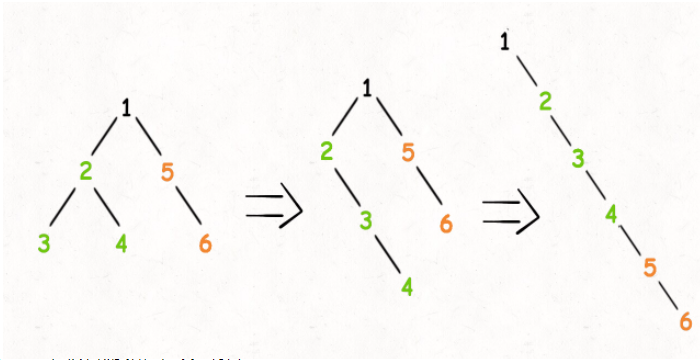

# LeetCode_114_二叉树展开为链表

难度（medium)

---

## 方法1：递归

### 分析

要将整棵二叉树拉成链表（一条线），首先要将根节点的左、右子树拉成链表，所以递归算法的设计采用后序遍历的结构，先处理左、右子节点，然后再处理根节点。



> 图片来源：作者labuladong

通过观察规律可知，对于根节点的处理包括：将左子树连接至根节点右子树处，将左子树置空，将原右子树连接至现右子树最右节点的右指针。

* 递归出口：root == null
* 处理左右子树：flattern(root.left); flattern(root.right);
* 处理根节点：
  1.  保存原右子树
  2. 左子树移动至根节点右子树位置
  3. 寻找最右节点
  4. 原右子树连接至最右节点

### 复杂度分析

* 时间复杂度：O(n)，遍历所有节点。
* 空间复杂度：O(n)，由系统维护函数栈。最坏情况为O(n)，树呈链状；最好为O(logn)，完全二叉树。

### 代码实现

```java
/**
 * 递归_二叉树展开为链表
 * Version 2.0 2021-07-19 by XCJ
 * Time: O(n), Space: O(n)
 * @param root 二叉树根节点
 */
public void flatten(TreeNode root) {
    if (root == null) return;

    // 先处理左右子树
    flatten(root.left);
    flatten(root.right);
    /* 后序遍历位置 */
    // 保存原右子树
    TreeNode rightTree = root.right;
    // 左子树移动至右子树
    root.right = root.left;
    root.left = null;
    // 找到最右节点
    TreeNode rightMost = root;
    while (rightMost.right != null) {
        rightMost = rightMost.right;
    }
    // 原右子树连接至最右节点
    rightMost.right = rightTree;
}
```

---

## 方法2：迭代

### 思路

与 Morris 遍历类似，找到遍历过程的前驱节点替代栈的作用，将空间复杂度优化为O(1)。由于数据量较小，所以优化效果并不明显。

### 复杂度分析

* 时间复杂度：O(n)，遍历所有节点。
* 空间复杂度：O(1)，只需一个变量存储遍历前驱节点。

### 代码实现

```java
/**
 * 迭代_二叉树展开为链表
 * Version 2.0 2021-07-19 by XCJ
 * Time: O(n), Space: O(1)
 * @param root 二叉树根节点
 */
public void flatten_Iteration(TreeNode root) {
    TreeNode currNode = root;
    while (currNode != null) {
        if (currNode.left != null) {
            // find predecessor
            TreeNode predecessor = currNode.left;
            while (predecessor.right != null) {
                predecessor = predecessor.right;
            }
            predecessor.right = currNode.right;
            currNode.right = currNode.left;
            currNode.left = null;
        }
        currNode = currNode.right;
    }
}
```