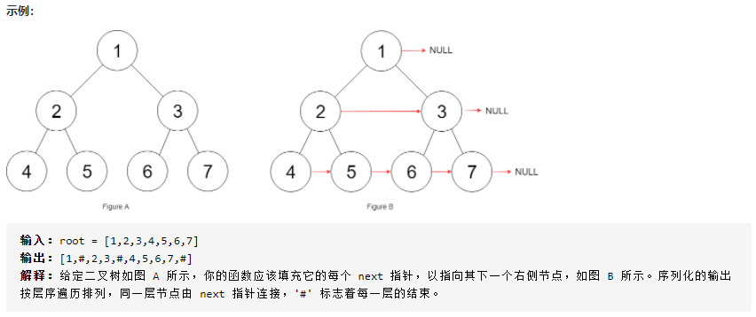
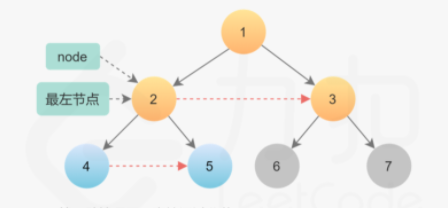
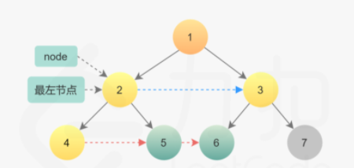

# LeetCode_116_填充每个节点的下一个右侧指针

难度（medium）



---

## 方法1：递归

### 思路

本题的特殊之处在于，存在连接跨父节点的两个相邻节点进行相连的情况。解决办法是增加函数参数，在函数实现中令两个参数相连，在函数递归调用过程中增加跨父节点的情况。

### 复杂度分析

* 时间复杂度：需遍历每个节点，时间复杂度为O(n)。

* 空间复杂度：需要O(height)的空间分配递归栈，所以空间复杂度为O(logn) - O(n)。

  > 结构清晰，空间复杂度可优化

### 代码实现

```java
/**
 * Recursion
 * Version 1.0 2021-07-17 by XCJ
 * Time: O(n), Space: O(height)
 * @param root root of the tree to populate the next right pointers
 * @return root after connection
 */
public Node connect_Recursion(Node root) {
    if (root == null) return null;
    connectTwoNodes(root.left, root.right);
    return root;
}
// 递归方法实现
public void connectTwoNodes(Node node1, Node node2) {
    if (node1 == null || node2 == null) {
        return;
    }
    /* 前序遍历位置 */
    // 连接参数传入的两个节点
    node1.next = node2;

    // 递归地连接相同父节点的两个子节点
    connectTwoNodes(node1.left, node1.right);
    connectTwoNodes(node2.left, node2.right);
    // 递归地连接跨父节点的两个子节点
    connectTwoNodes(node1.right, node2.left);
}
```

---

## 方法2：迭代（使用自己建立的 **next** 指针）

### 思路

为了实现 O(1) 的空间复杂度，必须使用迭代法，从根节点开始，逐步分析层序遍历过程中遇到的每一种情况，分步求解实现。

### 算法

1. 从根节点开始，由于第 0 层只有一个节点，所以不需要连接，直接为第 1 层节点建立 next 指针即可。本算法中需要==**注意**==——工作指针的位置应处于创建 next 指针所在的上一层。
2. 遍历某一层节点时，该层节点的 next 指针已经建立。因此只需要该层的最左节点，就可以按照链表方式遍历，不需要使用队列。
3. 总结思路伪码如下

~~~java
	leftmost = root
	while (leftmost.left != null)
	{
		head = leftmost
		while (head.next != null)
		{
			1) Establish Connection 1
			2) Establish Connection 2 using next pointers
		}
		leftmost = leftmost.left
	}
~~~

4. 存在两种类型的 next 指针
   * 第一种情况两个子节点属于同一个父节点，因此直接通过父节点建立路径即可。



~~~java
		node.left.next = node.right;
~~~
* 第二种情况是跨父节点。即要连接 parentNode1.right 和 parentNode2.left。由于 parentNode 这一层已经建立了 next 指针，因此可以直接通过第一个父节点的 next 指针找到第二个父节点，建立联系。



~~~java
		parentNode1.right.next = node.next.left;
~~~

5. 完成当前层的连接后，进入下一层重复操作，直到所有的节点全部连接。进入下一层后需要更新 leftmost 节点，然后从新的 leftmost 节点开始层序遍历。迭代终止条件为 leftmost == null。

### 复杂度分析

* 时间复杂度：遍历全部节点，耗时O(n)。
* 空间复杂度：申请两个变量 leftmost 和 head，占用空间为常量级O(1)。

### 代码实现

```java
/**
 * Iteration
 * Version 2.0 2021-07-17 by XCJ
 * Time: O(n), Space: O(1)
 * @param root root of the tree to populate the next right pointers
 * @return root after connection
 */
public Node connect_Iteration(Node root) {
    if (root == null) return null;

    // 从根节点开始
    Node leftmost = root;
    while (leftmost.left != null) {
        // 遍历该层节点形成的链表，为下一层的节点建立 next 指针
        Node head = leftmost;
        while (head != null) {
            // CONNECTION 1
            head.left.next = head.right;
            // CONNECTION 2
            if (head.next != null) head.right.next = head.next.left;
            // 指针向后移动
            head = head.next;
        }
        // 迭代至下一层最左节点
        leftmost = leftmost.left;
    }
    return root;
}
```