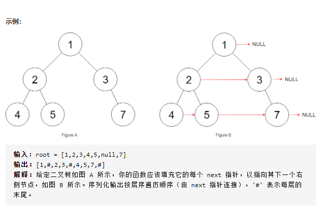

# LeetCode_117_填充每个节点的下一个右侧指针(2)

难度（meidum）



---

## 方法：迭代

### 分析

题目116是满二叉树，本题对二叉树结构没有限制，所以不能通过直接迭代确定每一行的起始位置以及上一个节点的 next 指针位置。**解决办法**——曾设变量存储，探测每一行时动态更新。

### 复杂度分析

* 时间复杂度：遍历全部节点，耗时O(n)。
* 空间复杂度：申请两个变量 leftmost 和 head，占用空间为常量级O(1)。

### 应用场景

该题目类似 MySQL 的 B+ 树的数据结构，横向的 next 指针是为了范围搜索的时候，可以不用再遍历整棵树，而是从行首元 leftmost 通过 next 指针遍历本行即可。

> 附：MySQL 的 B+ 树应该只在叶子节点建立 next 指针。

### 代码实现

```java
Node lastNode = null;        // lastNode 同行前驱节点指针
Node nextLeftMost = null;    // nextLeftMost 指向当前节点下一行的最左端节点，处理行首元素时更新

/**
 * 填充每个节点的下一个右侧节点指针（非满二叉树）
 * Version 1.0 2021-07-18 by XCJ
 * @param root 根节点
 * @return 填充指针后的根节点
 */
public Node connect(Node root) {
    if (root == null) {
        return null;
    }
    Node leftmost = root;   // leftmost 指向当前行的最左端节点
    while (leftmost != null) {
        lastNode = null;    // 换行时 lastNode 置空
        nextLeftMost = null;    // 换行时 nextLeftMost 置空
        // 遍历当前行节点
        for (Node currNode = leftmost; currNode != null; currNode = currNode.next) {
            if (currNode.left != null) {
                handle(currNode.left);
            }
            if (currNode.right != null) {
                handle(currNode.right);
            }
        }
        leftmost = nextLeftMost;    // 一行处理完成后，跳转至下一行首元素
    }
    return root;
}

public void handle(Node curr) {
    if (lastNode != null) {
        lastNode.next = curr;   // 如果当前节点非行首元素，则更新前驱节点的 next 指针
    }
    if (nextLeftMost == null) {
        nextLeftMost = curr;   // 每一行探测到的第一个非空子节点更新为 nextLeftMost
    }
    lastNode = curr;    // 更新前驱节点指针
}
```
