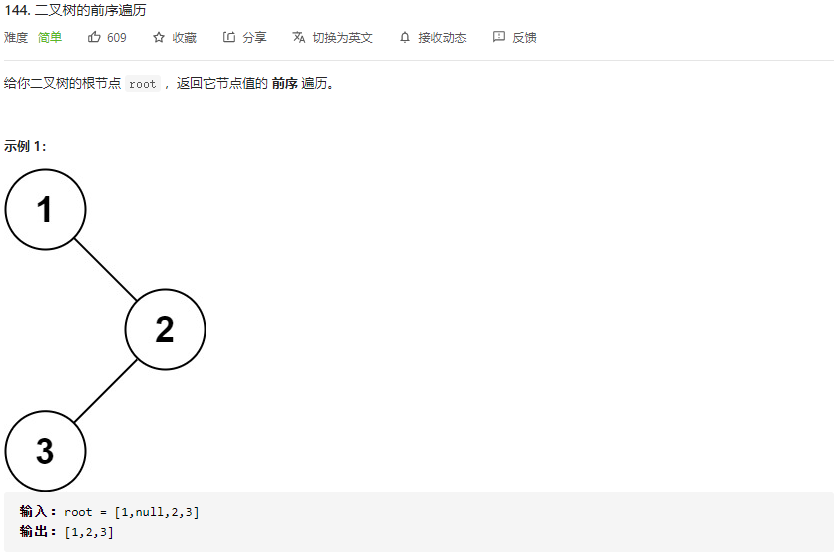
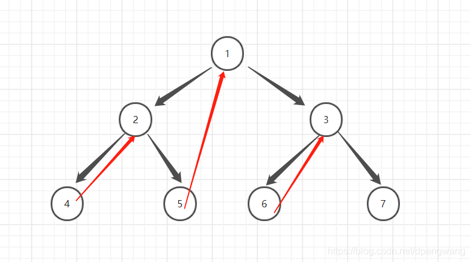

# LeetCode_144_二叉树的前序遍历

难度（easy）



---

## 方法1：递归

### 复杂度分析

* 时间复杂度：O(n)
* 空间复杂度：最优O(logn)，最坏O(n)

### 代码实现

```java
public void preorder(TreeNode root, List<Integer> res) {
    if (root == null) {
        return;
    }
    res.add(root.val);
    preorder(root.left, res);
    preorder(root.right, res);
}
```

---

## 方法2：Morris 遍历

### 简介

二叉树的遍历只需要考虑三种情况：遍历左子树、访问当前节点、遍历右子树。

二叉树遍历的**核心问题**就是——当遍历当前节点的左子树后，指针指向的位置为左子树的最右节点，如何**返回当前节点**并继续访问当前节点的右子树。为了解决此问题，常规方法是使用栈——不断向左子树深入访问时，每访问一个节点就将这个节点入栈，当遍历完当前节点的左子树后，将当前节点出栈。栈在其过程中起到了记录“**返回路径**”的作用。而 Morris 算法采用**构造返回路径**的方法，每访问一个节点，如果它有左子树，就设法找到遍历左子树时访问的最后一个节点，并搭建由该节点返回至当前节点的路径（将TreeNode.right 赋值为当前 TreeNode），如果左子树为 null，则直接访问右子树即可。

常规遍历算法：递归、迭代都要维护一个栈，其中保存的元素是未访问右子树的节点，区别是递归法隐式地由系统维护函数栈，而迭代法由代码显示地维护一个节点栈，所以其空间开销最好时为O(logn)，最坏时为O(n)（二叉树呈线性）。

 J.H.Morris在1979年的论文「Traversing Binary Trees Simply and Cheaply」中首次提出一种只占用**常数空间**来实现前序遍历的算法。故该算法被称为 Morris 算法。

### 详解



Morris 遍历的核心思想是利用树叶子节点的空指针，实现空间开销的极致缩减。常规算法使用栈的目的实质上是按顺序记录**未访问的右子树入口**。而 Morris 算法通过遍历过程中动态地搭建“**临时返回路径**”解决此问题。该算法只用到两个指针：一个用于遍历二叉树进行**访问**，另一个负责“**搭桥**”。其**前序遍历**规则如下：

1. 新建临时节点，初始化该节点为根节点 root
2. 如果当前节点的左子树为空，访问当前节点，并遍历当前节点的右子树
3. 如果当前节点的左子树不为空，在当前节点的左子树中找到**当前节点在中序遍历下的前驱节点**（通俗地讲就是一直访问 thisNode.right 直到 thisNode.right == null）
   * 如果前驱节点的右子节点为空，将前驱节点的右子节点设置为当前节点（搭建返回路径）。然后访问当前节点，并将访问指针更新为当前节点的左子节点。
   * 3.2 如果前驱节点的右子节点不为空，说明此时刚从左子树返回，已不再需要返回路径，将它的右子节点重新设为 null。访问指针更新为当前节点的右子节点。
4. 重复步骤 2 和 3 至遍历结束。

> 注：遍历结束的条件为访问指针 == null。该算法对于（除根节点 root 之外的）每个节点，都会首先判断其左子树是否存在返回路径，如果没有则创建路径，如果有且指向自己说明已访问当前节点的左子树。而根节点不是任何节点的左子节点，所以不存在返回的路径，所以是唯一一个遍历过程中最右子节点右指针为 null 的节点。

### 代码实现

```java
/**
 * 二叉树前序遍历 Morris算法
 * @param root 二叉树根节点
 * @return 数组 res，按前序遍历顺序保存访问的元素
 */
public List<Integer> preorderTraversal_Morris(TreeNode root) {
    List<Integer> res = new ArrayList<Integer>();   // 按顺序存储访问的元素
    if (root == null) {
        return res;
    }

    TreeNode currNode = root, mostRight = null;  // p1用于遍历+访问节点，p2用于构造临时路径。

    while (currNode != null) {
        mostRight = currNode.left;
        if (mostRight != null) {   // 左子树非空，找到当前节点在中序遍历下的前驱节点
            while (mostRight.right != null && mostRight.right != currNode) {
                mostRight = mostRight.right;
            }
            if (mostRight.right == null) { // 为空则访问、构造路径、进入左子树
                res.add(currNode.val);    // 访问
                mostRight.right = currNode;      // 构造路径
                currNode = currNode.left;       // 进入左子树
                continue;
            } else {
                mostRight.right = null;    // 不为空说明已返回，则将指针恢复为null。
            }
        } else {    // 左子树为空
            res.add(currNode.val);    // 访问当前节点
        }
        currNode = currNode.right;  // 遍历当前节点的右子树
    }
    return res;
}
```

