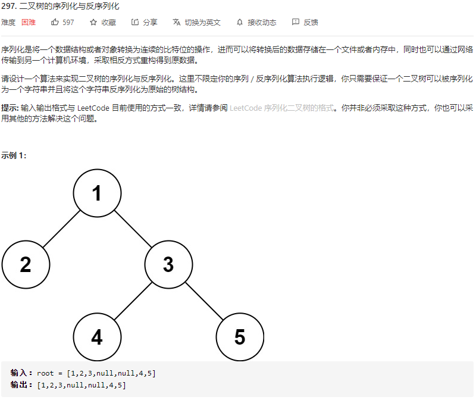

# LeetCode_297_二叉树的序列化与反序列化

难度（hard）



---

## 方法：前序遍历递归

### 分析

如果按题目给出的输出范例（层序遍历+去除最底层所有空指针+标准字符串格式）进行求解很难。但系统的判题标准给的很宽松，前、中、后序遍历均可，且对序列化字符串格式细节没有强制要求，所以省去了大量繁琐细节。我采用较简单的**前序遍历递归算法**实现序列化和反序列化。

### 定义子问题

* 序列化以“将 root 节点的值加入 stringBuilder”为 base case，子问题为“递归地将 root.left.value, root.right.value 加入 stringBuilder”。
*  反序列化构造时以数组序列首元构造一个 TreeNode，所以子问题为“使用去除根节点的数组序列继续进行先序构造”。

### 总体思路

* **序列化方法总体思路**：序列化的**递归出口**为 root == null，需要将空指针连接至 stringBuilder 尾部；**前序遍历位置**加入 root.val ，递归地处理子节点；最后返回 stringBuidler 对象。
* **反序列化方法总体思路**：以前序遍历的顺序构造二叉树，所以递归地取出参数数组的首元素作为根节点进行构造。反序列化**递归出口**为 listString.get(0).equals("null")（即作为参数的字符串数组首元素 == "null"），此时说明当前指针为空，返回 null 即可。

### 复杂度分析

* 时间复杂度：O(n)，需要遍历树的每一个节点。
* 空间复杂度：由系统维护函数栈。最坏情况为O(n)，树呈链状；最好为O(logn)，完全二叉树。

### 性能优化

* **关于字符串处理（最优执行时间** **107ms -> 9ms）**

本题涉及频繁的字符串修改操作。Java 的字符串为不可变类，如果使用 String += "..." 的方法，编译器会自动地将 “+”替换为 ：

~~~java
	new StringBuidler(String.valueOf(oldString)).append(newString.toString());
~~~

因此每使用一次字符串“+”运算符，系统都会 new 一个 StringBuilder 对象，调用频繁时将严重影响程序性能。官方给出的题解运行时长在 100ms 以上，性能过低的原因就在于直接使用了“+”运算符进行字符串扩展操作。改进办法是使用 StringBuidler 类实现全部字符串处理过程，最后使用 StringBuilder.toString() 方法转换为字符串。

* **关于自动装箱（最优内存消耗** **40.5M ->40.3M）**

观察反序列化方法，新建节点的构造方法调用如下

~~~java
TreeNode root = new TreeNode(Integer.valueOf(listString.get(0))); 	// 或
TreeNode root = new TreeNode(Integer.parseInt(listString.get(0)));
~~~

TreeNode参数涉及“字符串转整型”的操作。如果使用 **Integer.valueOf(String s)** 方法，将返回一个 Integer 对象，由于构造方法 TreeNode(int val) 参数类型为**基本数据类型** **int**，由 Java API，Integer.valueOf()方法返回的是 int 的包装类 Integer，所以参数的调用发生了冗余自动装箱、自动拆箱过程。

而 **Integer.parseInt(String s)** 方法直接返回基本数据类型 int，所以调用该方法更优。

### 代码实现（序列化与反序列化）

```java
// Encodes a tree to a single string.
public String serialize(TreeNode root) {
    StringBuilder res = serializePreorder(root, new StringBuilder());
    return res.toString();
}

/**
 * 递归_将二叉树以前序遍历的顺序序列化为一个 StringBuilder 对象
 * Version 2.0 2021-07-19 by XCJ
 * @param root 待序列化二叉树树根节点
 * @param stringBuilder 字符串构造器
 * @return 一个以前序遍历顺序排列的 stringBuilder 对象
 */
private StringBuilder serializePreorder(TreeNode root, StringBuilder stringBuilder) {
    // 递归出口
    if (root == null) {
        stringBuilder.append("null,");
        return stringBuilder;
    }
    /* 前序遍历位置 */
    // 将当前节点值加入 stringBuilder
    stringBuilder.append(root.val);
    stringBuilder.append(",");
    // 处理子节点
    stringBuilder = serializePreorder(root.left, stringBuilder);
    stringBuilder = serializePreorder(root.right, stringBuilder);

    return stringBuilder;
}


// Decodes your encoded data to tree.
public TreeNode deserialize(String data) {
    // 将参数二叉树元素字符串分割为字符串结点数组
    String[] strArray = data.split(",");
    // 转换为集合
    List<String> listString = new LinkedList<String>(Arrays.asList(strArray));
    // 构造二叉树
    return deserializePreorder(listString);
}

/**
 * 递归_由字符串数组构造一棵二叉树
 * Version 2.0 2021-07-19 by XCJ
 * @param listString 字符串数组，每个元素转换为 int 对应节点的 value
 * @return 生成的二叉树根节点
 */
private TreeNode deserializePreorder(List<String> listString) {
    if(listString.get(0).equals("null")) {
        listString.remove(0);
        return null;
    }
    /* 前序遍历位置 */
    // 使用待构造序列的首元素新建一个节点
    TreeNode root = new TreeNode(Integer.parseInt(listString.get(0)));
    listString.remove(0);
    // 处理子节点
    root.left = deserializePreorder(listString);
    root.right = deserializePreorder(listString);

    return root;
}
```

### 涉及方法参考 Java8 API

>**split**
>
>**public String[] split(String regex)**
>
>将此字符串拆分为给定的regular expression的匹配。
>
>该方法的工作原理是通过使用给定表达式和限制参数为零调用双参数split方法。 因此，尾随的空字符串不会包含在结果数组中。
>
>例如，字符串"boo:and:foo"使用以下表达式得到以下结果：
>
>Regex    Result
>
>:    { "boo", "and", "foo" }
>
>o    { "b", "", ":and:f" }
>
>**参数**
>
>regex - 分隔正则表达式
>
>**结果**
>
>通过将该字符串围绕给定的正则表达式的匹配来计算的字符串数组
>
>**异常**
>
>PatternSyntaxException - 如果正则表达式的语法无效
>
>**从以下版本开始：**
>
>1.4

> **valueOf**
>
> **public static Integer valueOf(String s)**
>
> ​            **throws NumberFormatException**
>
> 返回一个Integer物体保持在指定的值String 。 该参数被解释为表示一个有符号的十进制整数，就像参数给予parseInt(java.lang.String)方法一样。 结果是一个Integer对象，表示由字符串指定的整数值。
>
> 换句话说，该方法返回一个Integer对象的值等于：
>
> new Integer(Integer.parseInt(s))
>
> **参数**
>
> s - 要解析的字符串。
>
> **结果**
>
> 一个保存由string参数表示的值的 Integer对象。
>
> **异常**
>
> NumberFormatException - 如果字符串不能被解析为整数。

> **parseInt**
>
> **public static int parseInt(String s)**
>
> ​          **throws NumberFormatException**
>
> 将字符串参数解析为带符号的十进制整数。 字符串中的字符都必须是十进制数字，除了第一个字符可能是ASCII减号'-' （ '\u002D' ）以指示负值或ASCII加号'+' （ '\u002B' ）以指示正值。 返回所得到的整数值，就像参数和小数10被赋予parseInt(java.lang.String, int)方法的参数一样。
>
> **参数**
>
> s - 一个 String包含要解析的 int表示
>
> **结果**
>
> 由参数以十进制表示的整数值。
>
> **异常**
>
> NumberFormatException - 如果字符串不包含可解析整数。