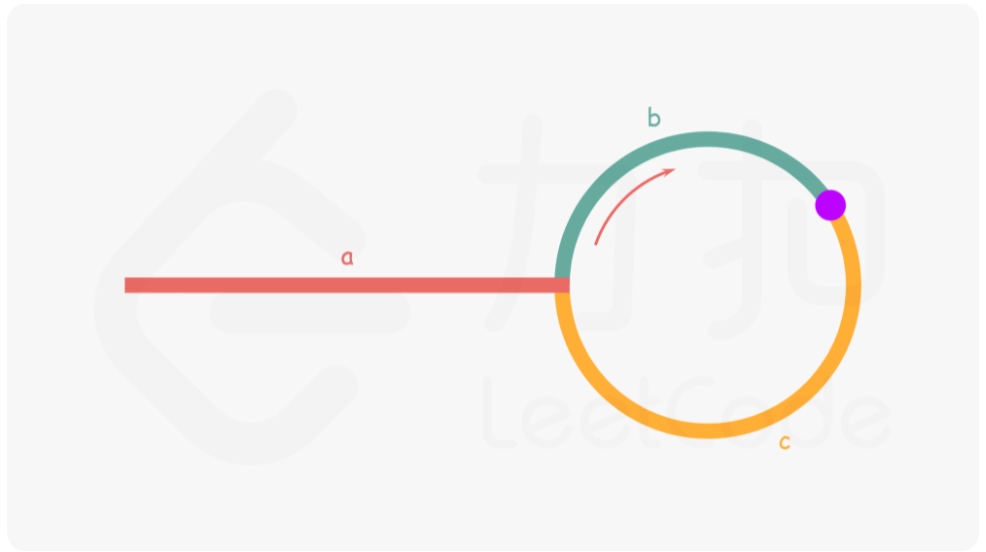

# LeetCode_142_环形链表(2)

---

## 方法：快慢指针

### 分析

题目要找到环的入口节点并返回该节点。无环返回null。

### 思路

若使用快慢指针，则该题是一道数学题，理清数学关系后该题非常简单。使用两个指针，slow和fast，起始位置都为head，slow每次移动一位，fast每次移动两位。如果链表中有环，则fast指针将与slow指针在环中相遇。

如下图所示，设head到环入口距离为a，slow指针进入环后，经过b与fast指针相遇，相遇位置距离环入口为c。设此时fast指针已在环中走了n圈。则 fast 指针移动总长度 = a + n(b + c) + b = a + (n + 1)b + c。由另一条件，d(fast) = 2*d(slow)，即 a + (n + 1)b + c = 2(a + b) ==> a = c + (n - 1)(b + c)。



此时 n 使等式较为复杂，尝试能否确认 n 的值或消去 n。设 环长度为A， 慢指针在入环时在环中位置为B(0 <= B <= A-1)。当快慢指针相遇时（慢指针在环中又走了长度C），则有

>C % A = ( B + 2C) % A
>
> 等价于	An + C = B + 2C
>
>合并得	C = An - B
>
>当 n=1 时 , 0 <= C < A

故慢指针在第一圈必定能和快指针相遇。此时确定n = 1， 则原等式a = c + (n - 1)(b + c)可化为a = c。即fast和slow指针第一次相遇时，slow指针距离环入口的距离 = head到环入口的距离。

此时问题已极其简单，找到入口节点，只需再定义一个指针ptr，从head开始与slow指针同步移动，当ptr == slow时，指向的即为入口节点，将其返回即可。

### 解题步骤

1. 使用上一题的do-while()循环找到slow&fast第一次相遇节点。
2. 通过while()循环找到ptr与slow相遇节点。
3. 返回该节点。

### 代码实现

```java
/**
 * Solution of double pointers.
 * @param head first node of the list
 * @return ListNode-entry node of the cycle | null-no cycle
 */
public ListNode detectCycle(ListNode head) {
    // invalid conditions
    if (head == null || head.next == null) return null;

    // find the point that fast and slow meet for the first time
    ListNode slow = head, fast = head;
    do {
        if (fast == null || fast.next == null) return null;
        slow = slow.next;
        fast = fast.next.next;
    } while (slow != fast);
    // now the distance between head and entry is the same as the distance between slow and entry
    ListNode p = head;
    while (p != slow) {
        p = p.next;
        slow = slow.next;
    }
    return p;
}
```