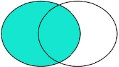
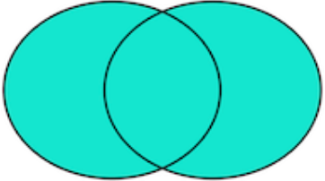

# MySQL 

<br><br><br><br><br><br><br><br><br><br><br><br><br><br><br>

---

<br><br><br><br><br><br><br><br><br><br><br><br><br><br><br>


# 目录


[TOC]

<br><br><br><br><br><br><br><br><br><br><br><br>

---

<br><br><br><br><br><br><br><br><br><br><br><br>

# 1. 了解SQL

综述：介绍数据库和SQL。

<br><br><br><br><br><br>

##  1.1 数据库基础

<br><br><br>

### 1.1.1 什么是数据库

* **数据库（database）**：保存有组织的数据的容器。（通常是一个文件或一组文件）

> 数据库可以理解为**以一个有组织的方式存储**的**数据集合**。可以将**数据库**想象为一个**文件柜**，此文件柜是一个存放数据的物理位置，不管数据是什么以及是如何组织的。
>
> * 概念区分：数据库与数据库软件
>   * 数据库是一个保存数据的容器
>   * 数据库软件（DBMS：Database Management System）是数据库管理系统。
>   * **使用者**不直接访问数据库，而是**通过DBMS**访问和**操作数据库**。

<br><br><br>

### 1.1.2 表

* **表（table）**：某种特定类型数据的结构化清单。
  * 注意：存储在表中的数据是**一种类型的数据**或**一个清单**。绝不可以将顾客的清单与订单的清单存储在同一个数据库表中。这样会导致检索和访问操作困难。
  * **表名**：表名的唯一性取决于多个因素，如数据库名和表明的结合。
    * 同一数据库表名不可重复，不同数据库表名可重复。
  * **模式（schema）**：关于数据库和表的布局及特性的信息。


### 1.1.3 列和数据类型

表由列组成。列中存储表的某部分信息。

* **列（column）**：表中的一个**字段**。所有的表都是由一个或多个列组成的。
* **数据类型（datatype）**：所容许的数据的类型。每个表都有相应的数据类型。它限制（或容许）该列中存储的数据。

> 数据类型限制可存储在列中的数据种类。【例如，防止在数值字段录入字符值】。数据类型还帮助正确地排序数据，并在优化磁盘使用方面起重要作用。
>
> 建表时应对数据类型给予特别关注。

<br><br><br>

### 1.1.4 行

* **行（row）**：表中的一个记录。

> 很多时候，行（row）和记录（record）两个数据可以相互替代，但从技术上说，行是正确的术语。

<br><br><br>

### 1.1.5 主键

* **主键（primary key）**：一列（或一组列），其值能够**唯一区分**表中的**每个行**。
  * 作为主键的条件
    1. 任意两行都不具有相同的主键值
    2. 每个行都必须具有一个主键值（主键列**不允许NULL**值）

主键通常定义在表的一列上，但不是必需的。也可以使用多个列作为主键。使用多列作为主键时，上述条件必须应用到构成主键的所有列，所有列值的组合必须唯一（但单个列的值可以不唯一）。

由于主键的作用十分重要，如何选取主键会对业务开发产生重要影响。如果我们以学生的身份证号作为主键，似乎能唯一定位记录。然而，身份证号也是一种业务场景，如果身份证号升位了，或者需要变更，作为主键，不得不修改的时候，就会对业务产生严重影响。

所以，选取主键的一个基本原则是：**不使用任何业务相关的字段作为主键**。

因此，身份证号、手机号、邮箱地址这些看上去可以唯一的字段，均**不可**用作主键。

作为主键最好是完全业务无关的字段，我们一般把这个字段命名为`id`。常见的可作为`id`字段的类型有：

1. **自增整数类型**：数据库会在插入数据时自动为每一条记录分配一个自增整数，这样我们就完全不用担心主键重复，也不用自己预先生成主键；
2. **全局唯一GUID类型**：使用一种全局唯一的字符串作为主键，类似`8f55d96b-8acc-4636-8cb8-76bf8abc2f57`。GUID算法通过网卡MAC地址、时间戳和随机数保证任意计算机在任意时间生成的字符串都是不同的，大部分编程语言都内置了GUID算法，可以自己预算出主键。

对于大部分应用来说，通常自增类型的主键就能满足需求。我们在`students`表中定义的主键也是`BIGINT NOT NULL AUTO_INCREMENT`类型。

> 注：如果使用`INT`自增类型，那么当一张表的记录数超过2147483647（约21亿）时，会达到上限而出错。使用`BIGINT`自增类型则可以最多约922亿亿条记录。

> **主键的好习惯：**
>
> * ==不更新主键列中的值==
> * ==不重用主键列的值==
> * ==不在主键列中使用可能会该的值。==

<br><br><br>

### 1.1.6 外键

* 参考连接：[外键 - 廖雪峰](https://www.liaoxuefeng.com/wiki/1177760294764384/1218728424164736)

当我们用主键唯一标识记录时，我们就可以在`students`表中确定任意一个学生的记录：

| id   | name | other columns... |
| ---- | ---- | ---------------- |
| 1    | 小明 | ...              |
| 2    | 小红 | ...              |

我们还可以在`classes`表中确定任意一个班级记录：

| id   | name | other columns... |
| ---- | ---- | ---------------- |
| 1    | 一班 | ...              |
| 2    | 二班 | ...              |

但是我们如何确定`students`表的一条记录，例如，`id=1`的小明，属于哪个班级呢？

由于一个班级可以有多个学生，在关系模型中，这两个表的关系可以称为“一对多”，即一个`classes`的记录可以对应多个`students`表的记录。

为了表达这种一对多的关系，我们需要在`students`表中加入一列`class_id`，让它的值与`classes`表的某条记录相对应：

| id   | class_id | name | other columns... |
| ---- | -------- | ---- | ---------------- |
| 1    | 1        | 小明 | ...              |
| 2    | 1        | 小红 | ...              |
| 5    | 2        | 小白 | ...              |

这样，我们就可以根据`class_id`这个列直接定位出一个`students`表的记录应该对应到`classes`的哪条记录。

例如：

- 小明的`class_id`是`1`，因此，对应的`classes`表的记录是`id=1`的一班；
- 小红的`class_id`是`1`，因此，对应的`classes`表的记录是`id=1`的一班；
- 小白的`class_id`是`2`，因此，对应的`classes`表的记录是`id=2`的二班。

在`students`表中，通过`class_id`的字段，可以把数据与另一张表关联起来，这种列称为`外键`。

外键并不是通过列名实现的，而是通过**定义外键约束**实现的：

~~~mysql
ALTER TABLE students
ADD CONSTRAINT fk_class_id
FOREIGN KEY (class_id)
REFERENCES classes (id);
~~~

其中，外键约束的名称`fk_class_id`可以任意，`FOREIGN KEY (class_id)`指定了`class_id`作为外键，`REFERENCES classes (id)`指定了这个外键将关联到`classes`表的`id`列（即`classes`表的主键）。

通过定义外键约束，关系数据库可以保证无法插入无效的数据。即如果`classes`表不存在`id=99`的记录，`students`表就无法插入`class_id=99`的记录。

由于外键约束会降低数据库的性能，大部分互联网应用程序为了追求速度，并不设置外键约束，而是仅靠应用程序自身来保证逻辑的正确性。这种情况下，`class_id`仅仅是一个普通的列，只是它起到了外键的作用而已。

要**删除外键约束**，也是通过`ALTER TABLE`实现的：

~~~mysql
ALTER TABLE students
DROP FOREIGN KEY fk_class_id;
~~~

注意：

* 删除外键约束并没有删除外键这一列。删除列是通过`DROP COLUMN ...`实现的。
* **删除外键约束**命令使用的是**外键名**而不是字段名。

<br><br><br>

### 1.1.7 索引

* 参考连接：[索引 - 廖雪峰](https://www.liaoxuefeng.com/wiki/1177760294764384/1218728442198976)

<br><br><br><br><br><br>

## 1.2 什么是SQL

<br><br><br>

### 1.2.1 相关概念

* **SQL（Structured Query Language）**：是一种专门用来与数据库通信的语言。

设计SQL的目的是提供一种从数据库中读写数据的简单有效的方法。

SQL是结构化查询语言的缩写，用来访问和操作数据库系统。SQL语句既可以查询数据库中的数据，也可以添加、更新和删除数据库中的数据，还可以对数据库进行管理和维护操作。不同的数据库，都支持SQL，这样，我们通过学习SQL这一种语言，就可以操作各种不同的数据库。

SQL语言定义了这么几种操作数据库的能力：

* **DDL：Data Definition Language**
  * DDL允许用户定义数据，也就是创建表、删除表、修改表结构这些操作。通常，DDL由数据库管理员执行。
* **DML：Data Manipulation Language**
  * DML为用户提供添加、删除、更新数据的能力，这些是应用程序对数据库的日常操作。
* **DQL：Data Query Language**
  * DQL允许用户查询数据，这也是通常最频繁的数据库日常操作。

<br><br><br>

### 1.2.2 语法特点

SQL语言关键字不区分大小写！！！但是，针对不同的数据库，对于表名和列名，有的数据库区分大小写，有的数据库不区分大小写。同一个数据库，有的在Linux上区分大小写，有的在Windows上不区分大小写。

* 个人习惯遵循的约定：==**SQL关键字**==总是==**大写**==，以示突出，==**表名和列名**==均使用==**小写**==。

<br><br><br><br><br><br>

## 1.3 小结

* 介绍了SQL的一些基本术语和概念。

* 主键
  * 主键是关系表中记录的唯一标识。主键的选取非常重要：主键不要带有业务含义，而应该使用BIGINT自增或者GUID类型。主键也不应该允许`NULL`。
  * 可以使用多个列作为联合主键，但联合主键并不常用。
* 外键
  * 关系数据库通过外键可以实现一对多、多对多和一对一的关系。外键既可以通过数据库来约束，也可以不设置约束，仅依靠应用程序的逻辑来保证。
* 索引
  * 通过对数据库表创建索引，可以提高查询速度。
  * 通过创建唯一索引，可以保证某一列的值具有唯一性。
  * 数据库索引对于用户和应用程序来说都是透明的。

<br><br><br><br><br><br><br><br><br><br><br><br>

---

<br><br><br><br><br><br><br><br><br><br><br><br>

# 2. MySQL简介

综述：介绍什么是MySQL，以及MySQL中可以应用什么工具。

<br><br><br><br><br><br>

## 2.1 什么是MySQL

* MySQL是一种DBMS，即它是一种数据库软件。

<br><br><br>

### 2.1.1 客户机-服务器软件

MySQL、Oracle、Microsoft SQL Server 等数据库都是基于客户机-服务器的数据库。kehuji-fuwuqi应用分为两个不同的部分。服务器部分是负责所有数据访问和处理的一个软件。这个软件运行在称为数据库服务器的计算机上。

与数据文件打交道的只有**服务器软件**。关于数据、数据添加、删除和数据更新的所有请求都由服务器软件完成。**客户机软件**通过网络提交请求给服务器软件。服务器软件处理这个请求，根据需要过滤、丢弃和排序数据，然后将结果响应给客户机软件。

> 客户机和服务器软件可能安装在两台计算机或一台计算机上。为了进行数据库交互，客户机软件要与服务器软件进行通信。

所有这些活动对用户是透明的。事实上，多数网络的建立使用户不具有对数据的访问权，甚至不具有对存储数据的驱动器的访问权。

这样，为了使用MySQL，需要**访问运行MySQL服务器软件的计算机**【客户机】和**发布命令到MySQL客户机软件的计算机**【服务器】。

* 服务器软件为MySQL DBMS。你可以在本地安装的副本上运行，也可以连接到运行在你具有访问权限的远程服务器上的一个副本。
* 客户机可以是MySQL提供的工具、脚本语言（如Perl）、Web应用开发语言（如ASP、ColdFusion、JSP和PHP）、程序设计语言（如C、C++、Java）等。

<br><br><br>

### 2.1.2 MySQL版本

系列版本中引入的一些更改。

* 4——InnoDB引擎，增加**事务处理**、**并**、**改进全文本搜索**等的支持。
* 4.1——对函数库、子查询、继承帮助等的重要增加。
* 5——存储过程、触发器、游标、视图等。

<br><br><br><br><br><br>

## 2.2 MySQL工具

<br><br><br>

### 2.2.1 mysql命令行实用程序

* 命令输入在 mysql> 之后
* 命令用 `；`或 `\g` 结束。仅按 Enter 不执行命令
* 输入`quit`或`exit`推出命令行实用程序

<br><br><br>

### 2.2.2 MySQL Administrator

<br><br><br>

### 2.2.3 MySQL Query Brower

<br><br><br><br><br><br>

## 2.3 小结

* 介绍了什么是MySQL。
* 引入了几个客户机实用程序。

<br><br><br><br><br><br><br><br><br><br><br><br>

---

<br><br><br><br><br><br><br><br><br><br><br><br>

#3. 使用MySQL

本节内容为如何连接和登录到MySQL，如何执行MySQL语句，以及如何获得数据库和表的信息。

<br><br><br><br><br><br>

## 3.1 连接

MySQL与所有客户机-服务器DBMS一样，要求在能之心工龄之前登录到DBMS。登录名可以与网络登录名不相同。MySQL在内部保存自己的用户列表，并且把每个用户与各种权限关联起来。

* 为了连接到MySQL，需要以下信息
  * 主机名（计算机名）——如果连接到本地MySQL服务器，为 **localhost**
  * 端口（如果使用默认端口 3306 之外的端口）
  * 一个合法的用户名
  * 用户口令（如果需要）

<br><br><br>

### MySQL数据库软件基本操作

1. 安装
2. 卸载
   1. 在mysql的安装目录找到my.ini文件
      * 复制 datadir=D:\SourceFiles\mysql\mysql-8.0.25-winx64\data
   2. 卸载MySQL
   3. 删除C:/ProgramData目录下的MySQL文件夹。
3. 配置
   * **MySQL服务的启动**
     1. 手动
     2. cmd --> services.msc  // 打开服务的窗口
     3. 使用管理员打开cmd
        * `net start mysql`：启动mysql的服务
        * `net stop mysql`：关闭mysql服务
   * **MySQL登录**
     1. `mysql -u'User' -p'Password'` 【默认连接本地 MySQL】
     2. `mysql -hip -u'User' -p'Password'`【本机ip为：127.0.0.1】
     3. `mysql --host=ip --user='User' --password='Password'`
   * **MySQL退出**
     1. `exit`
     2. `quit`

   * MySQL目录结构

     1.  MySQL安装目录：basedir="D:\SourceFiles\mysql\mysql-8.0.25-winx64\"

        * bin：二进制可执行文件
        * data：数据目录
        * include：存放c语言的一些头文件
        * lib：库文件
        * share：MySQL的错误信息

        * ==**配置文件**== my.ini
     
     2. MySQL数据目录：datadir=D:\SourceFiles\mysql\mysql-8.0.25-winx64\data
     
        * 几个概念
          * 数据库：文件夹
          * 表：文件
          * 数据：数据

<br><br><br><br><br><br>

## 3.2 选择数据库

在执行任意数据库操作前，需要使用 **USE** 关键字选择一个数据库。

* **关键字（key word）**：作为MySQL语言组成部分的一个保留字。决不要用关键字命名一个表或列。

**输入**

~~~mysql
USE crashcourse;	-- 选择数据库crashcourse
~~~

**输出**

~~~powershell
Database changed
~~~

**分析**

`USE` 语句并不返回任何结果。依赖于使用的客户机，显示某种形式的通知。例如，这里显示出的 Database changed 消息是 mysql 命令行实用程序在数据库选择成功后显示的。

<br><br><br><br><br><br>

## 3.3 查看数据库和表

<br><br><br>

### 3.3.1查看所有数据库

**输入**

~~~mysql
SHOW DATABASES;	-- 返回可用数据库的一个列表
~~~

**输出**

~~~bash
+--------------------+
| Database           |
+--------------------+
| crashcourse        |
| day14              |
| db1                |
| db2                |
| db3                |
| db4                |
| dbtest             |
| information_schema |
| mysql              |
| performance_schema |
| sys                |
+--------------------+
11 rows in set (0.00 sec)
~~~

**分析**

`SHOW DATABASES;` 返回可用数据库的一个列表。列表中的数据库可能是 MySQL 内部使用的数据库（如例子中的 mysql 和 information_schema），也可能是用户自己创建的数据库。

<br><br><br>

### 3.3.2 查看所有表

为了获得一个数据库内的表的列表，使用如下命令。

**输入**

~~~mysql
SHOW TABLES;	-- 查看所有表
~~~

**输出**

~~~bash
+-----------------------+
| Tables_in_crashcourse |
+-----------------------+
| customers             |
| orderitems            |
| orders                |
| productnotes          |
| products              |
| vendors               |
+-----------------------+
6 rows in set (0.00 sec)
~~~

**分析**

`SHOW TABLES;` 返回当前选择的数据库内可用表的列表。

<br><br><br>

### 3.3.3 显示某表的所有列

**输入**

~~~mysql
SHOW COLUMNS FROM customers;	-- 显示 customers 表的所有列
~~~

**输出**

~~~bash
+--------------+-----------+------+-----+---------+----------------+
| Field        | Type      | Null | Key | Default | Extra          |
+--------------+-----------+------+-----+---------+----------------+
| cust_id      | int       | NO   | PRI | NULL    | auto_increment |
| cust_name    | char(50)  | NO   |     | NULL    |                |
| cust_address | char(50)  | YES  |     | NULL    |                |
| cust_city    | char(50)  | YES  |     | NULL    |                |
| cust_state   | char(5)   | YES  |     | NULL    |                |
| cust_zip     | char(10)  | YES  |     | NULL    |                |
| cust_country | char(50)  | YES  |     | NULL    |                |
| cust_contact | char(50)  | YES  |     | NULL    |                |
| cust_email   | char(255) | YES  |     | NULL    |                |
+--------------+-----------+------+-----+---------+----------------+
9 rows in set (0.00 sec)
~~~

**分析**

**`SHOW COLUMNS`** 要求给出一个表名，它对每个字段返回一行，行中包含**字段名**、**数据类型**、**是否允许`NULL`**、**键信息**、**默认值**以及**其它信息**（如字段 `cust_id` 的 `auto_increment`）。

<br><br><br><br><br><br>

## 3.4 小结

* 连接、登录MySQL
* 如何用 `USE` 选择数据库
* 如何用 `SHOW` 查看MySQL数据库、表和内部信息。

<br><br><br><br><br><br><br><br><br><br><br><br>

---

<br><br><br><br><br><br><br><br><br><br><br><br>

# 4. 检索数据

本节内容为使用SELECT语句从表中检索一个或多个数据列。

<br>

* 检索数据的基本格式

  * ~~~mysql
    SELECT "what" FROM "where"
    ~~~

* 检索单个列

  * ~~~mysql
    SELECT prod_name
    FROM products;
    ~~~

  * > **推荐**    SQL==**关键字**==统一==**大写**==，所有==**列名、表名小写**==。

* 检索多个列

  * ~~~mysql
    SELECT prod_id, prod_name, prod_price
    FROM products;
    ~~~

* 检索所有列

  * ~~~mysql
    SELECT * FROM products;
    ~~~

* 检索不同的行【检索结果去重】

  * ~~~mysql
    SELECT DISTINCT vend_id, prod_price
    FROM products;
    ~~~

* 限制结果【的行数】

  * ~~~mysql
    SELECT prod_name
    FROM products
    LIMIT 5;	-- 返回查询结果的前5行
    ~~~

* 使用完全限定名

  * 完全限定表名：`databasename.tablename`
  * 完全限定列名：`tablename.columnname`

<br><br><br><br><br><br>

## 4.1 SELECT 语句

用途：从一个或多个表中检索信息

为了使用 `SELECT` 检索表数据，必须至少给出两条信息——想选择什么，以及从什么地方选择。

~~~mysql
SELECT "what" FROM "where"
~~~

<br><br><br><br><br><br>

## 4.2 检索单个列

**输入**

~~~mysql
SELECT prod_name
FROM products;
~~~

**分析**

上述语句利用 `SELECT` 语句从 `products` 表中检索一个名为` prod_name `的列。所需的列明在 `SELECT `关键字之后给出；`FROM` 关键字之处目标检索数据所在的表的表名。

**输出**

~~~bash
+----------------+
| prod_name      |
+----------------+
| .5 ton anvil   |
| 1 ton anvil    |
| 2 ton anvil    |
| Detonator      |
| Bird seed      |
| Carrots        |
| Fuses          |
| JetPack 1000   |
| JetPack 2000   |
| Oil can        |
| Safe           |
| Sling          |
| TNT (1 stick)  |
| TNT (5 sticks) |
+----------------+
14 rows in set (0.00 sec)
~~~

<br>

### 附：SQL语句大小写问题

> SQL语句不区分大小写。推荐使用固定的规范：SQL==**关键字**==统一==**大写**==，所有==**列名、表名小写**==。
>
> 标识符区是分大小写的。
>
> 推荐**大小写**规范**应明确、固定、一致**。

<br><br><br><br><br><br>

## 4.3 检索多个列

从一个表中检索多个列，必须在 `SELECT `关键字后给出多个列名，==**列名之间**==必须==**以逗号分隔**==。

**输入**

~~~mysql
SELECT prod_id, prod_name, prod_price
FROM products;
~~~

**输出**

~~~bash
+---------+----------------+------------+
| prod_id | prod_name      | prod_price |
+---------+----------------+------------+
| ANV01   | .5 ton anvil   |       5.99 |
| ANV02   | 1 ton anvil    |       9.99 |
| ANV03   | 2 ton anvil    |      14.99 |
| DTNTR   | Detonator      |      13.00 |
| FB      | Bird seed      |      10.00 |
| FC      | Carrots        |       2.50 |
| FU1     | Fuses          |       3.42 |
| JP1000  | JetPack 1000   |      35.00 |
| JP2000  | JetPack 2000   |      55.00 |
| OL1     | Oil can        |       8.99 |
| SAFE    | Safe           |      50.00 |
| SLING   | Sling          |       4.49 |
| TNT1    | TNT (1 stick)  |       2.50 |
| TNT2    | TNT (5 sticks) |      10.00 |
+---------+----------------+------------+
14 rows in set (0.00 sec)
~~~

### 附：数据表示

> SQL语句一般返回原始的、无格式的数据。**数据的格式化是一个表示问题，而不是一个检索问题**。因此，**表示**（对齐和显示上面的价格值，用货币符号和逗号表示其金额）**一般在显示该数据的应用程序中规定**。一般很少使用实际检索出的原始数据（没有应用程序提供的格式）。

<br><br><br><br><br><br>

## 4.4 检索所有列

**输入**

~~~mysql
SELECT * FROM products;
~~~

**输出**

~~~bash
+---------+---------+----------------+------------+----------------------------------------------------------------+
| prod_id | vend_id | prod_name      | prod_price | prod_desc                                                      |
+---------+---------+----------------+------------+----------------------------------------------------------------+
| ANV01   |    1001 | .5 ton anvil   |       5.99 | .5 ton anvil, black, complete with handy hook                  |
| ANV02   |    1001 | 1 ton anvil    |       9.99 | 1 ton anvil, black, complete with handy hook and carrying case |
| ANV03   |    1001 | 2 ton anvil    |      14.99 | 2 ton anvil, black, complete with handy hook and carrying case |
| DTNTR   |    1003 | Detonator      |      13.00 | Detonator (plunger powered), fuses not included                |
| FB      |    1003 | Bird seed      |      10.00 | Large bag (suitable for road runners)                          |
| FC      |    1003 | Carrots        |       2.50 | Carrots (rabbit hunting season only)                           |
| FU1     |    1002 | Fuses          |       3.42 | 1 dozen, extra long                                            |
| JP1000  |    1005 | JetPack 1000   |      35.00 | JetPack 1000, intended for single use                          |
| JP2000  |    1005 | JetPack 2000   |      55.00 | JetPack 2000, multi-use                                        |
| OL1     |    1002 | Oil can        |       8.99 | Oil can, red                                                   |
| SAFE    |    1003 | Safe           |      50.00 | Safe with combination lock                                     |
| SLING   |    1003 | Sling          |       4.49 | Sling, one size fits all                                       |
| TNT1    |    1003 | TNT (1 stick)  |       2.50 | TNT, red, single stick                                         |
| TNT2    |    1003 | TNT (5 sticks) |      10.00 | TNT, red, pack of 10 sticks                                    |
+---------+---------+----------------+------------+----------------------------------------------------------------+
14 rows in set (0.00 sec)
~~~

<br><br><br><br><br><br>

## 4.5 检索不同的行【去重】

**目标**

检索表 `products` 中产品的所有供应商ID （vend_id），要求检索的同时去掉重复的的id

**输入**

~~~mysql
SELECT DISTINCT vend_id
FROM products;
~~~

**分析**

`DISTINCT` 关键字必须直接放在列名的前面。`SELECT DISTINCT vend_id` 告诉MySQL只返回不同的（唯一的）`vend_id` 行，因此只返回4行。

> **不能部分使用 DISTINCT 关键字**
>
> **DISTINCT** 关键字==**应用于所有列**==而不仅是前置它的列，如果给出
>
> ~~~mysql
> SELECT DISTINC vend_id, prod_price FROM products;
> ~~~
>
> 除非指定的两个列都相同，否则所有行都将被检索出来。

**输出**

~~~bash
+---------+
| vend_id |
+---------+
|    1001 |
|    1002 |
|    1003 |
|    1005 |
+---------+
4 rows in set (0.00 sec)
~~~

<br><br><br><br><br><br>

## 4.6 限制结果【行数】

可用 LIMIT 子句限制查询返回的行数。

**输入**

~~~mysql
SELECT prod_name
FROM products
LIMIT 5;	-- 返回查询结果的前5行
~~~

**分析**

此句用 SELECT 关键字检索单个列。LIMIT 5 表示MySQL返回不超过5行【这里得出的是查询结果的前5行】。

**输出**

~~~bash
+--------------+
| prod_name    |
+--------------+
| .5 ton anvil |
| 1 ton anvil  |
| 2 ton anvil  |
| Detonator    |
| Bird seed    |
+--------------+
5 rows in set (0.00 sec)
~~~

如果想得到指定部分的查询结果，可以**指定返回的起始位置**。

**输入**

~~~mysql
SELECT prod_name
FROM products
LIMIT 5, 5;
~~~

**分析**

LIMIT 5, 5 表示MySQL返回从第5行开始的5行结果。第1个数为开始位置，第2个数为要检索的行数。

> **行0** ： **行的索引**是**从0开始**的。因此，语句
>
> ~~~mysql
> LIMIT 1, 1
> ~~~
>
> 将检索实际的第2行而不是第1行。
>
> **行数小于限制**时，将仅仅返回符合要求的所有行。

**输出**

~~~BASH
+--------------+
| prod_name    |
+--------------+
| Carrots      |
| Fuses        |
| JetPack 1000 |
| JetPack 2000 |
| Oil can      |
+--------------+
5 rows in set (0.00 sec)
~~~

<br>

### 附：MySQL5 的新LIMIT语法

~~~mysql
LIMIT 4 OFFSET 3	-- 表示从行3开始取4行
~~~

<br><br><br><br><br><br>

## 4.7 使用完全限定的表名

`databasename.tablename`

`tablename.columnname`

<br><br><br><br><br><br><br><br><br><br><br><br>

---

<br><br><br><br><br><br><br><br><br><br><br><br>

# 5. 排序检索数据

- 使用 `SELECT` 语句的 `ORDER BY` 子句，根据需要排序检索的数据。

<br><br><br><br><br><br>

## 5.1 排序数据

* **子句（clause）**：SQL语句由子句构成，有些必需，有些可选。一个子句通常由一个关键字和所提供的数据组成。

ORDER BY 子句取一个或多个列的名字，据此对输出进行排序。

### 输入

~~~mysql
SELECT prod_name
FROM products
ORDER BY prod_name;
~~~

### 分析

此句指示MySQL对 prod_name 查询结果列以 prod_name 列**字母顺序**排序数据。

### 输出

~~~bash
+----------------+
| prod_name      |
+----------------+
| .5 ton anvil   |
| 1 ton anvil    |
| 2 ton anvil    |
| Bird seed      |
| Carrots        |
| Detonator      |
| Fuses          |
| JetPack 1000   |
| JetPack 2000   |
| Oil can        |
| Safe           |
| Sling          |
| TNT (1 stick)  |
| TNT (5 sticks) |
+----------------+
14 rows in set (0.00 sec)
~~~

<br><br><br><br><br><br>

## 5.2 按多个列排序

**注意**：按多个列排序时，排序按照所规定的顺序进行。仅当第一个排序条件无法判断先后时才会按第二个排序条件排序，以此类推。

###  输入

~~~mysql
SELECT prod_id, prod_price, prod_name 
FROM products 
ORDER BY prod_price, prod_name;
~~~

### 输出

~~~bash
+---------+------------+----------------+
| prod_id | prod_price | prod_name      |
+---------+------------+----------------+
| FC      |       2.50 | Carrots        |
| TNT1    |       2.50 | TNT (1 stick)  |
| FU1     |       3.42 | Fuses          |
| SLING   |       4.49 | Sling          |
| ANV01   |       5.99 | .5 ton anvil   |
| OL1     |       8.99 | Oil can        |
| ANV02   |       9.99 | 1 ton anvil    |
| FB      |      10.00 | Bird seed      |
| TNT2    |      10.00 | TNT (5 sticks) |
| DTNTR   |      13.00 | Detonator      |
| ANV03   |      14.99 | 2 ton anvil    |
| JP1000  |      35.00 | JetPack 1000   |
| SAFE    |      50.00 | Safe           |
| JP2000  |      55.00 | JetPack 2000   |
+---------+------------+----------------+
14 rows in set (0.00 sec)
~~~

<br><br><br><br><br><br>

## 5.3 指定排序方向

MySQL**默认按升序**排列。如果想要按==**降序**==排列，需要在字段后加 ==**DESC**== 关键字。

举例如下：按价格降序排列产品。

### 输入

~~~mysql
SELECT prod_id, prod_price, prod_name 
FROM products 
ORDER BY prod_price DESC, prod_name;	-- 按价格降序排列
~~~

### 输出

~~~bash
+---------+------------+----------------+
| prod_id | prod_price | prod_name      |
+---------+------------+----------------+
| JP2000  |      55.00 | JetPack 2000   |
| SAFE    |      50.00 | Safe           |
| JP1000  |      35.00 | JetPack 1000   |
| ANV03   |      14.99 | 2 ton anvil    |
| DTNTR   |      13.00 | Detonator      |
| FB      |      10.00 | Bird seed      |
| TNT2    |      10.00 | TNT (5 sticks) |
| ANV02   |       9.99 | 1 ton anvil    |
| OL1     |       8.99 | Oil can        |
| ANV01   |       5.99 | .5 ton anvil   |
| SLING   |       4.49 | Sling          |
| FU1     |       3.42 | Fuses          |
| FC      |       2.50 | Carrots        |
| TNT1    |       2.50 | TNT (1 stick)  |
+---------+------------+----------------+
14 rows in set (0.00 sec)
~~~

* 若要对多个列同时进行降序限定，则要对每个字段分别加上关键字 DESC

~~~mysql
SELECT prod_id, prod_price, prod_name 
FROM products 
ORDER BY prod_price DESC, prod_name;	-- 按价格降序排列
~~~

* 与 DESC 关键字相反的是 ASC（ASCENDING），实际上可以不用指定，因为升序是默认的。

使用 ORDER BY 和 LIMIT 组合，可以找出一个列中的最大值或最小值。

* 例：查找  products 表中最贵物品的值

### 输入

~~~mysql
SELECT prod_price
FROM products 
ORDER BY prod_price DESC
LIMIT 1;	-- 查找降序第1个值【即最大值】
~~~

### 输出

~~~bash
+------------+
| prod_price |
+------------+
|      55.00 |
+------------+
1 row in set (0.01 sec)
~~~

<br><br><br><br><br><br>

## 5.4 ORDER BY 等关键字在语句中的位置

> **ORDER BY 句子的位置**
>
> 几个子句【如果都有】的合法顺序为
>
> **SELECT	columns	FROM	table	ORDER BY	columns	LIMIT	rows	**

<br><br><br><br><br><br>

## 5.5 小结

* 用 SELECT 语句的 ORDER BY 子句对检索出的数据进行排序。
* ==**这个子句必须是 SELECT 语句中的最后一条子句**==。
* 可根据需要，利用它在一个或多个列上对数据进行排序。

<br><br><br><br><br><br><br><br><br><br><br><br>

---

<br><br><br><br><br><br><br><br><br><br><br><br>

# 6. 过滤数据

* 使用 SELECT 语句的 **WHERE** 子句**指定搜索条件**。

<br><br><br><br><br><br>

## 6.1 使用 WHERE 子句

为什么要使用 WHERE 子句？

数据库表一般包含大量的数据，很少需要检索表中的所有行。**通常只会**根据特定操作或报告的需要**提取表数据的子集**。只检索所需数据需要指定**搜索条件（search criteria）**，搜索条件也成为**过滤条件（filter condition）**。

在 SELECT 语句中，数据根据 WHERE 子句中指定的搜索条件进行过滤。WHERE 子句在表名（FROM 子句）之后给出，如下所示：

### 输入

~~~MYSQL
SELECT prod_name, prod_price
FROM products
WHERE prod_price = 2.50;
~~~

### 分析

该语句从 products 表中检索两个列，返回 prod_price 值为 2.50 的行。

### 输出

~~~bash
+---------------+------------+
| prod_name     | prod_price |
+---------------+------------+
| Carrots       |       2.50 |
| TNT (1 stick) |       2.50 |
+---------------+------------+
2 rows in set (0.01 sec)
~~~

### WHERE 子句的位置

在同时使用 ORDER BY 和 WHERE 子句时，应该让 ORDER BY 位于 WHERE 之后，否则将会产生错误。

<br><br><br><br><br><br>

## 6.2 WHERE 子句操作符

下标列出 MySQL 支持的所有条件操作符。

| 操作符  | 说明               |
| ------- | ------------------ |
| =       | 等于               |
| <>      | 不等于             |
| !=      | 不等于             |
| <       | 小于               |
| <=      | 小于等于           |
| >       | 大于               |
| >=      | 大于等于           |
| BETWEEN | 在指定的两个值之间 |

<br><br><br>

### 6.2.1 检查单个值【=】

**例1**：测试相等

#### 输入

~~~MYSQL
SELECT prod_name, prod_price 
FROM products 
WHERE prod_name = 'fuses';
~~~

#### 输出

~~~bash
+-----------+------------+
| prod_name | prod_price |
+-----------+------------+
| Fuses     |       3.42 |
+-----------+------------+
1 row in set (0.00 sec)
~~~

<br><br><br>

**例2**：列出价格小于10美元的所有产品【的产品名和价格】

#### 输入

~~~mysql
SELECT prod_name, prod_price 
FROM products 
WHERE prod_price < 10;
~~~

#### 输出

~~~bash
+---------------+------------+
| prod_name     | prod_price |
+---------------+------------+
| .5 ton anvil  |       5.99 |
| 1 ton anvil   |       9.99 |
| Carrots       |       2.50 |
| Fuses         |       3.42 |
| Oil can       |       8.99 |
| Sling         |       4.49 |
| TNT (1 stick) |       2.50 |
+---------------+------------+
7 rows in set (0.00 sec)
~~~

<br><br><br>

### 6.2.2 不匹配检查【!=】

**例1**：列出不是由供应商1003制造的所有产品【的供应商id和产品名】

#### 输入

~~~mysql
SELECT vend_id, prod_name
FROM products 
WHERE vend_id <> 1003;	-- 等价子句 WHERE vend_id != 1003
~~~

#### 输出

~~~bash
+---------+--------------+
| vend_id | prod_name    |
+---------+--------------+
|    1001 | .5 ton anvil |
|    1001 | 1 ton anvil  |
|    1001 | 2 ton anvil  |
|    1002 | Fuses        |
|    1002 | Oil can      |
|    1005 | JetPack 1000 |
|    1005 | JetPack 2000 |
+---------+--------------+
7 rows in set (0.01 sec)
~~~

#### 附：何时使用引号

> 单引号用来限定字符串。
>
> 如果**将值与串类型的列进行比较**，则**需要限定引号**。用来与数值列进行比较的值不用引号。

<br><br><br>

### 6.2.3 范围值检查【BETWEEN AND】

例：使用 BETWEEN 操作符，检索价格在5美元和10美元之间的产品【返回产品名和产品价格】

#### 输入

~~~mysql
SELECT prod_name, prod_price
FROM products 
WHERE prod_price BETWEEN  5 AND 10;
~~~

#### 输出

~~~bash
+----------------+------------+
| prod_name      | prod_price |
+----------------+------------+
| .5 ton anvil   |       5.99 |
| 1 ton anvil    |       9.99 |
| Bird seed      |      10.00 |
| Oil can        |       8.99 |
| TNT (5 sticks) |      10.00 |
+----------------+------------+
5 rows in set (0.01 sec)
~~~

#### 分析

使用 BETWEEN 关键字时，必须指定所需范围的**低端值**和**高端值**，必须**用 AND 分隔**。

**BETWEEN AND 匹配范围**中**包括**指定的**开始值**和**结束值**。

<br><br><br>

### 6.2.4 空值检查【IS NULL】

建表时，表设计人员可以指定其中的列是否可以不包含值。在一个列不包含值时，称其为包含空值 NULL。

* **NULL	无值（no value）**：它与字段包含0、空字符串或仅仅包含空格不同。

例：通过 IS NULL 子句检查具有 NULL 值的列

#### 输入

~~~mysql
SELECT  cust_id
FROM customers
WHERE cust_email IS NULL;
~~~

#### 输出

~~~BASH
+---------+
| cust_id |
+---------+
|   10002 |
|   10005 |
+---------+
2 rows in set (0.00 sec)
~~~

<br><br><br><br><br><br>

## 6.3 小结

* 用 SELECT 语句的 WHERE 子句 过滤返回的数据。
* 相等、不等、大于、小于、范围区间。
* NULL 值。

<br><br><br><br><br><br><br><br><br><br><br><br>

---

<br><br><br><br><br><br><br><br><br><br><br><br>

# 7. 数据过滤

* 使用**组合 WHERE 子句**以建立功能更强的更高级的搜索条件。
*  **NOT** 和 **IN** 操作符。

<br><br><br><br><br><br>

## 7.1 组合 WHERE 子句

MySQL允许给出**多个 WHERE 子句**。这些子句可以**两种**方式使用：**以 AND 子句的方式**或 **OR 子句的方式**使用。

* **操作符（operator）**：用来联结或改变 WHERE 子句中的子句的**关键字**。也成为**逻辑操作符（logical operator）**。

<br><br><br>

### 7.1.1 AND 操作符

* AND：用在 WHERE 子句中的关键字，用来指示检索满足所有给定条件的行。

> 可以添加多个过滤条件，没添加一条就要使用一个 AND。

为了通过不止一个列进行过滤，可以使用 AND 操作符给 WHERE 子句附加条件。举例如下：

#### 输入

~~~mysql
SELECT prod_id, prod_price, prod_name 
FROM products
WHERE vend_id = 1003 AND prod_price <= 10;
~~~

#### 分析

该语句检索【有供应商1003制造】**且**【价格小于等于10美元】的产品id、价格和名称。这条 SELECT 语句中的 WHERE 子句包含两个条件，且用 AND 关键字联结它们。AND 指示 DBMS 返回**满足所有给定条件**的行。

#### 输出

~~~bash
+---------+------------+----------------+
| prod_id | prod_price | prod_name      |
+---------+------------+----------------+
| FB      |      10.00 | Bird seed      |
| FC      |       2.50 | Carrots        |
| SLING   |       4.49 | Sling          |
| TNT1    |       2.50 | TNT (1 stick)  |
| TNT2    |      10.00 | TNT (5 sticks) |
+---------+------------+----------------+
5 rows in set (0.00 sec)
~~~

<br><br><br>

### 7.1.2 OR 操作符

OR 操作符指示 MySQL 检索匹配任一条件的行。示例如下：

#### 输入

~~~mysql
SELECT prod_name, prod_price 
FROM products
WHERE vend_id = 1002 OR vend_id = 1003;
~~~

#### 输出

~~~BASH
+----------------+------------+
| prod_name      | prod_price |
+----------------+------------+
| Fuses          |       3.42 |
| Oil can        |       8.99 |
| Detonator      |      13.00 |
| Bird seed      |      10.00 |
| Carrots        |       2.50 |
| Safe           |      50.00 |
| Sling          |       4.49 |
| TNT (1 stick)  |       2.50 |
| TNT (5 sticks) |      10.00 |
+----------------+------------+
9 rows in set (0.00 sec)
~~~

<br><br><br>

### 7.1.3 计算次序

* 注意：SQL 中，==**AND 操作符的优先级高于 OR 操作符**==。所以涉及业务逻辑时，推荐使用（）保证业务逻辑正确，**尽量避免受运算优先级影响**。

<br><br><br><br><br><br>

## 7.2 IN 操作符

* **IN**：WHERE 子句中用来指定要匹配值的清单的关键字，功能与 **OR** 相当。

IN 操作符用来指定条件范围，范围中的每个条件都可以进行匹配。IN 取和法值清单由圆括号包裹，逗号分隔。示例如下：

### 输入

~~~mysql
SELECT prod_name, prod_price 
FROM products 
WHERE vend_id IN (1002, 1003)
ORDER BY prod_name;
~~~

### 输出

~~~bash
+----------------+------------+
| prod_name      | prod_price |
+----------------+------------+
| Bird seed      |      10.00 |
| Carrots        |       2.50 |
| Detonator      |      13.00 |
| Fuses          |       3.42 |
| Oil can        |       8.99 |
| Safe           |      50.00 |
| Sling          |       4.49 |
| TNT (1 stick)  |       2.50 |
| TNT (5 sticks) |      10.00 |
+----------------+------------+
9 rows in set (0.01 sec)
~~~

### 分析

IN 操作符与 OR 关键字实现几乎相同的功能。

* 使用 IN 操作符有以下几条优点：
  * 在使用长的合法选项清单时，IN操作符的**语法更清楚**且**更直观**。
  * 使用IN时，计算的次序更容易管理（因为使用的操作符更少）。
  * IN操作符一般比OR操作符清单执行更快。
  * IN的最大优点是可以包含其它 SELECT 语句，使得能够更动态地建立 WHERE 子句。

<br><br><br><br><br><br>

## 7.3 NOT 操作符

* **NOT**：WHERE 子句中用来否定后跟条件的关键字。

WHERE 子句的 NOT 操作符有且仅有一个功能——否定它之后所跟的任何条件。

例：列出除了【vend_id为】1002和1003之外的所有供应商制造的产品。

### 输入

~~~mysql
SELECT prod_name, prod_price 
FROM products 
WHERE vend_id NOT IN (1002, 1003) 
ORDER BY prod_name;
~~~

### 输出

~~~bash
+--------------+------------+
| prod_name    | prod_price |
+--------------+------------+
| .5 ton anvil |       5.99 |
| 1 ton anvil  |       9.99 |
| 2 ton anvil  |      14.99 |
| JetPack 1000 |      35.00 |
| JetPack 2000 |      55.00 |
+--------------+------------+
5 rows in set (0.00 sec)
~~~

### 分析

为什么使用NOT？对于简单的 WHERE 子句，使用 NOT 确实么有什么优势，但在复杂的子句中，NOT 非常有用。

例如：在与 IN 操作符联合使用时，NOT 使找出与条件列表不匹配的行非常简单。

> 个人理解：NOT 可以看成是一个集合运算中的**取补集**或**取反**的操作。
>
> **MySQL 中的 NOT**
>
> **MySQL支持**使用 NOT 对 **IN**、**BETWEEN** 和 **EXISTS** 子句取反，这与多数其他DBMS允许使用 NOT 对各种条件取反有很大的差别。

<br><br><br><br><br><br>

## 7.4 小结

本节涉及

* 使用 AND 和 OR 操作符组合成 WHERE 子句，
* 如何明确的管理计算的次序【使用圆括号（）】
* 使用 IN 操作符
* 使用 NOT 操作符

<br><br><br><br><br><br><br><br><br><br><br><br>

---

<br><br><br><br><br><br><br><br><br><br><br><br>

# 8. 用通配符进行过滤

本节介绍什么是通配符、如何使用通配符以及怎样使用 LIKE 操作符进行通配搜索，以便对数据进行复杂过滤。

* **通配符（wildcard）**：用来**匹配值的一部分**的特殊字符。
* **搜索模式（search pattern）**：由字面值、通配符或两者组合构成的搜索条件。

<br><br><br><br><br><br>

## 8.1 LIKE 操作符

前面所介绍的操作符都是针对已知值进行过滤的。不管是匹配一个值还是多个值，测试大于还是小于已知值，或检查某个范围的值，共同点是**过滤中使用的值都是已知的**。但是，这种过滤方法并不在所有情况都适用。例如，如何搜索产品中**包含文本 anvil 的所有产品**？用简单的比较操作符是不行的，这里必须**使用通配符**。

利用通配符可以创建**比较特定数据的搜索模式**。在这个例子中，如果想找出名称包含 anvil 的所有产品，可构造一个通配符搜索模式，找出产品名中任何位置出现 anvil 的产品。可**构造一个通配符搜索模式**，找出产品名中任何位置出现 anvil 的产品。

通配符本身实际是 SQL 的 WHERE 子句中有特殊含义的字符，SQL 支持几种通配符。

**为了在搜索子句中使用通配符，必须使用 ==LIKE== 操作符**。LIKE 指示 MySQL，后跟的搜索模式利用通配符匹配而不是直接相等匹配进行比较。

> **谓词（predicate）**
>
> 操作符何时不是操作符？答案是它**作为谓词（predicate）时**。从技术上说，LIKE 是为此而不是操作符。虽然最终的结果是相同的，但应该对此术语有所了解。在 SQL 文档中会出现此术语。

<br><br><br>

### 8.1.1 百分号（%）通配符

最常使用的通配符即**百分号（%）**。在搜索串中，% **表示任何字符出现任意次数**。

**例1**：找出所有以词 jet 起头的产品。

#### 输入

~~~mysql
SELECT prod_id, prod_name 
FROM products 
WHERE prod_name LIKE 'jet%';
~~~

#### 输出

~~~bash
+---------+--------------+
| prod_id | prod_name    |
+---------+--------------+
| JP1000  | JetPack 1000 |
| JP2000  | JetPack 2000 |
+---------+--------------+
2 rows in set (0.00 sec)
~~~

#### 分析

此例子使用了**搜索模式 ‘jet%’**。在执行这条子句时，将检索任意以 jet 起头的词。%告诉MySQL接受 jet 之后的任意字符，不管有多少字符。

> **区分大小写**
>
> 注意：根据MySQL的配置方式，搜索可以是区分大小写的。区分大小写时，大小写不一致将不匹配。

<br><br>

**例2**：检索任何位置包含文本 anvil 的值

#### 输入

~~~mysql
SELECT prod_id, prod_name 
FROM products 
WHERE prod_name LIKE '%anvil%';
~~~

#### 输出

~~~bash
+---------+--------------+
| prod_id | prod_name    |
+---------+--------------+
| ANV01   | .5 ton anvil |
| ANV02   | 1 ton anvil  |
| ANV03   | 2 ton anvil  |
+---------+--------------+
3 rows in set (0.00 sec)
~~~

#### 分析

搜索模式 **'%anvil%'** 表示匹配任何位置包含文本 anvil 的值。

<br><br>

通配符也可以出现在搜索模式中间。

**例**：在好处以 s 开头以 e 结尾的所有产品

#### 输入

~~~mysql
SELECT prod_id, prod_name 
FROM products 
WHERE prod_name LIKE 's%e';
~~~

#### 输出

~~~bash
+---------+-----------+
| prod_id | prod_name |
+---------+-----------+
| SAFE    | Safe      |
+---------+-----------+
1 row in set (0.00 sec)
~~~

* **注意**：% 可以匹配 **0个**，1个或多个字符。

> **注意尾空格**
>
> 保存数据的尾空格可能会**干扰通配符匹配**。
>
> 解决办法：
>
> * 在搜索模式最后附加一个%。
> * 一个更好的办法是**使用函数**。

> **注意NULL**
>
> %通配符无法匹配 NULL 值。

<br><br>

### 8.1.2 下划线（_）通配符

下划线 _ 的用途与 % 一样，但只能匹配单个字符而不是多个字符。举例如下：

#### 输入

~~~mysql
SELECT prod_id, prod_name 
FROM products 
WHERE prod_name LIKE '_ ton anvil';
~~~

#### 输出

~~~bash
+---------+-------------+
| prod_id | prod_name   |
+---------+-------------+
| ANV02   | 1 ton anvil |
| ANV03   | 2 ton anvil |
+---------+-------------+
2 rows in set (0.00 sec)
~~~

#### 分析

与上方 % 检索结果对比更清晰。

<br><br><br><br><br><br>

## 8.2 使用通配符的技巧

MySQL的通配符很有用，但功能是有代价的——通配符搜索的处理一般要比前面讨论的其他搜索所画时间更长。这里给出一些使用通配符要记住的技巧：

* **不要过度使用通配符**。如果其他操作能达到相同的目的，应该使用其他操作符。
* 在确实需要使用通配符时，除非绝对有必要，否则**不要把通配符用在搜索模式的开始处**。把通配符置于搜素模式的开始处，搜索起来是最慢的。
* 仔细**注意通配符的位置**，如果放错地方，可能不会返回想要的数据。

<br><br><br><br><br><br>

## 8.3 小结

* 什么是通配符。
* 如何在 WHERE 子句中使用 SQL 通配符。
* 通配符应细心使用，不要过度使用。

<br><br><br><br><br><br><br><br><br><br><br><br>

---

<br><br><br><br><br><br><br><br><br><br><br><br>

# 9. 用正则表达式进行搜索

* 如何在MySQL  WHERE 子句内使用正则表达式来更好地控制数据过滤

<br><br><br><br><br><br>

## 9.1 正则表达式介绍

相较于前两节的匹配、比价、通配符操作寻找数据，正则表达式适用于更加复杂的条件。

正则表达式是用来匹配文本的特殊的串（字符集合）。

* 正则表达式的应用场景
  * 从一个文本文件中提取电话号码
  * 查找名字中间有数字的所有文件
  * 在一个文本块中找到所有重复的单词
  * 替换一个页面中的所有URL为这些URL的实际HTML链接

所有种类的程序设计语言、文本编辑器、操作系统等都支持正则表达式。

正则表达式用正则表达式语言建立，正则表达式语言是用来完成上述及更多工作的一种特殊语言，具有自身的语法和指令。

<br><br><br><br><br><br>

## 9.2 使用 MySQL 正则表达式

* 正则表达式与MySQL的关系：
  * **正则表达式的作用**是**匹配文本**，将一个模式（正则表达式）与一个文本串进行比较。
  * MySQL用 **WHERE 子句**对正则表达式提供了初步的支持，允许**指定正则表达式**，**过滤** SELECT 检索出的**数据**。

> 注：MySQL仅支持正则表达式语言的一个很小的子集。

<br><br><br>

### 9.2.1 基本字符匹配

从一个简单的例子开始。

**例1**：检索列 prod_name 包含文本 '1000' 的所有行

#### 输入

~~~mysql
SELECT prod_name 
FROM products 
WHERE prod_name REGEXP '1000' 
ORDER BY prod_name;
~~~

#### 输出

~~~bash
+--------------+
| prod_name    |
+--------------+
| JetPack 1000 |
+--------------+
1 row in set (0.01 sec)
~~~

#### 分析

从格式上看，仅仅是关键字 **LIKE** 被 **REGEXP** 替代。该语句告诉MySQL：**REGEXP** 后所跟的东西作为**正则表达式**（与文字正文1000匹配的一个正则表达式）处理。

<br><br>

**例2**：

#### 输入

~~~mysql
SELECT prod_name 
FROM products 
WHERE prod_name REGEXP '.000' 
ORDER BY prod_name;
~~~

#### 输出

~~~bash
+--------------+
| prod_name    |
+--------------+
| JetPack 1000 |
| JetPack 2000 |
+--------------+
2 rows in set (0.01 sec)
~~~

#### 分析

这里使用了正则表达式 **.000** 。==**.**== 是正则表达式语言中一个特殊的字符，==表示匹配任意一个字符==，因此，1000 和 2000 都匹配且返回。

当然，例2也可以用 LIKE 和通配符来完成。语句如下

~~~mysql
SELECT prod_name 
FROM products 
WHERE prod_name LIKE '%000' 
ORDER BY prod_name;
~~~


#### LIKE 与 REGEXP

> **LIKE 与 REGEXP** 之间有一个重要差别。以如下两条语句为例。
>
> ~~~mysql
> SELECT prod_name 
> FROM products 
> WHERE prod_name LIKE '1000' 
> ORDER BY prod_name;
> ~~~
>
> ~~~mysql
> SELECT prod_name 
> FROM products 
> WHERE prod_name REGEXP '1000' 
> ORDER BY prod_name;
> ~~~
>
> 如果执行上述两条语句，会发现第一条语句不返回数据，而第二条语句返回一行。
>
> * 原因：
>   * **LIKE 匹配整个列**。如果被匹配的文本在列值中作为部分出现，LIKE 将不会找到它，相应的行也不被返回（除非使用通配符）。
>   * **而 REGEXP 在列值内进行匹配**，如果匹配的文本在列值中出现，REGEXP 将会找到它，相应的行被返回。这是一个重要的差别。
>
> REGEXP 也能用来匹配整个列值（从而起与 LIKE 相同的作用），需要使用 **^** 和 **$** 定位符（anchor）即可。

#### 匹配不区分大小写

> MySQL中的正则表达式匹配（自版本3.23.4后）不区分大小写。
>
> 为区分大小写，可使用 BINARY 关键字。如
>
> ~~~mysql
> WHERE prod_name REGEXP BINARY 'JetPack .000'
> ~~~

<br><br><br>

### 9.2.2 进行 OR 匹配

为搜索两个串之一（或为一个串，或为另一个串），使用 **|** ，举例如下。

#### 输入

~~~mysql
SELECT prod_name
FROM products 
WHERE prod_name REGEXP '1000|2000' 
ORDER BY prod_name;
~~~

#### 输出

~~~bash
+--------------+
| prod_name    |
+--------------+
| JetPack 1000 |
| JetPack 2000 |
+--------------+
2 rows in set (0.00 sec)
~~~

#### 分析

语句使用了正则表达式 **1000|2000**。**|** 为正则表达式的 OR 操作符。它表示匹配其中之一。

> **两个以上的 OR 条件**
>
> ~~~mysql
> WHERE prod_name REGEXP '1000|2000|3000';	-- 将匹配1000或2000或3000
> ~~~

<br><br><br>

### 9.2.3 匹配几个字符之一

要匹配某一组字符中的任何单一字符没通过 **[]** 实现。

#### 输入

~~~mysql
SELECT prod_name 
FROM products
WHERE prod_name REGEXP '[123] Ton' 
ORDER BY prod_name;
~~~

#### 输出

~~~bash
+-------------+
| prod_name   |
+-------------+
| 1 ton anvil |
| 2 ton anvil |
+-------------+
2 rows in set (0.00 sec)
~~~

#### 分析

这里使用了正则表达式 **[123] Ton**。**[123]** 定义一组字符，它的意思是匹配1或2或3，因此，1 ton 和 2 ton 都匹配且返回。

**[] **是另一种形式的 OR 语句。事实上，正则表达式 **[123] Ton** 是 **[1|2|3] Ton** 的缩写。也可以使用后者。

**[]** 规定了内部 **|** 字符（如果有的话）的作用域。

字符集合也可以被否定，及匹配时排除指定的字符。使用方法：在集合开始处加一个 **^** 即可。例如：

~~~mysql
WHERE prod_name REGEXP '[^123] Ton'	-- 匹配除这些字符外的任何东西
~~~

<br><br><br>

### 9.2.4 匹配范围

可以用 **-** 来定义一个范围。举例如下

#### 输入

~~~mysql
SELECT prod_name 
FROM products 
WHERE prod_name REGEXP '[1-5] Ton' 
ORDER BY prod_name;
~~~

#### 输出

~~~bash
+--------------+
| prod_name    |
+--------------+
| .5 ton anvil |
| 1 ton anvil  |
| 2 ton anvil  |
+--------------+
3 rows in set (0.00 sec)
~~~

#### 分析

此处 **[1-5]** 定义了一个范围。**'[1-5] Ton'** 作为正则表达式进行匹配。

<br><br><br>

### 9.2.5 匹配特殊字符

如果想匹配具有特殊含义的特殊字符【如 . 、[] 、| 、和 - 等】，需要用 `\\`为前导。

**例**：

#### 输入

~~~mysql
SELECT vend_name 
FROM vendors 
WHERE vend_name REGEXP '\\.' 
ORDER BY vend_name;
~~~

#### 输出

~~~bash
+--------------+
| vend_name    |
+--------------+
| Furball Inc. |
+--------------+
1 row in set (0.00 sec)
~~~

#### 分析

原理为**转义（escaping）**。

`\\`也用来引用**元字符**（空白元字符——具有特殊含义的字符），如下标所示。

| 元字符 |   说明   |
| :----: | :------: |
| `\\f`  |   换页   |
| `\\n`  |   换行   |
| `\\r`  |   回车   |
| `\\t`  |   制表   |
| `\\v`  | 纵向制表 |

> **匹配 `\`** 
>
> 为了匹配反斜杠字符本身，需要使用`\\\`。
>
> **`\` 或 `\\`**
>
> 多数正则表达式实现用单个反斜杠转义特殊字符。但MySQL要求两个反斜杠（MySQL自己解释一个，正则表达式库解释另外一个）。

<br><br><br>

### 9.2.6 匹配字符类

为了方便工作，可以使用预定义的字符集，称为字符类（character class）。下标列出字符类及它们的含义。

|     类     |                         说明                         |
| :--------: | :--------------------------------------------------: |
| [:alnum:]  |          任意字母和数字（同 [a-zA-Z0-9] ）           |
| [:alpha:]  |               任意字符（同 [a-zA-Z] ）               |
| [:blank:]  |                空格和制表（同 `\\t`）                |
| [:cntrl:]  |          ASCII控制字符（ASCII 0到31和127）           |
| [:digit:]  |                任意数字（同 [0-9] ）                 |
| [:graph:]  |           与 [:print:] 相同，但不包括空格            |
| [:lower:]  |              任意小写字母（同 [a-z] ）               |
| [:print:]  |                    任意可打印字符                    |
| [:punct:]  |    即不在 [:alnum:] 又不在 [:cntrl:] 中的任意字符    |
| [:space:]  | 包括空格在内的任意空白字符（同 `[\\f\\n\\r\\t\\v]`） |
| [:upper:]  |              任意大写字母（同 [A-Z] ）               |
| [:xdigit:] |          任意十六进制数字（同 [a-fA-F0-9]）          |

<br><br><br>

### 9.2.7 匹配多个实例 

* 应用场景：
  * 有时候需要对匹配的数目进行更强的控制
  * 需要寻找所有的数，不管数中包含多少数字
  * 想寻找一个单词并且还能够适应一个尾随的s（如果存在）
  * 等等

这可以用下表列出的==**正则表达式重复元字符**==来完成。

| 元字符  |            说    明            |
| :-----: | :----------------------------: |
|   `*`   |         0个或多个匹配          |
|   `+`   | 1个或多个匹配（等于  `{1,}` ） |
|   `?`   | 0个或1个匹配（等于  `{0,1}` ） |
|  `{n}`  |         指定数目的匹配         |
| `{n,}`  |      不少于指定数目的匹配      |
| `{n,m}` |  匹配数目的范围（m不超过255）  |

<br><br>

**例1**：

#### 输入

~~~mysql
SELECT prod_name 
FROM products 
WHERE prod_name REGEXP '\\([0-9] sticks?\\)' 
ORDER BY prod_name;
~~~

#### 输出

~~~bash
+----------------+
| prod_name      |
+----------------+
| TNT (1 stick)  |
| TNT (5 sticks) |
+----------------+
2 rows in set (0.00 sec)
~~~

#### 分析

正则表达式 `\\([0-9] sticks?\\)` 说明：`\\(匹配(,[0-9]匹配任意数字（这个例子中为1和5）, sticks?匹配stick和sticks（s后的?使s可选，因为?匹配它前面的任何字符的0次或1次出现），\\)匹配)。` 如果没有？，就匹配stick和sticks会非常困难。

<br><br>

**例2**：匹配连在一起的4位数字

#### 输入

~~~mysql
SELECT prod_name 
FROM products
WHERE prod_name REGEXP '[[:digit:]]{4}' 
ORDER BY prod_name;
~~~

#### 输出

~~~bash
+--------------+
| prod_name    |
+--------------+
| JetPack 1000 |
| JetPack 2000 |
+--------------+
2 rows in set (0.00 sec)
~~~

#### 分析

**`[[:digit:]]`**匹配任意数字，因为它为数字的一个集合。**`{4}`**要求它**前面的字符**（这里即任意数字）**出现4次**，所以`[[:digit:]]{4}`匹配连在一起的任意4位数字。

注：上面的例子也可以用如下语句实现

#### 输入

~~~mysql
SELECT prod_name 
FROM products
WHERE prod_name REGEXP '[0-9][0-9][0-9][0-9]' 
ORDER BY prod_name;
~~~

<br><br><br>

### 9.2.8 定位符

* 应用场景
  * 为了匹配特定位置的文本。

需要使用下表列出的**定位符**。

|  元字符   |    说明    |
| :-------: | :--------: |
|    `^`    | 文本的开始 |
|    `$`    | 文本的结尾 |
| `[[:<:]]` |  词的开始  |
| `[[:>:]]` |  词的结尾  |

<br><br>

**例**：找出以一个数（或小数点）**开始**的所有产品。

#### 输入

~~~mysql
SELECT prod_name 
FROM products 
WHERE prod_name REGEXP '^[0-9\\.]' 
ORDER BY prod_name;	-- -- 匹配以数字或点开始的所有串
~~~

#### 输出

~~~bash
+--------------+
| prod_name    |
+--------------+
| .5 ton anvil |
| 1 ton anvil  |
| 2 ton anvil  |
+--------------+
3 rows in set (0.00 sec)
~~~

#### 分析

^ 匹配串的开始。因此，`^[0-9\\.]`只在 **.** 或任意数字为串中第1个字符时才匹配它们。没有 ^ 将会检索出串中间有数字的行。

<br><br>

#### 附1：^ 的双重用途

> **^ 的双重用途**：^ 有两种用法。在集合中（用`[和]`定义），用它来**否定该集合**
>
> ~~~mysql
> WHERE prod_name REGEXP '[^123] Ton'	-- 匹配除这些字符外的任何东西
> ~~~
>
> 否则，用来指串的开始处。
>
> ~~~mysql
> WHERE prod_name REGEXP '^[0-9\\.]'	-- 匹配以数字或点开始的所有串
> ~~~

#### 附2：使REGEXP起类似LIKE的作用

> LIKE和REGEXP不同之处在于：LIKE匹配整个串而REGEXP匹配字串。
>
> 利用定位符，通过**^开始**每个表达式，用**$结束**每个表达式，可以是REGEXP与LIKE一样。
>
> #### 输入
>
> ~~~MYSQL
> SELECT prod_id, prod_name 
> FROM products 
> WHERE prod_name LIKE '_ ton anvil' 
> ORDER BY prod_id;
> ~~~
>
> ~~~MYSQL
> -- 实现1
> SELECT prod_id, prod_name 
> FROM products 
> WHERE prod_name REGEXP '^. ton anvil$'
> ORDER BY prod_id;
> -- 实现2
> SELECT prod_id, prod_name 
> FROM products 
> WHERE prod_name REGEXP '^[[:digit:]]{1} ton anvil$'
> ORDER BY prod_id;
> ~~~
>
> #### 输出（一致）
>
> ~~~baash
> +---------+-------------+
> | prod_id | prod_name   |
> +---------+-------------+
> | ANV02   | 1 ton anvil |
> | ANV03   | 2 ton anvil |
> +---------+-------------+
> 2 rows in set (0.00 sec)
> ~~~

#### 附3：简单的正则表达式测试

> 可以在不使用数据库表的情况下用SELECT来测试正则表达式。REGEXP检查总是返回**0（没有匹配）**或**1（匹配）**。可以用带文字穿的REGEXP来测试表达式，并试验。相应语法如下：
>
> ~~~mysql
> SELECT 'hello' REGEXP '[0-9]';
> ~~~
>
> #### 输出
>
> ~~~bash
> +------------------------+
> | 'hello' REGEXP '[0-9]' |
> +------------------------+
> |                      0 |
> +------------------------+
> 1 row in set (0.00 sec)
> ~~~
>
> 因为文本'hello'中没有数字，所以返回0。

<br><br><br><br><br><br>

## 9.3 小结

* 正则表达式的基础知识
* 在MySQL的SELECT语句中使用REGEXP关键字

<br><br><br><br><br><br><br><br><br><br><br><br>

---

<br><br><br><br><br><br><br><br><br><br><br><br>

# 10. 创建计算字段

* 介绍什么是计算字段
* 如何创建计算字段
* 怎样从应用程序中使用别名引用它们

<br><br><br><br><br><br>

## 10.1 计算字段

问题背景：存储在数据库表中的数据一般不是应用程序所需要的格式。举例如下

- [ ] 想在**一个字段**中既**显示公司名**，又**显示公司的地址**，但这两个信息一般包含在不同的表列中。
- [ ] 城市、州和邮政编码存储在不同的列中（it should be），但邮件标签打印程序却需要把它们作为一个恰当格式的字段检索出来。
- [ ] 物品订单表存储物品的价格和数量，但不需要存储每个物品的总价格（用价格乘以数量即可）。为打印发票，**需要**物品的**总价格**。
- [ ] 需要根据表数据进行**总数**、**平均数计算**或其他计算。

上述例子中，存储在表中的数据都不是应用程序所需的。我们需要**直接从数据库中检索出转换、计算或格式化过的数据**；而不是直接检索出数据，然后再在客户机应用程序或报告程序中重新格式化。

**计算字段**可以解决此问题。与前面提到过的列不同，计算字段并不实际存在于数据库表中。**计算字段是运行时在SELECT语句内创建的**。

* **字段（field）**：基本上与列（column）的意思相同，经常互换使用，不过数据库列一般称为列，而术语**字段**通常用在**计算字段的连接**上。

> 注：只有数据库知道 SELECT 语句中哪些列是实际的表列，哪些列是计算字段。从客户机（如应用程序）的角度来看，计算字段的数据是以与其他列的数据相同的方式返回的。

<br><br><br><br><br><br>

## 10.2 拼接字段

* **拼接（concatenate）**：将值联结到一起构成单个值。

**例**：要生成一个供应商报表，需要在供应商表 vendors 中检索供应商信息，按照 name（location）的格式列出供应商位置。

解决办法：在MySQL的 SELECT 语句中，使用 **Concat()** 函数拼接两个列。

> **MySQL的不同之处**：许多DBMS使用+或 || 实现拼接，MySQL使用Concat()函数实现。

#### 输入

~~~mysql
SELECT Concat(vend_name, ' (', vend_country, ')') 
FROM vendors 
ORDER BY vend_name;
~~~

#### 输出

~~~bash
+--------------------------------------------+
| Concat(vend_name, ' (', vend_country, ')') |
+--------------------------------------------+
| ACME (USA)                                 |
| Anvils R Us (USA)                          |
| Furball Inc. (USA)                         |
| Jet Set (England)                          |
| Jouets Et Ours (France)                    |
| LT Supplies (USA)                          |
+--------------------------------------------+
6 rows in set (0.00 sec)
~~~

#### 分析

Concat()方法：用于拼接串，子串用逗号分隔，拼接后作为单个长串。

<br><br>

### 删除数据多余空格

* **Trim函数**：
  * MySQL 支持 **RTrim()** 去掉串右边的空格。
  * **LTrim()**  函数去掉串左边空格。
  * **Trim()** 去掉串左右两边的空格。

在第8节中提到通过**删除数据右侧多余的空格**来整理数据，可以使用MySQL的 **RTrim()** 函数来实现。如下所示：

#### 输入

~~~MySQL
SELECT Concat(RTrim(vend_name), ' (', RTrim(vend_country), ')') 
FROM vendors 
ORDER BY vend_name;
~~~

#### 分析

* RTrim() 函数去掉值右边的所有空格。通过使用RTrim() 函数， 各个列都进行了整理。

<br><br>

### 使用别名

适用场景：比如对于拼接字段形成的新列，没有名字、只有值。一个未命名的列不能用于客户机应用中，因为客户机没有办法引用它。

为解决该问题，SQL支持列别名。别名（alias）是一个字段或值的替换名。别名用AS关键字赋予。

**例**：对上一个搜索结果使用别名

#### 输入

~~~mysql
SELECT Concat(RTrim(vend_name), ' (', RTrim(vend_country), ')')  AS vend_title 
FROM vendors 
ORDER BY vend_name;
~~~

#### 输出

~~~bash
+-------------------------+
| vend_title              |
+-------------------------+
| ACME (USA)              |
| Anvils R Us (USA)       |
| Furball Inc. (USA)      |
| Jet Set (England)       |
| Jouets Et Ours (France) |
| LT Supplies (USA)       |
+-------------------------+
6 rows in set (0.00 sec)
~~~

#### 分析

`AS 别名` 指示 SQL 创建一个包含指定计算的名为 `别名` 的计算字段。任何客户机应用都可以按名引用这个列，就像它是一个实际的表列一样。

#### 别名的其他用途

> 别名常见的其他用途包括：
>
> * 在实际的表列名包含不符合规定的字符（如空格）时重新命名它
> * 在原来的名字含混或容易误解时扩充它
> * 等等

#### 导出列

> **别名**有时候**也称为导出列（derived column）**，不管称为什么，它们都是相同的东西。

<br><br><br><br><br><br>

## 10.3 执行算术计算

计算字段的另一个常见用途：对检索出的数据进行算术计算。

例：orders 表中包含收到的所有订单，orderitems表包含每个订单的各项物品。下面语句检索订单号 2005 中的所有物品

#### 输入

~~~mysql
SELECT prod_id, quantity, item_price 
FROM orderitems 
WHERE order_num = 20005;
~~~

#### 输出

~~~bash
+---------+----------+------------+
| prod_id | quantity | item_price |
+---------+----------+------------+
| ANV01   |       10 |       5.99 |
| ANV02   |        3 |       9.99 |
| TNT2    |        5 |      10.00 |
| FB      |        1 |      10.00 |
+---------+----------+------------+
4 rows in set (0.00 sec)
~~~

在后面增加一列汇总物品价格（单价乘以订购数量）

#### 输入

~~~mysql
SELECT 	prod_id, 
		quantity, 
		item_price, 
		quantity*item_price AS expanded_price 
FROM orderitems 
WHERE order_num = 20005;
~~~

#### 输出

~~~bash
+---------+----------+------------+----------------+
| prod_id | quantity | item_price | expanded_price |
+---------+----------+------------+----------------+
| ANV01   |       10 |       5.99 |          59.90 |
| ANV02   |        3 |       9.99 |          29.97 |
| TNT2    |        5 |      10.00 |          50.00 |
| FB      |        1 |      10.00 |          10.00 |
+---------+----------+------------+----------------+
4 rows in set (0.00 sec)
~~~

#### 分析

客户机应用现在可以正常使用新计算列 expanded_price。

<br><br>

MySQL支持下表列出的**基本算术操作符**。此外，圆括号可以用来区分优先顺序。

| 操作符 | 说    明 |
| :----: | :------: |
|   +    |    加    |
|   -    |    减    |
|   *    |    乘    |
|   /    |    除    |

<br><br>

#### 测试计算

> **如何测试计算**	SELECT提供了测试和实验函数与计算的一个很好的办法。可以省略FROM子句以简单地访问和处理表达式。例如：
>
> * SELECT 3*2 将返回6
> * SELECT Trim('abc') 将返回abc
> * SELECT Now() 利用Now()函数返回当前日期和时间。

<br><br><br><br><br><br>

## 10.4 小结

* 计算字段
  * 概念
  * 创建
* 拼接字段
  * Concat() 方法拼接子串
  * Trim() 方法去空格
* 使用别名
* 测试计算

<br><br><br><br><br><br><br><br><br><br><br><br>

---

<br><br><br><br><br><br><br><br><br><br><br><br>

# 11. 使用数据处理函数

* 什么是函数
* MySQL支持何种函数
* 如何使用这些函数

<br><br><br><br><br><br>

## 11.1 函数

函数的可移植性相较 SQL 来说要低一些。所以**使用函数**时，要保证**做好代码注释**，以便自己或去其他人能够确切知道所编写的 SQL 代码含义。

<br><br><br><br><br><br>

## 11.2 使用函数

大部分SQL支持以下类型的函数

* 处理文本串（如删除或填充值，转换值为大写或小写）的**文本函数**。
* 在数值数据上进行算术操作（如返回绝对值，进行代数运算）的**数值函数**。
* 处理日期和时间值并从这些值中提取特定成分（如，返回两个日期之差，检查日期有效性等）的**日期和时间函数**。
* 返回 DBMS 正使用的特殊信息（如返回用户登录信息，检查版本细节）的**系统函数**。

<br><br><br>

### 11.2.1 文本处理函数

例：使用Upper() 函数转大写。

#### 输入

~~~mysql
SELECT vend_name, Upper(vend_name) AS vend_name_upcase 
FROM vendors  
ORDER BY vend_name;
~~~

#### 输出

~~~bash
+----------------+------------------+
| vend_name      | vend_name_upcase |
+----------------+------------------+
| ACME           | ACME             |
| Anvils R Us    | ANVILS R US      |
| Furball Inc.   | FURBALL INC.     |
| Jet Set        | JET SET          |
| Jouets Et Ours | JOUETS ET OURS   |
| LT Supplies    | LT SUPPLIES      |
+----------------+------------------+
6 rows in set (0.01 sec)
~~~

<br><br>

下表列出了部分**常用的文本处理函数**

|    函数     |       说明        |
| :---------: | :---------------: |
|   Left()    | 返回串左边的字符  |
|  Length()   |   返回串的长度    |
|  Locate()   | 找出串的一个子串  |
|   Lower()   |  将串转换为小写   |
|   LTrim()   | 去掉串左边的空格  |
|   Right()   | 去掉串右边的字符  |
|   RTrim()   | 去掉串右边的空格  |
|  Soundex()  | 返回串的SOUNDEX值 |
| SubString() |  返回子串的字符   |
|   Upper()   |  将串转换为大写   |

<br><br><br>

### 11.2.2 日期和时间处理函数

日期和时间采用相应数据类型和特殊格式存储，以便快速有效地排序或过滤，并节省物理存储空间。

一般应用程序不能使用用来存储日期和时间地格式，所以使用十日起和时间函数来读取、统计和处理这些值。

下表为部分常用的日期和时间处理函数

|     函数      |              说明              |
| :-----------: | :----------------------------: |
|   AddDate()   |    增加一个日期（天、周等）    |
|   AddTime()   |    增加一个时间（时、分等）    |
|   CurDate()   |          返回当前日期          |
|   CurTime()   |          返回当前时间          |
|    Date()     |     返回日期时间的日期部分     |
|  DateDiff()   |        计算两个日期之差        |
|  Date_Add()   |     高度灵活的日期运算函数     |
| Date_Format() |  返回一个格式化的日期或时间串  |
|     Day()     |     返回一个日期的天数部分     |
|  DayOfWeek()  | 对于一个日期，返回对应的星期几 |
|    Hour()     |     返回一个时间的小时部分     |
|   Minute()    |     返回一个时间的分钟部分     |
|    Month()    |     返回一个时间的月份部分     |
|     Now()     |       返回当前日期和时间       |
|   Second()    |      返回一个时间的秒部分      |
|    Time()     |   返回一个日期时间的时间部分   |
|    Year()     |     返回一个日期的年份部分     |

<br><br>

* 注意：

  * MySQL使用的日期格式：`yyyy-mm-dd`

    ~~~mysql
    2005-09-01	-- 格式举例
    ~~~

<br><br>

**例1**：基本日期

#### 输入

~~~mysql
SELECT cust_id, order_num 
FROM orders 
WHERE order_date = '2005-09-01';
~~~

#### 输出

~~~bash
+---------+-----------+
| cust_id | order_num |
+---------+-----------+
|   10001 |     20005 |
+---------+-----------+
1 row in set (0.01 sec)
~~~

#### 分析

使用字符串比较并不可靠【因为不清楚列 order_date 的格式是否仅为 yyyy-mm--dd 】，更可靠的办法是使用 **Date(order_date)** 函数指示MySQL**仅提取 order_date 列的日期部分**，并**进行比较**。修改如下

#### 输入

~~~mysql
SELECT cust_id, order_num 
FROM orders 
WHERE Date(order_date) = '2005-09-01';
~~~

<br><br>

> 如果只要日期，使用 **Date()**
>
> 如果只要时间，使用 **Time()**
>
> Date() 和 Time() 都是MySQL4.1.1中第一次引入的。

<br><br>

**例2**：检索2005年9月下的所有订单。

方法1：

#### 输入

~~~mysql
SELECT cust_id, order_num 
FROM orders 
WHERE Date(order_date) BETWEEN '2005-09-01' AND '2005-09-30';
~~~

#### 输出

~~~bash
+---------+-----------+
| cust_id | order_num |
+---------+-----------+
|   10001 |     20005 |
|   10003 |     20006 |
|   10004 |     20007 |
+---------+-----------+
3 rows in set (0.00 sec)
~~~

方法2：

#### 输入

~~~mysql
SELECT cust_id, order_num 
FROM orders 
WHERE Year(order_date) = 2005 AND Month(order_date) = 9;
~~~

#### 分析

Year() 从日期中返回年份，Month() 从日期中返回月份。

<br><br>

### 11.2.3 数值处理函数

数字处理函数用于处理数值或数据，这些函数一般用于处理代数、三角或几何运算，因此没有串或日期-时间处理函数使用的那么频繁。

下表为常用**数值处理函数**。

|  函数  |        说明        |
| :----: | :----------------: |
| Abs()  | 返回一个数的绝对值 |
| Cos()  | 返回一个角度的预先 |
| Exp()  | 返回一个数的指数值 |
| Mod()  |  返回除操作的余数  |
|  Pi()  |     返回圆周率     |
| Rand() |   返回一个随机数   |
| Sin()  | 返回一个角度的正弦 |
| Sqrt() | 返回一个数的平方根 |
|  Tan   | 返回一个角度的正切 |

<br><br><br><br><br><br>

## 11.3 小结

* 使用 SQL  的数据处理函数
* 着重介绍了日期处理函数

<br><br><br><br><br><br><br><br><br><br><br><br>

---

<br><br><br><br><br><br><br><br><br><br><br><br>

# 12. 汇总数据

* 什么是SQL的聚集函数。
* 如何利用它们汇总表的数据。

<br><br><br><br><br><br>

## 12.1 聚集函数

有时候，需要汇总表的信息，而不需要表中的具体数据，如：

* 确定表中行数（或满足某个条件或包含某个特定值的行数）
* 获得表中行组的和
* 找出表列（或所有行或某些特定的行）的最大值、最小值、平均值

上述例子都需要对表中数据（而不是实际数据本身）汇总。因此，返回实际表数据是对时间和处理资源的浪费。为方便此类型的检索，MySQL给出了5个**聚集函数**。

* **聚集函数（aggregate function）**：运行在行组上，计算和返回单个值的函数。

下表给出聚集函数。

|  函数   |       说明       |
| :-----: | :--------------: |
|  AVG()  | 返回某列的平均值 |
| COUNT() |  返回某列的行数  |
|  MAX()  | 返回某列的最大值 |
|  MIN()  | 返回某列的最小值 |
|  SUM()  |  返回某列值之和  |

> MySQL还支持一系列的标准偏差聚集函数，这里并未涉及。

<br><br><br>

### 12.1.1 AVG()函数

AVG()可用来返回所有列的平均值，也可用来返回特定列或行的平均值。

**例1**：使用AVG()返回products表中所有产品的平均价格

#### 输入

~~~mysql
SELECT AVG(prod_price) AS avg_price 
FROM products;
~~~

#### 输出

~~~bash
+-----------+
| avg_price |
+-----------+
| 16.133571 |
+-----------+
1 row in set (0.00 sec)
~~~

<br><br>

**例2**：确定特定行或列的平均值

#### 输入

~~~mysql
SELECT AVG(prod_price) AS avg_price 
FROM products
WHERE vend_id = 1003; 
~~~

#### 输出

~~~bash
+-----------+
| avg_price |
+-----------+
| 13.212857 |
+-----------+
1 row in set (0.00 sec)
~~~

<br><br>

> **只能用于单个列**	AVG()只用于单个列数值的平均值计算，而且列名必须作为函数参数给出。为了获得多个列的平均值，必须使用多个AVG()函数。

> **NULL值**	AVG()函数忽略值为NULL的行。

<br><br><br>

### 12.1.2 COUNT()函数

**功能**：可利用COUNT()确定表中行的数目或符合特定条件的行的数目。

COUNT()函数有两种使用方式：

* 使用 **COUNT(*)** 对表中的行的数目进行技术，不管表列中包含的是控制（NULL）还是非空值。
* 使用 **COUNT(column)** 对特定列中具有值的行进行计数，忽略NULL值。

<br><br>

**例1**：返回 customers 表中客户的总数

#### 输入

~~~MySQL
SELECT COUNT(*) AS num_cust
FROM customers;
~~~

#### 输出

~~~bash
+----------+
| num_cust |
+----------+
|        5 |
+----------+
1 row in set (0.00 sec)
~~~

#### 分析

利用COUNT(*)计数，不管行中各列有什么值。

**例2**：对表中具有电子邮件地址的客户计数

#### 输入

~~~mysql
SELECT COUNT(cust_email) AS num_cust 
FROM customers;
~~~

#### 输出

~~~bash
+----------+
| num_cust |
+----------+
|        3 |
+----------+
1 row in set (0.00 sec)
~~~

#### 分析

此语句中，COUNT()函数指定了列名，则会忽略NULL值的列。

> **COUNT() 函数与NULL值**	如果**指定列名**，则指定列的值为空的行（即NULL值）被 COUNT() 函数**忽略**。但如果 COUNT() 函数中使用的是  **(*)** ，则 NULL 值也参与计数。

<br><br><br>

### 12.1.3 MAX()函数

MAX返回指定列中的最大值。MAX()要求指定列名

#### 输入

~~~mysql
SELECT MAX(prod_price) AS max_price 
FROM products;
~~~

#### 输出

~~~bash
+-----------+
| max_price |
+-----------+
|     55.00 |
+-----------+
1 row in set (0.00 sec)
~~~

> **对非数值数据使用MAX()**	在用于文本数据时，如果数据按相应的列排序，则MAX()返回最后一行。

> **NULL值**	MAX()函数

<br><br><br>

#### 12.1.4 MIN()函数

* MIN()的功能为返回指定列最小值。**要求指定列名**。

**例**：

#### 输入

~~~mysql
SELECT MIN(prod_price) AS min_price 
FROM products;
~~~

#### 输出

~~~bash
+-----------+
| min_price |
+-----------+
|      2.50 |
+-----------+
1 row in set (0.00 sec)
~~~

<br><br>

> **对非数值数据使用MIN()**	与MAX()类似，对于文本数据，如果数据按相应的列排序，MIN() 返回最前面的行。

> **NULL值**	MIN()函数忽略列值为NULL的行。

<br><br><br>

### 12.1.5 SUM()函数

* SUM()用于返回指定列值的和（总计）

**例1**：检索 orderitems 表订单号 order_num 为20005的 quantity 列总数。

#### 输入

~~~mysql
SELECT SUM(quantity) AS items_quantity 
FROM orderitems 
WHERE order_num = 20005;
~~~

#### 输出

~~~bash
+----------------+
| items_quantity |
+----------------+
|             19 |
+----------------+
1 row in set (0.00 sec)
~~~

**例2**：合计计算数值

#### 输入

~~~mysql
SELECT SUM(item_price*quantity) AS total_price 
FROM orderitems
WHERE order_num = 2005;
~~~

#### 输出

~~~bash
+-------------+
| total_price |
+-------------+
|        NULL |
+-------------+
1 row in set (0.00 sec)
~~~

<br><br>

> **在多个列上进行计算**	如本例所示，利用标准的算术操作符，所有聚集函数都可用来执行多个列上的计算。

> **NULL值**	SUM()忽略列值为NULL的行。

<br><br><br><br><br><br>

## 12.2 聚集不同值

以上的5个聚集函数都可以如下使用：

* 对所有的行执行计算，指定ALL参数或不给参数（ALL时默认行为）；
* 只包含不同的值，指定 **DISTINCT** 参数。

<br><br>

**例**：使用AVG()函数 + DISTINCT 参数，只考虑不同的的价格

#### 输入

~~~mysql
SELECT AVG(DISTINCT prod_price) AS avg_price 
FROM products 
WHERE vend_id = 1003;
~~~

#### 输出

~~~bash
+-----------+
| avg_price |
+-----------+
| 15.998000 |
+-----------+
1 row in set (0.01 sec)
~~~

<br><br>

#### DISTINCT 只能用于列名

> 注意：如果指定列名，则DISTINCT只能用于COUNT(列名)。DISTINCT不能用于COUNT(*)，因此**不允许使用** **`COUNT(DISTINCT)`** ,否则会产生错误。

<br><br><br><br><br><br>

## 12.3 组合聚集函数

SELECT 语句可根据需要包含多个聚集函数

例：

#### 输入

~~~mysql
SELECT COUNT(*) AS num_items,
	MIN(prod_price) AS price_min, 
	MAX(prod_price) AS price_max, 
	AVG(prod_price) AS price_avg 
FROM products;
~~~

#### 输出

~~~bash
+-----------+-----------+-----------+-----------+
| num_items | price_min | price_max | price_avg |
+-----------+-----------+-----------+-----------+
|        14 |      2.50 |     55.00 | 16.133571 |
+-----------+-----------+-----------+-----------+
1 row in set (0.00 sec)
~~~

#### 分析

**注意**：不同聚合函数调用之间要用**逗号分隔**。

<br>

### 取别名

> **取别名**	在指定别名以包含某个聚集函数的结果时，推荐使用 **AS 别名**。这样易于理解和使用（容易定位和排除故障）。

<br><br><br><br><br><br>

## 12.4 小结

使用聚集函数比客户机应用程序计算效率更高。

<br><br><br><br><br><br><br><br><br><br><br><br>

---

<br><br><br><br><br><br><br><br><br><br><br><br>

# 13.分组数据

* 分组数据，以汇总表内容的子集。涉及如下两个SELECT语句子句：
  * **GROUP BY** 子句
  * **HAVING**  子句

<br><br><br><br><br><br>

## 13.1 数据分组

分组允许把数据分为多个逻辑组，以便能对每个组进行聚集运算。

<br><br><br><br><br><br>

## 13.2 创建分组

分组通过SELECT语句的 GROUP BY 子句创建

**例**：

#### 输入

~~~mysql
SELECT vend_id, COUNT(*) AS num_prods
FROM products
GROUP BY vend_id;
~~~

#### 输出

~~~bash
+---------+-----------+
| vend_id | num_prods |
+---------+-----------+
|    1001 |         3 |
|    1002 |         2 |
|    1003 |         7 |
|    1005 |         2 |
+---------+-----------+
4 rows in set (0.00 sec)
~~~

#### 分析

GROUP BY 子句指示MySQL按vend_id排序并分组数据。这导致对每个 vend_id 而不是整个表计算 num_prods 一次。

<br>

**有关 GROUP BY 的重要规定**：

* GROUP BY 子句可以包含任意数目的列。这使得能对分组进行嵌套，为数据分组提供更细致的控制。
* 如果在 GROUP BY 子句中嵌套了分组，数据将在最后规定的分组上进行汇总。换句话说，在建立分组时，指定的所有列都一起计算（所以不能从个别的列取回数据）
* GROUP BY 子句中列出的梅格列都必须是检索列或有效的表达式（单不能时聚集函数）。如果在SELECT中使用表达式，则必须去GROUP BY子句中指定相同的表达式，不能使用别名。
* 除聚集计算语句之外，**SELECT语句中的每个列**都**必须在 GROUP BY 子句中给出**。
* 如果分组列中具有NULL值，则NULL将作为一个分组返回。如果列中有多行NULL值，它们将分为一组。

<br><br><br><br><br><br>

## 13.3 过滤分组

* **WHERE** 子句用于**过滤行**
* ==**HAVING**== 子句用与==**过滤分组**==

> **HAVING支持所有WHERE操作符**	有关WHERE的所有技术和选项都适用于HAVING（如通配符条件和带多个操作符的子句），它们的语法时相同的，只是关键字有差别。

例1：

#### 输入

~~~mysql
SELECT cust_id, COUNT(*) AS orders 
FROM orders 
GROUP BY cust_id 
HAVING COUNT(*) >= 2;
~~~

#### 输出

~~~bash
+---------+--------+
| cust_id | orders |
+---------+--------+
|   10001 |      2 |
+---------+--------+
1 row in set (0.02 sec)
~~~

#### 分析

该语句前3行与上一个例子一致。最后一行为 HAVING 子句，过滤出两个以上订单的分组。

<br>

#### HAVING 和 WHERE 的重要差别

> WHERE 在数据分组前进行过滤，HAVING 在数据分组后进行过滤。
>
> WHERE 排除的行不包括在分组中，

<br><br>

例2：WHERE 和 HAVING 同时使用的例子——列出具有2个及以上、价格为10及以上的产品的供应商

#### 输入

~~~mysql
SELECT vend_id, COUNT(*) AS num_prods 
FROM products 
WHERE prod_price >= 10 
GROUP BY vend_id 
HAVING COUNT(*) >= 2;
~~~

#### 输出

~~~bash
+---------+-----------+
| vend_id | num_prods |
+---------+-----------+
|    1003 |         4 |
|    1005 |         2 |
+---------+-----------+
2 rows in set (0.00 sec)
~~~

#### 分析

分组的目的往往在于对目标组的数据进行运算或整合，所以 GROUP BY 经常与聚合函数联用。WHERE 子句初步过滤一些行，HAVING 子句进一步过滤一些组。

<br><br><br><br><br><br>

## 13.4 分组和排序

GROUP BY 和 ORDER BY 经常完成相同的工作，但它们是非常不同的。

下表汇总了它们之间的差别。

|                   ORDER BY                   |                           GROUP BY                           |
| :------------------------------------------: | :----------------------------------------------------------: |
|                  排序产生的                  |               分组行。但输出可能不是分组的顺序               |
| 任意列都可以使用（甚至非选择的列也可以使用） | 只可能使用选择列或表达式列，而且**必须使用每个选择列表达式** |
|                  不一定需要                  |       如果与聚集函数一起使用列（或表达式），则必须使用       |

注意表中的第一项差别。一般在使用 GROUP BY 子句时，应该也给出 ORDER BY 子句。这是保证数据正确排序的唯一方法。不要仅依赖GROUP BY排序数据。

**例**：检索总计订单价格大于等于50的订单的**订单号**和**总计订单价格**，并**按总计订单价格排序**。

#### 输入

~~~mysql
SELECT order_num, SUM(quantity*item_price) AS ordertotal 
FROM orderitems 
GROUP BY order_num 
HAVING SUM(quantity*item_price) >= 50 
ORDER BY ordertotal;
~~~

#### 分析

执行步骤：

* FROM确定表
* GROUP BY将行分组
* 执行SUM()聚合函数
* HAVING对分组过滤
* SELECT选择指定的列
* ORDER BY对分组排序

#### 输出

~~~bash
+-----------+------------+
| order_num | ordertotal |
+-----------+------------+
|     20006 |      55.00 |
|     20008 |     125.00 |
|     20005 |     149.87 |
|     20007 |    1000.00 |
+-----------+------------+
4 rows in set (0.06 sec)
~~~

<br><br><br><br><br><br>

## 13.5 SELECT子句书写顺序

目前为止涉及到的**SELECT子句书写顺序**如下表

|   子句    |        说明        |      是否必须使用      |
| :-------: | :----------------: | :--------------------: |
|  SELECT   | 要返回的列或表达式 |           是           |
|   FROM    |  从中检索数据的表  | 仅在从表选择数据时使用 |
|   WHERE   |      行级过滤      |           否           |
| GROUP BY  |      分组说明      | 仅在按组计算聚集时使用 |
|  HAVING   |      组级过滤      |           否           |
| ORDERE BY |    输出排序顺序    |           否           |
|   LIMIT   |    要检索的行数    |           否           |

<br><br><br><br><br><br>

## 13.6 小结

* 用SQL聚集函数对数据进行汇总计算
  * 使用GROUP BY子句汇总计算，返回每个组的结果
  * 使用HAVIGN子句过滤特定组
  * ORDER BY和GROUP BY 的差异
  * WHERE 和 HAVING 的差异

<br><br><br><br><br><br><br><br><br><br><br><br>

---

<br><br><br><br><br><br><br><br><br><br><br><br>

# 14. 使用子查询

* 什么是子查询
* 如何使用它们

<br><br><br><br><br><br>

## 14.1 子查询

> **版本要求**	MySQL4.1引入了对子查询的支持。

* **查询（query）**：任何SQL语句都是查询。此术语一般是指SELECT语句。
* **子查询（subquery）**：即嵌套在其他查询中的查询。

<br><br><br><br><br><br>

## 14.2 利用子查询进行过滤

订单存储在两张表中，客户存储在一张表中。

**orders**表存储**订单号**、**客户ID**、**订单日期**。

**orderitems**表存储各**订单的物品**。

**customers**表存储**客户信息**。


目标：列出**订购物品TNT2的所有用户**。检索步骤如下：

1. 检索包含物品TNT2的所有订单的编号。

   * 输入

     ~~~mysql
     SELECT order_num 
     FROM orderitems 
     WHERE prod_id = 'TNT2';
     ~~~

   * 输出

     ~~~bash
     +-----------+
     | order_num |
     +-----------+
     |     20005 |
     |     20007 |
     +-----------+
     2 rows in set (0.01 sec)
     ~~~

     <br>

2. 检索具有前一步骤列出的订单编号的所有客户的ID。

   * 输入

     ~~~mysql
     SELECT cust_id 
     FROM orders 
     WHERE order_num IN (20005, 20007);
     ~~~

   *  输出

     ~~~bash
     +---------+
     | cust_id |
     +---------+
     |   10001 |
     |   10004 |
     +---------+
     2 rows in set (0.00 sec)
     ~~~

     <br>

3. 检索前一步骤返回的所有客户ID的客户信息。

   * 输入

     ~~~mysql
     SELECT cust_name, cust_contact 
     FROM customers 
     WHERE cust_id IN (10001, 10004);
     ~~~

   * 输出

     ~~~bash
     +----------------+--------------+
     | cust_name      | cust_contact |
     +----------------+--------------+
     | Coyote Inc.    | Y Lee        |
     | Yosemite Place | Y Sam        |
     +----------------+--------------+
     2 rows in set (0.00 sec)
     ~~~

<br>

现在，将三个查询合并：

#### 输入

~~~mysql
SELECT cust_name, cust_contact 
FROM customers 
WHERE cust_id IN (SELECT cust_id 
                  FROM orders 
                  WHERE order_num IN (SELECT order_num 
                                      FROM orderitems 
                                      WHERE prod_id = 'TNT2'));
~~~

#### 输出

~~~bash
+----------------+--------------+
| cust_name      | cust_contact |
+----------------+--------------+
| Coyote Inc.    | Y Lee        |
| Yosemite Place | Y Sam        |
+----------------+--------------+
2 rows in set (0.01 sec)
~~~

#### 分析

在SELECT语句中，子查询总是从内向外处理。最里面的子查询返回订单号列表，中间的子查询返回客户ID列表，最外层的SELECT语句根据客户ID列表查询客户信息。

<br>

在实际使用时，由于性能的限制，不能嵌套太多的子查询。

> **列必须匹配**	在WHERE子句中使用子查询，应该保证SELECT语句具有与WHERE子句中相同数目的列。通常，子查询将返回单个列并与单个列匹配，但如果需要也可以使用多个列。

虽然子查询一般与**`IN`**操作符结合使用，但也可以用于测试等于（=）、不等于（<>）等。

> **子查询和性能**	之里给出的代码有效并能够获取所需结果。但使用子查询并不总是执行该种数据检索的最有效办法。15节将给出更多论述。

<br><br><br><br><br><br>

## 14.3 作为计算字段使用子查询

**例**：要显示customers表中每个客户的订单总数。订单与相应的客户ID存储在orders表中。

为了对每个客户执行`COUNT(*)`计算，应该将 `COUNT(*)`作为一个子查询。

**输入**

~~~mysql
SELECT cust_name, 
	cust_state, 
	(SELECT COUNT(*)
     FROM orders 
     WHERE orders.cust_id = customers.cust_id) AS orders 
FROM customers 
ORDER BY cust_name;
~~~

**输出**

~~~bash
+----------------+------------+--------+
| cust_name      | cust_state | orders |
+----------------+------------+--------+
| Coyote Inc.    | MI         |      2 |
| E Fudd         | IL         |      1 |
| Mouse House    | OH         |      0 |
| Wascals        | IN         |      1 |
| Yosemite Place | AZ         |      1 |
+----------------+------------+--------+
5 rows in set (0.01 sec)
~~~

**分析**

orders是一个计算字段，它是由圆括号中的子查询建立的。该子查询对检索出的每个客户执行一次。在此例子中，该子查询执行了5次，因为检索出了5个客户。

<br><br><br><br><br><br>

## 14.4 小结

* 子查询最常见的使用是在WHERE子句的IN操作符中，以及用来填充计算列。
* 推荐先建立最内层的查询，然后逐步用硬编码数据建立和测试外层查询，确认正确后再嵌入子查询，并再次测试它。

<br><br><br><br><br><br><br><br><br><br><br><br>

---

<br><br><br><br><br><br><br><br><br><br><br><br>

# 15. 联结表

* 什么是联结
* 为什么要使用联结
* 如何编写使用联结的SELECT语句

<br><br><br>

联结：就是把两张表通过两个字段一一对应的关系按行联系起来，使之从一个表的数据查询到另外一张表的数据。JOIN 概念包括内联（**INNER JOIN**）、外联（**LEFT OUTER JOIN**, **RIGHT OUTER JOIN**, **FULL OUTER JOIN**）

* 内联：涉及**两张表相关联字段一一对应**的关系，即**每一对相联结的属性均有值**。
* 外联：两张表内联的部分 + **附表**所“附加”的，**还没有与主表构成对应关系的记录**。这种情况所查询出来的**附表字段均有值**，而**主表对应属性可能为NULL**。

<br><br><br><br><br><br>

## 15.1 联结

SQL最**强大的功能之一**就是能在数据检索查询的执行中**联结（join）表**。联结是利用SQL的SELECT能执行的**最重要**的操作。

使用联结前，需要了解关系表以及关系数据库的一些基础知识。

<br><br><br>

### 15.1.1 关系表

相同数据出现多次绝不是一件好事，次因素是关系数据库设计的基础。关系表的设计就是要保证把信息分解成多个表，一类数据一个表。各表通过某些常用的值（即关系数据库中的关系（relational））互相关联。

* **外键（foreign key）**：外键为某个表中的一列，它包含另一个表的主键值，定义了两个表之间的关系。

关系数据可以有效地存储和方便地处理。关系数据库的可伸缩性远比非关系数据库要好。

* **可伸缩性（scale）**：能够适应不断增加的工作量而不失败。设计良好的数据库或应用程序称之为可伸缩性好（scale well）。

<br><br><br>

### 15.1.2 为什么要使用联结

分解数据为多个表能够更有效地存储，更方便地处理，并且具有更大的可伸缩性。

数据存储在多个表中，如何用单条SELECT语句检索出数据？

方法为：使用联结。简单来说，**联结是一种机制，用来在一条SELECT语句中关联表**，因此称之为联结。使用特殊的语法，可以联结多个表返回一组输出，联结在运行时关联表中正确的行。

#### 维护引用完整性

> ==**维护引用完整性**==	重要的是，**要理解联结不是物理实体**。换句话说，它在实际的数据库表中不存在。**联结由MySQL根据需要建立**，它**存在于查询的执行当中**。
>
> 在使用关系表时，仅在关系列中插入合法的数据非常重要。如果管系列数据非法，将无法访问到另一个表中的数据。
>
> 为防止这种情况发生，可指示MySQL只允许在某表的外键列中出现合法值（即出现在另一张表主键中的值）。这就是**维护引用完整性**。它是**通过在表的定义中指定主键和外键来实现的**。

<br><br><br><br><br><br>

## 15.2 创建联结

联结的创建非常简单，规定要联结的所有表以及它们如何关联即可。

例：

#### 输入

~~~mysql
SELECT vend_name, prod_name, prod_price 
FROM vendors, products 
WHERE vendors.vend_id = products.vend_id 
ORDER BY vend_name, prod_name;
~~~

#### 输出

~~~bash
+-------------+----------------+------------+
| vend_name   | prod_name      | prod_price |
+-------------+----------------+------------+
| ACME        | Bird seed      |      10.00 |
| ACME        | Carrots        |       2.50 |
| ACME        | Detonator      |      13.00 |
| ACME        | Safe           |      50.00 |
| ACME        | Sling          |       4.49 |
| ACME        | TNT (1 stick)  |       2.50 |
| ACME        | TNT (5 sticks) |      10.00 |
| Anvils R Us | .5 ton anvil   |       5.99 |
| Anvils R Us | 1 ton anvil    |       9.99 |
| Anvils R Us | 2 ton anvil    |      14.99 |
| Jet Set     | JetPack 1000   |      35.00 |
| Jet Set     | JetPack 2000   |      55.00 |
| LT Supplies | Fuses          |       3.42 |
| LT Supplies | Oil can        |       8.99 |
+-------------+----------------+------------+
14 rows in set (0.00 sec)
~~~

#### 分析

SELECT语句最大的差别是所指定的两个列（prod_name和prod_price）在一个表中，而另一个列（vend_name）在另一个表中。

FROM子句列出了两个表。这两个表用WHERE子句正确联结，WHERE子句指示MySQL匹配vendors表中的vend_id和products表中的vend_id。

> 注：在引用的列可能出现二义性时，必须使用**完全限定列名**（用一个点分隔的表名和列名）。

<br><br><br>

### 15.2.1 WHERE子句的重要性

在联结表时，会形成从第一张表到第二张表的笛卡尔积，即将第一张表中的每一个行与第二个表中的每一个行配对。WHERE子句作为过滤条件，只包含哪些匹配给定条件（此处为联结条件）的行。

* **笛卡尔积（cartesian product）**：由**没有联结条件**的表关系返回的结果为笛卡尔积。检索出的行数将是第一个表的行数乘以第二个表中的行数。

例：笛卡尔积举例

#### 输入

~~~mysql
SELECT vend_name, prod_name, prod_price 
FROM vendors, products 
ORDER BY vend_name, prod_name;
~~~

#### 输出

~~~bash
+----------------+----------------+------------+
| vend_name      | prod_name      | prod_price |
+----------------+----------------+------------+
| ACME           | .5 ton anvil   |       5.99 |
| ACME           | 1 ton anvil    |       9.99 |
| ACME           | 2 ton anvil    |      14.99 |
| ACME           | Bird seed      |      10.00 |
| ACME           | Carrots        |       2.50 |
| ACME           | Detonator      |      13.00 |
| ACME           | Fuses          |       3.42 |
| ACME           | JetPack 1000   |      35.00 |
| ACME           | JetPack 2000   |      55.00 |
| ACME           | Oil can        |       8.99 |
| ACME           | Safe           |      50.00 |
| ACME           | Sling          |       4.49 |
| ACME           | TNT (1 stick)  |       2.50 |
| ACME           | TNT (5 sticks) |      10.00 |
| Anvils R Us    | .5 ton anvil   |       5.99 |
| Anvils R Us    | 1 ton anvil    |       9.99 |
| Anvils R Us    | 2 ton anvil    |      14.99 |
| Anvils R Us    | Bird seed      |      10.00 |
| Anvils R Us    | Carrots        |       2.50 |
| Anvils R Us    | Detonator      |      13.00 |
| Anvils R Us    | Fuses          |       3.42 |
| Anvils R Us    | JetPack 1000   |      35.00 |
| Anvils R Us    | JetPack 2000   |      55.00 |
| Anvils R Us    | Oil can        |       8.99 |
| Anvils R Us    | Safe           |      50.00 |
| Anvils R Us    | Sling          |       4.49 |
| Anvils R Us    | TNT (1 stick)  |       2.50 |
| Anvils R Us    | TNT (5 sticks) |      10.00 |
| Furball Inc.   | .5 ton anvil   |       5.99 |
| Furball Inc.   | 1 ton anvil    |       9.99 |
| Furball Inc.   | 2 ton anvil    |      14.99 |
| Furball Inc.   | Bird seed      |      10.00 |
| Furball Inc.   | Carrots        |       2.50 |
| Furball Inc.   | Detonator      |      13.00 |
| Furball Inc.   | Fuses          |       3.42 |
| Furball Inc.   | JetPack 1000   |      35.00 |
| Furball Inc.   | JetPack 2000   |      55.00 |
| Furball Inc.   | Oil can        |       8.99 |
| Furball Inc.   | Safe           |      50.00 |
| Furball Inc.   | Sling          |       4.49 |
| Furball Inc.   | TNT (1 stick)  |       2.50 |
| Furball Inc.   | TNT (5 sticks) |      10.00 |
| Jet Set        | .5 ton anvil   |       5.99 |
| Jet Set        | 1 ton anvil    |       9.99 |
| Jet Set        | 2 ton anvil    |      14.99 |
| Jet Set        | Bird seed      |      10.00 |
| Jet Set        | Carrots        |       2.50 |
| Jet Set        | Detonator      |      13.00 |
| Jet Set        | Fuses          |       3.42 |
| Jet Set        | JetPack 1000   |      35.00 |
| Jet Set        | JetPack 2000   |      55.00 |
| Jet Set        | Oil can        |       8.99 |
| Jet Set        | Safe           |      50.00 |
| Jet Set        | Sling          |       4.49 |
| Jet Set        | TNT (1 stick)  |       2.50 |
| Jet Set        | TNT (5 sticks) |      10.00 |
| Jouets Et Ours | .5 ton anvil   |       5.99 |
| Jouets Et Ours | 1 ton anvil    |       9.99 |
| Jouets Et Ours | 2 ton anvil    |      14.99 |
| Jouets Et Ours | Bird seed      |      10.00 |
| Jouets Et Ours | Carrots        |       2.50 |
| Jouets Et Ours | Detonator      |      13.00 |
| Jouets Et Ours | Fuses          |       3.42 |
| Jouets Et Ours | JetPack 1000   |      35.00 |
| Jouets Et Ours | JetPack 2000   |      55.00 |
| Jouets Et Ours | Oil can        |       8.99 |
| Jouets Et Ours | Safe           |      50.00 |
| Jouets Et Ours | Sling          |       4.49 |
| Jouets Et Ours | TNT (1 stick)  |       2.50 |
| Jouets Et Ours | TNT (5 sticks) |      10.00 |
| LT Supplies    | .5 ton anvil   |       5.99 |
| LT Supplies    | 1 ton anvil    |       9.99 |
| LT Supplies    | 2 ton anvil    |      14.99 |
| LT Supplies    | Bird seed      |      10.00 |
| LT Supplies    | Carrots        |       2.50 |
| LT Supplies    | Detonator      |      13.00 |
| LT Supplies    | Fuses          |       3.42 |
| LT Supplies    | JetPack 1000   |      35.00 |
| LT Supplies    | JetPack 2000   |      55.00 |
| LT Supplies    | Oil can        |       8.99 |
| LT Supplies    | Safe           |      50.00 |
| LT Supplies    | Sling          |       4.49 |
| LT Supplies    | TNT (1 stick)  |       2.50 |
| LT Supplies    | TNT (5 sticks) |      10.00 |
+----------------+----------------+------------+
84 rows in set (0.01 sec)
~~~

<br>

> **不要忘记WHERE子句**	应该保证所有联结都有`WHERE`子句。同时应该保证`WHERE`子句的正确性。

<br><br><br>

### 15.2.2 内部联结

目前为止所使用的联结称为**等值联结**（equijoin），它基于两个表之间的相等测试。这种链接也成为**内部联结**。可以使用特殊的语法来明确指定联结的类型。

例：

#### 输入

~~~mysql
SELECT vend_name, prod_name, prod_price 
FROM vendors INNER JOIN products 
ON vendors.vend_id = products.vend_id;
~~~

#### 分析

这里，两个表之间的关系是FROM子句的组成部分，以INNER JOIN指定。在使用这种语法时，联结条件用特定的ON子句而不是WHERE子句给出。传递给ON的实际条件与传递给WHERE的相同。

> **使用哪种语法**	ANSI SQL规范首选INNER JOIN语法。

<br><br><br>

### 15.2.3 联结多个表

列出所有表，定义表之间的关系。

例1：

#### 输入

~~~mysql
SELECT prod_name, vend_name, prod_price, quantity
FROM orderitems, products, vendors 
WHERE products.vend_id = vendors.vend_id 
    AND orderitems.prod_id = products.prod_id 
    AND order_num = 20005;
~~~

#### 输出

~~~bash
+----------------+-------------+------------+----------+
| prod_name      | vend_name   | prod_price | quantity |
+----------------+-------------+------------+----------+
| .5 ton anvil   | Anvils R Us |       5.99 |       10 |
| 1 ton anvil    | Anvils R Us |       9.99 |        3 |
| TNT (5 sticks) | ACME        |      10.00 |        5 |
| Bird seed      | ACME        |      10.00 |        1 |
+----------------+-------------+------------+----------+
4 rows in set (0.00 sec)
~~~

> **性能考虑**	联结的表越多，性能下降越厉害，所以不要联结不必要的表。

<br><br>

**例2**：14章的例子使用联结重写。

使用**IN关键字**的**原解法**：

#### 输入

~~~mysql
SELECT cust_name, cust_contact 
FROM customers 
WHERE cust_id IN (SELECT cust_id 
                  FROM orders 
                  WHERE order_num IN  (SELECT order_num 
                                      FROM orderitems 
                                      WHERE prod_id = 'TNT2'));
~~~

使用**联结**的**新解法**

#### 输入

~~~mysql
SELECT cust_name, cust_contact 
FROM customers, orders, orderitems 
WHERE customers.cust_id = orders.cust_id 
    AND orders.order_num = orderitems.order_num
    AND orderitems.prod_id = 'TNT2';
~~~

#### 输出

~~~bash
+----------------+--------------+
| cust_name      | cust_contact |
+----------------+--------------+
| Coyote Inc.    | Y Lee        |
| Yosemite Place | Y Sam        |
+----------------+--------------+
2 rows in set (0.00 sec)
~~~

#### 分析

这里没有使用嵌套子查询，而是使用两个联结。这里有3个WHERE子句条件。前面两个关联联结中的表，后一个过滤产品TNT2的数据。

<br><br><br><br><br><br>

## 15.3 小结

* 联结的概念
* 等值联结（内部联结）。

<br><br><br><br><br><br><br><br><br><br><br><br>

---

<br><br><br><br><br><br><br><br><br><br><br><br>

# 16. 创建高级联结

* 另外一些联结类型（包括含义和使用方法）。
* 介绍如何对被联结的表使用表别名和聚集函数。

<br><br><br><br><br><br>

## 16.1 使用表别名

表别名的作用：

* 缩短SQL语句。
* 允许在单条SELECT语句中多次使用相同的表。

例：

#### 输入

~~~mysql
SELECT cust_name, cust_contact
FROM customers AS c, orders AS o, orderitems AS oi 
WHERE c.cust_id = o.cust_id 
	AND oi.order_num = o.order_num 
	AND prod_id = 'TNT2';
~~~

#### 分析

表别名还可以用于SELECT的列表，ORDER BY子句以及语句的其他部分。

==**注意**==：**表别名只在查询执行中使用**。与列别名不一样，**表别名不返回到客户机**。

<br><br><br><br><br><br>

## 16.2 使用不同类型的联结

四种联结：等值联结、自联结、自然联结、外部联结

<br><br><br>

### 16.2.1 自联结

例：假如某物品（ID为DTNTR）存在问题，想知道生产该物品的供应商生产的其他物品是否也存在这些问题。次查询要求首先找到生产ID（prod_id）为DTNTR的物品的供应商 vend_id，然后找出这个供应商生产的其他物品 （prod_id, prod_name）。

#### 输入

~~~mysql
SELECT p1.prod_id, p1.prod_name 
FROM products AS p1, products AS p2 
WHERE p1.vend_id = p2.vend_id;
	AND p2.prod_id = 'DTNTR';	-- 正确输入
	
SELECT p1.prod_id, p1.prod_name 
FROM products AS p1
WHERE p1.vend_id = p1.vend_id
	AND p1.prod_id = 'DTNTR';	-- 错误输入
~~~

#### 输出

~~~bash
+---------+----------------+
| prod_id | prod_name      |
+---------+----------------+
| DTNTR   | Detonator      |
| FB      | Bird seed      |
| FC      | Carrots        |
| SAFE    | Safe           |
| SLING   | Sling          |
| TNT1    | TNT (1 stick)  |
| TNT2    | TNT (5 sticks) |
+---------+----------------+
7 rows in set (0.00 sec)	-- 正确输出

+---------+-----------+
| prod_id | prod_name |
+---------+-----------+
| DTNTR   | Detonator |
+---------+-----------+
1 row in set (0.00 sec)		-- 错误输出（只查询到了自己）
~~~

#### 分析

此查询中需要的两个表实际上是相同的表，因此products表在FROM子句中出现两次。虽然是合法的，但对products的引用具有二义性。

为解决此问题，使用了表别名。WHERE（通过匹配p1中的vend_id和p2中的vend_id）首先联结两个表，然后按第二个表中的prod_id过滤数，返回所需的数据。

> **用自联结而不是子查询**	自联结通常作为外部语句用来替代从相同表中检索数据时使用的子查询语句。虽然最终的结果是相同的，但有时候处理联结远比处理子查询快得多。应该尝试并比较一下二者的性能哪个更好。

<br><br><br>

### 16.2.2 自然联结

在自然联结中，你只能选择哪些唯一的列。这一般要求通过对表使用通配符（SELECT *），对所有其他表的列使用明确的子集来完成。

<br><br><br>

### 16.2.3 外部联结

在一个表与另一个表相联结时，有时会需要包含没有关联的行。例如，可能会需要用联结完成以下工作：

* 对每个客户下了多少订单进行计数，**包括**那些至今**尚未下单的客户**。
* 列出所有产品以及订购数量，**包括没有人订购的产品**。
* 计算平均销售规模，**包括**那些至今**尚未下单的客户**。

在上述例子中，联结**包含了**那些==**在相关表中没有关联的行**==。这种类型的联结称为==**外部联结**==。

下面的SELECT语句给出一个简单的内部联结，检索所有客户及其订单：

#### 输入

~~~mysql
SELECT customers.cust_id, orders.order_num 
FROM customers INNER JOIN orders 
ON customers.cust_id = orders.cust_id;
~~~

#### 输出

~~~bash
+---------+-----------+
| cust_id | order_num |
+---------+-----------+
|   10001 |     20005 |
|   10001 |     20009 |
|   10003 |     20006 |
|   10004 |     20007 |
|   10005 |     20008 |
+---------+-----------+
5 rows in set (0.00 sec)
~~~

外部联结语法类似，但可以检索所有客户，**包括那些没有订单的客户**【此处customers表的表列要求出给出“**全集**”】，语句如下：

#### 输入

~~~mysql
SELECT customers.cust_id, orders.order_num 
FROM customers LEFT OUTER JOIN orders 
ON customers.cust_id = orders.cust_id;
~~~

#### 输出

~~~bash
+---------+-----------+
| cust_id | order_num |
+---------+-----------+
|   10001 |     20005 |
|   10001 |     20009 |
|   10002 |      NULL |
|   10003 |     20006 |
|   10004 |     20007 |
|   10005 |     20008 |
+---------+-----------+
~~~

<br>

在使用OUTER JOIN语法时，必须使用 RIGHT 或 LEFT 关键字指定包括其所有行的表。（RIGHT指出的是OUTER JOIN右边的表，而LEFT 指出的是 OUTER JOIN 左边的表。

> **联结语法的顺序可自由调整**，可由不同顺序实现相同的联结关系。

<br><br><br><br><br><br>

## 16.3 使用带聚集函数的联结

聚集函数可以与联结共同使用。

**例1**：检索所有客户【给出cust_name, cust_id】即每个客户所下的订单数【此处使用 GROUP BY 按 cust_id 分组，聚集函数COUNT()求订单数量 + 别名】。

~~~mysql
SELECT customers.cust_name, 
	customers.cust_id, 
	COUNT(orders.order_num) AS num_ord 
FROM customers INNER JOIN orders 
ON customers.cust_id = orders.cust_id 
GROUP BY customers.cust_id;
-- 聚合函数的另一种调用
SELECT customers.cust_name, 
	customers.cust_id, 
	COUNT(orders.cust_id) AS num_ord 
FROM customers INNER JOIN orders 
ON customers.cust_id = orders.cust_id 
GROUP BY customers.cust_id;
~~~

#### 输出

~~~bash
+----------------+---------+---------+
| cust_name      | cust_id | num_ord |
+----------------+---------+---------+
| Coyote Inc.    |   10001 |       2 |
| Wascals        |   10003 |       1 |
| Yosemite Place |   10004 |       1 |
| E Fudd         |   10005 |       1 |
+----------------+---------+---------+
~~~

#### 分析

INNER JOIN将customers和orders表互相关联。GROUP BY 按客户分组数据；COUNT()对每个客户的订单计数，将它作为num_ord返回。

<br>

聚集函数也可以和其他联结一起使用。

#### 输入

~~~mysql
SELECT customers.cust_name, 
	customers.cust_id, 
	COUNT(orders.order_num) AS num_ord 
FROM customers LEFT OUTER JOIN orders 
ON customers.cust_id = orders.cust_id 
GROUP BY customers.cust_id;
~~~

#### 输出

~~~bash
+----------------+---------+---------+
| cust_name      | cust_id | num_ord |
+----------------+---------+---------+
| Coyote Inc.    |   10001 |       2 |
| Mouse House    |   10002 |       0 |
| Wascals        |   10003 |       1 |
| Yosemite Place |   10004 |       1 |
| E Fudd         |   10005 |       1 |
+----------------+---------+---------+
~~~

<br><br><br><br><br><br>

## 16.4 使用联结和联结条件

以下为关于联结及其使用的某些要点：

* ==**注意所使用的联结类型**==。**一般**我们**使用内部联结**，但使用外部连接也是有效的。
* 保证==**使用正确的联结条件**==，否则将返回不正确的数据。
* 应该总是==**提供连接条件**==，否则会得出笛卡尔积。
* 在一个联结中可以包含多个表，甚至对于每个联结可以采用不同的联结类型。注意分别测试每个联结，简化故障排除过程。

<br><br><br><br><br><br>

## 16.5 小结

假设查询语句是：

```mysql
SELECT ... 
FROM tableA ??? JOIN tableB 
ON tableA.column1 = tableB.column2;
```

我们把tableA看作左表，把tableB看成右表，那么 **INNER JOIN** 是选出两张表都存在的记录：


**LEFT OUTER JOIN** 是选出左表存在的记录：



**RIGHT OUTER JOIN** 是选出右表存在的记录：


**FULL OUTER JOIN** 则是选出左右表都存在的记录：



### 注意：

* JOIN查询需要**先确定主表**，然后把**另一个表的数据**“**附加**”到结果集上；

  ~~~MYSQL
  SELECT ...
  FROM 附表 LEFT OUTER JOIN 主表
  ON ...
  ~~~

* INNER JOIN是最常用的一种JOIN查询，它的语法是`SELECT ... FROM <表1> INNER JOIN <表2> ON <条件...>`；

* JOIN查询仍然可以使用`WHERE`条件和`ORDER BY`排序。

<br><br><br><br><br><br><br><br><br><br><br><br>

---

<br><br><br><br><br><br><br><br><br><br><br><br>

# 17. 组合查询

* 利用 UNION 操作符将多条SELECT语句组合成一个结果集。

<br><br><br>

## 17.1 组合查询

多数SQL查询都只包含从一个或多个表中返回数据的单条SELECT语句。MySQL也允许==**执行多个查询（多条SELECT语句），并将结果作为单个查询结果集返回**==。这些组合查询通常称为**并（union）**或**复合查询（compound query）**。

* 以下两种基本情况，需要使用组合查询：
  * 在**单个查询**中从**不同的表**返回**类似结构的数据**。
  * 对**单个表执**行**多个查询**，**按单个查询返回数据**。

> **组合查询和多个WHERE条件**	多数情况下，组合相同表的两个查询完成的工作与具有多个WHERE子句的SELECT语句完成的工作相同。但二者的性能可能会不同。

<br><br><br><br><br><br>

## 17.2 创建组合查询

可用UNION操作符来组合数条SQL查询。利用UNION，可给出多条SELECT语句，将它们的结果组合成单个结果集。

<br><br><br>

### 17.2.1 使用UNION

使用方法：**给出每条SELECT语句，在各条语句之间放上关键字UNION**。

**例**：检索价格小于等于5的所有物品的一个 列表，同时还包括供应商1001，1002生产的所有物品（不考虑价格）。

#### 输入

~~~mysql
SELECT vend_id, prod_id, prod_price 
FROM products 
WHERE prod_price <= 5 
UNION -- UNION 组合两条SELECT语句
SELECT vend_id, prod_id, prod_price 
FROM products 
WHERE vend_id IN (1001,1002);
~~~

#### 输出

~~~bash
+---------+---------+------------+
| vend_id | prod_id | prod_price |
+---------+---------+------------+
|    1003 | FC      |       2.50 |
|    1002 | FU1     |       3.42 |
|    1003 | SLING   |       4.49 |
|    1003 | TNT1    |       2.50 |	#这里以上为第一条SELECT子句的查询结果
|    1001 | ANV01   |       5.99 |	#这里以下为第二条SELECT子句的查询结果
|    1001 | ANV02   |       9.99 |
|    1001 | ANV03   |      14.99 |
|    1002 | OL1     |       8.99 |
+---------+---------+------------+	#共8行结果，其中1行重复记录已被自动去除
~~~

#### 分析

这条语句由两条SELECT语句组成，语句中的UNION关键字分隔。UNION指示MySQL执行两条SELECT语句，并把输出组合成单个查询结果集。

<br>

作为参考，在这里给出使用多条WHERE子句而不是使用UNION的相同查询语句。

#### 输入

~~~mysql
SELECT vend_id, prod_id, prod_price 
FROM products
WHERE prod_price <=5 
	OR vend_id IN (1001,1002);
~~~

#### 分析

在这里，使用UNION比WHERE子句更复杂。但对于更复杂的过滤条件，或从多个表中检索数据时，使用UNION可能会使处理更简单。

<br><br><br>

### 17.2.2 UNION规则

UNION有几条规则需要注意。

* UNION必须由两条或两条以上的SELECT语句组成，语句之间用关键字UNION分隔（例：组合4条SELECT语句，需要使用3个UNION关键字）。
* UNION中的**每个查询**必须**包含相同的列、表达式或聚集函数**（各个列不需要以相同的次序列出，但这样结果集中相同列的数据将不一致。）
* 列数据类型必须兼容：类型不必完全相同，但必须是DBMS可以隐含地转换的类型（例如，不同的数值类型或不同的日期类型）。

遵守这些基本规则或限制，则可以将UNION用于任何数据检索的任务。

<br><br><br>

### 17.2.3 包含或取消重复的行

`UNION`从查询结果集中自动去除了重复的行。

这是`UNION`的默认行为，如果需要不去除重复的行，即返回所有匹配行，可以使用 **`UNION ALL`** 关键字。

例：与17.2.1的需求一致

#### 输入

~~~mysql
SELECT vend_id, prod_id, prod_price 
FROM products 
WHERE prod_price <= 5 
UNION ALL	-- UNION ALL 返回所有匹配行
SELECT vend_id, prod_id, prod_price 
FROM products 
WHERE vend_id IN (1001,1002);
~~~

#### 输出

~~~bash
+---------+---------+------------+
| vend_id | prod_id | prod_price |
+---------+---------+------------+
|    1003 | FC      |       2.50 |
|    1002 | FU1     |       3.42 |
|    1003 | SLING   |       4.49 |
|    1003 | TNT1    |       2.50 |
|    1001 | ANV01   |       5.99 |
|    1001 | ANV02   |       9.99 |
|    1001 | ANV03   |      14.99 |
|    1002 | FU1     |       3.42 |
|    1002 | OL1     |       8.99 |
+---------+---------+------------+	#共9条结果
~~~

<br><br><br>

### 17.2.4 对组合查询结果排序

使用`UNION`组合查询时，只允许使用一条`ORDER BY`子句，它必须出现在最后一条`SELECT`语句之后。MySQL将按照它排序所有返回的结果。

例：排序之前检索的内容。

#### 输入

~~~mysql
SELECT vend_id, prod_id, prod_price 
FROM products 
WHERE prod_price <= 5 
UNION 
SELECT vend_id, prod_id, prod_price 
FROM products 
WHERE vend_id IN (1001,1002) 
ORDER BY vend_id, prod_price;	-- 指明排序标准
~~~

#### 输出

~~~bash
+---------+---------+------------+
| vend_id | prod_id | prod_price |
+---------+---------+------------+
|    1001 | ANV01   |       5.99 |
|    1001 | ANV02   |       9.99 |
|    1001 | ANV03   |      14.99 |
|    1002 | FU1     |       3.42 |
|    1002 | OL1     |       8.99 |
|    1003 | FC      |       2.50 |
|    1003 | TNT1    |       2.50 |
|    1003 | SLING   |       4.49 |
+---------+---------+------------+
~~~

<br>

> **组合不同的表**	使用`UNION`可以应用于不同的表。

<br><br><br><br><br><br>


## 17.3 小结

* 利用UNION，可以把多条查询结果作为一条组合查询返回，不管它们的结果是否包含重复。
* 使用**UNION**可极大地**简化复杂的WHERE子句**，**简化从多个表中检索数据的工作**。

<br><br><br><br><br><br><br><br><br><br><br><br>

---

<br><br><br><br><br><br><br><br><br><br><br><br>

# 18. 全文本搜索

* 使用MySQL的全文本搜索功能进行高级的数据查询和选择

<br><br><br><br><br><br>

## 18.1 理解全文本搜索

> **并非所有引擎都支持全文本搜索**	如21节所述，MySQL支持几种基本的数据引擎。两个最常使用的引擎为 **MyISAM** 和 **InnoDB**。**前者支持**全文本搜索，而==**后者【InnoDB】不支持**==。所以如果要使用全文本搜索功能，建表时**注意存储引擎的选择**。

* 回顾：
  * 第8节的**LIKE**关键字——利用通配操作符匹配文本（和部分文本）。使用LIKE，能够查找包含特殊值或部分值得行（不管这些值位于列内什么位置）。
  * 第9节的**正则表达式**——可编写查找所需行的非常复杂的匹配模式。
* 分析
  * 这些搜索机制非常有用，但存在几个限制
    * 性能——通配符和正则表达式匹配通常要求MySQL尝试匹配表中所有行。因此，由于被搜索行数不断增加，这些搜索可能非常耗时。
    * 明确控制——使用通配符和正则表达式很难明确地控制匹配什么和不匹配什么。
    * 智能化的结果——不嫩提供一种智能化的选择结果的方法（如按匹配相关度排序等）。

这些限制都可用MySQL的全文本搜索来解决。使用MySQL的全文本搜索时，MySQL不需要分别查看每个行，不需要分别分析和处理每个词。**MySQL创建指定列中各词的一个索引**，搜索可以针对这些词进行。

<br><br><br><br><br><br>

## 18.2 使用全文本搜索

为了进行全文本搜索，**必须索引被搜索的列**。而且要随着数据的改变不断地重新索引。在对表列进行适当设计后，MySQL会自动进行所有的索引和重新索引。

在索引之后，SELECT可与Match()和Against()一起使用以实际执行搜索。

<br><br><br>

### 18.2.1 启用全文本搜索支持

一般**在创建表时启动全文本搜索**。CREATE TABLE 语句（21节介绍）接受 FULLTEXT 子句，它给出被索引列的一个逗号分隔的列表。

例：CREATE 语句演示FULLTEXT子句的使用方法

#### 输入

~~~mysql
CREATE TABLE productnotes
(
    note_id		int			NOT NULL AUTO_INCREMENT, 
    prod_id		char(10)	NOT NULL, 
    note_date	datetime	NOT NULL, 
    note_text	text		NULL,
    PRIMARY KEY(note_id), 
    FULLTEXT(note_text)
) ENGINE=MyISAM;
~~~

#### 分析

一条建表语句。其中 note_text 列，为了进行全文本搜索，MySQL根据子句 FULLTEXT(note_text) 的指示对它进行索引。这里的FULLTEXT索引单个列，如果需要也可以逗号分隔指定多个列。

在定义之后，MySQL自动维护该索引。在增加、更新、删除行时，索引随之自动更新。

可以在创建表时指定FULLTEXT，或稍后指定。

> **不要在导入数据时使用FULLTEXT**	应该先导入所有数据，然后再定义FULLTEXT。哟主语更快地导入数据。

<br><br><br>

### 18.2.2 进行全文本搜索

索引之后，使用 Match() 和 Against() 两个函数执行全文本搜索。

* **Match()**：指定被搜索的列
* **Against()**：指定要使用的搜索表达式

**例**：

#### 输入

~~~mysql
SELECT note_text 
FROM productnotes
WHERE Match(note_text) Against('rabbit');
~~~

#### 输出

~~~bash
+-----------------------------------------------------------------------------------------------------------------------+
| note_text                                                                                                             |
+-----------------------------------------------------------------------------------------------------------------------+
| Customer complaint: rabbit has been able to detect trap, food apparently less effective now.                          |
| Quantity varies, sold by the sack load.
All guaranteed to be bright and orange, and suitable for use as rabbit bait. |
+-----------------------------------------------------------------------------------------------------------------------+
2 rows in set (0.01 sec)
~~~

#### 分析

由于WEHRE子句，一个全文本搜索被执行。Match(note_text)指示MySQL针对指定列进行搜索；Against('rabbit')zhi顶词 rabbit 作为搜索文本。最终返回包含词 rabbit 的两行。

> **使用完整的Match()说明**	传递给Match()的值必须与FULLTEXT()定义中的相同。如果指定多个列，则必须列出它们（而且次序正确）。

> **搜索不分大小写**	除非使用BINARY方式，否则全文本搜索不区分大小写。

<br>

全文本搜索不仅返回包含目标的行，还会按文本匹配的良好程度排序。

下面演示排序等级。

#### 输入

~~~mysql
SELECT note_text, 
	Match(note_text) Against('rabbit') AS ranks
FROM productnotes;
~~~

#### 输出

~~~bash
+------------------------------------------------------------------------------------------------------------------------------------------------------------+--------------------+
| note_text                                                                                                                                                  | ranks              |
+------------------------------------------------------------------------------------------------------------------------------------------------------------+--------------------+
| Customer complaint:
Sticks not individually wrapped, too easy to mistakenly detonate all at once.
Recommend individual wrapping.                         |                  0 |
| Can shipped full, refills not available.
Need to order new can if refill needed.                                                                          |                  0 |
| Safe is combination locked, combination not provided with safe.
This is rarely a problem as safes are typically blown up or dropped by customers.         |                  0 |
| Quantity varies, sold by the sack load.
All guaranteed to be bright and orange, and suitable for use as rabbit bait.                                      | 1.5905543565750122 |
| Included fuses are short and have been known to detonate too quickly for some customers.
Longer fuses are available (item FU1) and should be recommended. |                  0 |
| Matches not included, recommend purchase of matches or detonator (item DTNTR).                                                                             |                  0 |
| Please note that no returns will be accepted if safe opened using explosives.                                                                              |                  0 |
| Multiple customer returns, anvils failing to drop fast enough or falling backwards on purchaser. Recommend that customer considers using heavier anvils.   |                  0 |
| Item is extremely heavy. Designed for dropping, not recommended for use with slings, ropes, pulleys, or tightropes.                                        |                  0 |
| Customer complaint: rabbit has been able to detect trap, food apparently less effective now.                                                               | 1.6408053636550903 |
| Shipped unassembled, requires common tools (including oversized hammer).                                                                                   |                  0 |
| Customer complaint:
Circular hole in safe floor can apparently be easily cut with handsaw.                                                                |                  0 |
| Customer complaint:
Not heavy enough to generate flying stars around head of victim. If being purchased for dropping, recommend ANV02 or ANV03 instead.   |                  0 |
| Call from individual trapped in safe plummeting to the ground, suggests an escape hatch be added.
Comment forwarded to vendor.                            |                  0 |
+------------------------------------------------------------------------------------------------------------------------------------------------------------+--------------------+
~~~

#### 分析

ranks列为全文本搜索计算出的**等级值**。等级由MySQL根据行中词的数目、唯一词的数目、整个索引中词的总数以及包含该次的行的数目计算出来。

这个例子有助于说明全文本排序如何排除行（排除等级为0的行），如何排序结果（按等级降序排序）。

<br><br><br>

### 18.2.3 使用查询扩展

查询扩展用来设法放宽所返回的全文本搜索结果的范围。

使用查询扩展时，MySQL对数据和索引进行两遍扫描来完成搜索。

* 首先，进行一个基本的全文本搜索，找出与搜索条件匹配的所有行；
* 其次，MySQL检查这些匹配行并选择所有有用的词；
* 再其次，MySQL再次进行全文本搜索，这次不仅使用原来的条件，而且还是用所有有用的词。

利用查询扩展，能找出可能相关的结果。

例：不使用与使用查询扩展对比

#### 输入

~~~mysql
SELECT note_text
FROM productnotes
WHERE Match(note_text) Against('anvils');
~~~

#### 输出

~~~bash
+----------------------------------------------------------------------------------------------------------------------------------------------------------+
| note_text                                                                                                                                                |
+----------------------------------------------------------------------------------------------------------------------------------------------------------+
| Multiple customer returns, anvils failing to drop fast enough or falling backwards on purchaser. Recommend that customer considers using heavier anvils. |
+----------------------------------------------------------------------------------------------------------------------------------------------------------+
1 row in set (0.00 sec)
~~~

#### 分析

只有一行包含目标词，所以返回一行。

#### 输入

~~~mysql
SELECT note_text
FROM productnotes
WHERE Match(note_text) Against('anvils' WITH QUERY EXPANSION);
~~~

#### 输出

~~~bash
+----------------------------------------------------------------------------------------------------------------------------------------------------------+
| note_text                                                                                                                                                |
+----------------------------------------------------------------------------------------------------------------------------------------------------------+
| Multiple customer returns, anvils failing to drop fast enough or falling backwards on purchaser. Recommend that customer considers using heavier anvils. |
| Customer complaint:
Sticks not individually wrapped, too easy to mistakenly detonate all at once.
Recommend individual wrapping.                       |
| Customer complaint:
Not heavy enough to generate flying stars around head of victim. If being purchased for dropping, recommend ANV02 or ANV03 instead. |
| Please note that no returns will be accepted if safe opened using explosives.                                                                            |
| Customer complaint: rabbit has been able to detect trap, food apparently less effective now.                                                             |
| Customer complaint:
Circular hole in safe floor can apparently be easily cut with handsaw.                                                              |
| Matches not included, recommend purchase of matches or detonator (item DTNTR).                                                                           |
+----------------------------------------------------------------------------------------------------------------------------------------------------------+
7 rows in set (0.00 sec)
~~~

#### 分析

包含了可能相关的行。

> **行越多越好**	表中的行越多，使用查询扩展返回的结果越好。 

<br><br><br>

### 18.2.4 布尔文本搜索

MySQL支持全文本搜索的另外一种形式，称为**布尔方式（boolean mode）**。以布尔方式，可以提供关于如下内容的细节：

* **要匹配的词**；
* **要排斥的词**（如果某行包含了这个词，则不返回该行，即使它包含其他指定的词也是如此）；
* **排列提示**（指定某些词比其他词更重要，更重要的词等级更高）；
* **表达式分组**；
* 其他内容。

> **即使没有FULLTEXT索引也可以使用**	  布尔方式不同于迄今为止使用的全文本搜索语法的地方在于，即使没有定义FULLTEXT索引，也可以使用它。但这是一种非常缓慢的操作（其性能将随着数据量的增加而降低）。

**例**：演示 **IN BOOLEAN MODE** 的作用。

#### 输入

~~~mysql
SELECT note_text 
FROM productnotes 
WHERE Match(note_text) Against('heavy' IN BOOLEAN MODE);
~~~

#### 输出

~~~bash
+----------------------------------------------------------------------------------------------------------------------------------------------------------+
| note_text                                                                                                                                                |
+----------------------------------------------------------------------------------------------------------------------------------------------------------+
| Item is extremely heavy. Designed for dropping, not recommended for use with slings, ropes, pulleys, or tightropes.                                      |
| Customer complaint:
Not heavy enough to generate flying stars around head of victim. If being purchased for dropping, recommend ANV02 or ANV03 instead. |
+----------------------------------------------------------------------------------------------------------------------------------------------------------+
2 rows in set (0.00 sec)
~~~

#### 分析

词全文本搜索检索包含词heavy的所有行（有两行）。其中使用了关键字 IN BOOLEAN MODE 但实际上没有指定布尔操作符，因此，其结果与没有指定布尔方式的结果相同。

> **IN BOOLEAN MODE的行为差异**	虽然这个例子的结果与没有 IN BOOLEAN MODE 的相同，但其行为有一个重要差别（即使在这个特殊的例子没有表现出来）。将在18.2.5节指出。

<br>

下表给出支持的所有**全文本布尔操作符**：

| 布尔操作符 |                             说明                             |
| :--------: | :----------------------------------------------------------: |
|     +      |                       包含，词必须存在                       |
|     -      |                      排除，词必须不出现                      |
|     >      |                     包含，而且增加等级值                     |
|     <      |                     包含，而且减少等级制                     |
|     ()     | 把词组成子表达式（允许这些子表达式作为一个组被包含、排除、排列等） |
|     ~      |                      取消一个词的排序值                      |
|     *      |                         词尾的通配符                         |
|     ""     | 定义一个短语（与单个词的列表不一样，它匹配整个短语以便博阿寒或排除这个短语） |

<br>

以下举例说明各操作符的使用样例：

* 匹配**包含**heavy但**不包含**任意**以rope开始**的词的行【-】【*】

  ~~~mysql
  SELECT note_text 
  FROM productnotes 
  WHERE Match(note_text) Against('heavy -rope*' IN BOOLEAN MODE);
  ~~~

* 匹配**同时包含**词rabbit和词bait的行【+】

  ~~~mysql
  SELECT note_text 
  FROM productnotes
  WHERE Match(note_text) Against('+rabbit +bait' IN BOOLEAN MODE);
  ~~~

* **没有指定操作符**，该搜索匹配包含rabbit和bait中的至少一个词的行【无】

  ~~~mysql
  SELECT note_text 
  FROM productnotes 
  WHERE Match(note_text) Against('rabbit biat' IN BOOLEAN MODE);
  ~~~

* 匹配**短语**rabbit bait而不是匹配两个词rabbit和bait【""】

  ~~~MYSQL
  SELECT note_text
  FROM productnotes
  WHERE Match(note_text) Against('"rabbit bait"' IN BOOLEAN MODE);
  ~~~

* 匹配rabbit和carrot，增加前者的等级，降低后者的等级【>】【<】

  ~~~mysql
  SELECT note_text
  FROM productnotes
  WHERE Match(note_text) Against('>rabbit <bait' IN BOOLEAN MODE);
  ~~~

* 匹配词safe和combination，降低后者的等级【()】

  ~~~mysql
  SELECT note_text
  FROM productnotes
  WHERE Match(note_text) Against('+safe +(<combination)' IN BOOLEAN MODE);
  ~~~

<br>

> **排列而不排序**	在布尔方式中，不按等级值降序排序返回的行。

<br><br><br>

### 18.2.5 全文本搜索的使用说明

以下给出**全文本搜索**的**某些==重要的说明==**：

* 在索引全文本数据时，**短词被忽略且从索引中排除**。短词定义为那些具有3个或3个以下字符的词（如果需要，这个数目可以更改）。
* MySQL带有一个内建的**非用词（stopword）列表**，这些词在索引全文本数据时总是被忽略。如果需要，可以覆盖这个列表（请阅读MySQL文档以了解如何完成此工作）。
* 许多词出现的频率很高，搜索它们没有用处（返回太多的结果）。因此，MySQL规定了一条**50%规则**：如果一个词出现在50%以上的行中，则将他作为一个非用词忽略。50%规则不用于 IN BOOLEAN MODE。
* **忽略词中的单引号**。例如：don't索引为dont。
* **不具有词分隔符**（包括日语和汉语）的语言**不能恰当地返回全文本搜索结果**。
* 如前所述，仅在**MyISAM数据库引擎**中**支持全文本搜索**。

<br><br><br><br><br><br>

## 18.3 小结

* 为什么使用全文本搜索

  * 性能、控制、智能化搜索结果

* 如何使用全文本搜索

  * 建表时启用全文本搜索

    * ~~~mysql
      FULLTEXT(目标列名)
      ~~~

  * 使用全文本搜索

    * Match(目标列)：指定要搜索的列
    * Against()：指定要使用的搜索表达式

  * 使用查询扩展

    * ~~~mysql
      SELECT note_text
      FROM productnotes
      WHERE Match(note_text) Against('anvils' WITH QUERY EXPANSION);
      ~~~

  * 布尔文本搜索

    * ~~~mysql
      SELECT note_text 
      FROM productnotes 
      WHERE Match(note_text) Against('heavy -rope*' IN BOOLEAN MODE);
      ~~~

<br><br><br><br><br><br><br><br><br><br><br><br>

---

<br><br><br><br><br><br><br><br><br><br><br><br>

# 19. 插入数据

* 利用SQL的**INSERT**语句将数据插入表中

<br><br><br><br><br><br>

## 19.1 数据插入

INSERT是用来插入（或添加）行到数据库表的。插入可以用几种方式使用：

* 插入完整的行；
* 插入行的一部分；
* 插入多行；
* 插入某些查询的结果。

> **插入及系统安全**	可针对每个表或每个用户，利用MySQL的安全机制禁止使用INSERT语句。（在28节涉及）

<br><br><br><br><br><br>

## 19.2 插入完整的行

要求指定表名和被插入到新行中的值。

**例**：插入一个新客户到 customers 表。

#### 输入

~~~mysql
INSERT INTO customers 
VALUES(NULL, 
      'Pep E. LaPew', 
      '100 Main Street', 
      'Los Angeles', 
      'CA', 
      '90046', 
      'USA', 
      NULL, 
      NULL);
~~~

> **没有输出**	INSERT语句一般不会产生输出。

#### 分析

这种语法简单，但**不安全，应尽量避免使用**。该SQL语句高度依赖表中列的定义次序。

更安全的方法如下：

#### 输入

~~~mysql
INSERT INTO customers(cust_name, 
                      cust_address, 
                      cust_city, 
                      cust_state, 
                      cust_zip, 
                      cust_country, 
                      cust_contact, 
                      cust_email)
            VALUES('Pep E. LaPew', 
                   '100 Main Street', 
                   'Los Angeles', 
                   'CA', 
                   '90046', 
                   'USA', 
                   NULL, 
                   NULL);
~~~

> **总是使用列的列表**	一般不要使用没有明确给出列的列表的INSERT语句。使用列的列表能使SQL代码继续发挥作用，即使表结构发生了变化。

> **仔细地给出值**	不管使用哪种INSERT语法，都必须给出VALUES的正确数目。不提供列名时，必须给每个表列提供一个值；提供列名时，必须给每个列出的列给出一个值。

> **省略列**	如果表的定义允许，可以在INSERT语句中省略某些列。省略的列必须满足以下某个条件
>
> * 该列定义为允许NULL值（无值或空值）。
> * 在表定义中给出默认值。这表示如果不给出空值，将使用默认值。

> **提高整体性能**	数据库经常被多个客户访问，对处理什么请求以及用什么次序处理进行管理时=是MySQL的任务。INSERT操作可能很耗时（特别是有很多索引需要更新时），而且它可能降低等待处理的SELECT语句的性能。
>
> 如果**数据检索**是最重要的（通常是这样）。则可以通过在**INSERT**和**INTO**之间添加关键字**LOW_PRIORITY**，指示MySQL**降低INSERT语句的优先级**。
>
> ~~~mysql
> INSERT LOW_PRIORITY INTO
> ~~~
>
> 这也适用于**UPDATE**和**DELETE**语句。

<br><br><br><br><br><br>

## 19.3 插入多个行

一次插入多个行有如下几种办法。

**方法1**：使用多条SELECT语句，每条语句分号结束，一次提交

#### 输入

~~~mysql
INSERT INTO customers(cust_name, 
                      cust_address, 
                      cust_city, 
                      cust_state, 
                      cust_zip, 
                      cust_country)
            VALUES('Pep E. LaPew', 
                   '100 Main Street', 
                   'Los Angeles', 
                   'CA', 
                   '90046', 
                   'USA');
INSERT INTO customers(cust_name, 
                      cust_address, 
                      cust_city, 
                      cust_state, 
                      cust_zip, 
                      cust_country)
            VALUES('M. Martian', 
                   '42 Galaxy Way', 
                   'New York', 
                   'NY', 
                   '11213', 
                   'USA');
~~~

**方法2**：只要每条SELECT语句中的列名（和次序）相同，可以如下组合各语句：

#### 输入

~~~mysql
INSERT INTO customers(cust_name, 
                      cust_address, 
                      cust_city, 
                      cust_state, 
                      cust_zip, 
                      cust_country)
            VALUES(
                	'Pep E. LaPew', 
                   '100 Main Street', 
                   'Los Angeles', 
                   'CA', 
                   '90046', 
                   'USA'),
				(
                    'M. Martian', 
                   '42 Galaxy Way', 
                   'New York', 
                   'NY', 
                   '11213', 
                   'USA');
~~~

#### 分析

其中单条语句有多组列名、次序一致的值，每组值用一对圆括号括起来，用逗号分隔。

> **提高INSERT的性能**	这种方法可以提高数据库处理的性能，因为MySQL用单条INSERT语句处理多个插入比使用多条INSERT更快。

<br><br><br><br><br><br>

## 19.4 插入检索出的数据

* **适用场景**：要从另一表中合并客户到你的customers表。

此时，不需要每次读取一行，再将它用INSERT插入。

例：将custnew表中的数据导入customers表中。

#### 输入

~~~mysql
INSERT INTO customers(cust_id, 
                      cust_contact, 
                      cust_email, 
                      cust_name, 
                      cust_address, 
                      cust_city, 
                      cust_state, 
                      cust_zip, 
                      cust_country)
                 SELECT cust_id, 
					cust_contact, 
					cust_email, 
					cust_name, 
					cust_address, 
					cust_city, 
					cust_state, 
					cust_zip, 
                      cust_country
                 FROM custnew
                 WHERE cust_id IN (10010);
~~~

#### 分析

该语句插入表customers多少行，取决于表custnew中的数据有多少行，没有则不会插入。

> **INSERT SELECT中的列名**	为简单起见，上述示例中的INSERT和SELECT语句中使用了相同的列名。但是，**不一定要求列名匹配**。事实上，**MySQL不关心SELECT返回的列名**。**它使用的是==列的位置==**。因此SELECT中的第一列（不管其列名是什么）将用来填充INSERT表列中指定的第一个列，第二列将用来填充INSERT表列中指定的第二个列，依此类推。这对于使用不同列名的表中导入数据是非常有用的。

<br><br>

INSERT SELECT语句中SELECT语句可包含WHERE子句以过滤插入的数据。

#### 输入

~~~mysql
INSERT INTO customers(cust_id, 
                      cust_contact, 
                      cust_email, 
                      cust_name, 
                      cust_address, 
                      cust_city, 
                      cust_state, 
                      cust_zip, 
                      cust_country)
                 SELECT cust_id, 
					cust_contact, 
					cust_email, 
					cust_name, 
					cust_address, 
					cust_city, 
					cust_state, 
					cust_zip, 
                      cust_country
                 FROM custnew
                 WHERE cust_id IN (10010);
~~~

<br><br><br><br><br><br>

## 19.5 小结

* 使用`INSERT INTO`语句将数据插入表
* 使用`INSERT INTO SELECT`语句从其他表导入数据

<br><br><br><br><br><br><br><br><br><br><br><br>

---

<br><br><br><br><br><br><br><br><br><br><br><br>

# 20. 更新和删除数据

* 利用UPDATE和DELETE语句进一步操纵表数据。

<br><br><br><br><br><br>

## 20.1 更新数据

更新（修改）表中的数据，可使用**UPDATE**语句。可采用**两种方式**使用UPDATE：

* 更新表中的特定行；
* 更新表中的所有行。

> **不要省略WHERE子句**	在使用UPDATE时一定要注意细心，因为稍不注意，就会更新表中的所有行。

> **UPDATE与安全**	可以限制和控制UPDATE语句的使用，更多内容见28节。

基本的UPDATE语句由3部分组成：

1. 要更新的表；
2. 列名和它们的新值
3. 确定要更新行的过滤条件。

<br>

例：客户10005有了电子邮件地址，因此他的记录需要更新。

**输入**

~~~mysql
UPDATE customers 
SET cust_email = 'elmer@fudd.com'
WHERE cust_id = 10005;
~~~

**分析**

UPDATE + 表名 指明要更新的表；SET + 列名 + ‘值’ 指明要更新的列和值；WHERE + 条件 筛选指定更新的行。

如果没有WHERE子句，MySQL将更新列目标列的所有行。

<br>

**更新多个列**的语法稍有不同。

**输入**

~~~mysql
UPDATE customers 
SET cust_name = 'The Fudds', 
	cust_email = 'elmer@fudd.com'
WHERE cust_id = 10005;
~~~

更新多个列时，只需要使用单个SET命令，每个“列=值”对之间用逗号分隔（最后一列之后不用逗号。

> **注**：**关键字SET和列名之间不能用制表TAB分隔**，可以使用空格作为分隔符。

> **在UPDATE语句中使用子查询**	UPDATE语句中可以使用子查询，使得能**用SELECT语句检索出的数据更新列数据**。子查询内容详见14节。

> **IGNORE关键字**	如果用UPDATE语句更新更多行，并且在**更新**这些行中的一行或多行时**出现**一个**错误**，则**整个UPDATE操作被取消**（错误发生前更新的所有行被恢复到它们原来的值）。**如果需要即使时发生错误，也继续进行更新，可以使用IGNORE关键字**，如下所示：
>
> ~~~mysql
> UPDATE IGNORE customers ...
> ~~~

**删除某个列**的值，**可以将其置为NULL**。

<br><br><br><br><br><br>

## 20.2 删除数据

使用DELETE语句，有两种方式：

* 从表中删除特定的行；
* 从表中删除所有行。

> **不要省略WHERE子句**	使用DELETE语句时，如果省略WHERE子句，将会删除所有行。

> **DELTE与安全**	可以限制和控制DELTE语句的使用。详见28节，

<br>**例1**：从customers表中删除一行。

**输入**

~~~mysql
DELETE FROM customers 
WHERE cust_id = 10010;
~~~

**分析**

DELETE FROM 指明要从中删除数据的表名；WHERE子句过滤要删除的行。如果没有WHERE子句，将删除表中的所有行。

DELETE不需要列名或通配符，DELETE删除的是整行的数据。要删除指定的列，需使用UPDATE语句。

> **删除表的内容而不是表**	DELETE语句从表中删除行，甚至是删除表中的所有行。但是，DELETE不删除表本身。

> **更快的删除**	如果想**从表中删除所有行**，不要使用DELETE。可使用**TRANCATE TABLE**语句。该语句的速度更快。（TRANCATE TABLE实际上是删除原来的表并重建一个新表。而不是逐行删除原来表的数据）。

<br><br><br><br><br><br>

## 20.3 更新和删除的指导原则

* 除非确实打算更新或删除每一行，否则绝对**不要使用不带WHERE子句的UPDATE或DELETE子句**。
* **保证每个表都有主键**（见15节），尽可能像WHERE子句那样使用它（可以指定各主键，多个值或值的范围）。
* 在**对UPDATE或DELETE语句使用WHERE子句前**，应该**先用SELECT子句进行测试**，保证它过滤的是正确的记录，以防编写的WHERE子句不正确。
* **使用强制实施引用完整性的数据库**（见15节），这样MySQL将不允许删除具有与其他表相关联的数据的行。

> **小心使用**	MySQL没有撤销（undo）按钮，所以使用UPDATE和DELETE时，应小心慎重。

<br><br><br><br><br><br>

## 20.4 小结

* UPDATE语句
* DELETE语句
* WHERE子句在其中的重要性
* 删改相关原则

<br><br><br><br><br><br><br><br><br><br><br><br>

---

<br><br><br><br><br><br><br><br><br><br><br><br>

# 21. 创建和操纵表

* 创建表
* 更改表
* 删除表

<br><br><br><br><br><br>

## 21.1 创建表

<br><br><br>

### 21.1.1 表创建基础

使用CREATE TABLE创建表，必须包含表的

<br><br>

示例1：

~~~mysql
########################
# Create customers table
########################
CREATE TABLE customers
(
    cust_id      int       NOT NULL AUTO_INCREMENT,
    cust_name    char(50)  NOT NULL ,
    cust_address char(50)  NULL ,
    cust_city    char(50)  NULL ,
    cust_state   char(5)   NULL ,
    cust_zip     char(10)  NULL ,
    cust_country char(50)  NULL ,
    cust_contact char(50)  NULL ,
    cust_email   char(255) NULL ,
    PRIMARY KEY (cust_id)
) ENGINE=InnoDB;
~~~

**示例2**：

~~~mysql
CREATE TABLE IF NOT EXISTS `mf_fd_cache` (
    `id` 			 bigint(18)		NOT NULL AUTO_INCREMENT,
    `dep` 			 varchar(3) 	NOT NULL DEFAULT '',
    `arr` 			 varchar(3) 	NOT NULL DEFAULT '',
    `flightNo` 	 	 varchar(10)  	 NOT NULL DEFAULT '',
    `flightDate` 	 date 			NOT NULL DEFAULT '1000-10-10',
    `flightTime` 	 varchar(20)  	 NOT NULL DEFAULT '',
    `isCodeShare`  	 tinyint(1) 	 NOT NULL DEFAULT '0',
    `tax` 			int(11) 		NOT NULL DEFAULT '0',
    `yq` 			int(11) 		NOT NULL DEFAULT '0',
    `cabin` 		char(2) 		NOT NULL DEFAULT '',
    `ibe_price` 	int(11) 		NOT NULL DEFAULT '0',
    `ctrip_price` 	int(11) 		NOT NULL DEFAULT '0',
    `official_price` int(11) 		NOT NULL DEFAULT '0',
    `uptime` 		datetime 		NOT NULL DEFAULT '1000-10-10 10:10:10',
  PRIMARY KEY (`id`),
  UNIQUE KEY `uid` (`dep`,`arr`,`flightNo`,`flightDate`,`cabin`),
  KEY `uptime` (`uptime`),
  KEY `flight` (`dep`,`arr`),
  KEY `flightDate` (`flightDate`)
) ENGINE=InnoDB  DEFAULT CHARSET=gbk;
~~~

<br><br><br>

### 21.1.2 使用NULL值

> **理解NULL**	不要把NULL与空串相混淆。NULL值是没有值，不是空串。如果指定`''`（两个单引号，中间无字符），这在NOT NULL列中是允许的。空串是一个有效的值，不是无值。NULL值用NULL关键字指定。

<br><br><br>

### 21.1.3 主键再介绍

无论单列还是多列的组合，主键值必须唯一。

~~~mysql
#########################
# Create orderitems table
#########################
CREATE TABLE orderitems
(
  order_num  int          NOT NULL ,
  order_item int          NOT NULL ,
  prod_id    char(10)     NOT NULL ,
  quantity   int          NOT NULL ,
  item_price decimal(8,2) NOT NULL ,
  PRIMARY KEY (order_num, order_item)
) ENGINE=InnoDB;
~~~

> 主键只能使用不允许NULL值的列。允许NULL值得列不能作为唯一标识。

<br><br><br>

### 21.1.4 使用AUTO_INCREMENT

AUTL_INCREMENT告诉MySQL，本列每当增加一行时自动增量。每次执行一个INSERT操作时，MySQL自动对该列增量，给该列赋予下一个可用的值。

> **AUTO_INCREMENT值不会重复生成**	经测试，使用AUTO_INCREMENT自动生成ID后，将该行删去，再次使用AUTO_INCREMENT生成新的一行，新的ID值为被删除行的ID自增1。也就是说，MySQL会记录历史生成过的AUTO_INCREMENT值，无论该行是否被删去，AUTO_INCREMENT都不会重用某个值，以避免主键重复。

**每个表只允许一个AUTO_INCREMENT列**，而且**它必须被索引**（如，通过使它成为主键）。

> **覆盖AUTO_INCREMENT**	在AUTO_INCREMENT列中，可以在INSERT语句中显示地指定一个值，只要确保它的值是唯一的即可。后续的增量将根据手工插入的值计算。

> **确定AUTO_INCREMENT值**	使用 **`last_insert_id()`** 方法查找最后一个AUTO_INCREMENT的值。使用方法如下：
>
> ~~~mysql
> SELECT last_insert_id
> ~~~
>
> 可将它用于后续的MySQL语句。

<br><br><br>

### 21.1.5 使用默认值

插入行时若没有给出值，将使用默认值。

例：

~~~mysql
#########################
# Create orderitems table
#########################
CREATE TABLE orderitems
(
  order_num  int          NOT NULL ,
  order_item int          NOT NULL ,
  prod_id    char(10)     NOT NULL ,
  quantity   int          NOT NULL DEFAULT 1,
  item_price decimal(8,2) NOT NULL ,
  PRIMARY KEY (order_num, order_item)
) ENGINE=InnoDB;
~~~

> **不允许函数**	与大多数DBMS不一样，MySQL不允许使用函数作为默认值，DEFAULT**只支持常量**。

> **使用默认值而不是NULL值**	对用于**计算**或**数据分组**的列**应使用默认值**而不是NULL。

<br><br><br>

### 21.1.6 引擎类型

以下是几个MySQL常用引擎：

* **InnoDB**：可靠的**事务处理**引擎（见26节），不支持全文本搜索。
* **MEMORY**：功能等同于MyISAM，但由于数据存储在内存（不是磁盘）中，速度很快（特别**适合于临时表**）。
* **MyISAM**：高性能引擎，**支持全文本搜索**，但不支持事务处理。

> **外键不能跨引擎**	混用引擎类型有一个大缺陷。外键）用于强制实施引用完整性（见第1节），不能跨引擎，即使使用一个引擎的表不能引用具有使用不同引擎的表的外键。

<br><br><br><br><br><br>

## 21.2 更新表

使用ALTER TABLE语句更新表。理想状态下，当表中存储数据以后，该表就不应该再被更新。在表的设计过程中需要花费大量时间来考虑，以便后期不对该表进行大的改动。

为了使用`ALTER TABLE` 更改表结构，必须给出下面的信息：

* 在`ALTER TABLE` 之后给出要更改的表名（该表必须存在，否则将出错）；
* 所做更改的列表。

**例1**：给表添加一个列

~~~mysql
ALTER TABLE vendors
ADD vend_phone CHAR(20);
~~~

**例2**：删除一个列

~~~mysql
ALTER TABLE Vendors
DROP COLUMN vend_phone;
~~~

<br>

`ALTER TABLE` 的一种常见用途是定义外键。

~~~mysql
ALTER TABLE orderitems
ADD CONSTRAINT fk_orderitems_orders
FOREIGN KEY (order_num) REFERENCES orders (order_num);

ALTER TABLE orderitems
ADD CONSTRAINT fk_orderitems_products FOREIGN KEY (prod_id)
REFERENCES products (prod_id);
~~~

这里，由于要更改4个不同的表，使用了4条`ALTER TABLE` 语句。为了对单个表进行多个更改，可以使用单条`ALTER TABLE` 语句，每个更改用逗号分隔。

复杂的表结构更改一般需要手动删除过程，它涉及以下步骤：

* 用新的列布局创建一个新表；
* 使用`INSERT SELECT` 语句（详见19节）从旧表复制数据到新表。如果有必要，可使用转换函数和计算字段；
* 检验包含所需数据的新表；
* 重命名旧表（如果确定，可以删除它）；
* 用旧表原来的名字重命名新表；
* 根据需要，重新创建触发器、存储过程、索引和外键。

> **小心使用`ALTER TABLE`** 	数据库表的更改不能撤销，应该在进行改动前做一个完整的备份（模式和数据的备份）。如果增加了不需要的列，可能不能删除；如果删除了不应该删除的列，可能会丢失该列中的所有数据。

<br><br><br><br><br><br>

## 21.3 删除表

使用`DROP TABLE`语句删除表（删除整个表而不是其内容）。

~~~mysql
DROP TABLE customers2;
~~~

删除表没有确认，也不能撤销，执行这条语句将永久删除该表。

<br><br><br><br><br><br>

## 21.4 重命名表

使用`RENAME TABLE` 语句可以重命名一个表：

~~~mysql
RENAME TABLE customers2 TO customers;
~~~

~~~mysql
RENAME TABLE backup_customers TO customers,
             backup_vendors TO vendors,
             backup_products TO products;
~~~

<br><br><br><br><br><br>

## 21.5 小结

* `CREATE TABLE` 创建新表
* `ALTER TABLE` 更改表列（或其他诸如约束或索引等对象）
* `DROP TABLE` 用来完整地删除一个表
* 数据库引擎、定义主键和外键，以及其他重要的表和列选项
* 这些语句必须小心使用，并且应在做了**备份**后使用。

<br><br><br><br><br><br><br><br><br><br><br><br>

---

<br><br><br><br><br><br><br><br><br><br><br><br>

# 22. 使用视图

* 什么是视图
* 视图怎样工作
* 何时使用视图
* 利用视图简化某些SQL操作

<br><br><br><br><br><br>

## 22.1 视图

> **需要MySQL 5** MySQL 5添加了对视图的支持。

**视图是虚拟的表**。与包含数据的表不一样，**视图只包含==使用时动态检索数据的查询==。**

一个例子理解视图：第15节中用下面的`SELECT` 语句从3个表中检索数据：

~~~mysql
SELECT cust_name, cust_contact
FROM customers, orders, orderitems
WHERE customers.cust_id = orders.cust_id
    AND orderitems.order_num = orders.order_num
    AND prod_id = 'TNT2';
~~~

此查询用来检索订购了某个特定产品的客户。任何需要这个数据的人都必须理解相关表的结构，并且知道如何创建查询和对表进行联结。为了检索其他产品（或多个产品）的相同数据，必须修改最后的`WHERE` 子句。

现在，假如可以把整个查询包装成一个名为`productcustomers` 的虚拟表，则可以如下轻松地检索出相同的数据：

**输入**

~~~mysql
SELECT cust_name, cust_contact
FROM productcustomers
WHERE prod_id = 'TNT2';
~~~

这就是视图的作用。`productcustomers` 是一个视图，作为==**视图**==，它不包含表中应该有的任何列或数据，它**==包含的是一个SQL查询==（与上面用以正确联结表的相同的查询）**。

<br><br><br>

### 22.1.1 为什么使用视图

下面是视图的一些常见应用。

* **重用SQL语句**。
* **简化复杂的SQL操作**。在编写查询后，可以方便地重用它而不必知道它的基本查询细节。
* 使用表的组成部分而不是整个表。
* **保护数据**。可以给用户授予表的特定部分的访问权限而不是整个表的访问权限。
* **更改数据格式和表示**。视图可返回与底层表的表示和格式不同的数据。

在视图创建之后，可以用与表基本相同的方式利用它们。可以对视图执行`SELECT` 操作，过滤和排序数据，将视图联结到其他视图或表，甚至能添加和更新数据（添加和更新数据存在某些限制。关于这个内容稍后还要做进一步的介绍）。

重要的是知道==**视图仅仅是用来查看存储在别处的数据的一种设施**==。**视图本身不包含数据**，因此**它们返回的数据是从其他表中检索出来的**。在添加或更改这些表中的数据时，视图将返回改变过的数据。

> **性能问题** 	因为视图不包含数据，所以每次使用视图时，都必须处理查询执行时所需的任一个检索。如果你用多个联结和过滤创建了复杂的视图或者嵌套了视图，可能会发现性能下降得很厉害。因此，在部署使用了大量视图的应用前，应该进行测试。

<br><br><br>

### 22.1.2 视图的规则和限制

视图创建和使用的一些最常见的规则和限制：

* 与表一样，视图必须==唯一命名==（不能给视图取与别的视图或表相同的名字）。
* 对于可以创建的视图数目没有限制。
* 为了创建视图，必须具有足够的==访问权限==。这些限制通常由数据库管理人员授予。
* ==视图可以嵌套==，即可以利用从其他视图中检索数据的查询来构造一个视图。
* `ORDER BY` 可以用在视图中，但如果从该视图检索数据`SELECT`中也含有`ORDER BY` ，那么该视图中的`ORDER BY` 将被覆盖。
* ==视图不能索引==，也不能有关联的触发器或默认值。
* 视图可以和表一起使用。例如，编写一条联结表和视图的`SELECT` 语句。

<br><br><br><br><br><br>

## 22.2 使用视图

<br>

视图的创建：

* 视图用`CREATE VIEW` 语句来创建。
* 使用`SHOW CREATE VIEW viewname;` 来查看创建视图的语句。
* 用`DROP` 删除视图，其语法为`DROP VIEW viewname;` 。
* 更新视图时，可以先用`DROP` 再用`CREATE` ，也可以直接用`CREATE OR REPLACE VIEW` 。如果要更新的视图不存在，则第2条更新语句会创建一个视图；如果要更新的视图存在，则第2条更新语句会替换原有视图。

<br><br><br><br><br><br>

### 22.2.1 利用视图简化复杂的联结

视图的最常见的应用之一是隐藏复杂的SQL，这通常都会涉及联结。

例：

**输入**

~~~mysql
CREATE VIEW productcustomers AS
SELECT cust_name, cust_contact, prod_id
FROM customers, orders, orderitems
WHERE customers.cust_id = orders.cust_id
  AND orderitems.order_num = orders.order_num;
~~~

**分析**

这条语句创建一个名为`productcustomers` 的视图，它联结三个表，以返回已订购了任意产品的所有客户的列表。如果执行`SELECT * FROM productcustomers` ，将列出订购了任意产品的客户。

为检索订购了产品`TNT2` 的客户，可如下进行：

**输入**

~~~mysql
SELECT cust_name, cust_contact
FROM productcustomers
WHERE prod_id = 'TNT2';
~~~

**输出**

~~~bash
+----------------+--------------+
| cust_name      | cust_contact |
+----------------+--------------+
| Coyote Inc.    | Y Lee        |
| Yosemite Place | Y Sam        |
+----------------+--------------+
~~~

**分析**

这条语句通过`WHERE` 子句从视图中检索特定数据。在MySQL处理此查询时，它将指定的`WHERE` 子句添加到视图查询中的已有`WHERE` 子句中，以便正确过滤数据。

利用视图，可一次性编写基础的SQL，然后根据需要多次使用。

> **创建可重用的视图**	创建不受特定数据限制的视图是一种好办法。例如，上面创建的视图返回生产所有产品的客户而不仅仅是生产`TNT2` 的客户。扩展视图的范围不仅使得它能被重用，而且甚至更有用。这样做不需要创建和维护多个类似视图。

<br><br><br>

### **22.2.2** 用视图重新格式化检索出的数据

<br>

下面的`SELECT` 语句（第10节）在单个组合计算列中返回供应商名和位置：

~~~mysql
SELECT Concat(RTrim(vend_name), ' (', RTrim(vend_country), ')')
       AS vend_title
FROM vendors
ORDER BY vend_name;
~~~

如经常需要这个格式的结果。不必在每次需要时执行联结，创建一个视图，每次需要时使用它即可。

将此语句转换为视图，可按如下进行：

**输入**

~~~mysql
CREATE VIEW vendorlocations AS
SELECT Concat(RTrim(vend_name), ' (', RTrim(vend_country), ')')
       AS vend_title
FROM vendors
ORDER BY vend_name;
~~~

这条语句使用与以前的`SELECT` 语句相同的查询创建视图。为了检索出以创建所有邮件标签的数据，可如下进行：

**输入**

~~~mysql
SELECT *
FROM vendorlocations;
~~~

**输出**

~~~bash
+-------------------------+
| vend_title              |
+-------------------------+
| ACME (USA)              |
| Anvils R Us (USA)       |
| Furball Inc. (USA)      |
| Jet Set (England)       |
| Jouets Et Ours (France) |
| LT Supplies (USA)       |
+-------------------------+
~~~

<br><br><br><br><br><br>

### 22.2.3 用视图过滤不想要的数据

在普通的WHERE子句中，可以定义`customeremaillist` 视图，它过滤没有电子邮件地址的客户。【此处过滤`NULL`值】

**输入**

~~~mysql
CREATE VIEW customeremaillist AS
SELECT cust_id, cust_name, cust_email
FROM customers
WHERE cust_email IS NOT NULL;
~~~

**分析**

该视图过滤了`cust_email` 列中具有`NULL` 值的那些行，使他们不被检索出来。

现在，可以像使用其他表一样使用视图`customeremaillist` 。

**输入**

~~~mysql
SELECT *
FROM customeremaillist;
~~~

**输出**

~~~bash
+---------+----------------+---------------------+
| cust_id | cust_name      | cust_email          |
+---------+----------------+---------------------+
|   10001 | Coyote Inc.    | ylee@coyote.com     |
|   10003 | Wascals        | rabbit@wascally.com |
|   10004 | Yosemite Place | sam@yosemite.com    |
+---------+----------------+---------------------+
~~~

<br><br><br><br><br><br>

### 22.2.4 使用视图与计算字段

视图有助于**简化计算字段的使用**。

**例：第10节中介绍的一条`SELECT` 语句。它检索某个特定订单中的物品，计算每种物品的总价格：**

原包含计算字段的语句如下

~~~mysql
SELECT prod_id,
       quantity,
       item_price,
       quantity*item_price AS expanded_price
FROM orderitems
WHERE order_num = 20005;
~~~

将其转换为一个视图，如下进行：

**输入**

~~~mysql
CREATE VIEW orderitemsexpanded AS
SELECT order_num,	-- 注意：增加了order_num列，用于在使用视图时通过该列检索
       prod_id,
       quantity,
       item_price,
       quantity*item_price AS expanded_price
FROM orderitems;
~~~

为检索订单`20005` 的详细内容（上面的输出），如下进行：

**输入**

~~~mysql
SELECT *
FROM orderitemsexpanded
WHERE order_num = 20005;
~~~

**输出**

~~~bash
+-----------+---------+----------+------------+----------------+
| order_num | prod_id | quantity | item_price | expanded_price |
+-----------+---------+----------+------------+----------------+
|     20005 | ANV01   |       10 |       5.99 |          59.90 |
|     20005 | ANV02   |        3 |       9.99 |          29.97 |
|     20005 | TNT2    |        5 |      10.00 |          50.00 |
|     20005 | FB      |        1 |      10.00 |          10.00 |
+-----------+---------+----------+------------+----------------+
~~~

<br><br><br>

### 22.2.5 更新视图

迄今为止的所有视图都是和`SELECT` 语句使用的。然而，视图的数据能否更新？答案视情况而定。

通常，视图是可更新的（即，可以对它们使用`INSERT` 、`UPDATE` 和`DELETE` ）。更新一个视图将更新其基表（视图本身没有数据）。如果对视图增加或删除行，实际上是对其基表增加或删除行。

但是，并非所有视图都是可更新的。基本上可以说，如果MySQL不能正确地确定被更新的基数据，则不允许更新（包括插入和删除）。这实际上意味着，如果视图定义中有以下操作，则==**不能**==进行视图的更新：

* 分组（使用`GROUP BY` 和`HAVING` ）；
* 联结；
* 子查询；
* 并；
* 聚集函数（`Min()` 、`Count()` 、`Sum()` 等）；
* `DISTINCT` ；
* 导出（计算）列。

<br>

> **将视图用于检索** 	一般，应该将视图用于检索（`SELECT` 语句）而不用于更新（`INSERT` 、`UPDATE` 和`DELETE` )。

<br><br><br><br><br><br>

## 22.3 小结

* 视图为虚拟的表。
* 视图包含的不是数据而是根据需要检索数据的查询。
* 视图提供了一种MySQL的`SELECT` 语句层次的封装
* 可用来
  * 简化数据处理
  * 重新格式化基础数据
  * 保护基础数据

<br><br><br><br><br><br><br><br><br><br><br><br>

---

<br><br><br><br><br><br><br><br><br><br><br><br>

# 23. 使用存储过程

* 什么是存储过程
* 为什么要使用存储过程
* 如何使用存储过程
* 创建和使用存储过程的基本语法

<br><br><br><br><br><br>

## 23.1 存储过程

> **需要MySQL 5** 	MySQL 5添加了对存储过程的支持。

迄今为止，使用的大多数SQL语句都是针对一个或多个表的单条语句。并非所有操作都这么简单，经常会有一个完整的操作需要多条语句才能完成。例如，考虑以下的情形。

* 为了处理订单，需要核对以保证库存中有相应的物品。
* 如果库存有物品，这些物品需要预定以便不将它们再卖给别的人，并且要减少可用的物品数量以反映正确的库存量。
* 库存中没有的物品需要订购，这需要与供应商进行某种交互。
* 关于哪些物品入库（并且可以立即发货）和哪些物品退订，需要通知相应的客户。

可以创建存储过程。==**存储过程**==简单来说，就是==**为以后的使用而保存的一条或多条MySQL语句的集合**==。**可将其视为==批文件==，虽然它们的作用==不仅限于批处理==**。

<br><br><br><br><br><br>

## 23.2 为什么使用存储过程

理由：

* 通过把处理封装在容易使用的单元中，**简化复杂的操作**（正如前面例子所述）。
* 由于不要求反复建立一系列处理步骤，这**保证了数据的完整性**。

如果所有开发人员和应用程序都使用同一（试验和测试）存储过程，则所使用的代码都是相同的。

这一点的延伸就是防止错误。需要执行的步骤越多，出错的可能性就越大。防止错误保证了数据的一致性。

* **简化对变动的管理**。如果表名、列名或业务逻辑（或别的内容）有变化，只需要更改存储过程的代码。使用它的人员甚至不需要知道这些变化。

这一点的延伸就是安全性。通过存储过程限制对基础数据的访问减少了数据讹误（无意识的或别的原因所导致的数据讹误）的机会。

* **提高性能**。因为使用存储过程比使用单独的SQL语句要快。
* 存在一些只能用在单个请求中的MySQL元素和特性，存储过程可以使用它们来编写功能更强更灵活的代码（在下一节的例子中可以看到。）

使用存储过程有3个主要的好处，即==简单、安全、高性能==。

<br>

它的一些缺陷：

- 一般来说，存储过程的编写比基本SQL语句复杂，编写存储过程需要更高的技能，更丰富的经验。
- 你可能没有创建存储过程的安全访问权限。许多数据库管理员限制存储过程的创建权限，允许用户使用存储过程，但不允许他们创建存储过程。

<br><br><br><br><br><br>

## 23.3 使用存储过程

分为执行、创建等内容。

<br><br><br>

### 23.3.1 执行存储过程

MySQL称存储过程的执行为调用，因此MySQL执行存储过程的语句为`CALL` 。`CALL` 接受存储过程的名字以及需要传递给它的任意参数。举例如下：

**输入**

~~~mysql
CALL productpricing(@pricelow,
                    @pricehigh,
                    @priceaverage);
~~~

**分析**

其中，执行名为`productpricing` 的存储过程，它计算并返回产品的最低、最高和平均价格。

存储过程可以显示结果，也可以不显示结果，如稍后所述。

<br><br><br>

### 23.3.2 创建存储过程

**例1：创建一个返回产品平均价格的存储过程。**

**输入**

~~~mysql
CREATE PROCEDURE productpricing()
BEGIN
	SELECT Avg(prod_price) AS priceaverage
	FROM products;
END;
~~~

**分析**

此存储过程名为`productpricing` ，用`CREATE PROCEDURE productpricing()` 语句定义。如果存储过程接受参数，它们将在`()` 中列举出来。此存储过程没有参数，但后跟的`()` 仍然需要。`BEGIN` 和`END` 语句用来限定存储过程体，过程体本身仅是一个简单的`SELECT` 语句（使用第12章介绍的`Avg()` 函数）。

在MySQL处理这段代码时，它创建一个新的存储过程`productpricing` 。没有返回数据，因为这段代码并未调用存储过程，这里只是为以后使用而创建它。

> ==**MySQL 命令行客户机的分隔符**==	如果你使用的是`mysql` 命令行实用程序，应该仔细阅读此说明。
>
> 默认的MySQL语句分隔符为`;`。`mysql` 命令行实用程序也使用;作为语句分隔符。如果命令行实用程序要解释**存储过程自身内的;字符**，则它们最终不会成为存储过程的成分，这会使存储过程中的SQL出现句法错误。
>
> 解决办法是临时更改命令行实用程序的语句分隔符，如下所示：
>
> ```mysql
>   DELIMITER //
> 
>   CREATE PROCEDURE productpricing()
>   BEGIN
>      SELECT Avg(prod_price) AS priceaverage
>      FROM products;
>   END //
> 
>   DELIMITER ;
> ```
>
> 其中，`DELIMITER//` 告诉命令行实用程序使用`//` 作为新的语句结束分隔符，可以看到标志存储过程结束的`END` 定义为`END//` 而不是`END;` 。这样，存储过程体内的`;` 仍然保持不动，并且正确地传递给数据库引擎。最后，为恢复为原来的语句分隔符，可使用`DELIMITER;` 。
>
> 除`\` 符号外，任何字符都可以用作语句分隔符。
>
> 如果你使用的是`mysql` 命令行实用程序，在阅读本章时请记住这里的内容。

<br><br>

使用这个存储过程方法如下所示：

**输入**

~~~mysql
CALL productpricing();
~~~

**输出**

~~~bash
+--------------+
| priceaverage |
+--------------+
|    16.133571 |
+--------------+
~~~

**分析**

`CALL productpricing();` 执行刚创建的存储过程并显示返回的结果。因为==**存储过程实际上是一种函数**==，所以存储过程名后需要有`()`符号（即使不传递参数也需要）。

<br><br><br>

### 23.3.3 删除存储过程

存储过程在创建之后，被保存在服务器上以供使用，直至被删除。删除命令（类似于第21章所介绍的语句）从服务器中删除存储过程。

为删除刚创建的存储过程，可使用以下语句：

**输入**

~~~mysql
DROP PROCEDURE productpricing;
~~~

**分析**

这条语句删除刚创建的存储过程。请==注意==没有使用后面的`()` ，**只给出存储过程名**。

> **仅当存在时删除**	如果指定的过程不存在，则`DROP PROCEDURE` 将产生一个错误。当过程存在想删除它时（如果过程不存在也不产生错误）可使用`DROP PROCEDURE IF EXISTS` 。

<br><br><br>

### 23.2.4 使用参数

一般，存储过程并不显示结果，而是把结果返回给你指定的变量。

* **变量（variable）**：内存中一个特定的位置，用来临时存储数据。

以下是`productpricing` 的修改版本（如果不先删除此存储过程，则不能再次创建它）：

**输入**

~~~mysql
DELIMITER //

CREATE PROCEDURE productpricing(
	OUT pl DECIMAL(8,2),
    OUT ph DECIMAL(8,2),
    OUT pa DECIMAL(8,2)
)
BEGIN
	SELECT Min(prod_price)
	INTO pl
	FROM products;
	SELECT Max(prod_price)
	INTO ph
	FROM products;
	SELECT Avg(prod_price)
	INTO pa
	FROM products;
END //

DELIMITER ;
~~~

**分析**

此存储过程接受3个参数：`pl` 存储产品最低价格，`ph` 存储产品最高价格，`pa` 存储产品平均价格。每个参数必须具有指定的类型，这里使用十进制值。关键字`OUT` 指出相应的参数用来从存储过程传出一个值（返回给调用者）。

MySQL支持

* `IN` （传递给存储过程）
* `OUT`（从存储过程传出，如这里所用）
* `INOUT` （对存储过程传入和传出）类型的参数

存储过程的代码位于`BEGIN` 和`END` 语句内，如前所见，它们是一系列`SELECT` 语句，用来检索值，然后保存到相应的变量（通过指定`INTO` 关键字）。

> **参数的数据类型** 	存储过程的参数允许的数据类型与表中使用的数据类型相同。**附录D**列出了这些类型。
>
> 注意，记录集不是允许的类型，因此，不能通过一个参数返回多个行和列。这就是前面的例子为什么要使用3个参数（和3条`SELECT` 语句）的原因。

<br><br>

为了调用此存储过程，需要指定3个变量名。

**输入**

~~~mysql
CALL productpricing(@pricelow,
                    @pricehigh,
                    @priceaverage);
~~~

**分析**

由于此存储过程要求3个参数，因此必须正好传递3个参数，不多也不少。所以，这条`CALL` 语句给出3个参数。它们是存储过程将保存结果的3个变量的名字。

> **变量名** 	所有MySQL变量都必须以`@` 开始。

在调用时，这条语句并不显示任何数据。它返回以后可以显示（或在其他处理中使用）的变量。

可以通过**SELECT**语句显示变量值：

**输入**

~~~mysql
SELECT @priceaverage;
~~~

**输出**

~~~bash
+---------------+
| @priceaverage |
+---------------+
|         16.13 |
+---------------+
~~~

同时获得三个值

~~~mysql
SELECT @pricelow, @pricehigh, @priceaverage;
~~~

~~~bash
+-----------+------------+---------------+
| @pricelow | @pricehigh | @priceaverage |
+-----------+------------+---------------+
|      2.50 |      55.00 |         16.13 |
+-----------+------------+---------------+
~~~

<br><br>

另一个例子：使用`IN` 和`OUT` 参数。`ordertotal` 接受订单号并返回该订单的合计：

**创建存储过程**

~~~mysql
DELIMITER //

CREATE PROCEDURE ordertotal(
	IN onumber INT,
    OUT ototal DECIMAL(8,2)
)
BEGIN
	SELECT Sum(item_price*quantity)
	FROM orderitems
	WHERE order_num = onumber
	INTO ototal;
END//

DELIMITER ;
~~~

**调用存储过程**

~~~mysql
CALL ordertotal(20005,@total);
~~~

**查看调用结果**

~~~mysql
SELECT @total;
~~~

~~~bash
+--------+
| @total |
+--------+
| 149.87 |
+--------+
~~~

<br>

为了得到另一个订单的合计显示，需要再次调用存储过程，然后重新显示变量：

**输入**

~~~mysql
CALL ordertotal(20009,@total);
SELECT @total;
~~~

<br><br><br>

### 23.3.5 建立智能存储过程

考虑存储过程内包含业务规则和智能处理的情形：

需要获得与以前一样的订单合计，但需要对合计增加营业税，不过只针对某些顾客（或许是你所在州中那些顾客）。那么，你需要做下面几件事情：

* 获得合计（与以前一样）；
* 把营业税有条件地添加到合计；
* 返回合计（带或不带税）。

存储过程的完整工作如下：

~~~mysql
DELIMITER //

-- Name: ordertotal
-- Parameters: onumber = order number
-- 			   taxable = 0 if not taxable, 1 if taxable
-- 			   ototal = order total variable

CREATE PROCEDURE ordertotal(
	IN onumber INT,
    IN taxable BOOLEAN,
    OUT ototal DECIMAL(8,2)
) COMMENT 'Obtain order total, optionally adding tax'
BEGIN

	-- Declare variable for total
	DECLARE total DECIMAL(8,2);
	-- Declare tax percentage
	DECLARE taxrate INT DEFAULT 6;
	
	-- Get the order total
	SELECT Sum(item_price*quantity)
	FROM orderitems
	WHERE order_num = onumber
	INTO total;
	
	-- Is this taxable?
	IF taxable THEN
		-- Yes, so add taxrate to the total
		SELECT total+(total/100*taxrate) INTO total;
	END IF;
	
	-- And finally, save to out variable
	SELECT total INTO ototal;
	
END//

DELIMITER ;
~~~

**分析**

此存储过程有很大的变动。首先，增加了注释（前面放置`--` ）。在存储过程复杂性增加时，这样做特别重要。添加了另外一个参数`taxable` ，它是一个布尔值（如果要增加税则为真，否则为假）。在存储过程体中，用`DECLARE` 语句定义了两个局部变量。`DECLARE`要求指定变量名和数据类型，它也支持可选的默认值（这个例子中的`taxrate` 的默认被设置为`6%` ）。`SELECT` 语句已经改变，因此其结果存储到`total` （局部变量）而不是`ototal` 。`IF` 语句检查`taxable` 是否为真，如果为真，则用另一`SELECT` 语句增加营业税到局部变量`total` 。最后，用另一`SELECT` 语句将`total` （它增加或许不增加营业税）保存到`ototal` 。

> **`COMMENT` 关键字** 	本例子中的存储过程在`CREATE PROCEDURE`语句中包含了一个`COMMENT` 值。它不是必需的，但如果给出，将在`SHOW PROCEDURE STATUS` 的结果中显示。

以下输入测试该存储过程

~~~mysql
CALL ordertotal(20005,0,@total);
SELECT @total;
~~~

~~~bash
+--------+
| @total |
+--------+
| 149.87 |
+--------+
~~~

~~~mysql
CALL ordertotal(20005,1,@total);
SELECT @total;
~~~

~~~bash
+--------+
| @total |
+--------+
| 158.86 |
+--------+
~~~

**分析**

`BOOLEAN` 值指定为`1` 表示真，指定为`0` 表示假（实际上，非零值都考虑为真，只有`0` 被视为假）。通过给中间的参数指定`0` 或`1` ，可以有条件地将营业税加到订单合计上。

> **`IF` 语句** 	这个例子给出了MySQL的`IF` 语句的基本用法。`IF` 语句还支持`ELSEIF` 和`ELSE` 子句（前者还使用`THEN` 子句，后者不使用）。在以后章节中将涉及`IF` 的其他用法（以及其他流控制语句）

<br><br><br>

### 23.3.6 检查存储过程

为显示用来创建一个存储过程的`CREATE` 语句，使用`SHOW CREATE PROCEDURE` 语句：

~~~mysql
SHOW CREATE PROCEDURE ordertotal;
~~~

为了获得包括何时、由谁创建等详细信息的存储过程列表，使用`SHOW PROCEDURE STATUS` 。

> **限制过程状态结果** 	`SHOW PROCEDURE STATUS` 列出所有存储过程。为限制其输出，可使用`LIKE` 指定一个过滤模式，例如：
>
> ~~~mysql
> SHOW PROCEDURE STATUS LIKE 'ordertotal';
> ~~~

<br><br><br><br><br><br>

## 23.4 小结

本节介绍了什么是存储过程、存储过程的执行、创建、删除及一些方法。下一节将继续介绍存储过程。

<br><br><br><br><br><br><br><br><br><br><br><br>

---

<br><br><br><br><br><br><br><br><br><br><br><br>

# 24. 使用游标

<br><br>

* **游标（cursor）**：是一个存储在MySQL服务器上的数据库查询，它不是一条`SELECT` 语句，而是被该语句检索出来的结果集。在存储了游标之后，应用程序可以根据需要滚动或浏览其中的数据。

* 什么要使用游标：有时，需要在检索出来的行中前进或后退一行或多行。

* 创建游标

  * 在存储过程中创建游标

  * 语法：

    ~~~mysql
    DECLARE cursor_name CURSOR
    FOR
    SELECT column_name FROM a_table;
    ~~~

* 打开游标

  * 语法：

    ~~~mysql
    OPEN cursor_name;
    ~~~

* 关闭游标

  * 语法：

    ~~~mysql
    CLOSE cursor_name
    ~~~

* 一个完整的游标样例结构：

  ~~~mysql
  CREATE PROCEDURE procedure_name()
  BEGIN
  
     -- Declare local variables
     DECLARE done BOOLEAN DEFAULT 0;
     DECLARE var1 INT;
     DECLARE var2 DECIMAL(8,2);
  
     -- Declare the cursor
     DECLARE cursor_name CURSOR
     FOR
     SELECT column_name FROM a_table;
     -- Declare continue handler
     DECLARE CONTINUE HANDLER FOR SQLSTATE '02000' SET done=1;
  
     -- Create a table to store the results
     CREATE TABLE resulttable
        (col1 INT, col2 DECIMAL(8,2));
  
     -- Open the cursor
     OPEN cursor_name;
  
     -- Loop through all rows
     REPEAT
  
        -- Get order number
        FETCH ordernumbers INTO var1;
  
        -- Get the total for this order(call another procedure to assign value to variable o and t)
        CALL ordertotal(var1, 1, var2);
  
        -- Insert order and total into ordertotals
        INSERT INTO resulttable(col1, col2)
        VALUES(var1, var2);
  
     -- End of loop
     UNTIL done END REPEAT;
  
     -- Close the cursor
     CLOSE cursor_name;
  
  END;
  ~~~


<br><br><br><br><br><br>

## 24.1 游标

> **需要MySQL 5** 	MySQL 5添加了对游标的支持.

有时，需要在检索出来的行中前进或后退一行或多行。这就是使用游标的原因。**游标（cursor）**是一个存储在MySQL服务器上的数据库查询，它不是一条`SELECT` 语句，而是被该语句检索出来的结果集。在存储了游标之后，应用程序可以根据需要滚动或浏览其中的数据。

游标主要用于交互式应用，其中用户需要滚动屏幕上的数据，并对数据进行浏览或做出更改。

> **只能用于存储过程** 	不像多数DBMS，MySQL游标只能用于存储过程（和函数）。

<br><br><br><br><br><br>

## 24.2 使用游标

使用游标的几个明确步骤：

* 在能够使用游标前，必须**声明**（定义）它。这个过程实际上没有检索数据，它只是定义要使用的`SELECT` 语句。
* 一旦声明后，必须**打开**游标以供使用。这个过程用前面定义的`SELECT` 语句把数据实际检索出来。
* 对于填有数据的游标，根据需要取出（检索）各行。
* 在结束游标使用时，必须**关闭**游标。

在声明游标后，可根据需要频繁地打开和关闭游标。在游标打开后，可根据需要频繁地执行取操作。

<br><br><br>

### 24.2.1 创建游标

游标用`DECLARE` 语句创建。`DECLARE` 命名游标，并定义相应的`SELECT` 语句，根据需要带`WHERE` 和其他子句。

**例：**下面的语句定义了名为`ordernumbers` 的游标，使用了可以检索所有订单的`SELECT` 语句。

**输入**

~~~mysql
DELIMITER //

CREATE PROCEDURE processorders()
BEGIN
	DECLARE ordernumbers CURSOR
	FOR
	SELECT ordernum FROM orders;
END//

DELIMITER ;
~~~

**分析**

这个存储过程并没有做很多事情，`DECLARE` 语句用来定义和命名游标，这里为`ordernumbers` 。存储过程处理完成后，游标就消失（因为它局限于存储过程）。

在定义游标之后，可以打开它。

<br><br><br>

### 24.2.2 打开和关闭游标

游标用`OPEN CURSOR` 语句来打开：

**输入**

~~~MYSQL
OPEN ordernumbers;
~~~

**分析**

在处理`OPEN` 语句时执行查询，存储检索出的数据以供浏览和滚动。

游标处理完成后，应当使用如下语句关闭游标：

**输入**

~~~MYSQL
CLOSE ordernumbers;
~~~

**分析**

`CLOSE` 释放游标使用的所有内部内存和资源，因此在每个游标不再需要时都应该关闭。

在一个游标关闭后，如果没有重新打开，则不能使用它。但是，使用声明过的游标不需要再次声明，用`OPEN` 语句打开它就可以了。

> **隐含关闭** 	如果你不明确关闭游标，MySQL将会在到达`END` 语句时自动关闭它。

<br><br>

下面是前面例子的修改版本：

**输入**

~~~mysql
DELIMITER //

CREATE PROCEDURE processorders()
BEGIN
   -- Declare the cursor
   DECLARE ordernumbers CURSOR
   FOR
   SELECT order_num FROM orders;

   -- Open the cursor
   OPEN ordernumbers;

   -- Close the cursor
   CLOSE ordernumbers;

END//

DELIMITER ;
~~~

**分析**

这个存储过程声明、打开和关闭一个游标。但对检索出的数据什么也没做。

<br><br><br>

### 24.2.3 使用游标数据

在一个游标被打开后，可以使用`FETCH` 语句分别访问它的每一行。`FETCH` 指定检索什么数据（所需的列），检索出来的数据存储在什么地方。它还向前移动游标中的内部行指针，使下一条`FETCH` 语句检索下一行（不重复读取同一行）。

<br><br>

**例1：**从从游标中检索单个行（第一行）

**输入**

~~~mysql
DELIMITER //

CREATE PROCEDURE processorders()
BEGIN 

	-- Declare local variables
	DECLARE o INT;
	
	-- Declare the cursor
	DECLARE ordernumbers CURSOR
	FOR
	SELECT order_num FROM orders;
	
	-- Open the cursor
	OPEN ordernumbers;
	
	-- Get order number
	FETCH ordernumbers INTO o;
	
	-- Close the cursor
	CLOSE ordernumbers;
END//

DELIMITER ;
~~~

**分析**

其中`FETCH` 用来检索当前行的`order_num` 列（将自动从第一行开始）到一个名为`o` 的局部声明的变量中。对检索出的数据不做任何处理。

<br>

**例2：**循环检索数据，从第一行到最后一行

**输入**

~~~mysql
DELIMITER //

CREATE PROCEDURE processorders()
BEGIN

	-- Declare local variables
	DECLARE done BOOLEAN DEFAULT 0;
	DECLARE o INT;
	
	-- Declare the cursor
	DECLARE ordernumbers CURSOR
	FOR
	SELECT order_num FROM orders;
	
	-- Declare continue handler
	DECLARE CONTINUE HANDLER FOR SQLSTATE '02000' SET done=1;
	
	-- Open the cursor
	OPEN ordernumbers;
	
	-- Loop through all rows
	REPEAT
	
		-- Get order number
		FETCH ordernumbers INTO o;
		
	-- End of loop
	UNTIL done END REPEAT;
	
	-- Close the cursor
	CLOSE ordernumbers;
	
END//

DELIMITER ;
~~~

**分析**

与前一个例子一样，这个例子使用`FETCH` 检索当前`order_num` 到声明的名为`o` 的变量中。但与前一个例子不一样的是，这个例子中的`FETCH` 是在`REPEAT` 内，因此它反复执行直到`done` 为真（由`UNTIL done END REPEAT;` 规定）。为使它起作用，用一个`DEFAULT 0`（假，不结束）定义变量`done` 。那么，`done` 被设置为真的条件由以下语句定义：

~~~mysql
DECLARE CONTINUE HANDLER FOR SQLSTATE '02000' SET done=1;
~~~

这条语句定义了一个`CONTINUE HANDLER` ，它是在条件出现时被执行的代码。这里，它指出当`SQLSTATE '02000'` 出现时，`SET done=1` 。`SQLSTATE '02000'` 是一个未找到条件，当`REPEAT` 由于没有更多的行供循环而不能继续时，出现这个条件。

> **MySQL的错误代码** 	关于MySQL5使用的MySQL错误代码列表，详见http://dev.mysql.com/doc/mysql/en/error-handling.html 。

> **`DECLARE` 语句的次序** 	`DECLARE` 语句的发布存在特定的次序。用`DECLARE` 语句定义的==局部变量==必须在定义任意==游标或句柄之前==定义，而==句柄==必须在==游标之后==定义。不遵守此顺序将产生错误消息。

如果调用这个存储过程，它将定义几个变量和一个`CONTINUE HANDLER` ，定义并打开一个游标，重复读取所有行，然后关闭游标。

如果一切正常，可以在循环内放入任意需要的处理（在`FETCH` 语句之后，循环结束之前）。

> **重复或循环？** 	除这里使用的`REPEAT` 语句外，MySQL还支持循环语句，它可用来重复执行代码，直到使用`LEAVE` 语句手动退出为止。通常`REPEAT` 语句的语法使它更适合于对游标进行循环。

<br><br>

**例3**：游标存储过程样例的更进一步修改的版本，对取出的数据进行某种实际的处理

**输入**

~~~mysql
DELIMITER //

CREATE PROCEDURE processorders()
BEGIN

   -- Declare local variables
   DECLARE done BOOLEAN DEFAULT 0;
   DECLARE o INT;
   DECLARE t DECIMAL(8,2);

   -- Declare the cursor
   DECLARE ordernumbers CURSOR
   FOR
   SELECT order_num FROM orders;
   -- Declare continue handler
   DECLARE CONTINUE HANDLER FOR SQLSTATE '02000' SET done=1;

   -- Create a table to store the results
   CREATE TABLE ordertotals
      (order_num INT, total DECIMAL(8,2));

   -- Open the cursor
   OPEN ordernumbers;

   -- Loop through all rows
   REPEAT

      -- Get order number
      FETCH ordernumbers INTO o;

      -- Get the total for this order
      CALL ordertotal(o, 1, t);

      -- Insert order and total into ordertotals
      INSERT INTO ordertotals(order_num, total)
      VALUES(o, t);

   -- End of loop
   UNTIL done END REPEAT;

   -- Close the cursor
   CLOSE ordernumbers;

END//

DELIMITER ;
~~~

**分析**

在这个例子中，我们增加了另一个名为`t` 的变量（存储每个订单的合计）。此存储过程还在运行中创建了一个新表（如果它不存在的话），名为`ordertotals` 。这个表将保存存储过程生成的结果。`FETCH` 像以前一样取每个`order_num` ，然后用`CALL` 执行另一个存储过程（我们在前一章中创建）来计算每个订单的带税的合计（结果存储到`t` ）。最后，用`INSERT` 保存每个订单的订单号和合计。

<br><br>

**执行该存储过程**

~~~mysql
CALL processorders();
~~~

此存储过程不返回数据，但它创建了表 ordertotals，并将结果填充在其中，可以用一条简单的`SELECT` 语句查看该表：

**输入**

~~~mysql
SELECT *
FROM ordertotals;
~~~

**输出**

~~~bash
+-----------+---------+
| order_num | total   |
+-----------+---------+
|     20005 |  158.86 |
|     20009 |   40.78 |
|     20006 |   58.30 |
|     20007 | 1060.00 |
|     20008 |  132.50 |
|     20008 |  132.50 |
+-----------+---------+
~~~

<br><br>

以上，为一个存储过程、游标、逐行处理以及存储过程调用其他存储过程的一个完整的工作样例。

<br><br><br><br><br><br><br><br>

## 24.3 小结

* **游标（cursor）**：是一个存储在MySQL服务器上的数据库查询，它不是一条`SELECT` 语句，而是被该语句检索出来的结果集。在存储了游标之后，应用程序可以根据需要滚动或浏览其中的数据。

* 什么要使用游标：有时，需要在检索出来的行中前进或后退一行或多行。

* 创建游标

  * 在存储过程中创建游标

  * 语法：

    ~~~mysql
    DECLARE cursor_name CURSOR
    FOR
    SELECT column_name FROM a_table;
    ~~~

* 打开游标

  * 语法：

    ~~~mysql
    OPEN cursor_name;
    ~~~

* 关闭游标

  * 语法：

    ~~~mysql
    CLOSE cursor_name
    ~~~

* 一个完整的游标样例结构：

  ~~~mysql
  CREATE PROCEDURE procedure_name()
  BEGIN
  
     -- Declare local variables
     DECLARE done BOOLEAN DEFAULT 0;
     DECLARE var1 INT;
     DECLARE var2 DECIMAL(8,2);
  
     -- Declare the cursor
     DECLARE cursor_name CURSOR
     FOR
     SELECT column_name FROM a_table;
     -- Declare continue handler
     DECLARE CONTINUE HANDLER FOR SQLSTATE '02000' SET done=1;
  
     -- Create a table to store the results
     CREATE TABLE resulttable
        (col1 INT, col2 DECIMAL(8,2));
  
     -- Open the cursor
     OPEN cursor_name;
  
     -- Loop through all rows
     REPEAT
  
        -- Get order number
        FETCH ordernumbers INTO var1;
  
        -- Get the total for this order(call another procedure to assign value to variable o and t)
        CALL ordertotal(var1, 1, var2);
  
        -- Insert order and total into ordertotals
        INSERT INTO resulttable(col1, col2)
        VALUES(var1, var2);
  
     -- End of loop
     UNTIL done END REPEAT;
  
     -- Close the cursor
     CLOSE cursor_name;
  
  END;
  ~~~


<br><br><br><br><br><br><br><br><br><br><br><br>

---

<br><br><br><br><br><br><br><br><br><br><br><br>

# 25. 使用触发器

<br><br>

* **触发器（TRIGGER）**：是MySQL响应`INSERT`、`DELETE`、`UPDATE` 语句而**自动执行的MySQL语句**（或位于`BEGIN`和`END` 语句之间的一组语句）。

* 为什么使用触发器？

  * 为了实现在某个表发生更改时的自动处理，如：
    * 新增记录时提示
    * 删除记录时记录【备份到另一张表】
    * 修改记录时检验【保证数据的一致性（大小写、格式等）】

* 创建触发器时，需给出以下四部分信息

  * 唯一的**触发器名**；
  * 触发器**关联的表**；
  * 触发器应该**响应的活动**（`DELETE` 、`INSERT` 或`UPDATE` ）；
  * 触发器**何时执行**（处理之前`BEFORE`或之后`AFTER`）。

* 触发器的分类

  * INSERT触发器

    * ~~~mysql
      CREATE TRIGGER neworder AFTER INSERT ON orders
      FOR EACH ROW SELECT NEW.order_num INTO @new_order_num;	-- 返回 orders 表新记录的订单号
      ~~~

  * DELETE触发器

    * ~~~mysql
      DELIMITER //
      
      CREATE TRIGGER deleteorder BEFORE DELETE ON orders
      FOR EACH ROW
      BEGIN	-- 将表 orders 将要被删除的行记录到一个存档表 archive_orders 中
         INSERT INTO archive_orders(order_num, order_date, cust_id)
         VALUES(OLD.order_num, OLD.order_date, OLD.cust_id);
      END//
      
      DELIMITER ;
      ~~~

  * UPDATE触发器

    * ~~~mysql
      CREATE TRIGGER updatevendor BEFORE UPDATE ON vendors
      FOR EACH ROW SET NEW.vend_state = Upper(New.vend_state);	-- 保证UPDATE数据时字段vend_state总是大写
      ~~~

* 删除触发器

  * ~~~mysql
    DROP TRIGGER trigger_name;
    ~~~

  * 触发器不能更新或覆盖。为了修改一个触发器，必须先删除它，然后再重新创建。

<br><br><br><br><br><br>

## 25.1 触发器

> **需要MySQL 5** 	对触发器的支持是在MySQL 5中增加的。因此，本章内容适用于MySQL 5或之后的版本。

问题背景：MySQL语句在需要时被执行，存储过程也是如此。但是，如果你想要某条语句（或某些语句）在事件发生时自动执行，例如：

* 每当增加一个顾客到某个数据库表时，都检查其电话号码格式是否正确，州的缩写是否为大写；
* 每当订购一个产品时，都从库存数量中减去订购的数量；
* 无论何时删除一行，都在某个存档表中保留一个副本。

这些例子的共同之处是它们都需要在**==某个表发生更改时自动处理==**。这确切地说就是触发器。**触发器是MySQL响应以下任意语句而自动执行的一条MySQL语句**（或位于`BEGIN`和`END` 语句之间的一组语句）：

- DELETE；
- INSERT；
- UPDATE。

其他MySQL语句不支持触发器。

<br><br><br><br><br><br>

## 25.2 创建触发器

在创建触发器时，需给出4条信息：

- 唯一的**触发器名**；
- 触发器**关联的表**；
- 触发器应该**响应的活动**（`DELETE` 、`INSERT` 或`UPDATE` ）；
- 触发器**何时执行**（处理之前`BEFORE`或之后`AFTER`）。

> **保持每个数据库的触发器名唯一** 	在MySQL 5中，触发器名必须在每个表中唯一，但不是在每个数据库中唯一。这表示同一数据库中的两个表可具有相同名字的触发器。这在其他每个数据库触发器名必须唯一的DBMS中是不允许的，而且后序的MySQL版本很可能会使命名规则更为严格。因此，最好在数据库范围内使用唯一的触发器名。

触发器用`CREATE TRIGGER` 语句创建。举例如下：

~~~mysql
CREATE TRIGGER newproduct AFTER INSERT ON products
FOR EACH ROW SELECT 'Product added';
~~~

**分析**

`CREATE TRIGGER` 用来创建名为`newproduct` 的新触发器。触发器可在一个操作发生之前或之后执行，这里给出了`AFTER INSERT` ，所以此触发器将在`INSERT` 语句成功执行后执行。这个触发器还指定`FOR EACH ROW` ，因此代码对每个插入行执行。在这个例子中，文本`Product added` 将对每个插入的行显示一次。

> ==**注意**==：执行上述触发器定义代码会报错：
>
> ~~~bash
> ERROR 1415 (0A000): Not allowed to return a result set from a trigger
> ~~~
>
> ==**原因**==：我是用的是MySQL 8.0.25版本，新版本的MySQL不允许触发器返回一个结果集。
>
> ==**解决办法**==：使用 `INTO @var_name` ，将结果赋值到变量中。修改定义语句如下：
>
> ~~~mysql
> CREATE TRIGGER newproduct AFTER INSERT ON products
> FOR EACH ROW SELECT 'Product added' INTO @temp_var;
> ~~~
>
> 修改后可成功执行。

**测试触发器**

使用`INSERT` 语句添加一行或多行到`products` 中，将看到对每个成功的插入，显示`Product added` 消息。

~~~mysql
INSERT INTO products
VALUES('Test001', 1001, 'Anthony 2000', 100, 'Anthony 2000');	-- 插入一条语句
SELECT @temp_var;	-- 查询结果
~~~

~~~bash
+---------------+
| @temp_var     |
+---------------+
| Product added |
+---------------+
1 row in set (0.00 sec)	# 控制台输出查询结果
~~~

>  **仅支持表** 	只有表才支持触发器，视图不支持（临时表也不支持）。

触发器按每个表每个事件每次地定义，每个表每个事件每次只允许一个触发器。因此，每个表最多支持6个触发器（每条`INSERT` 、`UPDATE` 和`DELETE` 的之前和之后）。单一触发器不能与多个事件或多个表关联，所以，如果你需要一个对`INSERT` 和`UPDATE` 操作执行的触发器，则应该定义两个触发器。

> **触发器失败** 	如果`BEFORE` 触发器失败，则MySQL将不执行请求的操作。此外，如果`BEFORE` 触发器或语句本身失败，MySQL将不执行`AFTER` 触发器（如果有的话）。

<br><br><br><br><br><br>

## 25.3 删除触发器

删除一个触发器，可使用`DROP TRIGGER` 语句:

**输入**

~~~mysql
DROP TRIGGER newproduct;
~~~

> ==**注意**==：	触发器不能更新或覆盖。为了修改一个触发器，必须先删除它，然后再重新创建。

<br><br><br><br><br><br>

## 25.4 使用触发器

涉及各种触发器类型及相关差异。

<br><br><br>

### 25.4.1 INSERT触发器

`NSERT` 触发器在`INSERT` 语句执行之前或之后执行。

* 在`INSERT` 触发器代码内，可引用一个名为`NEW` 的虚拟表，访问被插入的行；
* 在`BEFORE INSERT` 触发器中，`NEW` 中的值也可以被更新（允许更改被插入的值）；
* 对于`AUTO_INCREMENT` 列，`NEW` 在`INSERT` 执行之前包含`0` ，在`INSERT` 执行之后包含新的自动生成值。

**例**：创建一个触发器，返回 orders 表新记录的订单号

**创建触发器**

~~~mysql
CREATE TRIGGER neworder AFTER INSERT ON orders
FOR EACH ROW SELECT NEW.order_num INTO @new_order_num;	-- 返回 orders 表新记录的订单号
~~~

**测试触发器**

~~~mysql
INSERT INTO orders(order_num, order_date, cust_id)
VALUES(20010, Now(), 10001);	-- 插入一条记录
SELECT @new_order_num;	-- 查看触发器结果
~~~

**输出**

~~~bash
+----------------+
| @new_order_num |
+----------------+
|          20010 |
+----------------+
~~~

**分析**

`orders` 包含3个列。`order_date` 和`cust_id` 必须显示地给出，`order_num` 由MySQL自动生成，`order_num` 自动被返回，存入变量`new_order_num`。

> **选择`BEFORE` 还是`AFTER`？ ** 	通常，将`BEFORE` 用于==数据验证和净化==（目的是保证插入表中的数据确实是需要的数据）。本提示也适用于`UPDATE` 触发器。

<br><br><br>

### 25.4.2 DELETE触发器

`DELETE` 触发器在`DELETE` 语句执行之前或之后执行。

* 在`DELETE` 触发器代码内，你可以引用一个名为`OLD` 的虚拟表，访问被删除的行；
* `OLD` 中的值全都是只读的，不能更新。

<br><br>

**例**：使用`OLD` 将表 orders 将要被删除的行记录到一个存档表 archive_orders 中

> 需先创建一个与orders表结构相同的表 archive_orders
>
> ~~~mysql
> #####################
> # Create archive_orders table
> #####################
> CREATE TABLE archive_orders
> (
>   order_num  int      NOT NULL AUTO_INCREMENT,
>   order_date datetime NOT NULL ,
>   cust_id    int      NOT NULL ,
>   PRIMARY KEY (order_num)
> ) ENGINE=InnoDB;
> ~~~
>
> 

**创建触发器**

~~~mysql
DELIMITER //

CREATE TRIGGER deleteorder BEFORE DELETE ON orders
FOR EACH ROW
BEGIN	-- 将表 orders 将要被删除的行记录到一个存档表 archive_orders 中
   INSERT INTO archive_orders(order_num, order_date, cust_id)
   VALUES(OLD.order_num, OLD.order_date, OLD.cust_id);
END//

DELIMITER ;
~~~

**测试触发器**

~~~mysql
DELETE FROM orders WHERE order_num = 20010;	-- 删除一条记录
SELECT * FROM archive_orders;	-- 从 archive_orders 表中查看触发器记录
~~~

~~~bash
# 输出如下
+-----------+---------------------+---------+
| order_num | order_date          | cust_id |
+-----------+---------------------+---------+
|     20010 | 2021-09-26 08:43:25 |   10001 |
+-----------+---------------------+---------+
~~~

**分析**

在任意订单被删除前将执行此触发器。它使用一条`INSERT` 语句将`OLD` 中的值（要被删除的订单）保存到一个名为`archive_orders` 的存档表中（为实际使用这个例子，你需要用与`orders` 相同的列创建一个名为`archive_orders` 的表）。

* 使用`BEFORE DELETE` 触发器的**优点**（相对于`AFTER DELETE` 触发器来说）为：如果由于某种原因，订单不能存档，`DELETE` 本身将被放弃【如档案表 archive_orders 被删除，则此时无法删除表 orders 中的记录】。

> **多语句触发器** 	触发器`deleteorder` 使用`BEGIN` 和`END` 语句标记触发器体。这在此例子中并不是必需的，不过也没有害处。使用`BEGIN END` 块的好处是触发器能容纳多条SQL语句（在`BEGIN END` 块中一条挨着一条）。

<br><br><br>

### 25.4.3 UPDATE触发器

`UPDATE` 触发器在`UPDATE` 语句执行之前或之后执行。

* 在`UPDATE` 触发器代码中，你可以引用一个名为`OLD` 的虚拟表访问以前（`UPDATE` 语句前）的值，引用一个名为`NEW` 的虚拟表访问新更新的值；
* 在`BEFORE UPDATE` 触发器中，`NEW` 中的值可能也被更新（允许更改将要用于`UPDATE`语句中的值）；
* `OLD` 中的值全都是只读的，不能更新。

<br>

例：创建UPDATE触发器保证州名缩写总是大写。

**输入**

~~~mysql
CREATE TRIGGER updatevendor BEFORE UPDATE ON vendors
FOR EACH ROW SET NEW.vend_state = Upper(New.vend_state);	-- 保证UPDATE数据时字段vend_state总是大写
~~~

**分析**

显然，任何数据净化都需要在`UPDATE` 语句之前进行，如上所示。每次更新一个行时，`NEW.vend_state` 中的值（将用来更新表行的值）都用`Upper(NEW.vend_state)` 替换。

**测试UPDATE触发器**

**输入**

~~~mysql
UPDATE vendors
SET vend_state = 'ab'
WHERE vend_id = 1007;	-- 修改id为1007的记录州信息为小写ab
SELECT * FROM vendors WHERE vend_id = 1007;	-- 查看修改的结果
~~~

**输出**

~~~bash
# 注意：vend_state字段自动更正为大写AB
+---------+---------------+--------------+-----------+------------+----------+--------------+
| vend_id | vend_name     | vend_address | vend_city | vend_state | vend_zip | vend_country |
+---------+---------------+--------------+-----------+------------+----------+--------------+
|    1007 | New Vendor 01 | Address01    | City01    | AB         | 00000    | Chinese      |
+---------+---------------+--------------+-----------+------------+----------+--------------+
~~~

<br><br><br>

### 25.4.4 关于触发器的进一步介绍

**使用触发器**时需牢记的==**重点**==：

* 与其他DBMS相比，MySQL5中支持的触发器相当初级。未来的MySQL版本中有一些改进和增强触发器支持的计划。
* ==创建触发器==可能==需要特殊的安全访问权限==，但是，==**触发器的执行**==是==**自动的**==。如果`INSERT` 、`UPDATE` 或`DELETE` 语句能够执行，则相关的触发器也能执行。
* **==应该用触发器来保证数据的一致性（大小写、格式等）==**。在触发器中执行这种类型的处理的优点是它总是进行这种处理，而且是==透明地进行==，==与客户机应用无关==。
* 触发器的一种非常有意义的使用是==**创建审计跟踪**==。使用触发器，==把更改==（如果需要，甚至还有之前和之后的状态）==记录到另一个表==非常容易。
* 遗憾的是，MySQL触发器中不支持`CALL` 语句。这表示**不能从触发器内调用存储过程**。所需的==存储过程代码需要复制到触发器内==。

<br><br><br><br><br><br>

## 25.5 小结

* **触发器（TRIGGER）**：是MySQL响应`INSERT`、`DELETE`、`UPDATE` 语句而**自动执行的MySQL语句**（或位于`BEGIN`和`END` 语句之间的一组语句）。

* 为什么使用触发器？

  * 为了实现在某个表发生更改时的自动处理，如：
    * 新增记录时提示
    * 删除记录时记录【备份到另一张表】
    * 修改记录时检验【保证数据的一致性（大小写、格式等）】

* 创建触发器时，需给出以下四部分信息

  * 唯一的**触发器名**；
  * 触发器**关联的表**；
  * 触发器应该**响应的活动**（`DELETE` 、`INSERT` 或`UPDATE` ）；
  * 触发器**何时执行**（处理之前`BEFORE`或之后`AFTER`）。

* 触发器的分类

  * INSERT触发器

    * ~~~mysql
      CREATE TRIGGER neworder AFTER INSERT ON orders
      FOR EACH ROW SELECT NEW.order_num INTO @new_order_num;	-- 返回 orders 表新记录的订单号
      ~~~

  * DELETE触发器

    * ~~~mysql
      DELIMITER //
      
      CREATE TRIGGER deleteorder BEFORE DELETE ON orders
      FOR EACH ROW
      BEGIN	-- 将表 orders 将要被删除的行记录到一个存档表 archive_orders 中
         INSERT INTO archive_orders(order_num, order_date, cust_id)
         VALUES(OLD.order_num, OLD.order_date, OLD.cust_id);
      END//
      
      DELIMITER ;
      ~~~

  * UPDATE触发器

    * ~~~mysql
      CREATE TRIGGER updatevendor BEFORE UPDATE ON vendors
      FOR EACH ROW SET NEW.vend_state = Upper(New.vend_state);	-- 保证UPDATE数据时字段vend_state总是大写
      ~~~

* 删除触发器

  * ~~~mysql
    DROP TRIGGER trigger_name;
    ~~~

  * 触发器不能更新或覆盖。为了修改一个触发器，必须先删除它，然后再重新创建。

<br><br><br><br><br><br><br><br><br><br><br><br>

---

<br><br><br><br><br><br><br><br><br><br><br><br>

# 26. 管理事务处理

<br>

* **事务处理（transactionprocessing）**：可以用来维护数据库的完整性，它保证成批的MySQL操作要么完全执行，要么完全不执行。

* 控制事务处理：

  * 事务启动

    * ~~~mysql
      START TRANSACTION;	-- 开启事务
      ~~~

  * 回退（撤销）到事务启动前的状态

    * ~~~mysql
      START TRANSACTION;	-- 开启事务
      DELETE FROM ordertotals;	-- 删除表所有行
      ROLLBACK;		-- 回退
      ~~~

  * 部分提交（部分回退）：使用保留点

    * ~~~mysql
      SAVEPOINT delete1;
      ...
      ROLLBACK TO delete1;
      ~~~

  * 更改默认的提交行为

    * ~~~mysql
      SET autocommit=0;	-- 设置为默认不提交
      SET autocommit=1;	-- 设置为默认提交
      ~~~

    * 注意：`autocommit` 标志是针对每个==连接==而不是服务器的。

<br><br><br><br><br><br>

## 26.1 事务处理

> **并非所有引擎都支持事务处理** 	MySQL支持几种基本的数据库引擎。`MyISAM` 和`InnoDB` 是两种最常使用的引擎。前者不支持明确的事务处理管理，而后者支持。如果你的应用中需要事务处理功能，则一定要使用正确的引擎类型。

**事务处理（transactionprocessing）**：可以用来维护数据库的完整性，它保证成批的MySQL操作要么完全执行，要么完全不执行。

事务处理是一种机制，用来管理必须成批执行的MySQL操作，以保证数据库不包含不完整的操作结果。利用事务处理，可以保证一组操作不会中途停止，它们或者作为整体执行，或者完全不执行（除非明确指示）。如果没有错误发生，整组语句提交给（写到）数据库表。如果发生错误，则进行回退（撤销）以恢复数据库到某个已知且安全的状态。

例：对比**给系统添加订单**流程无事务和有事务的系列操作。

* 无事务
  1. 检查数据库中是否存在相应的客户（从`customers` 表查询），如果不存在，添加他/她。
  2. 检索客户的ID。
  3. 添加一行到`orders` 表，把它与客户ID关联。
  4. 检索`orders` 表中赋予的新订单ID。
  5. 对于订购的每个物品在`orderitems` 表中添加一行，通过检索出来的ID把它与`orders`表关联（以及通过产品ID与`products` 表关联）。
* 使用事务
  1. 检查数据库`customers`表中是否存在相应的客户，如果不存在，添加他/她。
  2. 提交客户信息。
  3. 检索客户的ID。
  4. 添加一行到`orders` 表。
  5. 如果在添加行到`orders` 表时出现故障，回退。
  6. 检索`orders` 表中赋予的新订单ID。
  7. 对于订购的每项物品，添加新行到`orderitems` 表。
  8. 如果在添加新行到`orderitems` 时出现故障，回退所有添加的`orderitems` 行和`orders` 行。
  9. 提交订单信息。

事务的几个关键术语：

* **事务（transaction）** ：指一组SQL语句；
* **回退（rollback）** ：指撤销指定SQL语句的过程；
* **提交（commit）** ：指将未存储的SQL语句结果写入数据库表；
* **保留点（savepoint）** 指事务处理中设置的临时占位符（place-holder），你可以对它发布回退（与回退整个事务处理不同）。

<br><br><br><br><br><br>

## 26.2 控制事务处理

**==管理事务处理的关键==**在于**==将SQL语句组分解为逻辑块==，并==明确规定数据何时应该回退，何时不应该回退==。**

MySQL标识事务的开始：

**输入**

~~~mysql
START TRANSACTION;	-- 开启事务
~~~

<br><br><br>

### 26.2.1 使用ROLLBACK

例：使用`ROLLBACK` 命令回退（撤销）MySQL语句

**输入**

~~~mysql
SELECT * FROM ordertotals;	
START TRANSACTION;	-- 开启事务
DELETE FROM ordertotals;	-- 删除表所有行
SELECT * FROM ordertotals;	-- 查看删除结果
ROLLBACK;		-- 回退
SELECT * FROM ordertotals;	-- 重新查看结果
~~~

**分析**

这个例子从显示`ordertotals` 表（此表在第24节中填充）的内容开始。首先执行一条`SELECT` 以显示该表不为空。然后开始一个事务处理，用一条`DELETE` 语句删除`ordertotals` 中的所有行。另一条`SELECT` 语句验证`ordertotals` 确实为空。这时用一条`ROLLBACK` 语句回退`START TRANSACTION` 之后的所有语句，最后一条`SELECT` 语句显示该表不为空。

显然，`ROLLBACK` 只能在一个事务处理内使用（在执行一条`START TRANSACTION` 命令之后）。

> **哪些语句可以回退？** 	事务处理用来管理`INSERT` 、`UPDATE` 和`DELETE` 语句。
>
> 不能回退`SELECT` 语句。（这样做也没有什么意义。）不能回退`CREATE` 或`DROP` 操作。事务处理块中可以使用这两条语句，但如果你执行回退，它们不会被撤销。

<br><br><br>

### 26.2.2 使用COMMIT

一般的MySQL语句都是直接针对数据库表执行和编写的。这就是所谓的**隐含提交（implicitcommit）**，即提交（写或保存）操作是自动进行的。

但是，在事务处理块中，需进行明确的提交，使用`COMMIT` 语句，如下所示：

**输入**

~~~mysql
START TRANSACTION;
DELETE FROM orderitems WHERE order_num = 20010;
DELETE FROM orders WHERE order_num = 20010;
COMMIT;
~~~

**分析**

在这个例子中，从系统中完全删除订单`20010` 。因为涉及更新两个数据库表`orders` 和`orderItems` ，所以使用事务处理块来保证订单不被部分删除。最后的`COMMIT` 语句仅在不出错时写出更改。如果第一条`DELETE` 起作用，但第二条失败，则`DELETE` 不会提交（实际上，它是被自动撤销的）。

> **隐含事务关闭** 	当`COMMIT` 或`ROLLBACK` 语句执行后，事务会**自动关闭**（将来的更改会隐式地自动提交）。

<br><br><br>

### 26.2.3 使用保留点

简单的`ROLLBACK` 和`COMMIT` 语句就可以写入或撤销整个事务处理。但是，**更复杂的**事务处理可能需要==**部分提交**==或==**回退**==。

例如，前面描述的添加订单的过程为一个事务处理。如果发生错误，只需要返回到添加`orders` 行之前即可，不需要回退到`customers` 表（如果存在的话）。

为了支持回退部分事务处理，必须能在事务处理块中合适的位置放置占位符。这样，如果需要回退，可以回退到某个占位符。

这些占位符称为==**保留点**==。为了创建占位符，可如下使用`SAVEPOINT` 语句：

**输入**

~~~mysql
SAVEPOINT delete1;
~~~

每个保留点都取标识它的唯一名字，以便在回退时，MySQL知道要回退到何处。为了回退到本例给出的保留点，可如下进行：

**输入**

~~~mysql
ROLLBACK TO delete1;
~~~

> **保留点越多越好** 	可以在MySQL代码中设置任意多的保留点，越多越好。保留点越多，就越能按自己的意愿灵活地进行回退。

> **释放保留点** 	保留点在事务处理完成（执行一条`ROLLBACK` 或`COMMIT` ）后自动释放。自MySQL 5以来，也可以用`RELEASE SAVEPOINT` 明确地释放保留点。

<br><br><br>

### 26.2.4 更改默认的提交行为

**默认**的MySQL行为是**自动提交所有更改**。换句话说，任何时候执行一条MySQL语句，该语句实际上都是针对表执行的，而且所做的更改立即生效。为指示MySQL不自动提交更改，需要使用以下语句：

**输入**

~~~mysql
SET autocommit=0;	-- 设置为默认不提交
SET autocommit=1;	-- 设置为默认提交
~~~

**分析**

`autocommit` 标志决定是否自动提交更改，不管有没有`COMMIT` 语句。设置`autocommit` 为`0` （假）指示MySQL不自动提交更改（直到`autocommit` 被设置为真为止）。

> **标志为连接专用** 	`autocommit` 标志是针对每个==连接==而不是服务器的。

<br><br><br><br><br><br>

## 26.3 小结

* **事务处理（transactionprocessing）**：可以用来维护数据库的完整性，它保证成批的MySQL操作要么完全执行，要么完全不执行。

* 控制事务处理：

  * 事务启动

    * ~~~mysql
      START TRANSACTION;	-- 开启事务
      ~~~

  * 回退（撤销）到事务启动前的状态

    * ~~~mysql
      START TRANSACTION;	-- 开启事务
      DELETE FROM ordertotals;	-- 删除表所有行
      ROLLBACK;		-- 回退
      ~~~
      
    
  * 部分提交（部分回退）：使用保留点
  
    * ~~~mysql
      SAVEPOINT delete1;
      ...
      ROLLBACK TO delete1;
      ~~~
  
  * 更改默认的提交行为
  
    * ~~~mysql
      SET autocommit=0;	-- 设置为默认不提交
      SET autocommit=1;	-- 设置为默认提交
      ~~~
  
    * 注意：`autocommit` 标志是针对每个==连接==而不是服务器的。

<br><br><br><br><br><br><br><br><br><br><br><br>

---

<br><br><br><br><br><br><br><br><br><br><br><br>

# 27. 全球化和本地化

* 涉及MySQL处理不同字符集和语言的基础知识。

* 查看字符集和校对

  * ~~~mysql
    SHOW CHARACTER SET;		-- 查看MySQL所支持的字符集完整列表
    SHOW VARIABLES LIKE 'character%';	-- 确定默认的字符集
    SHOW COLLATION;		-- 查看MySQL所支持校对的完整列表
    SHOW VARIABLES LIKE 'collation%';	-- 确定默认的校对
    ~~~

* 指定字符集和校对

  * 建表时为表指定字符集和校对

    * ~~~mysql
      CREATE TABLE mytable
      (
         columnn1   INT,
         columnn2   VARCHAR(10)
      ) DEFAULT CHARACTER SET hebrew
        COLLATE hebrew_general_ci;
      ~~~

  * 建表时单独对某个列设置字符集和校对

    * ~~~mysql
      CREATE TABLE mytable
      (
         columnn1   INT,
         columnn2   VARCHAR(10),
         column3    VARCHAR(10) CHARACTER SET latin1 COLLATE latin1_general_ci
      ) DEFAULT CHARACTER SET hebrew
        COLLATE hebrew_general_ci;
      ~~~

  * 在SELECT语句中的ORDER BY子句指定校对

    * ~~~mysql
      SELECT * FROM customers
      ORDER BY lastname, firstname COLLATE latin1_general_cs;	-- 指定校对为区分大小写
      ~~~


<br><br><br><br><br><br>

## 27.1 字符集和校对顺序

数据库表被用来存储和检索数据。不同的语言和字符集需要以不同的方式存储和检索。因此，MySQL需要适应不同的字符集（不同的字母和字符），适应不同的排序和检索数据的方法。

语言和字符集的相关重要术语：

- **字符集**（`CHARACTER SET`）：为字母和符号的集合；
- **编码**：为某个字符集成员的内部表示；
- **校对**（`COLLATE`）：为规定字符如何比较的指令。

> **校对为什么重要** 	排序英文正文很容易，对吗？或许不。考虑词APE、apex和Apple。它们处于正确的排序顺序吗？这有赖于你是否想区分大小写。使用区分大小写的校对顺序，这些词有一种排序方式，使用不区分大小写的校对顺序有另外一种排序方式。这不仅影响排序（如用`ORDER BY` 排序数据），还影响搜索（例如，寻找apple的`WHERE` 子句是否能找到APPLE）。在使用诸如法文à或德文ö这样的字符时，情况更复杂，在使用不基于拉丁文的字符集（日文、希伯来文、俄文等）时，情况更为复杂。

在MySQL的正常数据库活动（`SELECT` 、`INSERT` 等）中，不需要考虑太多。使用何种字符集和校对的决定在服务器、数据库和表级进行。

<br><br><br><br><br><br>

## 27.2 使用字符集和校对顺序

查看MySQL所支持的字符集完整列表，使用以下语句：

**输入**

~~~mysql
SHOW CHARACTER SET;		-- 查看MySQL所支持的字符集完整列表
~~~

**分析**

这条语句显示所有可用的字符集以及每个字符集的描述和默认校对。

<br>

查看所支持校对的完整列表，使用以下语句：

**输入**

```mysql
SHOW COLLATION;		-- 查看MySQL所支持校对的完整列表
```

**分析**

此语句显示所有可用的校对，以及它们适用的字符集。可以看到有的字符集具有不止一种校对。例如，`latin1` 对不同的欧洲语言有几种校对，而且许多校对出现两次，一次==区分大小写==（由`_cs` 表示），一次不区分大小写（由`_ci` 表示）。

通常系统管理在安装时定义一个默认的字符集和校对。此外，也可以在创建数据库时，指定默认的字符集和校对。为了确定所用的字符集和校对，可以使用以下语句：**输入**

```mysql
SHOW VARIABLES LIKE 'character%';	-- 确定默认的字符集
SHOW VARIABLES LIKE 'collation%';	-- 确定默认的校对
```

实际上，**字符集很少是服务器范围（甚至数据库范围）的设置**。**不同的表，甚至不同的列都可能需要不同的字符集，而且两者都可以在创建表时指定。**

<br>

### 给表指定字符集和校对

可使用带子句的`CREATE TABLE` （参见第21章）：

**输入**

```mysql
CREATE TABLE mytable
(
   columnn1   INT,
   columnn2   VARCHAR(10)
) DEFAULT CHARACTER SET hebrew
  COLLATE hebrew_general_ci;
```

**分析**

此语句创建一个包含两列的表，并且指定一个字符集和一个校对顺序。

该例子中指定了`CHARACTER SET` 和`COLLATE` 两者。一般，MySQL如下确定使用什么样的字符集和校对。

- 如果指定`CHARACTER SET` 和`COLLATE` 两者，则使用这些值。
- 如果只指定`CHARACTER SET` ，则使用此字符集及其默认的校对（如`SHOW CHARACTER SET` 的结果中所示）。
- 如果既不指定`CHARACTER SET` ，也不指定`COLLATE` ，则使用数据库默认。

<br>

### 单独对某个列设置字符集和校对

**输入**

```mysql
CREATE TABLE mytable
(
   columnn1   INT,
   columnn2   VARCHAR(10),
   column3    VARCHAR(10) CHARACTER SET latin1 COLLATE latin1_general_ci
) DEFAULT CHARACTER SET hebrew
  COLLATE hebrew_general_ci;
```

**分析**

这里对整个表以及一个特定的列指定了`CHARACTER SET` 和`COLLATE` 。

<br>

### 在SELECT语句中的ORDER BY子句指定校对

**输入**

```mysql
SELECT * FROM customers
ORDER BY lastname, firstname COLLATE latin1_general_cs;	-- 指定校对为区分大小写
```

**分析**

此`SELECT` 使用`COLLATE` 指定一个备用的校对顺序（在这个例子中，为==区分大小写==的校对）。这显然将会影响到结果排序的次序。

> **临时区分大小写** 	上面的`SELECT` 语句演示了在通常不区分大小写的表上进行区分大小写搜索的一种技术。当然，反过来也是可以的（使用`COLLATE latin1_general_ci`）。

> **`SELECT` 的其他`COLLATE` 子句** 	除了这里看到的在`ORDER BY` 子句中使用以外，`COLLATE` 还可以用于`GROUP BY` 、`HAVING` 、聚集函数、别名等。

> **串的字符集转换**	如果绝对需要，串可以在字符集之间进行转换。为此，使用`Cast()`或`Convert()` 函数。


<br><br><br><br><br><br>

## 27.3 小结

* 查看字符集和校对

  * ~~~mysql
    SHOW CHARACTER SET;		-- 查看MySQL所支持的字符集完整列表
    SHOW VARIABLES LIKE 'character%';	-- 确定默认的字符集
    SHOW COLLATION;		-- 查看MySQL所支持校对的完整列表
    SHOW VARIABLES LIKE 'collation%';	-- 确定默认的校对
    ~~~

* 指定字符集和校对

  * 建表时为表指定字符集和校对

    * ~~~mysql
      CREATE TABLE mytable
      (
         columnn1   INT,
         columnn2   VARCHAR(10)
      ) DEFAULT CHARACTER SET hebrew
        COLLATE hebrew_general_ci;
      ~~~

  * 建表时单独对某个列设置字符集和校对

    * ~~~mysql
      CREATE TABLE mytable
      (
         columnn1   INT,
         columnn2   VARCHAR(10),
         column3    VARCHAR(10) CHARACTER SET latin1 COLLATE latin1_general_ci
      ) DEFAULT CHARACTER SET hebrew
        COLLATE hebrew_general_ci;
      ~~~

  * 在SELECT语句中的ORDER BY子句指定校对

    * ~~~mysql
      SELECT * FROM customers
      ORDER BY lastname, firstname COLLATE latin1_general_cs;	-- 指定校对为区分大小写
      ~~~

<br><br><br><br><br><br><br><br><br><br><br><br>

---

<br><br><br><br><br><br><br><br><br><br><br><br>

# 28. 安全管理

数据库服务器通常包含关键的数据，确保这些数据的安全和完整需要利用访问控制。本节涉及MySQL的访问控制和用户管理。

* 访问控制：给用户提供且仅提供需要的访问权限

  * 应该严肃对待`root` 登录的使用。==仅在绝对需要时使用它==（或许在你不能登录其他管理账号时使用）。不应该在日常的MySQL操作中使用`root` 。

* 管理用户

  * 创建用户账号

    * ~~~mysql
      CREATE USER '用户名' IDENTIFIED BY '密码';
      CREATE USER 'ben' IDENTIFIED BY '111';	-- 例
      CREATE USER '用户名'@'主机名' IDENTIFIED BY '密码';
      CREATE USER 'ben'@'localhost' IDENTIFIED BY '123';	-- 例
      ~~~

  * 重命名用户账号

    * ~~~mysql
      RENAME USER 'ben' TO 'bfortaplus';
      RENAME USER 'ben'@'localhost' TO 'bforta'@'localhost';
      ~~~

  * 删除用户账号

    * ~~~mysql
      DROP USER '用户名';
      DROP USER 'bfortaplus';	-- 例
      DROP USER '用户名'@'主机名';
      DROP USER 'bforta'@'localhost';	-- 例
      ~~~

  * 设置访问权限

    * 查询用户权限

      * ~~~mysql
        -- 查询权限
        SHOW GRANTS FOR '用户名'@'主机名';
        SHOW GRANTS FOR ben@'localhost';	-- accessible
        SHOW GRANTS FOR ben@localhost;	-- accessible
        ~~~

    * 设置用户权限

      * ~~~mysql
        -- 授予权限
        GRANT 权限列表 ON 数据库名.表名 TO '用户名'@'主机名';
        -- 允许用户在crashcourse.* （crashcourse 数据库的所有表）上使用SELECT。即授予只读访问权限。
        GRANT SELECT ON crashcourse.* TO ben@localhost;
        -- 给主机的ben用户授予SELECT,和INSERT权限，在crashcourse数据库任意表上
        GRANT SELECT, INSERT ON crashcourse.* TO ben@localhost;
        -- 给主机的ben用户授予所有权限，在任意数据库任意表上
        GRANT ALL ON *.* TO 'ben'@'localhost';
        ~~~

      * ~~~mysql
        -- 移除权限
        REVOKE 权限列表 ON 数据库名.表名 FROM '用户名'@'主机名';
        -- 移除用户在crashcourse.* （crashcourse 数据库的所有表）上使用SELECT的权限。即移除只读访问权限。
        REVOKE SELECT ON crashcourse.* FROM ben@localhost;
        ~~~

  * 修改密码

    * ~~~mysql
      ALTER USER '用户名'@'主机名' IDENTIFIED BY '新密码';	-- 8.0.25版本可执行语法
      ALTER USER ben@localhost IDENTIFIED BY '123456';	-- 样例
      
      UPDATE USER SET PASSWORD = PASSWORD('新密码') WHERE USER = '用户名';
      UPDATE USER SET PASSWORD = PASSWORD('abc') WHERE USER = 'ben';
      
      SET PASSWORD FOR '用户名'@'主机名' = Password('新密码');
      SET PASSWORD FOR ben@localhost = Password('123456');
      ~~~

<br><br><br><br><br><br>

## 28.1 访问控制

需要给用户提供他们所需的访问权，且仅提供他们所需的访问权。这就是所谓的**访问控制**，==**管理访问控制需要创建和管理用户账号**==。

> **使用MySQL Administrator** 	MySQL Administrator（第2节提到）提供了一个图形用户界面，可用来管理用户及账号权限。MySQL Administrator在内部利用本章介绍的语句，使你能交互地、方便地管理访问控制。

（第3节提到）为了执行数据库操作，需要登录MySQL。MySQL创建一个名为`root` 的用户账号，它对整个MySQL服务器具有完全的控制。在学习中可以使用`root` 进行过登录；不过在现实世界的日常工作中，决==不能==使用`root` 。应该创建一系列的账号，有的用于管理，有的供用户使用，有的供开发人员使用，等等。

> **防止无意的错误** 	重要的是注意到，访问控制的目的不仅仅是防止用户的恶意企图。数据梦魇更为常见的是无意识错误的结果，如错打MySQL语句，在不合适的数据库中操作或其他一些用户错误。通过保证用户不能执行他们不应该执行的语句，访问控制有助于避免这些情况的发生。

> **不要使用`root`** 	应该严肃对待`root` 登录的使用。==仅在绝对需要时使用它==（或许在你不能登录其他管理账号时使用）。不应该在日常的MySQL操作中使用`root` 。

<br><br><br><br><br><br>

## 28.2 管理用户

MySQL用户账号和信息存储在名为`mysql` 的MySQL数据库中。

需要获得所有用户账号列表时，访问该数据库。使用以下代码：

**输入**

```mysql
USE mysql;
SELECT user FROM user;
```

**输出**

```bash
+------------------+
| user             |
+------------------+
| mysql.infoschema |
| mysql.session    |
| mysql.sys        |
| root             |
+------------------+
```

<br><br><br>

### 28.2.1 创建用户账号

使用`CREATE USER` 语句创建一个新用户账号：

**输入**

```mysql
CREATE USER '用户名' IDENTIFIED BY '密码';
CREATE USER 'ben' IDENTIFIED BY '111';	-- 例
CREATE USER '用户名'@'主机名' IDENTIFIED BY '密码';
CREATE USER 'ben'@'localhost' IDENTIFIED BY '123';	-- 例
```

**分析**

`CREATE USER` 创建一个新用户账号。在创建用户账号时不一定需要口令，不过这个例子用`IDENTIFIED BY 'p@$$wOrd'` 给出了一个口令。

> **指定散列口令** 	`IDENTIFIED BY` 指定的口令为纯文本，MySQL将在保存到`user` 表之前对其进行加密。为了作为散列值指定口令，使用`IDENTIFIED BY PASSWORD` 。

> **使用`GRANT` 或`INSERT`** 	`GRANT` 语句（稍后介绍）也可以创建用户账号，但一般来说`CREATE USER` 是最清楚和最简单的句子。此外，也可以通过直接插入行到`user` 表来增加用户，不过为安全起见，一般不建议这样做。MySQL用来存储用户账号信息的表（以及表模式等）极为重要，对它们的任何毁坏都可能严重地伤害到MySQL服务器。因此，相对于直接处理来说，最好是用标记和函数来处理这些表。

<br>

为重新命名一个用户账号，使用`RENAME USER` 语句，如下所示：

**输入**

```mysql
RENAME USER 'ben' TO 'bfortaplus';
RENAME USER 'ben'@'localhost' TO 'bforta'@'localhost';
```

> **MySQL 5之前** 	仅MySQL 5或之后的版本支持`RENAME USER` 。为了在以前的MySQL中重命名一个用户，可使用`UPDATE` 直接更新`user` 表。

<br><br><br>

### 28.2.2 删除用户账号

删除一个用户账号（以及相关的权限），使用`DROP USER` 语句，如下所示：

**输入**

```mysql
DROP USER '用户名';
DROP USER 'bfortaplus';	-- 例
DROP USER '用户名'@'主机名';
DROP USER 'bforta'@'localhost';	-- 例
```

> **MySQL 5之前** 	自MySQL 5以来，`DROP USER` 删除用户账号和所有相关的账号权限。在MySQL 5以前，`DROP USER` 只能用来删除用户账号，不能删除相关的权限。因此，如果使用旧版本的MySQL，需要先用`REVOKE` 删除与账号相关的权限，然后再用`DROP USER` 删除账号。

<br><br><br>

### 28.2.3 设置访问权限

#### 查询权限

~~~mysql
-- 查询权限
SHOW GRANTS FOR '用户名'@'主机名';
SHOW GRANTS FOR ben@'localhost';	-- accessible
SHOW GRANTS FOR ben@localhost;	-- accessible
~~~

 **输出**

~~~bash
+-----------------------------------------+
| Grants for ben@localhost                |
+-----------------------------------------+
| GRANT USAGE ON *.* TO `ben`@`localhost` |
+-----------------------------------------+
~~~

**分析**

输出结果显示用户`bforta` 有一个权限`USAGE ON*.*` 。`USAGE` 表示*根本没有权限* ，所以，此结果表示在*任意数据库* 和*任意表* 上对*任何东西没有权限* 。

> **用户定义为`user@host`** 	MySQL的权限用用户名和主机名结合定义。如果不指定主机名，则使用默认的主机名%（授予用户访问权限而不管主机名）。

<br><br>

#### 设置权限

* 使用 `GRANT` 语句授予/更新权限；
* 使用 `REVOKE` 语句移除权限。与 `GRANT` 语句语法一致。

`GRANT` 要求你至少给出以下信息：

- 要授予的权限；
- 被授予访问权限的数据库或表；
- 用户名。

~~~mysql
-- 授予权限
GRANT 权限列表 ON 数据库名.表名 TO '用户名'@'主机名';
-- 允许用户在crashcourse.* （crashcourse 数据库的所有表）上使用SELECT。即授予只读访问权限。
GRANT SELECT ON crashcourse.* TO ben@localhost;
-- 给主机的ben用户授予SELECT,和INSERT权限，在crashcourse数据库任意表上
GRANT SELECT, INSERT ON crashcourse.* TO ben@localhost;
-- 给主机的ben用户授予所有权限，在任意数据库任意表上
GRANT ALL ON *.* TO 'ben'@'localhost';

-- 移除权限
REVOKE 权限列表 ON 数据库名.表名 FROM '用户名'@'主机名';
-- 移除用户在crashcourse.* （crashcourse 数据库的所有表）上使用SELECT的权限。即移除只读访问权限。
REVOKE SELECT ON crashcourse.* FROM ben@localhost;
~~~


<br><br>

`GRANT` 和`REVOKE` 可在几个层次上控制访问权限：

- 整个服务器，使用`GRANT ALL` 和`REVOKE ALL` ；
- 整个数据库，使用`ON database.*` ；
- 特定的表，使用`ON database.table` ；
- 特定的列；
- 特定的存储过程。

表28-1列出可以授予或撤销的每个权限。

**表28-1 权限**

|           权 限           |                            说 明                             |
| :-----------------------: | :----------------------------------------------------------: |
|           `ALL`           |                除`GRANT OPTION` 外的所有权限                 |
|          `ALTER`          |                      使用`ALTER TABLE`                       |
|      `ALTER ROUTINE`      |           使用`ALTER PROCEDURE` 和`DROP PROCEDURE`           |
|         `CREATE`          |                      使用`CREATE TABLE`                      |
|     `CREATE ROUTINE`      |                    使用`CREATE PROCEDURE`                    |
| `CREATE TEMPORARY TABLES` |                 使用`CREATE TEMPORARY TABLE`                 |
|       `CREATE USER`       | 使用`CREATE USER` 、`DROP USER` 、`RENAME USER` 和`REVOKE ALL PRIVILEGES` |
|       `CREATE VIEW`       |                      使用`CREATE VIEW`                       |
|         `DELETE`          |                         使用`DELETE`                         |
|          `DROP`           |                       使用`DROP TABLE`                       |
|         `EXECUTE`         |                    使用`CALL` 和存储过程                     |
|          `FILE`           |        使用`SELECT INTO OUTFILE` 和`LOAD DATA INFILE`        |
|      `GRANT OPTION`       |                    使用`GRANT` 和`REVOKE`                    |
|          `INDEX`          |              使用`CREATE INDEX` 和`DROP INDEX`               |
|         `INSERT`          |                         使用`INSERT`                         |
|       `LOCK TABLES`       |                      使用`LOCK TABLES`                       |
|         `PROCESS`         |                 使用`SHOW FULL PROCESSLIST`                  |
|         `RELOAD`          |                         使用`FLUSH`                          |
|   `REPLICATION CLIENT`    |                       服务器位置的访问                       |
|    `REPLICATION SLAVE`    |                        由复制从属使用                        |
|         `SELECT`          |                         使用`SELECT`                         |
|     `SHOW DATABASES`      |                     使用`SHOW DATABASES`                     |
|        `SHOW VIEW`        |                    使用`SHOW CREATE VIEW`                    |
|        `SHUTDOWN`         |         使用`mysqladmin shutdown` （用来关闭MySQL）          |
|          `SUPER`          | 使用`CHANGE MASTER` 、`KILL` 、`LOGS` 、`PURGE` 、`MASTER` 和`SET GLOBAL` 。还允许`mysqladmin` 调试登录 |
|         `UPDATE`          |                         使用`UPDATE`                         |
|          `USAGE`          |                          无访问权限                          |

<br>

> **未来的授权** 	在使用`GRANT` 和`REVOKE` 时，用户账号必须存在，但对所涉及的对象没有这个要求。这允许管理员在创建数据库和表之前设计和实现安全措施。
>
> 这样做的副作用是，当某个数据库或表被删除时（用`DROP` 语句），相关的访问权限仍然存在。而且，如果将来重新创建该数据库或表，这些权限仍然起作用。

> **简化多次授权** 	可通过列出各权限并用逗号分隔，将多条`GRANT` 语句串在一起，如下所示：
>
> ```mysql
>   GRANT SELECT, INSERT ON crashcourse.* TO ben@localhost;
> ```

<br><br><br>

### 28.2.4 更改密码

修改密码

~~~mysql
ALTER USER '用户名'@'主机名' IDENTIFIED BY '新密码';	-- 8.0.25版本可执行语法
ALTER USER ben@localhost IDENTIFIED BY '123456';	-- 样例

UPDATE USER SET PASSWORD = PASSWORD('新密码') WHERE USER = '用户名';
UPDATE USER SET PASSWORD = PASSWORD('abc') WHERE USER = 'ben';

SET PASSWORD FOR '用户名'@'主机名' = Password('新密码');
SET PASSWORD FOR ben@localhost = Password('123456');
~~~

<br><br><br><br><br><br>

## 28.3 小结

* 访问控制：给用户提供且仅提供需要的访问权限
  * 应该严肃对待`root` 登录的使用。==仅在绝对需要时使用它==（或许在你不能登录其他管理账号时使用）。不应该在日常的MySQL操作中使用`root` 。
  
* 管理用户

  * 创建用户账号

    * ~~~mysql
      CREATE USER '用户名' IDENTIFIED BY '密码';
      CREATE USER 'ben' IDENTIFIED BY '111';	-- 例
      CREATE USER '用户名'@'主机名' IDENTIFIED BY '密码';
      CREATE USER 'ben'@'localhost' IDENTIFIED BY '123';	-- 例
      ~~~

  * 重命名用户账号

    * ~~~mysql
      RENAME USER 'ben' TO 'bfortaplus';
      RENAME USER 'ben'@'localhost' TO 'bforta'@'localhost';
      ~~~

  * 删除用户账号

    * ~~~mysql
      DROP USER '用户名';
      DROP USER 'bfortaplus';	-- 例
      DROP USER '用户名'@'主机名';
      DROP USER 'bforta'@'localhost';	-- 例
      ~~~

  * 设置访问权限

    * 查询用户权限

      * ~~~mysql
        -- 查询权限
        SHOW GRANTS FOR '用户名'@'主机名';
        SHOW GRANTS FOR ben@'localhost';	-- accessible
        SHOW GRANTS FOR ben@localhost;	-- accessible
        ~~~

    * 设置用户权限

      * ~~~mysql
        -- 授予权限
        GRANT 权限列表 ON 数据库名.表名 TO '用户名'@'主机名';
        -- 允许用户在crashcourse.* （crashcourse 数据库的所有表）上使用SELECT。即授予只读访问权限。
        GRANT SELECT ON crashcourse.* TO ben@localhost;
        -- 给主机的ben用户授予SELECT,和INSERT权限，在crashcourse数据库任意表上
        GRANT SELECT, INSERT ON crashcourse.* TO ben@localhost;
        -- 给主机的ben用户授予所有权限，在任意数据库任意表上
        GRANT ALL ON *.* TO 'ben'@'localhost';
        ~~~

      * ~~~mysql
        -- 移除权限
        REVOKE 权限列表 ON 数据库名.表名 FROM '用户名'@'主机名';
        -- 移除用户在crashcourse.* （crashcourse 数据库的所有表）上使用SELECT的权限。即移除只读访问权限。
        REVOKE SELECT ON crashcourse.* FROM ben@localhost;
        ~~~

  * 修改密码

    * ~~~mysql
      ALTER USER '用户名'@'主机名' IDENTIFIED BY '新密码';	-- 8.0.25版本可执行语法
      ALTER USER ben@localhost IDENTIFIED BY '123456';	-- 样例
      
      UPDATE USER SET PASSWORD = PASSWORD('新密码') WHERE USER = '用户名';
      UPDATE USER SET PASSWORD = PASSWORD('abc') WHERE USER = 'ben';
      
      SET PASSWORD FOR '用户名'@'主机名' = Password('新密码');
      SET PASSWORD FOR ben@localhost = Password('123456');
      ~~~

<br><br><br><br><br><br><br><br><br><br><br><br>

---

<br><br><br><br><br><br><br><br><br><br><br><br>

# 29. 数据库维护

本章学习如何进行常见的数据库维护。

<br><br><br><br><br><br>

## 29.1 备份数据

### 数据备份

MySQL数据库是基于磁盘的文件，普通的备份系统和例程就能备份MySQL的数据。但是，由于这些文件总是处于打开和使用状态，普通的文件副本备份不一定总是有效。

下面列出这个问题的可能解决方案。

- 使用命令行实用程序`mysqldump` 转储所有数据库内容到某个外部文件。在进行常规备份前这个实用程序应该正常运行，以便能正确地备份转储文件。

  - ~~~bash
    mysqldump -u username -p dbname table1 table2... > BackupName.sql	# 格式
    mysqldump -u root -p crashcourse orders > E:backupOrders.sql	-- 备份crashcourse.orders表
    mysqldump -u root -p crashcourse > E:backupCrashcourse.sql		-- 备份crashcourse数据库所有内容
    
    mysqldump -u username -p --databases dbname1 dbname2 > E:Backup.sql	-- 同时备份多个数据库
    mysqldump -u root -p --databases db1 db2 > E:backupdb1db2.sql	-- 同时备份多个数据库
    ~~~

- 
- 可用命令行实用程序`mysqlhotcopy` 从一个数据库复制所有数据（并非所有数据库引擎都支持这个实用程序）。
- 可以使用MySQL的`BACKUP TABLE` 或`SELECT INTO OUTFILE` 转储所有数据到某个外部文件。这两条语句都接受将要创建的系统文件名，此系统文件必须不存在，否则会出错。数据可以用`RESTORE TABLE` 来复原。

<br><br>

### 数据还原

~~~bash
mysql -u root -p [dbname] < backup.sql	# 格式
mysql -uroot -p123456 dbtest < E:backupOrders.sql
mysql -uroot -p123456 crashcourse <E:backupOrders.sql
~~~

> 注意：
>
> 在cmd下使用命令`mysql -uUser -pPassword [dbname] < backup.sql`导入数据时会报错，内容如下
>
> ~~~bash
> ERROR: ASCII '\0' appeared in the statement, but this is not allowed unless option --binary-mode is enabled and mysql is run in non-interactive mode. Set --binary-mode to 1 if ASCII '\0' is expected. Query: '?'.
> ~~~
>
> 解决办法：使用任意编辑器打开`.sql`脚本，将其编码格式转为`UTF-8`，再重新使用命令恢复数据即可。
>
> 问题解决方案链接：[mysql - Enable binary mode while restoring a Database from an SQL dump - Stack Overflow](https://stackoverflow.com/questions/17158367/enable-binary-mode-while-restoring-a-database-from-an-sql-dump)

> **首先刷新未写数据** 	为了保证所有数据被写到磁盘（包括索引数据），可能需要在进行备份前使用`FLUSH TABLES` 语句。

<br><br><br><br><br><br>

## 29.2 数据库维护

MySQL提供了一系列的语句，可以（应该）用来保证数据库正确和正常运行。

<br>

- `ANALYZE TABLE` ，用来检查表键是否正确。`ANALYZE TABLE` 返回如下所示的状态信息：

**输入**

```mysql
ANALYZE TABLE orders;
```

**输出**

```bash
+--------------------+---------+----------+----------+
| Table              | Op      | Msg_type | Msg_text |
+--------------------+---------+----------+----------+
| crashcourse.orders | analyze | status   | OK       |
+--------------------+---------+----------+----------+
```

- `CHECK TABLE` 用来针对许多问题对表进行检查。在`MyISAM` 表上还对索引进行检查。`CHECK TABLE` 支持一系列的用于`MyISAM` 表的方式。`CHANGED` 检查自最后一次检查以来改动过的表。`EXTENDED` 执行最彻底的检查，`FAST` 只检查未正常关闭的表，`MEDIUM` 检查所有被删除的链接并进行键检验，`QUICK` 只进行快速扫描。如下所示，`CHECK TABLE` 发现和修复问题：

**输入**

```mysql
CHECK TABLE orders, orderitems;
```

**输出**

```bash
+------------------------+-------+----------+----------+
| Table                  | Op    | Msg_type | Msg_text |
+------------------------+-------+----------+----------+
| crashcourse.orders     | check | status   | OK       |
| crashcourse.orderitems | check | status   | OK       |
+------------------------+-------+----------+----------+
```

- 如果`MyISAM` 表访问产生不正确和不一致的结果，可能需要用`REPAIR TABLE` 来修复相应的表。这条语句不应该经常使用，如果需要经常使用，可能会有更大的问题要解决。
- 如果从一个表中删除大量数据，应该使用`OPTIMIZE TABLE` 来收回所用的空间，从而优化表的性能。

<br><br><br><br><br><br>

## 29.3 诊断启动问题

服务器启动问题通常在对MySQL配置或服务器本身进行更改时出现。MySQL在这个问题发生时报告错误，但由于多数MySQL服务器是作为系统进程或服务自动启动的，这些消息可能看不到。

在排除系统启动问题时，首先应该尽量用手动启动服务器。MySQL服务器自身通过在命令行上执行`mysqld` 启动。下面是几个重要的`mysqld` 命令行选项：

- `--help` 显示帮助——一个选项列表；
- `--safe-mode` 装载减去某些最佳配置的服务器；
- `--verbose` 显示全文本消息（为获得更详细的帮助消息与`--help` 联合使用）；
- `--version` 显示版本信息然后退出。

几个另外的命令行选项（与日志文件的使用有关）在 29.4 列出。

<br><br><br><br><br><br>

## 29.4 查看日志文件

MySQL维护管理员依赖的一系列日志文件。主要的日志文件有以下几种。

- 错误日志。它包含启动和关闭问题以及任意关键错误的细节。此日志通常名为`hostname.err`，位于`data` 目录中。此日志名可用`--log-error` 命令行选项更改。
- 查询日志。它记录所有MySQL活动，在诊断问题时非常有用。此日志文件可能会很快地变得非常大，因此不应该长期使用它。此日志通常名为`hostname.log` ，位于`data` 目录中。此名字可以用`--log` 命令行选项更改。
- 二进制日志。它记录更新过数据（或者可能更新过数据）的所有语句。此日志通常名为`hostname-bin` ，位于`data` 目录内。此名字可以用`--log-bin` 命令行选项更改。注意，这个日志文件是MySQL 5中添加的，以前的MySQL版本中使用的是更新日志。
- 缓慢查询日志。顾名思义，此日志记录执行缓慢的任何查询。这个日志在确定数据库何处需要优化很有用。此日志通常名为`hostname-slow.log` ，位于`data` 目录中。此名字可以用`--log-slow-queries` 命令行选项更改。

在使用日志时，可用`FLUSH LOGS` 语句来刷新和重新开始所有日志文件。

<br><br><br><br><br><br><br><br><br><br><br><br>

---

<br><br><br><br><br><br><br><br><br><br><br><br>

# 30. 改善性能

* 涉及与MySQL性能有关的某些要点。

<br><br><br><br><br><br>

## 30.1 改善性能

以下内容并不能完全决定MySQL的性能。此处仅通过回顾前面各章的重点，提供进行性能优化探讨和分析的一个出发点。

- 首先，MySQL（与所有DBMS一样）具有特定的硬件建议。在学习和研究MySQL时，使用任何旧的计算机作为服务器都可以。但对用于生产的服务器来说，应该坚持遵循这些硬件建议。
- 一般来说，关键的生产DBMS应该运行在自己的专用服务器上。
- MySQL是用一系列的默认设置预先配置的，从这些设置开始通常是很好的。但过一段时间后你可能需要调整内存分配、缓冲区大小等。（为查看当前设置，可使用`SHOW VARIABLES;` 和`SHOW STATUS;` 。）
- MySQL一个多用户多线程的DBMS，换言之，它经常同时执行多个任务。如果这些任务中的某一个执行缓慢，则所有请求都会执行缓慢。如果你遇到显著的性能不良，可使用`SHOW PROCESS LIST` 显示所有活动进程（以及它们的线程ID和执行时间）。你还可以用`KILL` 命令终结某个特定的进程（使用这个命令需要作为管理员登录）。【此处测试无法使用SHOW命令】
- 总是有不止一种方法编写同一条`SELECT` 语句。应该试验联结、并、子查询等，找出最佳的方法。
- 使用`EXPLAIN` 语句让MySQL解释它将如何执行一条`SELECT` 语句。
  - `EXPLAIN`语句详见[mysql 用法 Explain_lvhaizhen的博客-CSDN博客](https://blog.csdn.net/lvhaizhen/article/details/90763799)
- 一般来说，**存储过程**执行得比一条一条地执行其中的各条MySQL语句快。
- 应该总是使用正确的数据类型。
- 决不要检索比需求还要多的数据。换言之，不要用`SELECT*` （除非你真正需要每个列）。
- 有的操作（包括`INSERT` ）支持一个可选的`DELAYED` 关键字，如果使用它，将把控制立即返回给调用程序，并且一旦有可能就实际执行该操作。
- 在==导入数据时，应该关闭自动提交==。你可能还想删除索引（包括`FULLTEXT` 索引），然后在导入完成后再重建它们。
- 必须==索引数据库表==以改善数据检索的性能。确定索引什么不是一件微不足道的任务，需要分析使用的`SELECT` 语句以找出重复的`WHERE` 和`ORDER BY` 子句。如果一个简单的`WHERE` 子句返回结果所花的时间太长，则可以断定其中使用的列（或几个列）就是需要索引的对象。
- 你的`SELECT` 语句中有一系列复杂的`OR` 条件吗？通过使用多条`SELECT` 语句和连接它们的`UNION`语句【组合查询】，你能看到极大的性能改进。
- **索引改善数据检索的性能，但损害数据插入、删除和更新的性能。**如果你有一些表，它们收集数据且不经常被搜索，则在有必要之前不要索引它们。（索引可根据需要添加和删除。）
- `LIKE` 很慢。一般来说，最好是使用`FULLTEXT`【全文索引】 而不是`LIKE` 。
- 数据库是不断变化的实体。一组优化良好的表一会儿后可能就面目全非了。由于表的使用和内容的更改，理想的优化和配置也会改变。
- 最重要的规则就是，==**每条规则在某些条件下都会被打破**==。


> **浏览文档** 	位于http://dev.mysql.com/doc/ 的MySQL文档有许多提示和技巧（甚至有用户提供的评论和反馈）。一定要查看这些非常有价值的资料。


<br><br><br><br><br><br><br><br><br><br><br><br><br><br><br>

# 附录0：Tables_in_crashcourse

<br>

### vendors

~~~bash
+---------+----------------+-----------------+-------------+------------+----------+--------------+
| vend_id | vend_name      | vend_address    | vend_city   | vend_state | vend_zip | vend_country |
+---------+----------------+-----------------+-------------+------------+----------+--------------+
|    1001 | Anvils R Us    | 123 Main Street | Southfield  | MI         | 48075    | USA          |
|    1002 | LT Supplies    | 500 Park Street | Anytown     | OH         | 44333    | USA          |
|    1003 | ACME           | 555 High Street | Los Angeles | CA         | 90046    | USA          |
|    1004 | Furball Inc.   | 1000 5th Avenue | New York    | NY         | 11111    | USA          |
|    1005 | Jet Set        | 42 Galaxy Road  | London      | NULL       | N16 6PS  | England      |
|    1006 | Jouets Et Ours | 1 Rue Amusement | Paris       | NULL       | 45678    | France       |
+---------+----------------+-----------------+-------------+------------+----------+--------------+
6 rows in set (0.00 sec)
~~~

`vendors` 表存储销售产品的供应商。每个供应商在这个表中有一个记录，供应商ID（`vend_id` ）列用来匹配产品和供应商。

**表B-1 `vendors` 表的列**

|       列       |      说 明       |
| :------------: | :--------------: |
|   `vend_id`    |  唯一的供应商ID  |
|  `vend_name`   |     供应商名     |
| `vend_address` |   供应商的地址   |
|  `vend_city`   |   供应商的城市   |
|  `vend_state`  |    供应商的州    |
|   `vend_zip`   | 供应商的邮政编码 |
| `vend_country` |   供应商的国家   |

- 所有表都应该有主键。这个表使用`vend_id` 作为主键。`vend_id` 为一个自动增量字段。

<br>

### products

~~~bash
+---------+---------+----------------+------------+----------------------------------------------------------------+
| prod_id | vend_id | prod_name      | prod_price | prod_desc                                                      |
+---------+---------+----------------+------------+----------------------------------------------------------------+
| ANV01   |    1001 | .5 ton anvil   |       5.99 | .5 ton anvil, black, complete with handy hook                  |
| ANV02   |    1001 | 1 ton anvil    |       9.99 | 1 ton anvil, black, complete with handy hook and carrying case |
| ANV03   |    1001 | 2 ton anvil    |      14.99 | 2 ton anvil, black, complete with handy hook and carrying case |
| DTNTR   |    1003 | Detonator      |      13.00 | Detonator (plunger powered), fuses not included                |
| FB      |    1003 | Bird seed      |      10.00 | Large bag (suitable for road runners)                          |
| FC      |    1003 | Carrots        |       2.50 | Carrots (rabbit hunting season only)                           |
| FU1     |    1002 | Fuses          |       3.42 | 1 dozen, extra long                                            |
| JP1000  |    1005 | JetPack 1000   |      35.00 | JetPack 1000, intended for single use                          |
| JP2000  |    1005 | JetPack 2000   |      55.00 | JetPack 2000, multi-use                                        |
| OL1     |    1002 | Oil can        |       8.99 | Oil can, red                                                   |
| SAFE    |    1003 | Safe           |      50.00 | Safe with combination lock                                     |
| SLING   |    1003 | Sling          |       4.49 | Sling, one size fits all                                       |
| TNT1    |    1003 | TNT (1 stick)  |       2.50 | TNT, red, single stick                                         |
| TNT2    |    1003 | TNT (5 sticks) |      10.00 | TNT, red, pack of 10 sticks                                    |
+---------+---------+----------------+------------+----------------------------------------------------------------+
14 rows in set (0.00 sec)
~~~

`products` 表包含产品目录，每行一个产品。每个产品有唯一的ID（`prod_id` 列），通过`vend_id`（供应商的唯一ID）关联到它的供应商。

**表B-2 `products` 表的列**

|      列      |                      说 明                       |
| :----------: | :----------------------------------------------: |
|  `prod_id`   |                   唯一的产品ID                   |
|  `vend_id`   | 产品供应商ID（关联到`vendors` 表中的`vend_id` ） |
| `prod_name`  |                      产品名                      |
| `prod_price` |                     产品价格                     |
| `prod_desc`  |                     产品描述                     |

- 所有表都应该有一个主键，这个表用`prod_id` 作为其主键。
- 为实施引用完整性，应该在`vend_id` 上定义一个外键，关联到`vendors` 的`vend_id` 。

<br>

### customers

~~~bash
+---------+----------------+---------------------+-----------+------------+----------+--------------+--------------+---------------------+
| cust_id | cust_name      | cust_address        | cust_city | cust_state | cust_zip | cust_country | cust_contact | cust_email          |
+---------+----------------+---------------------+-----------+------------+----------+--------------+--------------+---------------------+
|   10001 | Coyote Inc.    | 200 Maple Lane      | Detroit   | MI         | 44444    | USA          | Y Lee        | ylee@coyote.com     |
|   10002 | Mouse House    | 333 Fromage Lane    | Columbus  | OH         | 43333    | USA          | Jerry Mouse  | NULL                |
|   10003 | Wascals        | 1 Sunny Place       | Muncie    | IN         | 42222    | USA          | Jim Jones    | rabbit@wascally.com |
|   10004 | Yosemite Place | 829 Riverside Drive | Phoenix   | AZ         | 88888    | USA          | Y Sam        | sam@yosemite.com    |
|   10005 | E Fudd         | 4545 53rd Street    | Chicago   | IL         | 54545    | USA          | E Fudd       | NULL                |
+---------+----------------+---------------------+-----------+------------+----------+--------------+--------------+---------------------+
5 rows in set (0.00 sec)
~~~

`customers` 表存储所有顾客的信息。每个顾客有唯一的ID（`cust_id` 列）。

**表B-3 `customers` 表的列**

|       列       |       说 明        |
| :------------: | :----------------: |
|   `cust_id`    |    唯一的顾客ID    |
|  `cust_name`   |       顾客名       |
| `cust_address` |     顾客的地址     |
|  `cust_city`   |     顾客的城市     |
|  `cust_state`  |      顾客的州      |
|   `cust_zip`   |   顾客的邮政编码   |
| `cust_country` |     顾客的国家     |
| `cust_contact` |    顾客的联系名    |
|  `cust_email`  | 顾客的联系emal地址 |
|                |                    |

- 所有表都应该定义主键，这个表将使用`cust_id` 作为它的主键。`cust_id` 是一个自动增量字段。

<br>

### orders

~~~bash
+-----------+---------------------+---------+
| order_num | order_date          | cust_id |
+-----------+---------------------+---------+
|     20005 | 2005-09-01 00:00:00 |   10001 |
|     20006 | 2005-09-12 00:00:00 |   10003 |
|     20007 | 2005-09-30 00:00:00 |   10004 |
|     20008 | 2005-10-03 00:00:00 |   10005 |
|     20009 | 2005-10-08 00:00:00 |   10001 |
+-----------+---------------------+---------+
5 rows in set (0.00 sec)
~~~

`orders` 表存储顾客订单（但不是订单细节）。每个订单唯一地编号（`order_num` 列）。订单用`cust_id` 列（它关联到`customer` 表的顾客唯一ID）与相应的顾客关联。

**表B-4 `orders` 表的列**

|      列      |                      说 明                      |
| :----------: | :---------------------------------------------: |
| `order_num`  |                   唯一订单号                    |
| `order_date` |                    订单日期                     |
|  `cust_id`   | 订单顾客ID（关系到`customers` 表的 `cust_id` ） |

- 所有表都应该定义主键，这个表使用`order_num` 作为它的主键。`order_num` 是一个自动增量字段。
- 为实施引用完整性，应该在`cust_id` 上定义一个外键，关联到`customers` 的`cust_id` 。

<br>

### orderitems

~~~bash
+-----------+------------+---------+----------+------------+
| order_num | order_item | prod_id | quantity | item_price |
+-----------+------------+---------+----------+------------+
|     20005 |          1 | ANV01   |       10 |       5.99 |
|     20005 |          2 | ANV02   |        3 |       9.99 |
|     20005 |          3 | TNT2    |        5 |      10.00 |
|     20005 |          4 | FB      |        1 |      10.00 |
|     20006 |          1 | JP2000  |        1 |      55.00 |
|     20007 |          1 | TNT2    |      100 |      10.00 |
|     20008 |          1 | FC      |       50 |       2.50 |
|     20009 |          1 | FB      |        1 |      10.00 |
|     20009 |          2 | OL1     |        1 |       8.99 |
|     20009 |          3 | SLING   |        1 |       4.49 |
|     20009 |          4 | ANV03   |        1 |      14.99 |
+-----------+------------+---------+----------+------------+
11 rows in set (0.00 sec)
~~~

`orderitems` 表存储每个订单中的实际物品，每个订单的每个物品占一行。对`orders` 中的每一行，`orderitems` 中有一行或多行。每个订单物品由订单号加订单物品（第一个物品、第二个物品等）唯一标识。订单物品通过`order_num` 列（关联到`orders` 中订单的唯一ID）与它们相应的订单相关联。此外，每个订单项包含订单物品的产品ID（它关联物品到`products` 表）。

**表B-5 `orderitems` 表的列**

|      列      |                   说 明                   |
| :----------: | :---------------------------------------: |
| `order_num`  | 订单号（关联到`orders` 表的`order_num` ） |
| `order_item` |     订单物品号（在某个订单中的顺序）      |
|  `prod_id`   | 产品ID（关联到`products` 表的`prod_id` ） |
|  `quantity`  |                 物品数量                  |
| `item_price` |                 物品价格                  |

- 所有表都应该有主键，这个表使用`order_num` 和`order_item` 作为其主键。
- 为实施引用完整性，应该在`order_num` 上定义外键，关联它到`orders` 的`order_num` ，在`prod_id` 上定义外键，关联它到`products` 的`prod_id` 。

<br>

### productnotes

~~~bash
+---------+---------+---------------------+------------------------------------------------------------------------------------------------------------------------------------------------------------+
| note_id | prod_id | note_date           | note_text                                                                                                                                                  |
+---------+---------+---------------------+------------------------------------------------------------------------------------------------------------------------------------------------------------+
|     101 | TNT2    | 2005-08-17 00:00:00 | Customer complaint:
Sticks not individually wrapped, too easy to mistakenly detonate all at once.
Recommend individual wrapping.                         |
|     102 | OL1     | 2005-08-18 00:00:00 | Can shipped full, refills not available.
Need to order new can if refill needed.                                                                          |
|     103 | SAFE    | 2005-08-18 00:00:00 | Safe is combination locked, combination not provided with safe.
This is rarely a problem as safes are typically blown up or dropped by customers.         |
|     104 | FC      | 2005-08-19 00:00:00 | Quantity varies, sold by the sack load.
All guaranteed to be bright and orange, and suitable for use as rabbit bait.                                      |
|     105 | TNT2    | 2005-08-20 00:00:00 | Included fuses are short and have been known to detonate too quickly for some customers.
Longer fuses are available (item FU1) and should be recommended. |
|     106 | TNT2    | 2005-08-22 00:00:00 | Matches not included, recommend purchase of matches or detonator (item DTNTR).                                                                             |
|     107 | SAFE    | 2005-08-23 00:00:00 | Please note that no returns will be accepted if safe opened using explosives.                                                                              |
|     108 | ANV01   | 2005-08-25 00:00:00 | Multiple customer returns, anvils failing to drop fast enough or falling backwards on purchaser. Recommend that customer considers using heavier anvils.   |
|     109 | ANV03   | 2005-09-01 00:00:00 | Item is extremely heavy. Designed for dropping, not recommended for use with slings, ropes, pulleys, or tightropes.                                        |
|     110 | FC      | 2005-09-01 00:00:00 | Customer complaint: rabbit has been able to detect trap, food apparently less effective now.                                                               |
|     111 | SLING   | 2005-09-02 00:00:00 | Shipped unassembled, requires common tools (including oversized hammer).                                                                                   |
|     112 | SAFE    | 2005-09-02 00:00:00 | Customer complaint:
Circular hole in safe floor can apparently be easily cut with handsaw.                                                                |
|     113 | ANV01   | 2005-09-05 00:00:00 | Customer complaint:
Not heavy enough to generate flying stars around head of victim. If being purchased for dropping, recommend ANV02 or ANV03 instead.   |
|     114 | SAFE    | 2005-09-07 00:00:00 | Call from individual trapped in safe plummeting to the ground, suggests an escape hatch be added.
Comment forwarded to vendor.                            |
+---------+---------+---------------------+------------------------------------------------------------------------------------------------------------------------------------------------------------+
14 rows in set (0.01 sec)
~~~

`productnotes` 表存储与特定产品有关的注释。并非所有产品都有相关的注释，而有的产品可能有许多相关的注释。

**表B-6 `productnotes` 表的列**

|     列      |                    说 明                    |
| :---------: | :-----------------------------------------: |
|  `note_id`  |                 唯一注释ID                  |
|  `prod_id`  | 产品ID（对应于`products` 表中的`prod_id` ） |
| `note_date` |               增加注释的日期                |
| `note_text` |                  注释文本                   |

- 所有表都应该有主键，这个表应该使用`note_id` 作为其主键。
- 列`note_text` 必须为`FULLTEXT` 搜索进行索引。
- 由于这个表使用全文本搜索，因此必须指定`ENGINE=MyISAM` 。

<br><br><br><br><br><br><br><br><br><br><br><br>

---

<br><br><br><br><br><br><br><br><br><br><br><br>

# 附录1：MySQL关键字书写顺序、执行顺序

<br>

在SQL语句中每个关键字都会按照顺序往下执行，而每一步操作，会生成一个**虚拟表**，最后的虚拟表就是最终结果。

## 基本 SQL 语句书写顺序如下 :

~~~mysql
(8)SELECT (9)DISTINCT <select_list>
(1)FROM <left_table>
(3) <join_type> JOIN <right_table>
(2)ON <join_condition>
(4)WHERE <where_condition>
(5)GROUP BY <group_by_list>
(6)WITH{CUBE|ROLLUP}
(7)HAVING <having_condition>
(10)ORDER BY <order_by_list>
(11)LIMIT <limit_number>
~~~

<br>

## 常用执行顺序

1. **`FROM`** ： 对FROM左边的表和右边的表计算**笛卡尔积**，产生虚表VT1；
2. **`ON`** ： 对虚拟表VT1进行ON筛选，只有那些符合条件的行才会被记录在虚拟表VT2中；
3. **`JOIN`** ：如果是OUT JOIN，那么将保留表中（如左表或者右表）未匹配的行作为外部行添加到虚拟表VT2中，从而产生虚拟表VT3；
4. **`WHERE`** ：对虚拟表VT3进行 **WHERE 条件过滤**，只有符合的记录才会被放入到虚拟表VT4；
5. **`GROUP BY`**：根据GROUP BY子句中的列，对虚拟表VT4进行**分组**操作，产生虚拟表VT5；
6. **`CUBE|ROLLUP`**：对虚拟表VT5进行CUBE或者ROLLUP操作，产生虚拟表VT6；
7. **`HAVING`** ：对虚拟表VT6进行 **HAVING 条件过滤**，只有符合的记录才会被插入到虚拟表VT7中；
8. **`SELECT`** ：执行SELECT操作，**选择指定的列**，插入到虚拟表VT8中；
9. **`DISTINCT`** ：对虚拟表VT8中的记录进行**去重**，产生虚拟表VT9；
10. **`ORDER BY`** ：将虚拟表VT9中的记录按照进行**排序**操作，产生虚拟表VT10；
11. **`LIMIT`** ：取出指定行的记录，**限定行数**，产生虚拟表VT11，并将结果返回。

<br><br><br><br><br><br><br><br><br><br><br><br>

---

<br><br><br><br><br><br><br><br><br><br><br><br>

# 附录2：SHOW命令用法

~~~mysql
1. 	SHOW TABLES 或 SHOW TABLES FROM database_name; -- 显示当前数据库中所有表的名称。
2. 	SHOW DATABASES; -- 显示mysql中所有数据库的名称。 
3. 	SHOW COLUMNS FROM table_name FROM database_name; 
	SHOW COLUMNS FROM database_name.table_name; -- 显示表中列名称。
4. 	SHOW GRANTS FOR user_name; -- 显示一个用户的权限，显示结果类似于grant 命令。
5. 	SHOW INDEX FROM table_name; -- 显示表的索引。
6. 	SHOW STATUS; -- 显示一些系统特定资源的信息，例如，正在运行的线程数量。
7. 	SHOW VARIABLES; -- 显示系统变量的名称和值。
8. 	SHOW PROCESSLIST; -- 显示系统中正在运行的所有进程，也就是当前正在执行的查询。大多数用户可以查看他们自己的进程，但是如果他们拥有process权限，就可以查看所有人的进程，包括密码。
9. 	SHOW TABLE STATUS; -- 显示当前使用或者指定的database中的每个表的信息。信息包括表类型和表的最新更新时间。
10. SHOW PRIVILEGES; -- 显示服务器所支持的不同权限。
11. SHOW CREATE DATABASE database_name; -- 显示create database 语句是否能够创建指定的数据库。
12. SHOW CREATE TABLE table_name; -- 显示create database 语句是否能够创建指定的数据库。
13. SHOW ENGINES; -- 显示安装以后可用的存储引擎和默认引擎。
14. SHOW INNODB STATUS; -- 显示innoDB存储引擎的状态。
15. SHOW LOGS; -- 显示BDB存储引擎的日志。
16. SHOW WARNINGS; -- 显示最后一个执行的语句所产生的错误、警告和通知。
17. SHOW ERRORS; -- 只显示最后一个执行语句所产生的错误。
18. SHOW [STORAGE] ENGINES; --显示安装后的可用存储引擎和默认引擎。
19. SHOW CHARACTER SET;		-- 查看MySQL所支持的字符集完整列表
	SHOW VARIABLES LIKE 'character%';	-- 确定默认的字符集
20. SHOW COLLATION;		-- 查看MySQL所支持校对的完整列表
	SHOW VARIABLES LIKE 'collation%';	-- 确定默认的校对
~~~

<br><br><br><br><br><br><br><br><br><br><br><br>

---

<br><br><br><br><br><br><br><br><br><br><br><br>

# 附录3：MySQL数据类型

<br><br>

数据类型是定义列中可以存储什么数据以及该数据实际怎样存储的基本规则。

数据类型用于以下目的。

- 数据类型允许限制可存储在列中的数据。例如，数值数据类型列只能接受数值。
- 数据类型允许在内部更有效地存储数据。可以用一种比文本串更简洁的格式存储数值和日期时间值。
- 数据类型允许变换排序顺序。如果所有数据都作为串处理，则1位于10之前，而10又位于2之前（串以字典顺序排序，从左边开始比较，一次一个字符）。作为数值数据类型，数值才能正确排序。

在设计表时，应该特别重视所用的数据类型。使用错误的数据类型可能会严重地影响应用程序的功能和性能。更改包含数据的列不是一件小事（而且这样做可能会导致数据丢失）。

本附录虽然不是关于数据类型及其如何使用的一个完整的教材，但介绍了MySQL主要的数据类型和用途。

<br><br>

## 附录3.1 串数据类型

最常用的数据类型是串数据类型。它们存储串，如名字、地址、电话号码、邮政编码等。有两种基本的串类型，分别为定长串和变长串（参见表D-1）。

定长串接受长度固定的字符串，其长度是在创建表时指定的。例如，名字列可允许30个字符，而社会安全号列允许11个字符（允许的字符数目中包括两个破折号）。定长列不允许多于指定的字符数目。它们分配的存储空间与指定的一样多。因此，如果串`Ben` 存储到30个字符的名字字段，则存储的是30个字符，`CHAR` 属于定长串类型。

变长串存储可变长度的文本。有些变长数据类型具有最大的定长，而有些则是完全变长的。不管是哪种，只有指定的数据得到保存（额外的数据不保存）`TEXT` 属于变长串类型。

既然变长数据类型这样灵活，为什么还要使用定长数据类型？回答是因为性能。MySQL处理定长列远比处理变长列快得多。此外，MySQL不允许对变长列（或一个列的可变部分）进行索引。这也会极大地影响性能。

**表D-1 串数据类型**

|   数据类型   |                            说 明                             |
| :----------: | :----------------------------------------------------------: |
|    `CHAR`    | 1～255个字符的定长串。它的长度必须在创建时指定，否则MySQL假定为`CHAR(1)` |
|    `ENUM`    |         接受最多64 K个串组成的一个预定义集合的某个串         |
|  `LONGTEXT`  |               与`TEXT` 相同，但最大长度为4 GB                |
| `MEDIUMTEXT` |               与`TEXT` 相同，但最大长度为16 K                |
|    `SET`     |       接受最多64个串组成的一个预定义集合的零个或多个串       |
|    `TEXT`    |                   最大长度为64 K的变长文本                   |
|  `TINYTEXT`  |              与`TEXT` 相同，但最大长度为255字节              |
|  `VARCHAR`   | 长度可变， 最多不超过255 字节。如果在创建时指定为`VARCHAR(n)` ，则可存储`0` 到`n` 个字符的变长串（其中`n` ≤255） |

> **使用引号** 	不管使用何种形式的串数据类型，串值都必须括在引号内（通常单引号更好）。

> **当数值不是数值时** 	你可能会认为电话号码和邮政编码应该存储在数值字段中（数值字段只存储数值数据），但是，这样做却是不可取的。如果在数值字段中存储邮政编码01234，则保存的将是数值1234，实际上丢失了一位数字。需要遵守的基本规则是：如果数值是计算（求和、平均等）中使用的数值，则应该存储在数值数据类型列中。如果作为字符串（可能只包含数字）使用，则应该保存在串数据类型列中。

<br><br>

## 附录3.2 数值数据类型

‘数值数据类型存储数值。MySQL支持多种数值数据类型，每种存储的数值具有不同的取值范围。显然，支持的取值范围越大，所需存储空间越多。此外，有的数值数据类型支持使用十进制小数点（和小数），而有的则只支持整数。表D-2列出了常用的MySQL数值数据类型。

> **有符号或无符号** 	所有数值数据类型（除`BIT` 和`BOOLEAN` 外）都可以有符号或无符号。有符号数值列可以存储正或负的数值，无符号数值列只能存储正数。默认情况为有符号，但如果你知道自己不需要存储负值，可以使用`UNSIGNED` 关键字，这样做将允许你存储两倍大小的值。

**表D-2 数值数据类型**

|        数据类型         |                            说 明                             |
| :---------------------: | :----------------------------------------------------------: |
|          `BIT`          | 位字段，1～64位。（在MySQL 5之前，`BIT` 在功能上等价于`TINYINT` |
|        `BIGINT`         | 整数值，支持−9223372036854775808～9223372036854775807（如果是`UNSIGNED` ，为0～18446744073709551615）的数 |
| `BOOLEAN` （或`BOOL` ） |    布尔标志，或者为0或者为1，主要用于开/关（on/off）标志     |
| `DECIMAL` （或`DEC` ）  |                       精度可变的浮点值                       |
|        `DOUBLE`         |                         双精度浮点值                         |
|         `FLOAT`         |                         单精度浮点值                         |
| `INT` （或`INTEGER` ）  | 整数值，支持−2147483648～2147483647（如果是`UNSIGNED` ，为0～4294967295）的数 |
|       `MEDIUMINT`       | 整数值，支持−8388608～8388607（如果是`UNSIGNED` ，为0～16777215）的数 |
|         `REAL`          |                        4字节的浮点值                         |
|       `SMALLINT`        | 整数值，支持−32768～32767（如果是`UNSIGNED` ，为0～65535）的数 |
|        `TINYINT`        |   整数值，支持−128～127（如果为`UNSIGNED` ，为0～255）的数   |

> **不使用引号** 	与串不一样，数值不应该括在引号内。

> **存储货币数据类型** 	MySQL中没有专门存储货币的数据类型，一般情况下使用`DECIMAL(8,2)`

<br><br>

## 附录3.3 日期和时间数据类型

MySQL使用专门的数据类型来存储日期和时间值（见表D-3）。

**表D-3 日期和时间数据类型**

|  数据类型   |                            说 明                             |
| :---------: | :----------------------------------------------------------: |
|   `DATE`    |   表示`1000-01-01～9999-12-31` 的日期，格式为`YYYY-MM-DD`    |
| `DATETIME`  |                    `DATE` 和`TIME` 的组合                    |
| `TIMESTAMP` |             功能和`DATETIME` 相同（但范围较小）              |
|   `TIME`    |                       格式为`HH:MM:SS`                       |
|   `YEAR`    | 用2位数字表示，范围是70（1970年）～69（2069年），用4位数字表示，范围是1901年～2155年 |

<br><br>

## 附录3.4 二进制数据类型

二进制数据类型可存储任何数据（甚至包括二进制信息），如图像、多媒体、字处理文档等（参见表D-4）。

**表D-4 二进制数据类型**

|   数据类型   |         说 明         |
| :----------: | :-------------------: |
|    `BLOB`    |  Blob最大长度为64 KB  |
| `MEDIUMBLOB` |  Blob最大长度为16 MB  |
|  `LONGBLOB`  |  Blob最大长度为4 GB   |
|  `TINYBLOB`  | Blob最大长度为255字节 |

> **数据类型对比** 	如果你想看一个使用不同数据库的实际例子，请参看样例表的表创建脚本。

<br><br><br><br><br><br><br><br><br><br><br><br>

---

<br><br><br><br><br><br><br><br><br><br><br><br>

# 附录4：MySQL保留字

* 保留字——即关键字。

MySQL是由关键字组成的语言，关键字是一些用于执行MySQL操作的特殊词汇。在命名数据库、表、列和其他数据库对象时，一定不要使 用这些关键字。因此，这些关键字是一定要保留的。本附录列出主要 MySQL（自MySQL 5以后的版本）中所有的保留字。

| `ACTION`           | `CASE`                | `DATABASE`           |
| ------------------ | --------------------- | -------------------- |
| `ADD`              | `CHANGE`              | `DATABASES`          |
| `ALL`              | `CHAR`                | `DATE`               |
| `ALTER`            | `CHARACTER`           | `DAY_HOUR`           |
| `ANALYZE`          | `CHECK`               | `DAY_MICROSECOND`    |
| `AND`              | `COLLATE`             | `DAY_MINUTE`         |
| `AS`               | `COLUMN`              | `DAY_SECOND`         |
| `ASC`              | `CONDITION`           | `DEC`                |
| `ASENSITIVE`       | `CONNECTION`          | `DECIMAL`            |
| `BEFORE`           | `CONSTRAINT`          | `DECLARE`            |
| `BETWEEN`          | `CONTINUE`            | `DEFAULT`            |
| `BIGINT`           | `CONVERT`             | `DELAYED`            |
| `BINARY`           | `CREATE`              | `DELETE`             |
| `BIT`              | `CROSS`               | `DESC`               |
| `BLOB`             | `CURRENT_DATE`        | `DESCRIBE`           |
| `BOTH`             | `CURRENT_TIME`        | `DETERMINISTIC`      |
| `BY`               | `CURRENT_TIMESTAMP`   | `DISTINCT`           |
| `CALL`             | `CURRENT_USER`        | `DISTINCTROW`        |
| `CASCADE`          | `CURSOR`              | `DIV`                |
| `DOUBLE`           | `HOUR_MINUTE`         | `LINES`              |
| `DROP`             | `HOUR_SECOND`         | `LOAD`               |
| `DUAL`             | `IF`                  | `LOCALTIME`          |
| `EACH`             | `IGNORE`              | `LOCALTIMESTAMP`     |
| `ELSE`             | `IN`                  | `LOCK`               |
| `ELSEIF`           | `INDEX`               | `LONG`               |
| `ENCLOSED`         | `INFILE`              | `LONGBLOB`           |
| `ENUM`             | `INNER`               | `LONGTEXT`           |
| `ESCAPED`          | `INOUT`               | `LOOP`               |
| `EXISTS`           | `INSENSITIVE`         | `LOW_PRIORITY`       |
| `EXIT`             | `INSERT`              | `MATCH`              |
| `EXPLAIN`          | `INT`                 | `MEDIUMBLOB`         |
| `FALSE`            | `INTEGER`             | `MEDIUMINT`          |
| `FETCH`            | `INTERVAL`            | `MEDIUMTEXT`         |
| `FLOAT`            | `INTO`                | `MIDDLEINT`          |
| `FOR`              | `IS`                  | `MINUTE_MICROSECOND` |
| `FORCE`            | `ITERATE`             | `MINUTE_SECOND`      |
| `FOREIGN`          | `JOIN`                | `MOD`                |
| `FROM`             | `KEY`                 | `MODIFIES`           |
| `FULLTEXT`         | `KEYS`                | `NATURAL`            |
| `GOTO`             | `KILL`                | `NO`                 |
| `GRANT`            | `LEADING`             | `NO_WRITE_TO_BINLOG` |
| `GROUP`            | `LEAVE`               | `NOT`                |
| `HAVING`           | `LEFT`                | `NULL`               |
| `HIGH_PRIORITY`    | `LIKE`                | `NUMERIC`            |
| `HOUR_MICROSECOND` | `LIMIT`               | `ON`                 |
| `OPTIMIZE`         | `RLIKE`               | `THEN`               |
| `OPTION`           | `SCHEMA`              | `TIME`               |
| `OPTIONALLY`       | `SCHEMAS`             | `TIMESTAMP`          |
| `OR`               | `SECOND_MICROSECOND`  | `TINYBLOB`           |
| `ORDER`            | `SELECT`              | `TINYINT`            |
| `OUT`              | `SENSITIVE`           | `TINYTEXT`           |
| `OUTER`            | `SEPARATOR`           | `TO`                 |
| `OUTFILE`          | `SET`                 | `TRAILING`           |
| `PRECISION`        | `SHOW`                | `TRIGGER`            |
| `PRIMARY`          | `SMALLINT`            | `TRUE`               |
| `PROCEDURE`        | `SONAME`              | `UNDO`               |
| `PURGE`            | `SPATIAL`             | `UNION`              |
| `READ`             | `SPECIFIC`            | `UNIQUE`             |
| `READS`            | `SQL`                 | `UNLOCK`             |
| `REAL`             | `SQL_BIG_RESULT`      | `UNSIGNED`           |
| `REFERENCES`       | `SQL_CALC_FOUND_ROWS` | `UPDATE`             |
| `REGEXP`           | `SQL_SMALL_RESULT`    | `USAGE`              |
| `RELEASE`          | `SQLEXCEPTION`        | `USE`                |
| `RENAME`           | `SQLSTATE`            | `USING`              |
| `REPEAT`           | `SQLWARNING`          | `UTC_DATE`           |
| `REPLACE`          | `SSL`                 | `UTC_TIME`           |
| `REQUIRE`          | `STARTING`            | `UTC_TIMESTAMP`      |
| `RESTRICT`         | `STRAIGHT_JOIN`       | `VALUES`             |
| `RETURN`           | `TABLE`               | `VARBINARY`          |
| `REVOKE`           | `TERMINATED`          | `VARCHAR`            |
| `RIGHT`            | `TEXT`                | `VARCHARACTER`       |
| `VARYING`          | `WHILE`               | `XOR`                |
| `WHEN`             | `WITH`                | `YEAR_MONTH`         |
| `WHERE`            | `WRITE`               | `ZEROFILL`           |

