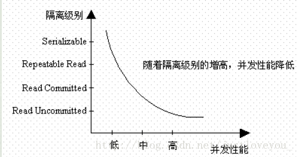

# 简述数据库事务并发机制

---

## 摘要

事务是最小的逻辑执行单元，也是数据库并发控制的基本单位，其执行的结果必须使数据库从一种一致性状态变到另一种一致性状态。事务具有四个重要特性，即原子性（Atomicity）、一致性（Consistency）、隔离性 (Isolation)和持久性 (Durability)。本文首先叙述了数据库中事务的本质及其四大特性（ACID）的内涵，然后重点介绍了事务隔离性的动机和内涵，并介绍了数据库为此所提供的事务隔离级别以及这些事务隔离级别能解决的事务并发问题。介于并发安全与并发效率的平衡，我们一般不会一味地提高事务隔离级别来保证事务并发安全性，而是通过结合其他机制(包括笔者提到的乐观锁和悲观锁机制)来解决数据库事务并发问题。

### 版权声明

本文原创作者：[书呆子Rico](http://my.csdn.net/justloveyou_)

作者博客地址：http://blog.csdn.net/justloveyou_/

本文关于脏读、不可重复读和幻读的解释举例来源于博文[《数据库事务隔离级别》](http://blog.csdn.net/fg2006/article/details/6937413)。

---

## 1. 事务概述

一般而言，用户的每次请求都对应一个业务逻辑方法，并且每个业务逻辑方法往往具有逻辑上的原子性。**此外，一个业务逻辑方法往往包括一系列数据库原子访问操作，并且这些数据库原子访问操作应该绑定成一个整体，即要么全部执行，要么全部不执行，通过这种方式我们可以保证数据库的完整性。**也就是说，事务是最小的逻辑执行单元，是数据库维护数据一致性的基本单位。

总的来说，==**事务是一个不可分割操作序列，也是数据库并发控制的基本单位，其执行的结果必须使数据库从一种一致性状态变到另一种一致性状态。**==事务具有四个重要特征，即原子性（Atomicity）、一致性（Consistency）、隔离性 (Isolation)和持久性 (Durability)。

### 1.1 原子性（Atomicity）

**原子性是指事务包含的所有操作要么全部成功，要么全部失败回滚。** 因此，事务的操作如果成功就必须要完全应用到数据库，如果操作失败则不会对数据库有任何影响，也就是说，事务是应用中不可再分的最小逻辑执行体。

### 1.2 一致性（Consistency）

**一致性是指事务执行的结果必须使数据库从一种一致性状态变到另一种一致性状态**。也就是说，一个事务执行之前和执行之后数据库都必须处于一致性状态。拿转账来说，假设用户A和用户B两者的钱加起来一共是5000，那么不管A和B之间如何转账，转几次账，事务结束后两个用户的钱相加起来应该还得是5000，这就是事务的一致性。

### 1.3 隔离性 (Isolation) **— 与事务并发直接相关**

==**隔离性是指并发执行的事务之间不能相互影响。**==也就是说，对于任意两个并发的事务 T1 和 T2，在事务 T1 看来，T2 要么在 T1 开始之前就已经结束，要么在 T1 结束之后才开始，这样每个事务都感觉不到有其他事务在并发地执行。关于事务的隔离性下文会重点探讨。

### 1.4 持久性 (Durability)

**持久性是指一个事务一旦被提交了，那么对数据库中的数据的改变就是永久性的**，即便是在数据库系统遇到故障的情况下也不会丢失提交事务的操作。换句换说，事务一旦提交，对数据库所做的任何改变都要记录到永久的存储器中(通常就是保存到物理数据库)。

---

## 2. 事务隔离性的内涵

以上介绍完了事务的基本概念及其四大特性(简称ACID)，现在重点来说明下事务的隔离性。我们知道，当多个线程都开启事务操作数据库中的数据时，数据库系统要能进行隔离操作以保证各个线程获取数据的准确性。也就是说，==**事务的隔离性主要用于解决事务的并发安全问题，**==那么事务的隔离性解决了哪些具体问题呢？

### 2.1 事务并发带来的问题

#### 2.1.1 脏读

**脏读是指在一个事务处理过程中读取了另一个事务未提交的数据。**比如，当一个事务正在多次修改某个数据，而当这个事务对数据的修改还未提交时，这时一个并发的事务来访问该数据，就会造成数据的脏读。举例如下:

公司发工资了，领导把5000元打到singo的账号上，但是该事务并未提交，而singo正好去查看账户，发现工资已经到账，是5000元整，非常高兴。可是不幸的是，领导发现发给singo的工资金额不对，是2000元，于是迅速回滚了事务，修改金额后，将事务提交，最后singo实际的工资只有2000元，singo空欢喜一场。

出现的上述情况就是我们所说的脏读，即对于两个并发的事务(事务A：领导给singo发工资、事务B：singo查询工资账户)，事务B读取了事务A尚未提交的数据。特别地，**当隔离级别设置为 Read Committed 时，就可以避免脏读，但是仍可能会造成不可重复读。**特别地，大多数数据库的默认级别就是Read committed，比如Sql Server , Oracle。

### 2.1.2 不可重复度

不可重复读是指：**对于数据库中的某个数据，一个事务范围内多次查询却返回了不同的数据值，**这是由于在查询间隔该数据被另一个事务修改并提交了。例如，事务 T1 在读取某一数据，而事务 T2 立马修改了这个数据并且提交事务，当事务T1再次读取该数据就得到了不同的结果，即发生了不可重复读。==**不可重复读和脏读的区别是，脏读是某一事务读取了另一个事务未提交的脏数据，而不可重复读则是读取了前一事务提交的数据。**==举例如下:

singo拿着工资卡去消费，系统读取到卡里确实有2000元，而此时她的老婆也正好在网上转账，把singo工资卡的2000元转到另一账户，并在singo之前提交了事务，当singo扣款时，系统检查到singo的工资卡已经没有钱，扣款失败，singo十分纳闷，明明卡里有钱，为何……

上述情况就是我们所说的不可重复读，即两个并发的事务(事务A：singo消费、事务B：singo的老婆网上转账)，事务A事先读取了数据，事务B紧接着更新了数据并提交了事务，而事务A再次读取该数据时，数据已经发生了改变。**当隔离级别设置为Repeatable read时，可以避免不可重复读。**这时，当singo拿着工资卡去消费时，一旦系统开始读取工资卡信息（即事务开始），singo的老婆就不可能对该记录进行修改，也就是singo的老婆不能在此时转账。特别地，MySQL的默认隔离级别就是 Repeatable read。

#### 2.1.3 幻读

**幻读是事务非独立执行时发生的一种现象，即在一个事务读的过程中，另外一个事务可能插入了新数据记录，影响了该事务读的结果。**例如，事务 T1 对一个表中所有的行的某个数据项执行了从“1”修改为“2”的操作，这时事务T2又对这个表中插入了一行数据项，而这个数据项的数值还是为“1”并且提交给数据库。这时，操作事务 T1 的用户如果再查看刚刚修改的数据，会发现还有一行没有修改，其实这行是从事务T2中添加的，就好像产生幻觉一样，这就是发生了幻读。==**幻读和不可重复读都是读取了另一条已经提交的事务（这点与脏读不同），所不同的是不可重复读查询的都是同一个数据项，而幻读针对的是数据记录插入/删除问题，二者关注的问题点不太相同。**==举例如下:

singo的老婆工作在银行部门，她时常通过银行内部系统查看singo的信用卡消费记录。有一天，她正在查询到singo当月信用卡的总消费金额为80元，而singo此时正好在外面胡吃海塞后在收银台买单，消费1000元，即新增了一条1000元的消费记录并提交了事务，随后singo的老婆将singo当月信用卡消费的明细打印到A4纸上，却发现消费总额为1080元，singo的老婆很诧异，以为出现了幻觉，幻读就这样产生了。**当隔离级别设置为Serializable(最高的事务隔离级别)时，不仅可以避免脏读、不可重复读，还可以避免幻读。但同时代价也花费最高，性能很低，一般很少使用，因为在该级别下并发事务将串行执行。**

### 2.2 小结

总的来说，事务的隔离性主要用于解决事务并发安全问题。上面提到的脏读、不可重复读和幻读三个典型问题都是在事务并发的前提下发生的，不同的是三者的问题关注点略有不同。脏读关注的是事务读取了另一个事务未提交的数据；不可重复读关注的是同一事务中对同一个数据项多次读取的结果互不相同；幻读更侧重于数据记录的插入/删除问题，比如同一事务中对符合同一条件的数据记录的多次查询的结果互不相同。更进一步地说，==**不可重复读关注的是数据的更新带来的问题，幻读关注的是数据的增删带来的问题。**==

---

## 3. 数据库的事务隔离级别

不同数据库的事务隔离级别不尽相同。比如我们在上一节提到，MySQL数据库支持下面的四种隔离级别，并且默认为 Repeatable read 级别；而在Oracle数据库中，只支持Serializable 级别和 Read committed 这两种级别，并且默认为 Read committed 级别。MySQL数据库为我们提供了四种隔离级别，分别为：

* Serializable (串行化)：最高级别，可避免脏读、不可重复读、幻读的发生；
* Repeatable read (可重复读)：可避免脏读、不可重复读的发生；
* Read committed (读已提交)：可避免脏读的发生；
* Read uncommitted (读未提交)：最低级别，任何情况都无法保证。

从上图中可以看出，以上四种隔离级别中最高的是 Serializable级别，最低的是 Read uncommitted级别。当然，隔离级别越高，事务并发就越安全，但执行效率也就越低。比如，Serializable 这样的级别就是以锁表的方式(类似于Java多线程中的锁)保证并发事务的串行执行，但这时执行效率也降到了最低，所以，**选用何种隔离级别实质上是一种并发安全与并发效率的平衡**，应该根据实际情况而定。特别地，在MySQL数据库中，默认的事务隔离级别为 Repeatable read(可重复读)，下面我们看看如何在MySQL数据库中操作事务的隔离级别。

### 3.1 MySQL默认事务隔离级别查看

在MySQL数据库中，我们可以通过以下方式查看当前事务的隔离级别:

~~~mysql
select @@tx_isolation;
~~~

### 3.2 MySQL事务隔离级别修改

在MySQL数据库中，我们可以分别通过以下两种方式设置事务的隔离级别，分别为：

~~~mysql
    set  [glogal | session]  transaction isolation level 隔离级别名称;
或
    set tx_isolation='隔离级别名称';
~~~

### 3.3 使用JDBC对设置数据库事务的隔离级别

设置数据库的隔离级别一定要是在开启事务之前。特别地，使用JDBC对数据库的事务设置隔离级别时，我们应该在调用Connection对象的setAutoCommit(false)方法之前调用Connection对象的setTransactionIsolation(level)去设置当前链接的隔离级别.

特别地，通过这种方式设置事务隔离级别只对当前链接有效。对于使用MySQL命令窗口而言，一个窗口就相当于一个链接，当前窗口设置的隔离级别只对当前窗口中的事务有效；对于JDBC操作数据库来说，一个Connection对象相当于一个链接，而对于Connection对象设置的隔离级别只对该Connection对象有效，与其他链接Connection对象无关。

---

## 4. 数据库并发控制

也许大家已经听说过，锁分两种，一个叫 ==**悲观锁**==，一种称之为 ==**乐观锁**==。事实上，==**无论是悲观锁还是乐观锁，都是人们定义出来的概念，是一种解决问题的思想。**==因此，不仅仅在数据库系统中有乐观锁和悲观锁的概念，像memcache、hibernate、tair等都有类似的概念。比如，在线程并发处理中， ==**Synchronized内置锁**== 就是悲观锁的一种，也称之为 **独占锁**，加了synchronized关键字的代码基本上就只能以单线程的形式去执行了，它会导致其他需要该资源的线程挂起，直到前面的线程执行完毕释放所资源；而 ==**乐观锁是一种更高效的机制，它的原理就是每次不加锁去执行某项操作，如果发生冲突则失败并重试，直到成功为止，其实本质上不算锁，所以很多地方也称之为**== **自旋**。

**在解决数据库的事务并发访问问题时，虽然将事务串形化可以保证数据在多事务并发处理下不存在数据不一致的问题，但串行执行使得数据库的处理性能大幅度地下降，常常是我们接受不了的。所以，一般来说，我们常常结合事务隔离级别和其它并发机制来保证事务的并发，以此来兼顾事务并发的效率与安全性。**事实上，大多数数据库的隔离级别都会设置为 Read Committed（只能读取其他事务已提交的数据），然后由应用程序使用乐观锁/悲观锁机制来解决其他事务并发问题，比如不可重复读问题。==**特别地，乐观并发控制(乐观锁)和悲观并发控制（悲观锁）是并发控制主要采用的技术手段。**==

特别地，**乐观锁的理念是：假设不会发生并发冲突，只在提交操作时检查是否违反数据完整性；而悲观锁的理念是假定会发生并发冲突，屏蔽一切可能违反数据完整性的操作。**针对于不同的业务场景，应该选用不同的并发控制方式。所以，不要把乐观并发控制和悲观并发控制狭义的理解为DBMS中的概念，更不要把他们和数据中提供的锁机制（行锁、表锁、排他锁、共享锁）混为一谈。需要指出的是，在DBMS中，悲观锁正是利用数据库本身提供的锁机制来实现的。

> **Ps:更多关于 \**synchronized 关键字\** 的介绍， 请移步博文[《Java 并发：内置锁 Synchronized》](http://blog.csdn.net/justloveyou_/article/details/54381099)。**

### 4.1 乐观锁

==**乐观锁，虽然名字中带“锁”，但是乐观锁并不锁住任何东西，而是在提交事务时检查这条记录是否被其他事务进行了修改：如果没有，则提交；否则，进行回滚。**==相对于悲观锁，在对数据库进行处理的时候，乐观锁并不会使用数据库提供的锁机制。如果并发的可能性并不大，那么乐观锁定策略带来的性能消耗是非常小的。**乐观锁采用的实现方式一般是记录数据版本。**

　　数据版本是为数据增加的一个版本标识。当读取数据时，将版本标识的值一同读出，数据每更新一次同时对版本标识进行更新。当我们提交更新的时候，判断数据库表对应记录的当前版本信息与第一次取出来的版本标识进行比对，如果数据库表当前版本号与第一次取出来的版本标识值相等，则予以更新，否则认为是过期数据。一般地，实现数据版本有两种方式，一种是使用版本号，另一种是使用时间戳。

### 4.2 悲观锁

悲观锁，正如其名，它指的是对数据被外界修改持保守(悲观)态度，因此，在整个数据处理过程中，将数据处于锁定状态。**悲观锁的实现往往依靠数据库提供的锁机制，也只有数据库层提供的锁机制才能真正保证数据访问的排他性，否则即使在本系统中实现了加锁机制，也无法保证外部系统不会修改数据。**悲观并发控制主要用于数据争用激烈的环境，以及发生并发冲突时使用锁保护数据的成本要低于回滚事务的成本的环境中。和乐观锁相比，悲观锁则是一把真正的锁了，它通过SQL语句“select for update”锁住select出的那批数据，这时如果其他事务来更新这批数据时会等待。

　　==**悲观并发控制实际上是“先取锁再访问”的保守策略，为数据处理的安全提供了保证。**==但是在效率方面，处理加锁的机制会让数据库产生额外的开销，还有增加产生死锁的机会；另外，在只读型事务处理中由于不会产生冲突，也没必要使用锁，这样做只能增加系统负载；还有会降低了并行性，一个事务如果锁定了某行数据，其他事务就必须等待该事务处理完才可以处理那行数据。

### 4.3 小结

**悲观锁和乐观锁都是一种解决并发控制问题的思想。**特别地，在数据库并发控制方面，悲观锁与乐观锁有以下几点区别：

* **思想**：在事务并发环境中，乐观锁假设不会发生并发冲突，因此只在提交操作时检查是否违反数据完整性；而悲观锁假定会发生并发冲突，会屏蔽一切可能违反数据完整性的操作。
* **实现**：悲观锁是利用数据库本身提供的锁机制来实现的；而乐观锁则是通过记录数据版本实现的。
* **应用场景**：悲观锁主要用于数据争用激烈的环境或者发生并发冲突时使用锁保护数据的成本要低于回滚事务的成本的环境中；而乐观锁主要应用于并发可能性并不太大、数据竞争不激烈的环境中，这时乐观锁带来的性能消耗是非常小的。
* **脏读**：乐观锁不能解决脏读问题，而悲观锁则可以。

总的来说，悲观锁相对乐观锁更安全一些，但是开销也更大，甚至可能出现数据库死锁的情况，建议只在乐观锁无法工作时才使用。

---

## 5. 附

> [数据库事务的四大特性以及事务的隔离级别](http://www.cnblogs.com/fjdingsd/p/5273008.html)
>
> [数据库事务隔离级别](http://blog.csdn.net/fg2006/article/details/6937413)
>
> [深入理解乐观锁与悲观锁](http://www.open-open.com/lib/view/open1452046967245.html)

