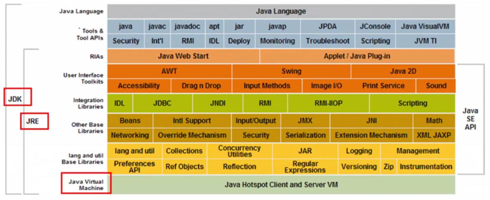
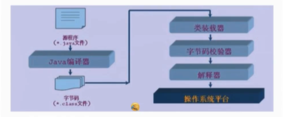

# Java入门知识

---

## 目录

* [Java 平台和工具](#Java 平台和工具)
* [Java 的特性和优势](#Java 的特性和优势)
* [Java 的三大版本](#Java 的三大版本)
* [JDK、JRE、JVM](#JDK、JRE、JVM)
* [开发环境](#开发环境)
  * [卸载 JDK](#卸载 JDK)
  * [安装JDK](#安装JDK)
  * [JDK 子目录简介](#JDK 子目录简介)
* [HelloWorld 详解](#HelloWorld 详解)
* [Java 程序运行机制](#Java 程序运行机制)
* [IDEA 安装](#IDEA 安装)
  * [IDE 简介](#IDE 简介)
  * [IDEA 安装](#IDEA 安装)
    * ==[旗舰版学生认证](#旗舰版学生认证)==
  * [新建第一个项目](#新建第一个项目)
  * [自定义设置](#自定义设置)

---

## Java 平台和工具

* 基于 Java 开发了众多平台，系统和工具
  * 构建工具：Ant, Maven, Jekins
  * 应用服务器：Tomcat, Jetty, Jboss, Websh=phere, weblogic
  * Web开发：Strus, Sprint, Hibernate, myBatis
  * 开发工具：Eclipse, Netbean, Intellij IDEA, Jbuilder
  * ...
* 三高的概念：高可用、高性能、高并发

---

## Java 的特性和优势

* 简单性
* 面向对象
* 可移植性（跨平台：Windows, Android, Linux, ...）
* 高性能（即时编译）
* 分布式（网络分布式环境）
* 动态性（反射的机制）
* 多线程
* 安全性
* 健壮性

---

## Java 的三大版本

* JavaSE：标准版（桌面应用程序，控制台开发……JavaSE 是Java的**核心**）
* JavaME：嵌入式开发（手机、小家电……目前已很少见）
* JavaEE：E企业级开发（web端，服务器开发……）

JavaSE (Java Platform, Standard Edition)，Java 平台标准版。用于开发和部署桌面、服务器以及嵌入设备和实时环境中的 Java 应用程序。Java SE 包括用于开发 Java Web 服务的类库，同时， Java SE 为 Java EE 和 Java ME 提供了基础。Java SE 就是基于 JDK 和 JRE，包含支持 Java Web 服务开发的类，并为 Java 企业级开发提供基础。

JavaME (Java Platform,Micro Edition)  是 Java 微版的简称，是一个技术和规范的集合，它为移动设备（包括消费类产品、嵌入式设备、高级移动设备等）提供了基于Java环境的开发与应用平台。Java ME分为两类配置，一类是面向小型移动设备的 CLDC（Connected Limited Device Profile），一类是面向功能更强大的移动设备如智能手机和机顶盒，称为 CDC（Connected Device Profile CDC）。

Java EE（Java Platform，Enterprise Edition）是sun公司（2009年4月20日甲骨文将其收购）推出的企业级应用程序版本。这个版本以前称为 J2EE。能够帮助我们开发和部署可移植、健壮、可伸缩且安全的服务器端 Java应用程序。Java EE 是在 Java SE 的基础上构建的，它提供Web 服务、组件模型、管理和通信 API，可以用来实现企业级的面向服务体系结构（service-oriented architecture，SOA）和 Web 3.0应用程序。

---

## JDK、JRE、JVM

* JDK：Java Development Kit （Java 语言的开发工具包(SDK)）JDK 包括了 JRE（Java 运行环境）和 JVM （Java虚拟机）。额外又包含了开发工具。如：
  * java、javac：用于编译、运行 Java 程序。
  * javadoc：生成文档
  * jar：将 Java 打包生成一个应用
* JRE：Java Runtime Environment（Java 运行环境）包含了一些库，一些组件，可以运行 Java 程序。
* JVM：Java Virtual Machine（Java 虚拟机）Java语言在不同平台上运行时不需要重新编译。Java语言使用Java虚拟机屏蔽了与具体平台相关的信息，使得Java语言编译程序，只需生成在Java虚拟机上运行的目标代码（字节码），就可以在多种平台上不加修改地运行。

---

## 开发环境

### 卸载 JDK

1. 删除 Java 的安装目录
2. 删除 相关环境变量
3. dos 下输入命令 java -version 查看是否卸载干净安装jdk

### 安装JDK

1. 下载对应版本的安装包

2. 启动安装包，安装至自定义路径

3. 配置环境变量

   * 我的电脑 -> 右键 -> 属性 -> 高级系统设置 -> 环境变量

   * Path 中的%%表示引用，中间的变量会被替换成已添加的路径。
   * Java bin 目录下包含了各种执行程序，要加入环境变量。
   * Java jre 目录包含运行环境，也加入环境变量。（大概jdk11以后不需要再配置jre）

4. 测试 JDK 是否安装成功

   1. 打开 cmd
   2. java -version

### JDK 子目录简介

* bin目录：用于存放**可执行程序**（各类 .exe 文件）
* include目录：由于 JDK 是用c、c++编写的，在启动时要引入一些头文件
* jre目录：运行环境（大概jdk11以后不需要再配置jre）
* lib目录：包含各种库文件
* src.zip压缩包（在lib目录下）：压缩了很多资源文件（java类源码），如 applet, awt, bans, io, lang, mathl, net ...

---

## HelloWorld 详解

1. 选择一个目录存放代码

2. 新建一个 java 文件

   * 文件后缀名为 .java

   * Hello.java

   * 【注意】文件可能隐藏了后缀，要在查看中修改设置。

   * 完成编写目标代码，保存关闭
 ~~~java
     public class Hello {
         public static void main(String[] atgs) {
             System.out.println("Hello, world!");
         }
     }
 ~~~

3. 打开dos命令行进入存放 Hello.java 的**当前目录**
4. 通过 javac + Java文件名（全名，带 .java 后缀）命令编译 .java 文件，生成 .class 文件
5. 通过 java + Java文件名 命令运行 java class 文件

* 没有包的情况下，在 .java 文件的当前目录执行如下命令即可编译 + 运行

~~~markdown
	javac Hello.java	// 编译 Hello.java 文件，自动生成 Hello.class 文件
    java Hello		// 运行 Hello.class 文件
~~~

* 有包的情况下（比如 Hello.java 声明了该文件属于 package set; ），要如下操作进行编译 + 运行

~~~markdown
	// 方法1：直接编译运行
	java Hello.
	
	// 方法2：先生成 .class 文件，再运行 .class 文件
	javac Hello.java	// 编译 Hello.java 文件，自动生成 Hello.class 文件
	cd..	// 返回包名所在目录
	java set.Hello	// 运行 Hello.class 文件
~~~

### 可能遇到的情况

1. 单词大小写问题。**Java是大小写敏感的**。
2. 尽量使用英文
3. 文件名必须与类名一致
4. 符号全英文
5. 环境变量

---

## Java 程序运行机制

高级语言具有编译型和解释型的特性，区别在于翻译的时机不同。

* 编译型（compile）：如操作系统、c、c++程序，对执行速度要求比较高。先完全编译再运行。
* 解释型：如一些网页、JavaScript、脚本、Python 等，对速度要求不高，边解释边执行。

Java 既具有编译型的特性也具有解释型的特性。**Java 源文件**通过编译器编译成**字节码 .class 文件**，该过程称为预编译，生成了介于**代码**和**机器码**之间的**字节码**。Java 虚拟机会将字节码文件（.class 文件）放入类装载器，此时类被加载入 JVM 中。然后通过**字节码校验器**检验代码是否正确，确保无问题后，通过**解释器**解释给操作系统（类似解释一句执行一句）。

> 由于当前技术的发展和硬件属性的提升（内存容量不断扩大），解释型和编译型的边界越来越模糊。

---

## IDEA 安装

### IDE 简介

IDE（Integrated Development Environment, **集成开发环境**）是用于提供程序开发环境的应用程序，一般包括代码编辑器、编译器、调试器和图形用户界面等工具。集成了代码编写功能、分析功能、调试功能等一体化的开发软件服务套。所有具备这一特性的软件或软件套（组）都可以叫集成开发环境。如微软的 Visual Studio 系列等。该程序可以独立运行，也可以和其他程序并用。

### IDEA 安装

* 官网下载安装包（推荐旗舰版 ultimate）

* #### 旗舰版学生认证

  * 下载旗舰版可拥有完整服务，学生认证可申请一年的免费使用权，步骤如下：
    1. 注册学校的官方邮箱账户，例如武汉理工大学的学生邮箱:XXX@whut.edu.cn
    2. 网站地址: https://www.jetbrains.com/student/ 在该网页申请学生认证。
    3. 提交申请后，官网会给你的邮箱发送信息。按信息提示操作即可。
    4. 授权成功后，官网会提示使用一个账号登录绑定授权 lisence，此时可注册或登录一个账号，登陆后将自动绑定授权信息。
    5. 安装IDEA，并使用刚刚授权的账号登录，IDEA 将自动获取账号使用权许可。

* 推荐安装至自定义本地路径

* 如果之前安装过其它版本的 IntelliJ IDEA，卸载时可**保留配置文件**，在安装新版本（比如升级为旗舰版）后，可以选择**导入原配置**（在安装后第一次运行 IDEA 时会给出提示和说明，选择导入配置文件后会自动加载原配置文件存放路径）。

### 新建第一个项目

* setup SDK：设置软件开发工具包，此处选择自己电脑已安装的jdk。
* 选择项目存储的位置。开发环境会在路径终点自动生成一个与项目名称同名的文件夹
  * 项目文件夹中包括 **.idea** 文件夹和 **src** 文件夹。代码要放在 src 目录下。
* 运行项目需要设置 Modues 。

### 自定义设置

* 字体：左上角File -> Settings -> Editor -> Font

> 可以搜索“IDEA优化”，进行各类个性化设置。
