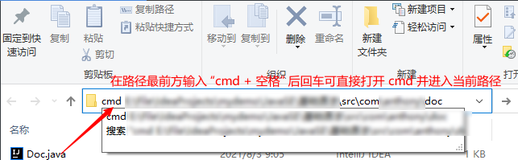

# Java基础_JavaDoc文档

---

* javadoc 命令是用于生成 API 文档

* 参数信息
  * @author 作者名
  * @version 版本号
  * @since 指明需要最早使用的 jdk 版本
  * @param 参数名
  * @return 返回值情况
  * @throws 异常抛出情况

## 命令行生成 JavaDoc 文档步骤

* 进入 .java 目标文件所在目录

* 文件管理器路径栏前输入 cmd 直接打开命令行窗口

  

* 输入命令自动生成文档

  ~~~java
  	// 生成javadoc文档，编码、字符集为 UTF-8
  	javadoc -encoding UTF-8 -charset UTF-8 Doc.java
  ~~~

  

  