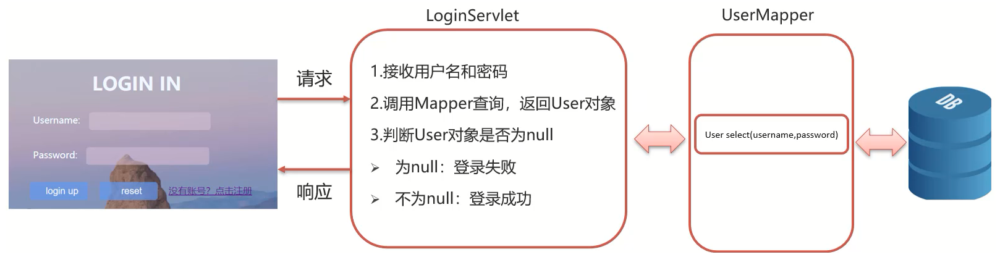

# Request-Response对象

## 1. Request-Response对象概述

在Servlet接口中的`service(ServletRequest request, ServletResponse response)`方法中，有两个参数 request 和 response，其作用如下：

* `rerquest`对象：<font color="ff9f44">**获取请求数据**</font>
  * 浏览器会发送HTTP请求到后台服务器[Tomcat]
  * 后台服务器[Tomcat]会对HTTP请求中的数据进行解析并把解析结果存入到一个对象中
  * 所存入的对象即为request对象，所以我们<font color="ff9f44">可以从request对象中获取请求的相关参数</font>
  * 获取到数据后就可以继续后续的业务，比如获取用户名和密码后，就可以实现登录操作的相关业务
* `response`对象：<font color="ff9f44">**设置响应数据**</font>
  * 业务处理完后，后台就需要给前端返回业务处理的结果即响应数据
  * 在业务逻辑代码中将响应数据封装到`response`对象
  * 后台服务器[Tomcat]会解析response对象,按照[响应行+响应头+响应体]格式拼接结果
  * 浏览器最终解析结果，把内容展示在浏览器给用户浏览


## 2. Request对象

### 2.1 Request对象继承体系

* Request的继承体系为`ServletRequest` -> `HttpServletRequest` -> `RequestFacade`
  * 其中，`ServletRequest`和 `HttpServletRequest` 二者都是接口
  * `RequestFacade`是 Tomcat 提供的实现类
    * 该类实现了HttpServletRequest接口，也间接实现了ServletRequest接口
    * Servlet 类中的 `service()` 方法、`doGet()` 方法或者是 `doPost()` 方法最终都是由Web服务器[Tomcat]来调用的，所以 Tomcat 提供了方法参数接口的具体实现类，并完成了对象的创建
    * 要想了解RequestFacade中都提供了哪些方法，我们可以直接查看JavaEE的API文档中关于ServletRequest和HttpServletRequest的接口文档，因为RequestFacade实现了其接口就需要重写接口中的方法
* Tomcat 会解析请求数据，封装为 `request` 对象,并且创建 `request` 对象传递到 `service()` 方法
  * 代码在 `service()` 方法中形成业务逻辑，通过 `request` 对象获取请求中的参数、属性值，进行数据处理。


### 2.2 Request获取请求数据

HTTP请求数据总共分为三部分内容，分别是<font color="ff9f44">**请求行、请求头、请求体**</font>

下面将逐一记录从 `request` 对象获取三部分内容的方法。

#### 2.2.1 获取请求行数据

请求行包含三块内容，分别是`请求方式`、`请求资源路径`、`HTTP协议及版本`

一个完整的请求行示例如下所示：

`GET /request-demo/RequestDemo1?username=anthony HTTP/1.1`

其格式分解如下：

| 请求方式 |                 请求资源路径                  | HTTP协议及版本 |
| :------: | :-------------------------------------------: | :------------: |
|  `GET`   | `/request-demo/RequestDemo1?username=anthony` |   `HTTP/1.1`   |

对于这三部分内容，request对象都提供了对应的API方法来获取，具体如下:

* 获取请求方式：对应示例中的`GET`

```java
String getMethod()
```

* 获取虚拟目录(项目访问路径)：对应示例中的 `/request-demo`

```java
String getContextPath()
```

* 获取URL(统一资源定位符)： `http://localhost:8080/request-demo/RequestDemo1`

```java
StringBuffer getRequestURL()
```

* 获取URI(统一资源标识符)：对应示例中的`/request-demo/RequestDemo1`

```java
String getRequestURI()
```

* <font color="ff9f44">获取请求参数(GET方式)</font>: `username=zhangsan&password=123`

```java
String getQueryString()
```


方法示例：

~~~java
package com.anthonycj.javaweb2021.requestdemo.web.request;

import javax.servlet.ServletException;
import javax.servlet.annotation.WebServlet;
import javax.servlet.http.HttpServlet;
import javax.servlet.http.HttpServletRequest;
import javax.servlet.http.HttpServletResponse;
import java.io.BufferedReader;
import java.io.IOException;

/**
 * request 获取请求数据示例
 */
@WebServlet(urlPatterns = "/requestDemo1")
public class RequestDemo1 extends HttpServlet {
    @Override
    protected void doGet(HttpServletRequest req, HttpServletResponse resp) throws ServletException, IOException {
        // String getMethod()：获取请求方式： GET
        String method = req.getMethod();
        System.out.println(method); //GET
        // String getContextPath()：获取虚拟目录(项目访问路径)：/request-demo
        String contextPath = req.getContextPath();
        System.out.println(contextPath);
        // StringBuffer getRequestURL(): 获取URL(统一资源定位符)：http://localhost:8080/request-demo/req1
        StringBuffer url = req.getRequestURL();
        System.out.println(url.toString());
        // String getRequestURI()：获取URI(统一资源标识符)： /request-demo/req1
        String uri = req.getRequestURI();
        System.out.println(uri);
        // String getQueryString()：获取请求参数（GET方式）： username=zhangsan
        String queryString = req.getQueryString();
        System.out.println(queryString);

        // ------------
        // 获取请求头的某一参数（此处以user-agent为例）
        String header = req.getHeader("user-agent");
        System.out.println(header);
    }

    @Override
    protected void doPost(HttpServletRequest req, HttpServletResponse resp) throws ServletException, IOException {
    }
}
~~~


#### 2.2.2 获取请求头数据

请求头的数据，格式为 `key: value` 的形式，举例如下（第一行为请求行数据，后面为请求头数据 Headers ）

~~~http
GET /request-demo/resp2 HTTP/1.1
Host: localhost:8080
Connection: keep-alive
Cache-Control: max-age=0
sec-ch-ua: " Not A;Brand";v="99", "Chromium";v="96", "Microsoft Edge";v="96"
sec-ch-ua-mobile: ?0
sec-ch-ua-platform: "Windows"
Upgrade-Insecure-Requests: 1
User-Agent: Mozilla/5.0 (Windows NT 10.0; Win64; x64) AppleWebKit/537.36 (KHTML, like Gecko) Chrome/96.0.4664.55 Safari/537.36 Edg/96.0.1054.43
Accept: text/html,application/xhtml+xml,application/xml;q=0.9,image/webp,image/apng,*/*;q=0.8,application/signed-exchange;v=b3;q=0.9
Sec-Fetch-Site: none
Sec-Fetch-Mode: navigate
Sec-Fetch-User: ?1
Sec-Fetch-Dest: document
Accept-Encoding: gzip, deflate, br
Accept-Language: zh-CN,zh;q=0.9,en;q=0.8,en-GB;q=0.7,en-US;q=0.6
Cookie: Idea-45df91f4=d76edae0-4d55-4bad-8226-11ee11e43aa4
~~~

根据请求头名称 `key` 获取对应请求头的值 `value` 的方法如下：

~~~java
String getHeader(String name);
~~~

示例

~~~java
/**
 * request 获取请求数据示例
 */
@WebServlet(urlPatterns = "/requestDemo1")
public class RequestDemo1 extends HttpServlet {
    @Override
    protected void doGet(HttpServletRequest req, HttpServletResponse resp) throws ServletException, IOException {
        // 获取请求头的某一参数（此处以user-agent为例）
        String header = req.getHeader("user-agent");
        System.out.println(header);
    }

    @Override
    protected void doPost(HttpServletRequest req, HttpServletResponse resp) throws ServletException, IOException {
    }
}
~~~


#### 2.2.3 获取请求体数据

<font color="ff9f44">注意：</font>浏览器发送的 `POST` 请求才有请求体，在发送 GET 请求的时候没有请求体。

Request对象提供了如下<font color="ff9f44">两种</font>方法获取请求体的数据：

* <font color="ff9f44">对于文件数据，获取字节输入流。</font>如果前端发送的是字节数据。比如传递的是文件数据，则使用该方法

```java
ServletInputStream getInputStream() // 该方法可以获取字节
```

* <font color="ff9f44">对于纯文本数据，获取字符输入流。</font>如果前端发送的是纯文本数据，则使用该方法

```java
BufferedReader getReader();
```

> **附**	BufferedReader 流是通过 request 对象来获取的，当请求完成后 request 对象就会被销毁，request 对象被销毁后，BufferedReader 流就会自动关闭，所以此处不需要手动关闭流。


#### 2.2.4 获取请求参数的通用方式

* 什么是请求参数
  * 通常与用户的输入相关
  * 以登录注册的页面为例，页面提交的请求参数通常为用户输入的用户名、密码等信息
* 什么是请求数据
  * 请求数据是包含**请求行、请求头和请求体**的所有数据
* 请求参数和请求数据的关系
  * 请求参数是请求数据中的部分内容
  * 如果是 `GET` 请求，请求参数在请求行中
  * 如果是 `POST` 请求，请求参数一般在请求体中

`GET`请求方式和`POST`请求方式区别主要在于获取请求参数的方式不一样，我们期望找到一种<font color="ff9f44">统一</font>获取请求参数的方式，从而<font color="ff9f44">统一</font> `doGet` 和` doPost` 方法内的代码。

对于请求参数的获取，常用的有以下两种:

* <font color="ff9f44">GET方式:</font>

```java
String getQueryString()
```

* <font color="ff9f44">POST方式:</font>

```java
BufferedReader getReader();
```

根据请求方式获取请求参数的处理逻辑框架如下：

~~~java
// 获取请求方式
String method = req.getMethod();
// 获取请求参数
String params = "";
if ("GET".equals(method)) {
    params = req.getQueryString();
} else if ("POST".equals(method)) {
    BufferedReader reader = req.getReader();
    params = reader.readLine();
}
~~~

`request` 对象已经将上述获取请求参数的逻辑进行了封装，且 request 提供的方法实现的功能更强大，使用时只需要调用 request 提供的方法即可，在request的方法中都实现以下操作

1. 不同的请求方式获取请求参数
2. 把获取到的内容进行分割，通过`&`分隔得到不同的参数键值对，通过`=`分隔得到每一对的参数名和参数值
3. 把分割后端数据，存入到一个Map集合
   * 因为参数的值可能是一个，也可能有多个，所以Map的值的类型为String数组 `String[]`

基于上述理论，`request` 对象为我们提供了如下方法:

* 获取所有参数Map集合

```java
Map<String,String[]> getParameterMap()
```

使用示例

~~~java
// 方法1.获取所有参数的Map集合
Map<String, String[]> map = req.getParameterMap();
for (String key : map.keySet()) {
    // username:anthony
    System.out.print(key + ":");
    // 获取值
    String[] values = map.get(key);
    for (String value : values) {
        System.out.print(value + "\040");
    }
    System.out.println();
}
~~~

使用示例

~~~java
// 方法2：根据key直接获取参数值的数组
String[] hobbies = req.getParameterValues("hobby");
for (String hobby : hobbies) {
    System.out.print(hobby + "\040");
}
System.out.println();
~~~


* 根据名称获取参数值（数组）

```java
String[] getParameterValues(String name)
```

使用示例

~~~java
// 方法3：根据key获取单个参数值
String username = req.getParameter("username");
String password = req.getParameter("password");
System.out.println(username);
System.out.println(password);
~~~


* 根据名称获取参数值(单个值)

```java
String getParameter(String name)
```


附：使用示例中的提交表单页面定义如下

~~~html
<!DOCTYPE html>
<html lang="en">
<head>
    <meta charset="UTF-8">
    <title>Title</title>
</head>
<body>
<form action="/request-demo/req2" method="get">
    <input type="text" name="username"><br>
    <input type="password" name="password"><br>
    <input type="checkbox" name="hobby" value="1"> 游泳
    <input type="checkbox" name="hobby" value="2"> 爬山 <br>
    <input type="submit">

</form>
</body>
</html>
~~~


<font color="ff9f44">**小结**</font>

* `req.getParameter()` 方法使用的频率会比较高
* 以后获取请求参数，只需按如下逻辑编写代码：

~~~java
public class RequestDemo extends HttpServlet {
    @Override
    protected void doGet(HttpServletRequest req, HttpServletResponse resp) throws ServletException, IOException {
       //采用request提供的获取请求参数的通用方式来获取请求参数
       //编写其他的业务代码...
    }
    @Override
    protected void doPost(HttpServletRequest req, HttpServletResponse resp) throws ServletException, IOException {
        this.doGet(req,resp);
    }
}
~~~


### 2.3 IDEA快速创建Servlet

可以使用Servlet模板快速创建Servlet类。

IDEA中修改Servlet模板的方法：

File -> Settings -> Editor -> File and Code Templates -> Other -> Web -> Java code templates -> Servlet Annotated Class.java


### 2.4 请求参数中文乱码问题

#### 2.4.1 POST请求解决方案

* 出现中文乱码的原因：
  * POST的请求参数通过`request`对象的`getReader()`方法来获取流中的数据
  * Tomcat在获取流的时候采用的编码是ISO-8859-1
  * ISO-8859-1编码是不支持中文的，所以会出现乱码
* 解决方案：设置输入流的编码
  * 页面设置的编码格式为`UTF-8`
  * 把Tomcat在获取流数据之前的编码设置为`UTF-8`
  * 通过request.setCharacterEncoding("UTF-8")设置编码,UTF-8也可以写成小写

解决示例：设置输入流的编码

~~~java
request.setCharacterEncoding("UTF-8");
~~~

完整实例：

~~~java
@WebServlet(urlPatterns = "/RequestDemo3")
public class RequestDemo3 extends HttpServlet {
    @Override
    protected void doGet(HttpServletRequest request, HttpServletResponse response) throws ServletException, IOException {
        // 1.解决中文乱码，根据页面的字符集设置编码，一般都为UTF-8
        request.setCharacterEncoding("UTF-8");

        // 获取username
        String username = request.getParameter("username");
        System.out.println(username);
    }

    @Override
    protected void doPost(HttpServletRequest request, HttpServletResponse response) throws ServletException, IOException {
        this.doGet(request, response);
    }
}
~~~


#### 2.4.2 GET请求解决方案

* Tomcat8.0之后，已将GET请求乱码问题解决，设置默认的解码方式为UTF-8
* 此处记录一种通用方式（GET/POST）：需要先解码，再编码

~~~java
String username = request.getParameter("username");
username = new String(username.getBytes("ISO-8859-1"),"UTF-8");	// 先解码，再编码
~~~


### 2.5 Request请求转发

#### 2.5.1 请求转发概述

<font color="ff9f44">请求转发(forward)：一种在服务器内部的资源跳转方式。</font>


* 流程示例：
  1. 浏览器发送请求给服务器，服务器中对应的资源A接收到请求
  2. 资源A处理完请求后将请求发给资源B
  3. 资源B处理完后将结果响应给浏览器

> 请求从资源A到资源B的过程就叫请求转发


#### 2.5.2 请求转发的实现方式

代码如下

~~~java
req.getRequestDispatcher("资源B路径").forward(req,resp);
~~~


#### 2.5.3 请求转发资源间共享数据-使用request对象

需要使用`request`对象提供的三个方法:

* 存储数据到request域[范围,数据是存储在request对象]中

```java
void setAttribute(String name,Object o);
```

* 根据key获取值

```java
Object getAttribute(String name);
```

* 根据key删除该键值对

```java
void removeAttribute(String name);
```


#### 2.5.4 请求转发的特点

* 浏览器地址栏路径不发生变化
* 只能转发到<font color="ff9f44">当前服务器的内部资源</font>
  * 不能从一个服务器通过转发访问另一台服务器
* 一共只有一次请求，可以在转发资源间使用 `request` 对象共享数据


## 3. Response对象

* Request对象用于<font color="ff9f44">获取</font>请求数据
* Response对象用于<font color="ff9f44">设置</font>响应数据。

对于Response对象主要涉及以下内容：

* Response对象设置响应数据的方法
* Response完成重定向
* Response响应字符数据
* Response响应字节数据


### 3.1 Response对象设置响应数据功能介绍

HTTP响应数据总共分为三部分内容，分别是<font color="ff9f44">**响应行、响应头、响应体**</font>

* 响应行

结构为：`HTTP协议及版本`、`响应状态码`、`状态码描述`

~~~http
HTTP/1.1 200 OK
~~~

对于响应行，比较常用的就是`request`对象设置响应状态码:

```java
void setStatus(int sc);
```


* 响应头

结构为：`key-value`对

~~~http
HTTP/1.1 200 OK
Bdpagetype: 2
Bdqid: 0xa8ca2a1c00032f10
Cache-Control: private
Connection: keep-alive
Content-Encoding: gzip
Content-Type: text/html;charset=utf-8
Date: Sat, 11 Dec 2021 03:39:33 GMT
Expires: Sat, 11 Dec 2021 03:39:33 GMT
Server: BWS/1.1
Set-Cookie: BDSVRTM=452; path=/
Set-Cookie: BD_HOME=1; path=/
Set-Cookie: H_PS_PSSID=34443_35293_35104_31253_35436_34584_34504_35246_34606_35331_35315_26350; path=/; domain=.baidu.com
Strict-Transport-Security: max-age=172800
Traceid: 1639193973095451905012162580043415105296
X-Frame-Options: sameorigin
X-Ua-Compatible: IE=Edge,chrome=1
Transfer-Encoding: chunked
~~~

`request`对象设置响应头键值对：

```java
void setHeader(String name,String value);
```


* 响应体

对于响应体，是通过字符、字节输出流的方式写数据。

> 数据写入输出流后，在服务器真正作出响应时Tomcat会将数据从流中取出，放到响应体的对应位置。

获取字符输出流:

```java
PrintWriter getWriter();
```

获取字节输出流

```java
ServletOutputStream getOutputStream();
```


### 3.2 Response重定向

#### 3.2.1 重定向概述

<font color="ff9f44">Response重定向(redirect)：一种资源跳转方式。</font>


* 过程
  1. 浏览器发送请求给服务器，服务器中对应的资源A接收到请求
  2. 资源A现在无法处理该请求，就会给浏览器响应一个`302`的状态码 + `location`（一个访问资源B的路径）
  3. 浏览器接收到响应状态码为`302`就会重新发送请求到location对应的访问地址去访问资源B

> 资源B接收到请求后进行处理并最终给浏览器响应结果，这整个过程就叫重定向。


#### 3.2.2 重定向的实现方式

标准写法

~~~java
resp.setStatus(302);	// 1.设置响应状态码 302
resp.setHeader("location","资源B的访问路径");	//2. 设置响应头 Location
~~~

`request`对象还提供了简化的写法

~~~java
resposne.sendRedirect("/request-demo/resp2");
~~~


#### 3.2.3 重定向的特点

* 浏览器地址栏路径发生变化
* 可以重定向到任何位置的资源(服务内容、外部均可)
  * 因为第一次响应结果中包含了浏览器下次要跳转的路径，所以这个路径是可以任意位置资源。
* 一次重定向包含两次请求，且不能在多个资源使用request共享数据


**请求转发与重定向的对比**

| 重定向                                         | 请求转发                                        |
| ---------------------------------------------- | ----------------------------------------------- |
| 浏览器地址栏路径发生变化                       | 浏览器地址栏路径不发生变化                      |
| 可以重定向到任何位置的资源(服务内容、外部均可) | 只能转发到当前服务器的内部资源                  |
| 两次请求，且不能在多个资源使用request共享数据  | 一次请求，可以在转发的资源间使用request共享数据 |


### 3.3 路径问题

#### 3.3.1 什么时候加虚拟路径

规则如下：

* 浏览器使用:需要加虚拟目录(项目访问路径)
* 服务端使用:不需要加虚拟目录

对于转发来说，因为是在服务端进行的，所以不需要加虚拟目录

对于重定向来说，路径最终是由浏览器来发送请求，就需要添加虚拟目录。

举例：

* `<a href='路劲'>`
  * 超链接，从浏览器发送，需要加

* `<form action='路径'>`
  * 表单，从浏览器发送，需要加

* `req.getRequestDispatcher("路径")`
  * 转发，是从服务器内部跳转，不需要加

* `resp.sendRedirect("路径")`
  * 重定向，是由浏览器进行跳转，需要加


#### 3.3.2 如何动态获取项目访问路径

项目的访问路径可以通过Tomcat插件自由配置，为了使重定向的访问路径动态地与项目路径一致（解决硬编码），可以使用`request`对象的`getContextPath()`方法。

示例：

~~~java
@WebServlet("/resp1")
public class ResponseDemo1 extends HttpServlet {
    @Override
    protected void doGet(HttpServletRequest request, HttpServletResponse response) throws ServletException, IOException {
        System.out.println("resp1....");

        //简化方式完成重定向
        //动态获取虚拟目录
        String contextPath = request.getContextPath();
        response.sendRedirect(contextPath + "/resp2");
    }

    @Override
    protected void doPost(HttpServletRequest request, HttpServletResponse response) throws ServletException, IOException {
        this.doGet(request, response);
    }
}
~~~


### 3.4 Response响应字符数据

* 两个步骤

通过Response对象获取字符输出流：

~~~java
PrintWriter writer = resp.getWriter();
~~~

通过字符输出流写数据：

~~~java
writer.write("text");
~~~

> 数据写入字符输出流后，Tomcat会将数据从流中取出，放到响应体的对应位置。

示例：

~~~java
/**
 * 响应字符数据：设置字符数据的响应体
 */
@WebServlet(urlPatterns = "/resp3")
public class ResponseDemo3 extends HttpServlet {
    @Override
    protected void doGet(HttpServletRequest request, HttpServletResponse response) throws ServletException, IOException {
        //设置响应的数据格式及数据的编码
        // text/html告诉浏览器发送的数据是什么格式，保证其调用正确的解析引擎解析数据，正确渲染
        // charset=utf-8设置字符输出流的字符集，使其支持中文
        response.setContentType("text/html;charset=utf-8");
        // 1.获取字符输出流
        PrintWriter writer = response.getWriter();
        writer.write("中文...");
    }

    @Override
    protected void doPost(HttpServletRequest request, HttpServletResponse response) throws ServletException, IOException {
        this.doGet(request, response);
    }
}
~~~


### 3.5 Response响应字节数据

* 两个步骤

通过Response对象获取字节输出流

~~~java
ServletOutputStream outputStream = resp.getOutputStream();
~~~

通过字节输出流写数据：

~~~java
outputStream.write(字节数据);
~~~

由于涉及流的拷贝操作，所以可以使用工具类。在pom.xml添加依赖

~~~xml
<dependency>
    <groupId>commons-io</groupId>
    <artifactId>commons-io</artifactId>
    <version>2.6</version>
</dependency>
~~~

* 调用工具类方法

~~~java
//is:输入流
//os:输出流
IOUtils.copy(fis,os);
~~~

最终实现代码如下：

~~~java
/**
 * 响应字节数据：设置字节数据的响应体
 */
@WebServlet(urlPatterns = "/resp4")
public class ResponseDemo4 extends HttpServlet {
    @Override
    protected void doGet(HttpServletRequest request, HttpServletResponse response) throws ServletException, IOException {
        // 1.读取文件
        FileInputStream fileInputStream = new FileInputStream("E://a.jpg");

        // 2.读取response字节输出流
        ServletOutputStream outputStream = response.getOutputStream();

        // 3.完成流的copy
//        byte[] buff = new byte[1024];
//        int len = 0;
//        while ((len = fileInputStream.read(buff)) != -1) {
//            outputStream.write(buff, 0, len);
//        }
        IOUtils.copy(fileInputStream, outputStream); // 使用工具类

        fileInputStream.close();
    }

    @Override
    protected void doPost(HttpServletRequest request, HttpServletResponse response) throws ServletException, IOException {
        this.doGet(request, response);
    }
}
~~~


## 4. 用户登录-注册案例

### 4.1  用户登录

#### 4.1.1 需求分析



1. 用户在登录页面输入用户名和密码，提交请求给 `LoginServlet`
2. 在 `LoginServlet` 中接收请求和数据[用户名和密码]
3. 在 `LoginServlet` 中通过 Mybatis 实现调用 `UserMapper` 来根据用户名和密码查询数据库表
4. 将查询的结果封装到 `User` 对象中进行返回
5. 在 `LoginServlet` 中判断返回的 `User` 对象是否为 `null` 
   * 如果为 `null`，说明根据用户名和密码没有查询到用户，则登录失败，返回`"登录失败"`数据给前端
   * 如果不为 `null`，则说明用户存在并且密码正确，则登录成功，返回`"登录成功"`数据给前端


#### 4.1.2 环境准备：

1. 页面资源
   * 将登录、注册的HTML静态页面资源复制到项目的`webapp`目录下


2. 数据库、表、实体类

   * 创建数据库`db1`

   * 创建表`tb_user`并导入数据

   * 在`com/anthonycj/javaweb2021/requestdemo/pojo`路径下创建实体类`User.java`


3. 在项目的`pom.xml`导入 Mybatis 和 Mysql 驱动坐标，以下为`pom.xml`全部内容

~~~xml
<?xml version="1.0" encoding="UTF-8"?>
<project xmlns="http://maven.apache.org/POM/4.0.0"
         xmlns:xsi="http://www.w3.org/2001/XMLSchema-instance"
         xsi:schemaLocation="http://maven.apache.org/POM/4.0.0 http://maven.apache.org/xsd/maven-4.0.0.xsd">
    <modelVersion>4.0.0</modelVersion>

    <groupId>org.example</groupId>
    <artifactId>mybatisdemo</artifactId>
    <version>1.0-SNAPSHOT</version>

    <properties>
        <maven.compiler.source>8</maven.compiler.source>
        <maven.compiler.target>8</maven.compiler.target>
    </properties>

    <dependencies>
        <!--MyBatis依赖-->
        <dependency>
            <groupId>org.mybatis</groupId>
            <artifactId>mybatis</artifactId>
            <version>3.5.5</version>
        </dependency>

        <!--mysql驱动-->
        <dependency>
            <groupId>mysql</groupId>
            <artifactId>mysql-connector-java</artifactId>
            <version>5.1.46</version>
        </dependency>

        <!--junit单元测试-->
        <dependency>
            <groupId>junit</groupId>
            <artifactId>junit</artifactId>
            <version>4.13</version>
            <scope>test</scope>
        </dependency>

        <!-- 添加slf4j日志api -->
        <dependency>
            <groupId>org.slf4j</groupId>
            <artifactId>slf4j-api</artifactId>
            <version>1.7.20</version>
        </dependency>
        <!-- 添加logback-classic依赖 -->
        <dependency>
            <groupId>ch.qos.logback</groupId>
            <artifactId>logback-classic</artifactId>
            <version>1.2.3</version>
        </dependency>
        <!-- 添加logback-core依赖 -->
        <dependency>
            <groupId>ch.qos.logback</groupId>
            <artifactId>logback-core</artifactId>
            <version>1.2.3</version>
        </dependency>
    </dependencies>

</project>
~~~


4. 创建`mybatis-config.xml`核心配置文件，`UserMapper.xml`映射文件，`UserMapper`接口

4.1 在`resources`目录下创建创建`mybatis-config.xml`核心配置文件，配置实体类的包扫描和Mapper映射文件的包扫描

~~~xml
<?xml version="1.0" encoding="UTF-8" ?>
<!DOCTYPE configuration
        PUBLIC "-//mybatis.org//DTD Config 3.0//EN"
        "http://mybatis.org/dtd/mybatis-3-config.dtd">
<configuration>
    
    <typeAliases>
        <!--使用包扫描的方式配置实体类文件-->
        <!--使用后，UserMapper.xml文件中的resultType可以不指明包路径，且不再区分类名大小写，即使用"user"-->
        <package name="com.anthonycj.javaweb2021.requestdemo.pojo"/>
    </typeAliases>
    
    <!--
        environments:配置数据库连接环境信息，可以配置多个environment，通过default属性切换不同的环境
    -->
    <environments default="development">
        <!--开发数据库-->
        <environment id="development">
            <transactionManager type="JDBC"/>
            <dataSource type="POOLED">
                <!--数据库连接信息-->
                <property name="driver" value="com.mysql.jdbc.Driver"/>
                <property name="url" value="jdbc:mysql://127.0.0.1:3306/db1?useSSL=false&amp;useServerPrepStmts=true"/>
                <property name="username" value="root"/>
                <property name="password" value="123456"/>
            </dataSource>
        </environment>

        <!--测试数据库-->
        <environment id="test">
            <transactionManager type="JDBC"/>
            <dataSource type="POOLED">
                <!--数据库连接信息-->
                <property name="driver" value="com.mysql.jdbc.Driver"/>
                <property name="url" value="jdbc:mysql://127.0.0.1:3306/db1?useSSL=false"/>
                <property name="username" value="root"/>
                <property name="password" value="123456"/>
            </dataSource>
        </environment>
    </environments>
    <mappers>
        <!--加载SQL映射文件-->
        <!--<mapper resource="com/anthonycj/javaweb2021/mybatisdemo/mapper/UserMapper.xml"/>-->
        <!--使用包扫描的方式加载SQL映射文件-->
        <package name="com.anthonycj.javaweb2021.requestdemo.mapper"/>
    </mappers>
</configuration>
~~~

4.2 在`com/anthonycj/javaweb2021/requestdemo/mapper`包下创建UserMapper接口

~~~java
package com.anthonycj.javaweb2021.requestdemo.mapper;

import com.anthonycj.javaweb2021.requestdemo.pojo.User;
import org.apache.ibatis.annotations.Param;
import org.apache.ibatis.annotations.Select;

public interface UserMapper {
    /**
     * 用户登录-根据用户名和密码查询用户对象
     * @param username
     * @param passworld
     * @return
     */
    @Select("select * from tb_user where username = #{username} and password = #{password}")
    User select(@Param("username") String username, @Param("password") String passworld);
}
~~~

4.3 在`resources`目录下创建路径`com/anthonycj/javaweb2021/requestdemo/mapper/UserMapper.xml`，<font color="ff9f44">**注意路径用`/`分隔**</font>，创建Mapper映射文件`UserMapper.xml`

~~~xml
<?xml version="1.0" encoding="UTF-8" ?>
<!DOCTYPE mapper
        PUBLIC "-//mybatis.org//DTD Mapper 3.0//EN"
        "http://mybatis.org/dtd/mybatis-3-mapper.dtd">
<mapper namespace="com.anthonycj.javaweb2021.requestdemo.mapper.UserMapper">

</mapper>
~~~


#### 4.1.3 代码实现

1. 在UserMapper接口中提供一个根据用户名和密码查询用户对象的方法

~~~java
/**
 * 用户登录-根据用户名和密码查询用户对象
 * @param username
 * @param passworld
 * @return
 */
@Select("select * from tb_user where username = #{username} and password = #{password}")
User select(@Param("username") String username, @Param("password") String passworld);
~~~

> **说明**
>
> @Param注解的作用：用于传递参数,是方法的参数可以与SQL中的字段名相对应。
> @Select注解的作用：由于sql语句较简单，所以此处直接使用注解进行sql语句的配置。


2. 修改`loign.html`，设置提交的资源路径`action="/request-demo/loginServlet"`，设置请求方式`method="post"`，

~~~html
<!DOCTYPE html>
<html lang="en">

<head>
    <meta charset="UTF-8">
    <title>login</title>
    <link href="css/login.css" rel="stylesheet">
</head>

<body>
<div id="loginDiv">
    <form action="/request-demo/loginServlet" method="post" id="form">
        <h1 id="loginMsg">LOGIN IN</h1>
        <p>Username:<input id="username" name="username" type="text"></p>

        <p>Password:<input id="password" name="password" type="password"></p>

        <div id="subDiv">
            <input type="submit" class="button" value="login up">
            <input type="reset" class="button" value="reset">&nbsp;&nbsp;&nbsp;
            <a href="register.html">没有账号？点击注册</a>
        </div>
    </form>
</div>

</body>
</html>
~~~


3. 编写`LoginServlet`

~~~java
package com.anthonycj.javaweb2021.requestdemo.web;

import com.anthonycj.javaweb2021.requestdemo.mapper.UserMapper;
import com.anthonycj.javaweb2021.requestdemo.pojo.User;
import org.apache.ibatis.io.Resources;
import org.apache.ibatis.session.SqlSession;
import org.apache.ibatis.session.SqlSessionFactory;
import org.apache.ibatis.session.SqlSessionFactoryBuilder;

import javax.servlet.*;
import javax.servlet.http.*;
import javax.servlet.annotation.*;
import java.io.IOException;
import java.io.InputStream;
import java.io.PrintWriter;

@WebServlet(urlPatterns = "/loginServlet")
public class LoginServlet extends HttpServlet {
    @Override
    protected void doGet(HttpServletRequest request, HttpServletResponse response) throws ServletException, IOException {
        System.out.println("loginServlet...");
        // 1.接收用户名和密码
        String username = request.getParameter("username");
        String password = request.getParameter("password");

        // 2.调用MyBatis完成查询
        // 2.1 加载mybatis核心配置文件，获取SqlSessionFactory对象
        String resource = "mybatis-config.xml";
        InputStream inputStream = Resources.getResourceAsStream(resource);
        SqlSessionFactory sqlSessionFactory = new SqlSessionFactoryBuilder().build(inputStream);
        // 2.2 获取SqlSession对象，用其执行sql
        SqlSession sqlSession = sqlSessionFactory.openSession();
        // 2.3 获取UserMapper接口的代理对象
        UserMapper userMapper = sqlSession.getMapper(UserMapper.class);
        // 2.4 执行接口中声明的方法
        User user = userMapper.select(username,password);
        // 2.5 释放资源
        sqlSession.close();

        // 设置数据格式、字符集编码，并获取字符输出流
        response.setContentType("text/html;charset=utf-8");
        PrintWriter writer = response.getWriter();
        // 3.判断user是否为null
        if (user != null) {
            // 登陆成功
            writer.write("登陆成功！");
        } else {
            // 登陆失败
            writer.write("登陆失败！");
        }
    }

    @Override
    protected void doPost(HttpServletRequest request, HttpServletResponse response) throws ServletException, IOException {
        this.doGet(request, response);
    }
}
~~~


### 4.2 用户注册

#### 4.2.1 需求分析


* 流程说明：
  1. 用户填写用户名、密码等信息，点击注册按钮，提交到RegisterServlet
  2. 在RegisterServlet中使用MyBatis保存数据
  3. 保存前，需要判断用户名是否已经存在：根据用户名做一次查询


#### 4.2.2 代码实现

1. UserMapper接口

~~~java
package com.anthonycj.javaweb2021.requestdemo.mapper;

import com.anthonycj.javaweb2021.requestdemo.pojo.User;
import org.apache.ibatis.annotations.Insert;
import org.apache.ibatis.annotations.Param;
import org.apache.ibatis.annotations.Select;

public interface UserMapper {
    /**
     * 用户登录-根据用户名和密码查询用户对象
     * @param username
     * @param password
     * @return
     */
    //@Select("select * from tb_user where username = #{username} and password = #{password}")
    User select(@Param("username") String username,@Param("password") String password);

    /**
     * 根据用户名查询对象
     * @param username
     * @return
     */
    @Select("select * from db1.tb_user where username = #{username}")
    User selectByUsernameUser(String username);

    /**
     * 添加用户
     * @param user
     */
    @Insert("insert into db1.tb_user values(null,#{username},#{password})")
    void add(User user);
}
~~~


2. 修改register.html

~~~java
<!DOCTYPE html>
<html lang="en">
<head>
    <meta charset="UTF-8">
    <title>欢迎注册</title>
    <link href="css/register.css" rel="stylesheet">
</head>
<body>

<div class="form-div">
    <div class="reg-content">
        <h1>欢迎注册</h1>
        <span>已有帐号？</span> <a href="login.html">登录</a>
    </div>
    <form id="reg-form" action="/request-demo/registerServlet" method="post">

        <table>

            <tr>
                <td>用户名</td>
                <td class="inputs">
                    <input name="username" type="text" id="username">
                    <br>
                    <span id="username_err" class="err_msg" style="display: none">用户名不太受欢迎</span>
                </td>

            </tr>

            <tr>
                <td>密码</td>
                <td class="inputs">
                    <input name="password" type="password" id="password">
                    <br>
                    <span id="password_err" class="err_msg" style="display: none">密码格式有误</span>
                </td>
            </tr>


        </table>

        <div class="buttons">
            <input value="注 册" type="submit" id="reg_btn">
        </div>
        <br class="clear">
    </form>

</div>
</body>
</html>
~~~


3. 创建RegisterServlet类

~~~java
package com.anthonycj.javaweb2021.requestdemo.web;

import com.anthonycj.javaweb2021.requestdemo.mapper.UserMapper;
import com.anthonycj.javaweb2021.requestdemo.pojo.User;
import org.apache.ibatis.io.Resources;
import org.apache.ibatis.session.SqlSession;
import org.apache.ibatis.session.SqlSessionFactory;
import org.apache.ibatis.session.SqlSessionFactoryBuilder;

import javax.servlet.*;
import javax.servlet.http.*;
import javax.servlet.annotation.*;
import java.io.IOException;
import java.io.InputStream;
import java.io.PrintWriter;

@WebServlet(urlPatterns = "/registerServlet")
public class RegisterServlet extends HttpServlet {
    @Override
    protected void doGet(HttpServletRequest request, HttpServletResponse response) throws ServletException, IOException {
        // 1.接收用户数据
        String username = request.getParameter("username");
        String password = request.getParameter("password");

        // 封装用户对象
        User user = new User();
        user.setUsername(username);
        user.setPassword(password);

        // 2.调用mapper 根据用户名查询用户对象
        // 2.1 加载mybatis核心配置文件，获取SqlSessionFactory对象
        String resource = "mybatis-config.xml";
        InputStream inputStream = Resources.getResourceAsStream(resource);
        SqlSessionFactory sqlSessionFactory = new SqlSessionFactoryBuilder().build(inputStream);
        // 2.2 获取SqlSession对象，用其执行sql
        SqlSession sqlSession = sqlSessionFactory.openSession();
        // 2.3 获取UserMapper接口的代理对象
        UserMapper userMapper = sqlSession.getMapper(UserMapper.class);
        // 2.4 调用方法
        User userSelect = userMapper.selectByUsernameUser(username);

        // 3.判断查询出的用户对象是否为null
        if (userSelect == null) {
            // 用户名不存在，添加用户
            userMapper.add(user);
            // 提交事务
            sqlSession.commit();
            // 释放资源
            sqlSession.close();
        } else {
            // 用户名存在，给出提示信息
            response.setContentType("text/html;charset=utf-8");
            response.getWriter().write("用户名已存在~");
        }
    }

    @Override
    protected void doPost(HttpServletRequest request, HttpServletResponse response) throws ServletException, IOException {
        this.doGet(request, response);
    }
}

~~~


### 4.3 SqlSessionFactory工具类抽取

上面两个功能已经实现，但是在写Servlet的时候，因为需要使用Mybatis来完成数据库的操作，所以对于Mybatis的基础操作就出现了些重复代码，如下

```java
String resource = "mybatis-config.xml";
InputStream inputStream = Resources.getResourceAsStream(resource);
SqlSessionFactory sqlSessionFactory = new 
	SqlSessionFactoryBuilder().build(inputStream);
```

有了这些重复代码就会造成一些问题:

* 重复代码不利于后期的维护
* SqlSessionFactory工厂类进行重复创建
  * 就相当于每次买手机都需要重新创建一个手机生产工厂来给你制造一个手机一样，资源消耗非常大但性能却非常低。所以这么做是不允许的。

那如何来优化呢？

* 代码重复可以抽取工具类
* 对指定代码只需要执行一次可以使用静态代码块

在`com/anthonycj/javaweb2021/requestdemo/util`路径下创建工具类`SqlSessionFactoryUtils`

```java
public class SqlSessionFactoryUtils {
    private static SqlSessionFactory sqlSessionFactory;

    static {
        // 静态代码块随着类地加载自动执行，且只执行一次
        try {
            // 加载mybatis核心配置文件，获取SqlSessionFactory对象
            String resource = "mybatis-config.xml";
            InputStream inputStream = Resources.getResourceAsStream(resource);
            sqlSessionFactory = new SqlSessionFactoryBuilder().build(inputStream);
        } catch (IOException e) {
            e.printStackTrace();
        }
    }

    public static SqlSessionFactory getSqlSessionFactory() {
        return sqlSessionFactory;
    }
}
```

工具类抽取以后，以后在对Mybatis的SqlSession进行操作的时候，就可以直接使用

```java
SqlSessionFactory sqlSessionFactory =SqlSessionFactoryUtils.getSqlSessionFactory();
```

这样就可以很好的解决上面所说的代码重复和重复创建工厂导致性能低的问题了。


