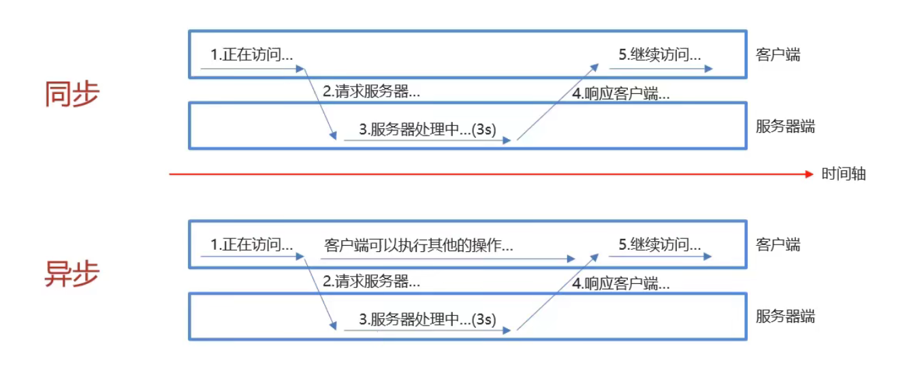

# AJAX

## 1. 基本概念

### 1.1 AJAX概述

* 概念：AJAX（Asynchronous JavaScript And XML)——异步的 JavaScript 和 XML
* AJAX的作用：
  1. 与服务器进行数据交换：通过AJAX可以给服务器发送请求，并获取服务器的响应数据
     * 使用了AJAX和服务器进行通信，就可以使用HTML+ AJAX来替换JSP页面
  2. 异步交互：可以在不重新加载整个页面的情况下，与服务器交换数据并更新部分网页的技术
     * 如：搜索联想、用户名是否可用校验...

使用JSP与AJAX的逻辑对比

### 1.2 同步和异步

* 同步：服务端处理客户端发送的请求时，客户端只能等待服务器响应
* 异步：服务器处理客户端发送的请求时，客户端可以执行其他操作

## 2. AJAX 快速入门

w3cschool可查询模板代码

1. 创建核心对象

~~~javascript
var xhttp;
if (window.XMLHttpRequest) {
    xhttp = new XMLHttpRequest();
} else {
    // code for IE6, IE5
    xhttp = new ActiveXObject("Microsoft.XMLHTTP");
}
~~~

2. 发送请求

~~~javascript
xhttp.open("GET", "http://localhost:8080/ajax-demo/ajaxServlet", true);
xhttp.send();
~~~

3. 获取响应

~~~javascript
xhttp.onreadystatechange = function() {
    if (this.readyState == 4 && this.status == 200) {
        document.getElementById("demo").innerHTML =
            alert(this.responseText);
    }
};
~~~

## 3. 案例-用户名校验

* 需求：在完成用户注册时，当用户名输入框失去焦点时，校验用户名是否在数据库存在

SelectUserServlet

~~~java
package com.anthonycj.web.servlet;

import javax.servlet.*;
import javax.servlet.http.*;
import javax.servlet.annotation.*;
import java.io.IOException;

@WebServlet(urlPatterns = "/selectUserServlet")
public class SelectUserServlet extends HttpServlet {
    @Override
    protected void doGet(HttpServletRequest request, HttpServletResponse response) throws ServletException, IOException {
        // 1.接收用户名
        String username = request.getParameter("username");

        // 2.调用service查询的user对象
        boolean flag = true;    //模拟用户存在

        // 3.响应标记
        response.getWriter().write("" + flag);
    }

    @Override
    protected void doPost(HttpServletRequest request, HttpServletResponse response) throws ServletException, IOException {
        this.doGet(request, response);
    }
}
~~~

register.html

~~~html
<!DOCTYPE html>
<html lang="en">
<head>
    <meta charset="UTF-8">
    <title>欢迎注册</title>
    <link href="css/register.css" rel="stylesheet">
</head>
<body>

    

        <h1>欢迎注册</h1>
        已有帐号？ <a href="login.html">登录</a>
    

    <form id="reg-form" action="#" method="get">

        <table>

            <tr>
                <td>用户名</td>
                <td class="inputs">
                    <input name="username" type="text" id="username">
                     
                    用户名不太受欢迎
                </td>

            </tr>

            <tr>
                <td>密码</td>
                <td class="inputs">
                    <input name="password" type="password" id="password">
                     
                    密码格式有误
                </td>
            </tr>

            <tr>
                <td>验证码</td>
                <td class="inputs">
                    <input name="checkCode" type="text" id="checkCode">
                    
                    <a href="#" id="changeImg">看不清？</a>
                </td>
            </tr>

        </table>

        

            <input value="注 册" type="submit" id="reg_btn">
        

         
    </form>

</body>
</html>
~~~

## 4. Axios异步框架

* Axios 对原生的AJAX进行封装，简化书写
* 官网：https://www.axios-http.cn

### 4.1 Axios快速入门

1. 引入axios的js文件

~~~html

~~~

2. 使用axios发送请求，并获取响应结果

~~~javascript
// 1.get方式
axios({
    method:"get",
    url:"http://localhost:8080/ajax-demo/axiosServlet?username=zhangsan"
}).then(function (resp) {	// resp参数接收响应内容
    alert(resp.data);	// resp.data获取响应数据
})
~~~

~~~javascript
// 2.post方式
axios({
    method:"post",
    url:"http://localhost:8080/ajax-demo/axiosServlet",
    data:"username=zhangsan"	// post请求要将参数单独列出
}).then(function (resp) {	// resp参数接收响应内容
    alert(resp.data);	// resp.data获取响应数据
})
~~~

> **注意**	post请求要将参数单独列出

### 4.2 Axios请求方式别名

* 为了方便起见，Axios已经为所有支持的请求方法提供了别名。
* 是对上述方法的封装
* 写法简便，但阅读性没有前者好

写法如下：

~~~javascript
// 1.get方式
axios.get("http://localhost:8080/ajax-demo/axiosServlet?username=zhangsan").then(function (resp) {
    alert(resp.data);
})
~~~

~~~javascript
// 2.post方式
axios.post("http://localhost:8080/ajax-demo/axiosServlet","username=zhangsan").then(function (resp) {
    alert(resp.data);
})
~~~

## 5. JSON

