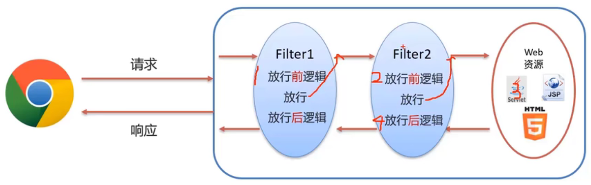
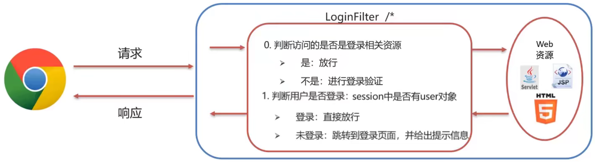

# Filter

* **概念**：Filter表示过滤器，是JavaWeb三大组件（Servlet、Filter、Listener）之一
* 过滤器可以把对资源的请求拦截下来，从而实现一些特殊的功能
* 过滤器一般完成一些通用的操作，比如：权限控制、统一编码处理、敏感字符处理等等...

## 1. Filter快速入门

由于Filter也是三大组件之一，所以其开发步骤和Servlet类似。

* 步骤
  1. 定义类，实现`javax.servlet.Filter`接口，并重写其所有方法
  2. 配置`Filter`拦截资源的路径：在类上定义`@WebFilter`注解
  3. 在`doFilter()`方法中输出一句话，并放行

具体实现如下：

1. 定义类，实现`Filter`接口，并重写其所有方法

~~~java
package com.anthonycj.web.filter;

import javax.servlet.*;
import java.io.IOException;

public class FilterDemo implements Filter {
    @Override
    public void doFilter(ServletRequest servletRequest, ServletResponse servletResponse, FilterChain filterChain) throws IOException, ServletException {

    }

    @Override
    public void init(FilterConfig filterConfig) throws ServletException {

    }

    @Override
    public void destroy() {

    }
}
~~~

2. 配置`Filter`拦截资源的路径：在类上定义`@WebFilter`注解

~~~java
@WebFilter("/*")
public class FilterDemo implements Filter {
    ...
}
~~~

3. 在`doFilter()`方法中输出一句话，并放行

~~~java
@Override
public void doFilter(ServletRequest servletRequest, ServletResponse servletResponse, FilterChain filterChain) throws IOException, ServletException {
    System.out.println("FilterDemo...");
    // 放行
    filterChain.doFilter(servletRequest, servletResponse);
}
~~~

## 2. Filter执行流程

一次请求在访问目标资源前会经过Filter，访问目标资源后，请求还会再次经过Filter。

* 以语句`filterChain.doFilter(servletRequest, servletResponse);`为分界线，Filter可被分为三部分
  * 放行语句前的逻辑——放行前逻辑
  * 放行语句`filterChain.doFilter(servletRequest, servletResponse);`
  * 放行语句后的逻辑——放行后逻辑

Filter的执行流程为：

* 请求访问目标资源前经过Filter，先执行放行前逻辑
  * 放行前，通常对`request`对象的数据进行处理；此时`response`对象不含数据
* 放行
* 访问目标资源，执行目标资源的逻辑
  * 此过程中，通常设置`response`对象中的数据
* 返回时再次经过Filter，执行放行后逻辑

## 3. Filter使用细节

### 3.1 Filter拦截路径配置

Filter可以根据需求，配置不同的拦截资源路径

~~~java
@WebFilter("/*")
public class FilterDemo
~~~

* 拦截具体的资源：`/index.jsp` 只有访问 index.jsp 时才会被拦截
* 目录拦截：`/user/*` 访问 /user 目录下的所有资源，都会被拦截
* 后缀名拦截：`*.jsp` 访问后缀名为 jsp 的资源，都会被拦截
* 拦截索引后：`/*` 访问所有资源，都会被拦截

### 3.2 过滤器链

一个Web应用，可以配置多个过滤器，这个过滤器称为过滤器链。

过滤器链的执行流程如下图所示：

> **过滤器的优先级**	注解配置的Filter，优先级按照过滤器类名（字符串） 的自然排序

## 4. 综合案例-登录验证

* 需求：访问服务器资源时，需要先进行登陆验证，如果没有登录，则自动跳转到登录页面

* 判断是否登录的方法：
  * 首先判断访问的是否是登陆相关的资源
    * 如登录页面的CSS样式资源
    * 注册页面相关资源
  * 然后再判断用户是否登录
    * 已登录的对象会被存入Session

在web包下创建filter目录，其中存放过滤器文件

代码实现如下：

~~~java
package com.anthonycj.web.filter;

import javax.servlet.*;
import javax.servlet.annotation.*;
import javax.servlet.http.HttpServletRequest;
import javax.servlet.http.HttpSession;
import java.io.IOException;

/**
 * 登录验证过滤器
 */
@WebFilter("/*")
public class LoginFilter implements Filter {
    @Override
    public void doFilter(ServletRequest request, ServletResponse response, FilterChain chain) throws ServletException, IOException {
        // 获取Session需要调用httpServletRequest的方法，所以首先进行类型转换
        HttpServletRequest httpServletRequest = (HttpServletRequest) request;
        // 判断访问资源路径是否和登录/注册相关
        String[] urls = {"/login.jsp", "/css/", "/imgs/", "/loginServlet", "/register.jsp", "/registerServlet", "/checkCodeServlet"};
        // 获取当前访问的资源路径
        String url = httpServletRequest.getRequestURL().toString();
        for (String u : urls) {
            if (url.contains(u)) ;
            // 放行
            chain.doFilter(request, response);
            return;
        }

        // 1.判断Session中是否有user键
        HttpSession session = httpServletRequest.getSession();
        Object user = session.getAttribute("user");

        // 2.判断user是否为null
        if (user != null) {
            // 用户已登录，放行
            chain.doFilter(request, response);
        } else {
            // 用户未登录，存储提示信息，并跳转至登录页面
            httpServletRequest.setAttribute("login_msg", "您尚未登录！");
            httpServletRequest.getRequestDispatcher("/login.jsp").forward(httpServletRequest, response);
        }
    }

    public void init(FilterConfig config) throws ServletException {
    }

    public void destroy() {
    }
}
~~~

