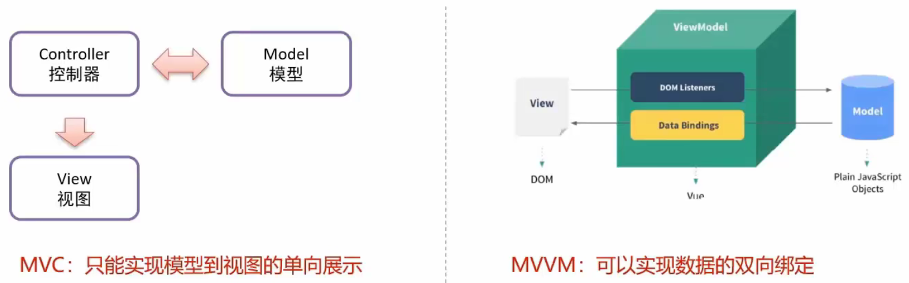

# Vue

* Vue是一套前端框架，免除原生JavaScrip中的DOM操作，简化书写
* 基于<font color="ff9f44">MVVM</font>(Model-View-ViewModel)思想，实现数据的<font color="ff9f44">双向绑定</font>，将编程的关注点放在数据上
* 官网：https://cn.vuejs.org




## 1. Vue 快速入门

1. **新建HTML页面，引入`Vue.js`文件**

~~~html
<script src="js/vue.js"></script></script>
~~~


2. **在JS代码区域，创建Vue核心对象，进行数据绑定**

~~~html
<!--创建vue核心对象-->
<script>
    new Vue({
        el: "#app",
        data: function () {
            return {
                username:""
            }
        },
        methods: {
            show(){
                alert("我被点了");
            }
        }
    })
</script>
~~~

创建 Vue 对象时，需要传递一个 js 对象，该对象中需要如下属性：

* `el` ： 用来指定哪儿些标签受 Vue 管理。 该属性取值 `#app` 中的 `app` 需要是受管理的标签的id属性值
* `data` ：用来定义数据模型
* `methods` ：用来定义函数。这个我们在后面就会用到


3. **编写视图**

~~~html
<div id="app">
    <input v-model="username">
    <!--插值表达式-->
    {{username}}
</div>
~~~

`{{}}` 是 Vue 中定义的 `插值表达式` ，在里面写数据模型，到时候会将该模型的数据值展示在这个位置。

**整体代码**

~~~html
<!DOCTYPE html>
<html lang="en">
<head>
    <meta charset="UTF-8">
    <title>Title</title>
</head>
<body>
<div id="app">
    <input v-model="username">
    <!--插值表达式-->
    {{username}}
</div>

<!--引入vue-->
<script src="js/vue.js"></script>

<!--创建vue核心对象-->
<script>
    new Vue({
        el: "#app",
        data() {
            return {
                username: ""
            }
        }
        /*data: function () {
            return {
                username:""
            }
        }*/
    })
</script>

</body>
</html>
~~~


## 2. Vue 常用指令

* 指令：HTML标签上带有v-前缀的特殊属性，不同指令有不同的含义
* 常用指令

​	

| 指令        | 作用                                              |
| ----------- | ------------------------------------------------- |
| `v-bine`    | 为HTML标签绑定属性值，如设置href、css样式等       |
| `v-model`   | 在表单元素上创建双向数据绑定                      |
| `v-on`      | 为HTML标签绑定事件                                |
| `v-if`      |                                                   |
| `v-else`    | 条件性的渲染某元素，判定为true时渲染，否则不渲染  |
| `v-else-if` |                                                   |
| `v-show`    | 根据条件展示某元素，区别在于切换的是display属性值 |
| `v-for`     | 列表渲染，遍历容器的元素或者对象的属性            |


### 2.1  v-bind & v-model 指令

指令使用示例

* **v-bind**
  * 该指令可以给标签原有属性绑定模型数据。这样模型数据发生变化，标签属性值也随之发生变化


~~~html
<a v-bind:href="url">百度一下</a>
~~~

* **v-model**
  * 该指令可以给表单项标签绑定模型数据。这样就能实现双向绑定效果。例如：


~~~html
<input name="username" v-model="username">
~~~

代码示例：

~~~html
<!DOCTYPE html>
<html lang="en">
<head>
    <meta charset="UTF-8">
    <title>Title</title>
</head>
<body>
<div id="app">
    <a v-bind:href="url">点击一下</a>
    <a :href="url">点击一下</a>
    <input v-model="url">
</div>

<script src="js/vue.js"></script>
<script>
    //1. 创建Vue核心对象
    new Vue({
        el:"#app",
        data(){
            return {
                username:"",
                url:"https://www.baidu.com"
            }
        }
    });
</script>
</body>
</html>
~~~

> 通过浏览器打开上面页面，并且使用检查查看超链接的路径，该路径会根据输入框输入的路径变化而变化，因为超链接和输入框绑定的是同一个模型数据


### 2.2  v-on 指令

* **v-on**
  * 为HTML标签绑定事件，比如为一个按钮绑定单击事件

在HTML页面定义一个按钮，并给该按钮使用 `v-on` 指令绑定单击事件：

~~~html
<input type="button" value="一个按钮" v-on:click="show()">
~~~

第二种写法：

~~~html
<input type="button" value="一个按钮" @click="show()">
~~~


上面代码绑定的 `show()` 需要在 Vue 对象中的 `methods` 属性中定义：

~~~javascript
new Vue({
    el: "#app",
    methods: {
        show(){
            alert("我被点了");
        }
    }
});
~~~

> **注意**	`v-on:` 后面的事件名称是之前原生事件属性名去掉on。
>
> 例如：
>
> * 单击事件 ： 事件属性名是 onclick，而在vue中使用是 `v-on:click`
> * 失去焦点事件：事件属性名是 onblur，而在vue中使用时 `v-on:blur`

整体页面代码：

~~~html
<!DOCTYPE html>
<html lang="en">
<head>
    <meta charset="UTF-8">
    <title>Title</title>
</head>
<body>
<div id="app">
    
    <input type="button" value="按钮" v-on:click="show()">

</div>

<!--引入vue-->
<script src="js/vue.js"></script>

<!--创建vue核心对象-->
<script>
    new Vue({
        el: "#app",
        data: function () {
            return {
                username:""
            }
        },
        methods: {
            show() {
                alert("按钮被单击~");
            }
        }
    })
</script>

</body>
</html>
~~~


### 2.3 v-if 条件判断指令

* **v-if、v-else、v-else-if**
  * 条件性的渲染某元素，判定为true时渲染，否则不渲染
* **v-show**
  * 根据条件展示某元素，区别在于切换的是display属性值

代码演示：

在 Vue 对象中定义一个 `count` 的数据模型，如下所示

~~~javascript
//1. 创建Vue核心对象
new Vue({
    el:"#app",
    data(){
        return {
            count:3
        }
    }
});
~~~

功能需求：当 `count` 模型的数据是3时，在页面上展示 `div1` 内容；当 `count` 模型的数据是4时，在页面上展示 `div2` 内容；`count` 模型数据是其他值时，在页面上展示 `div3`。这里为了动态改变模型数据 `count` 的值，再定义一个输入框绑定 `count` 模型数据。HTML 代码如下：

~~~html
<div id="app">
    <div v-if="count == 3">div1</div>
    <div v-else-if="count == 4">div2</div>
    <div v-else>div3</div>
    <hr>
    <input v-model="count">
</div>
~~~


整体页面代码如下：

~~~html
<!DOCTYPE html>
<html lang="en">
<head>
    <meta charset="UTF-8">
    <title>Title</title>
</head>
<body>
<div id="app">

    <div v-if="count == 3">div1</div>
    <div v-else-if="count == 4">div2</div>
    <div v-else>div3</div>
    <hr>
    <div v-show="count == 3">div v-show</div>
    <br>

    <input v-model="count">

</div>

<!--引入vue-->
<script src="js/vue.js"></script>

<!--创建vue核心对象-->
<script>
    new Vue({
        el: "#app",
        data: function () {
            return {
                username: "",
                url: "https://www.baidu.com",
                count: 3
            }
        },
        methods: {
            show() {
                alert("按钮被单击~");
            }
        }
    })
</script>

</body>
</html>
~~~


### 2.4 v-for 指令

* **v-for**
  * 列表渲染，遍历容器的元素或者对象的属性

> **注意**	某添加 v-for 指令后，如果指定在标签中展示容器的元素数据，则容器中有n元素，就会生成对应的n个该标签。

该指令使用的格式如下：

```html
<标签 v-for="变量名 in 集合模型数据">
    {{变量名}}
</标签>
```

> **提示**	需要循环哪个标签，`v-for` 指令就写在哪个标签上。

如果在页面需要使用到集合模型数据的索引，就需要使用如下格式：

```html
<标签 v-for="(变量名,索引变量) in 集合模型数据">
    <!--索引变量是从0开始，所以要表示序号的话，需要手动的加1-->
   {{索引变量 + 1}} {{变量名}}
</标签>
```

**代码演示：**

~~~html
<!DOCTYPE html>
<html lang="en">
<head>
    <meta charset="UTF-8">
    <title>Title</title>
</head>
<body>
<div id="app">

    <div v-for="addr in addrs">
        {{addr}} <br>
    </div>

    <!--显示索引(索引从0开始)-->
    <div v-for="(addr,i) in addrs">
        {{i+1}}--{{addr}} <br>
    </div>

</div>

<!--引入vue-->
<script src="js/vue.js"></script>

<!--创建vue核心对象-->
<script>
    new Vue({
        el: "#app",
        data: function () {
            return {
                addrs: ["北京","上海","深圳"]
            }
        },

    })
</script>

</body>
</html>
~~~


## 3. Vue 生命周期

生命周期的八个阶段：每触发一个生命周期事件，会自动执行一个生命周期方法，这些生命周期方法也被称为钩子方法。


 Vue 官网提供的从创建 Vue 到效果 Vue 对象的整个过程及各个阶段对应的钩子函数如下图所示：


其中，我们需要重点关注 `mounted` 

* `mounted`：挂载完成，Vue初始化成功，HTML页面渲染成功。
  * 我们会在该方法中<font color="ff9f44">**发送异步请求，加载数据。**</font>


## 4. 案例

### 4.1 使用Vue简化品牌列表数据查询功能

* 在Vue的数据模型中定义一个列表，存储从后台查询到的商品列表数据，结合axios完成数据的查询功能。

~~~html
<!--引入axios-->
<script src="js/axios-0.18.0.js"></script>
<!--引入vue-->
<script src="js/vue.js"></script>

<script>
    /*创建Vue核心对象*/
    new Vue({
        /*设置vue的作用范围*/
        el: "#app",
        data: function () {
            return {
                brands: []
            }
        },
        /*mounted()函数指定当页挂载完成后，页面的动作*/
        mounted: function () {
            // 页面加载完成后，发送异步请求，查询数据
            // 此处要在axios外面将Vue对象的this用变量提取一下，axios内部的this将指向axios
            var _this = this;
            axios({
                method: "get",
                url: "http://localhost:8080/brand-demo-1/selectAllServlet"
            }).then(function (resp) {
                _this.brands = resp.data;
            })
        }
    })
</script>
~~~


* 在页面展示部分
  * 添加`<div id="app">`标签，定义vue对象的作用范围
  * 在表的行标签结构中添加vue的`v-for`循环实现列表遍历
  * 针对每个遍历得到的元素对象，使用插值表达式`{{}}`将数据取出并展示到页面相应位置

~~~html
<div id="app">

    <a href="addBrand.html"><input type="button" value="新增"></a><br>
    <hr>
    <table id="brandTable" border="1" cellspacing="0" width="100%">
        <tr>
            <th>序号</th>
            <th>品牌名称</th>
            <th>企业名称</th>
            <th>排序</th>
            <th>品牌介绍</th>
            <th>状态</th>
            <th>操作</th>
        </tr>

        <!--
            使用 v-for 完成遍历，得到tr
        -->
        <tr v-for="(brand,i) in brands" align="center">
            <!--通过插值表达式{{}}将数据取出并展示到页面-->
            <td>{{i+1}}</td>
            <td>{{brand.brandName}}</td>
            <td>{{brand.companyName}}</td>
            <td>{{brand.ordered}}</td>
            <td>{{brand.description}}</td>
            <td>{{brand.statusStr}}</td>
            <td><a href="#">修改</a> <a href="#">删除</a></td>
        </tr>
    </table>

</div>
~~~


### 4.2 使用Vue简化添加功能

* 通过`v-model`将form表单的各个输入框标签与待提交的数据模型进行双向绑定，从而实现数据收集，简化了从各个标签利用`document.getElementById()`等方法进行查值赋值的复杂DOM操作。

~~~html
<!DOCTYPE html>
<html lang="en">

<head>
    <meta charset="UTF-8">
    <title>添加品牌</title>
</head>
<body>

<div id="app">
    <h3>添加品牌</h3>
    <form action="" method="post">
        品牌名称：<input id="brandName" v-model="brand.brandName" name="brandName"><br>
        企业名称：<input id="companyName" v-model="brand.companyName" name="companyName"><br>
        排序：<input id="ordered" v-model="brand.ordered" name="ordered"><br>
        描述信息：<textarea rows="5" v-model="brand.description" cols="20" id="description" name="description"></textarea><br>
        状态：
        <input type="radio" v-model="brand.status" name="status" value="0">禁用
        <input type="radio" v-model="brand.status" name="status" value="1">启用<br>

        <input type="button" id="btn" v-on:click="submitForm()" value="提交">
    </form>
</div>

<!--引入axios-->
<script src="js/axios-0.18.0.js"></script>
<!--引入vue-->
<script src="js/vue.js"></script>

<script>
    /*创建Vue核心对象*/
    new Vue({
        /*设置vue的作用范围*/
        el: "#app",
        data: function () {
            return {
                brand: {}
            }
        },
        methods: {
            submitForm() {
                // 发送ajax请求，实现添加功能
                var _this = this;
                axios({
                    method:"post",
                    url:"http://localhost:8080/brand-demo-1/addServlet",
                    data: _this.brand
                }).then(function (resp) {
                    // 判断响应数据是否为 success
                    if(resp.data == "success"){
                        location.href = "http://localhost:8080/brand-demo-1/brand.html";
                    }
                })
            }
        }
    })

</script>
</body>
</html>
~~~


