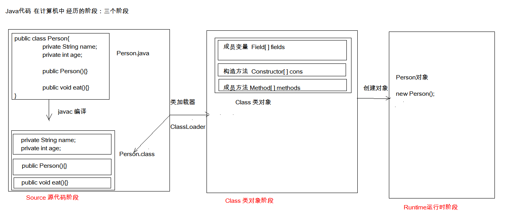

# ch00_1_Junit、反射、和注解

---

## 1. Junit 单元测试

* 测试分类
  1. 黑盒测试（不需要写代码，给定输入，观察程序是否给出期望输出）
  2. 白盒测试（需要写代码，关注程序具体的执行流程）
* Junit即为表和测试的一种

### Junit 的使用

* 步骤：

  1. 定义一个测试类（测试用例）
     * 建议：
       * 测试类名：被测试的类名 + Test
       * 测试类所在包名：xx.xxx.xx.test
  2. 定义测试方法：可以独立运行
     * 建议：
       * 方法名：test + 测试的方法名
       * 返回值：void
       * 参数列表：空参
  3. 给方法加注解 @Test （JUnit 的注解，使方法能够独立运行）【@Ignore 可以让程序忽略该方法，不执行】
  4. 导入 JUnit 依赖环境

* 判定结果

  * 红色：失败

  * 绿色：成功

  * 一般使用==断言==操作来判断是否正确

    ~~~java
    	Assert.assertEquals(expected, actual);
    ~~~

* 补充：

  * @Before:
    * 修饰的方法会在测试方法之前被自动执行（通常用于**申请资源**）
  * @After
    * 修饰的方法会在测试方法之后被自动执行（通常用于**释放资源**）

---

## 2. 反射：框架设计的灵魂

### 2.1 简介

* 框架：半成品软件。可以在框架的基础上进行软件开发，简化编码
* 反射：将**类的各个组成部分**==封装==为==其他对象==，这是反射机制。（反射机制实现了 Java 代码从第一阶段到第二阶段的变化过程）
  * 反射的好处
    1. 可以在程序运行过程中，操作这些对象【举例：编译器可自动列出对象提供的方法】
    2. 可以解耦，提高程序的可扩展性。

> ==Java 代码==在计算机中经历的==三个阶段==：
>
> 1. **Source 源代码阶段**（代码并没有进入内存，仍然处于硬盘）：Java类文件经过 javac 编译后生成 .class 字节码文件，其中包含类名字、成员变量、构造函数、成员方法等。
>
> 2. **Class 类对象阶段**（**类加载器**【Class Loader】可以**将** .class **字节码文件加载至内存**）
>
>    * 在内存里通过**Class 类对象**描述 .class 字节码文件
>
>      > Java中的 **Class 类**用于描述所有**字节码文件**共同的**特征**和**行为**。（成员变量、构造方法、成员方法） Java 将它们**封装**为不同的**对象**。
>      >
>      > * 成员变量—— Field[] fields 对象数组
>      > * 构造方法—— Constructor[] cons 对象数组
>      > * 成员方法—— Method[] methods 对象数组
>
> 3. **Runtime 运行时阶段**（程序内存中运行）：系统 new 一个对象，并为之分配内存，执行程序。

### 2.2 获取 Class 对象的方式

1. 【源代码阶段，此时未将字节码加载进内存】**Class.forName("全类名")**：将字节码文件加载进内存，返回 Class 对象。
   * 参数为**字符串**类型，==多用于配置文件==，将类名定义在配置文件中。读取文件，加载类
2. 【已将字节码文件加载进内存，此时 Class 对象已经存在】**类名.class**：通过类名的属性 class 获取。
   * ==多用于参数的传递==
3. 【已经有了类的实例对象，可以通过对象调用方法获取】**对象.getClass()**：getClass() 方法被封装在 Object 类中，会被所有对象继承下来。
   * ==多用于已**有对象**的条件下，要通过该对象获取字节码的情况==

* **结论**：
  * **同一个字节码文件**（*.class）在**一次程序运行**过程中，**只会被加载一次**。无论通过哪一种方式获取的 class 对象都是**同一个对象**。

### 2.3 使用 Class 对象功能

#### 获取功能

1. **获取成员变量**（1...n）
   * Field getField(String name)
   * Field[] getFields()  // 获取所有 public 修饰的成员变量
   * Field getDeclaredField(String name)
   * Field[] getDeclaredFields()  // 获取所有的成员变量，不考虑修饰符
2. **获取构造方法**（1...n）
   * Constructor<T> getConstructor(类<?>... parameterTypes) 
   * Constructor<?>[] getConstructors() 
   * Constructor<T> getDeclaredConstructor(类<?>... parameterTypes)  
   * Constructor<?>[] getDeclaredConstructors()  
3. **获取成员方法**（1...n）
   * Method getMethod(String name, 类<?>... parameterTypes)
   * Method[] getMethods()  
   * Method getDeclaredMethod(String name, 类<?>... parameterTypes)  
   * Method[] getDeclaredMethods()
4. **获取类名**
   * String getName()

#### Field：成员变量

* 操作：

  1. 设置值

     * void set(Object obj, Object value)  

     ~~~java
     // Field.set(obj, value) 表示将对象 obj 的成员 Field 的值设置为 value
     	Field a = personClass.getField("a");
     	Person person = new Person();
     	Object value = a.get(person);
     ~~~

     

  2. 获取值

     * get(Object obj) 

     ~~~java 
     // Field.set(obj) 表示获取对象 obj 中对应 Field 成员的值
     	Field a = personClass.getField("a");
     	Person person = new Person();
     	a.set(person, "张三");
     ~~~

     

  3. 忽略访问权限修饰符的安全检查

     * setAccessible(true)  // 暴力反射，在通过 getDeclaredMethod(String) 方法访问非 public 成员时，通过该方法忽略访问权限修饰符的安全检查。

#### Constructor：构造方法

* 创建对象：

  * T newInstance(Object... initargs)

  * 如果使用空参数构造方法创建对象，操作可以简化：使用 Class 对象的 newInstance() 方法（不推荐）

  * 如果不需要 constructor 对象，可不设置变量接收返回值，将两句整合为一句直接返回构造的结果

    ~~~java
    // 获取 class 对象
    Class<Person> personClass = Person.class;
    // 直接构造对象
    Object person3 = personClass.getConstructor(String.class, int.class).newInstance("李四", 21);
    ~~~

  * 忽略访问权限修饰符的安全检查：constructor.setAccessible(true) 方法

#### Method：方法对象

* 获取方法：
  * class.getMethod(String name, Class... parameters)

* 执行方法：
  * Object invoke(Object obj, Object... args)  
* 获取方法名称：
  * String getName:获取方法名

#### 获取类名

~~~java
    Class<Person> personClass = Person.class;
	// 获取（包括包名的）全类名
    String className = personClass.getName();
~~~

### 2.4 反射案例

* 需求：写一个“框架”，可以帮我们创建任意类的对象，并执行其中任意类的方法。
  * 实现：
    1. 配置文件
    2. 反射
  * 步骤：
    1. 将需要创建的对象的全类名和需要执行的方法定义在配置文件中
    2. 在程序中加载读取配置文件
    3. 使用反射技术来加载类文件进内存
    4. 创建对象
    5. 执行方法

---

## 3. 注解

### 3.1 注解的基本概念

* 概念：从JDK5开始,Java增加对元数据的支持，也就是注解，注解与注释是有一定区别的，可以把注解理解为代码里的特殊标记，这些标记可以在编译，类加载，运行时被读取，并执行相应的处理。通过注解开发人员可以在不改变原有代码和逻辑的情况下在源代码中嵌入补充信息。
* 概念描述
  * JDK1.5后的新特性
  * 用于说明程序
  * 使用注解：@注解名称
* 作用分类
  1. 编写文档：通过代码里标识的**注解**生成文档【生成文档doc文档】
  2. 代码分析：通过代码里标识的**注解**对代码进行分析【使用反射】
  3. 编译检查：通过代码里标识的**注解**让编译器能够实现基本的编译检查【以Override注解为例，编译器将检查该方法是否是重写其父类的方法，不是会报错。是一种安全机制】

### 3.2 JDK中预定义的一些注解

* @Override	：检测被该注解标注的方法是否是继承自父类(接口)的
* @Deprecated：该注解标注已过时的内容
* @SuppressWarnings：压制警告
  * 一般传递参数all  @SuppressWarnings("all") 【放在类前，可压制类中所有警告，放在方法前可压制单方法警告】

### 3.3 自定义注解

* 格式

  元注解

  public @interface 注解名称 {
  		属性列表;
  }

* 本质：==注解本质==上就是一个==接口==，该接口默认继承Annotation接口

  ~~~java
  public interface MyAnno extends java.lang.annotation.Annotation {}
  ~~~

* 属性：接口中的抽象方法

  * 要求：
    1. 属性的返回值类型有且仅有下列
       * 基本数据类型
       * String
       * Enumeration
       * 注解
       * 以上类型的数组
    2. 定义了属性，在使用时需要给属性赋值
       1. 如果定义属性时，使用 **default** 关键字给**属性默认初始化值**，则使用注解时，可以不进行属性的赋值。
       2. 如果只有一个属性需要赋值，并且属性的名称是value，则value可以省略，直接定义值即可。
       3. 数组赋值时，值使用 {} 包裹。如果数组中只有一个值，则 {} 可以省略

* 元注解：用于描述注解的注解
  * @Target：描述**注解**能够==作用的位置==
    * ElementType取值【enum类型，仅有TYPE, METHOD, FIELD 三种】
      * TYPE：可以作用于**类**上
      * METHOD：可以作用于**方法**上
      * FIELD：可以作用于**成员变量**上
  * @Retention：描述**注解**==被保留的阶段==【三个阶段：SOURCE, CLASS, RUNTIME】
    * @Retention(RetentionPolicy.RUNTIME)：【RetentionPolicy.RUNTIME】表示当前被描述的注解，会保留到class字节码文件中，并被 JVM 读取到，一般自定义注解都使用 RetentionPolicy.RUNTIME
  * @Documented：描述**注解**==是否被抽取到api文档==中【添加注解的位置会在 API 文档中显示】
  * @Inherited：描述**注解**==是否被子类继承==

> 较常用的是 @Target 和 @Retention 注解。

### 3.4 在程序中使用（解析）注解【获取注解中定义的属性值】

> 注解在程序中的作用是简化配置文件的操作，用于==替代配置文件==的各种内容。
>
> 配置文件中定义了各种属性，注解中也可以定义各种属性，起到配置文件的作用。
>
> 例：在测试样例中，我期望在 ReflectTest.java 中执行注解【标注、提供】的类或方法，那么
>
> * 设计注解时
>   * 注解的属性就包括类名、方法名
>   * 通过@Target({ElementType.TYPE})标注谁【这里为类】可以使用注解
>   * 通过@Retention(RetentionPolicy.RUNTIME)标注注解的保留时段【这里是运行时】。
> * 在 ReflectTest.java 中使用注解时，对注解的属性【类名、方法名】进行初始化。

1. 获取注解定义的位置的对象  （Class，Method，Field）

   ~~~java
   ClassAnnotation annotation = targetClass.getAnnotation(ClassAnnotation.class);	// 类注解
   MethodAnnotation annotation = targetMethod.getAnnotation(MethodAnnotation.class);// 方法注解
   FieldAnnotation annotation = targetField.getAnnotation(FieldAnnotation.class);	// 域注解
   ~~~

   

2. 获取指定的注解

   * getAnnotation(Class)

   ~~~java
       Pro annotation = reflectTestClass.getAnnotation(Pro.class);
   // 上方语句的实质：在内存中生成一个该注解接口的子类实现对象。子类如下：
       public class ProImpl implements Pro {
           public String className() {
               return "com.anthony.annotation.Demo1";
           }
           public String methodName() {
               return "show";
           }
       }
   ~~~

3. 调用注解中的抽象方法获取配置的属性值

### 3.5 注解小结

1. 大多数情况，会使用注解，而不是自定义注解
2. 注解给谁使用？
   1. 编译器
   2. 解析程序使用
3. 注解不是程序的一部分，可以理解为是一个【标签】
