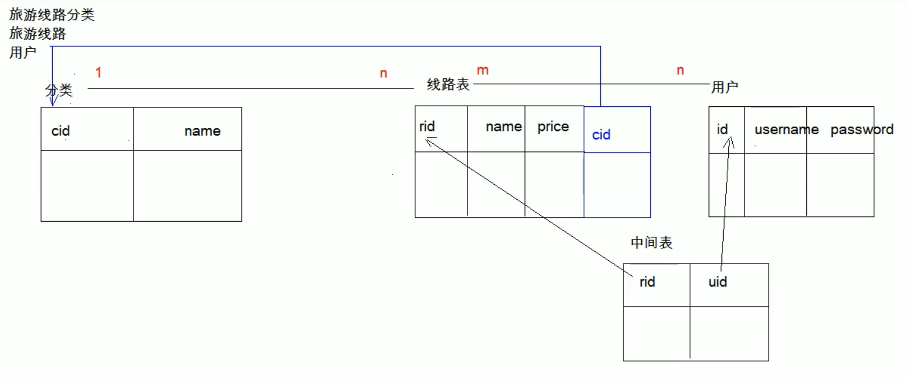

# MySQL 约束

---

## 目录

1.  DQL:查询语句
   1. 排序查询
   2. 聚合函数
   3. 分组查询
   4. 分页查询
2. 约束
3. 数据库的设计
   1. 多表之间的关系
   2. 范式
4. 数据库的备份和还原

---

## 1. DQL:查询语句

### 1.1 排序查询

* 语法：ORDER BY 子句

  ~~~mysql
  	ORDER BY 排序字段1 排序方式1, 排序字段2 排序方式2...
  ~~~

* 排序方式：

  * ASC：升序【默认】。

    ~~~mysql
    	SELECT * FROM student ORDER BY math;    -- 升序排序【默认】
    ~~~

  * DESC：降序。

    ~~~mysql
    	SELECT * FROM student ORDER BY math DESC;    -- 降序排序
    ~~~

  * ~~~mysql
    	-- 按数学成绩排名，如果数学成绩一样，按英语成绩排名【升序】
    	SELECT * FROM student ORDER BY math ASC, english ASC;
    	-- 排序优先级从左至右递减
    ~~~

* 注意：

  * 如果有多个排序条件，则当前边的条件值一样时，才会判断第二条件。

### 1.2 聚合函数

* 聚合函数：将一列数据作为一个整体，进行==纵向计算==。

1. COUNT：计算个数
   1. 一般选择非空的列：**主键**
   2. COUNT(*)
2. MAX：计算最大值
3. MIN：计算最小值
4. SUM：计算和
5. AVG：计算平均值

* 注意：**聚合函数**的计算，自动**排除NULL值**。

  * 解决方案：

    1. 选择不包含 NULL 的列进行计算

    2. 借助 IFNULL函数

       ~~~mysql
       	SELECT COUNT(IFNULL(english, 0)) FROM student;
       ~~~

       

### 1.3 分组查询

1. 语法：GROUP BY 分组字段;
2. 注意：
   1. 分组之后查询的字段：分组字段、聚合函数
   2. WHERE和 HAVING 的区别？
      1. WHERE 在==分组之前==进行限定，如果不满足条件，则不参与分组。HAVING 在==分组之后==进行限定，如果不满足结果，则不会被查询出来
      2. WHERE 后不可以跟聚合函数，HAVING 可以进行聚合函数的判断。

~~~mysql
	-- 按照性别分组。分别查询男、女同学的平均分
	SELECT sex, AVG(math) FROM student GROUP BY sex;
	
	-- 按照性别分组。分别查询男、女同学的平均分,人数
	SELECT sex, AVG(math), COUNT(id) FROM student GROUP BY sex;
	
	--  按照性别分组。分别查询男、女同学的平均分,人数 要求：分数低于70分的人，不参与分组
	SELECT sex, AVG(math), COUNT(id) FROM student WHERE math > 70 GROUP BY sex;
	
	--  按照性别分组。分别查询男、女同学的平均分，人数 要求：分数低于70分的人，不参与分组,分组之后。人数要大于2个人
	SELECT sex, AVG(math), COUNT(id) AS 人数 FROM student WHERE math > 70 GROUP BY sex HAVING COUNT(id) > 2;
~~~

### 1.4 分页查询

1. 语法：LIMIT 开始的索引, 每页查询的条数;

2. 公式：开始的索引 = （当前的页码 - 1） * 每页显示的条数

   ~~~mysql
   	-- 每页显示3条记录 
   	SELECT * FROM student LIMIT 0,3; -- 第1页
   	SELECT * FROM student LIMIT 3,3; -- 第2页
   	SELECT * FROM student LIMIT 6,3; -- 第3页
   ~~~

3. LIMIT 是一个 MySQL 独有的用法

---

## 2. 约束

* 概念： 对表中的数据进行限定，保证数据的正确性、有效性和完整性。	

* 分类：

  1. 主键约束：PRIMARY KEY
  2. 非空约束：NOT NULL
  3. 唯一约束：UNIQUE
  4. 外键约束：FORIEGN KEY

* 非空约束：NOT NULL，某一列的值不能为NULL

  1. 创建表时添加约束

     ~~~mysql
     	CREATE TABLE stu(
     		id INT,
     		name VARCHAR(20) NOT NULL -- name为非空
     	);
     ~~~

  2. 创建表完后，添加非空约束

     ~~~mysql
     	ALTER TABLE stu MODIFY name VARCHAR(20) NOT NULL;
     ~~~

  3. 删除 name 的非空约束

     ~~~mysql
     	ALTER TABLE stu MODIFY name VARCHAR(20);	-- 重置该列属性

* 唯一约束：UNIQUE，某一列的值不能重复

  1. 注意：

     *  唯一约束可以有NULL值，但是只能有一条记录为NULL

  2. 在创建表时，添加唯一约束

     ~~~mysql
     	CREATE TABLE stu(
     		id INT,
     		phone_number VARCHAR(20) UNIQUE -- 手机号
     	);
     ~~~

  3. 删除唯一约束

     ~~~mysql
     ALTER TABLE stu DROP INDEX phone_number; -- 该语法较特殊
     ~~~

  4. 在表创建完后，添加唯一约束

     ~~~mysql
     ALTER TABLE stu MODIFY phone_number VARCHAR(20) UNIQUE;
     ~~~

* 主键约束：PRIMARY KEY。

  1. 注意：

     1. 含义：==非空==且==唯一==
     2. ==一张表==只能有==一个==字段为主键
     3. 主键就是表中记录的==唯一标识==

  2. 在创建表时，添加主键约束

     ~~~mysql
     	create table stu(
     		id INT PRIMARY KEY,-- 给id添加主键约束
     		name VARCHAR(20)
     	);
     ~~~

  3. 删除主键

     ~~~mysql
     	ALTER TABLE stu DROP PRIMARY KEY; -- s
     ~~~

  4. 创建完表后，添加主键

     ~~~mysql
     	ALTER TABLE stu MODIFY id INT PRIMARY KEY;
     ~~~

  5. 自动增长：

     1. 概念：如果某一列是数值类型的，使用 auto_increment 可以来完成值得自动增长

     2. 在创建表时，添加主键约束，并且完成主键自增长

        ~~~mysql
        	CREATE TABLE stu(
        		id INT PRIMARY KEY AUTO_INCREMENT,-- 给id添加主键约束
        		name VARCHAR(20)
        	);
        ~~~

     3. 删除自动增长

        ~~~mysql
        	ALTER TABLE stu MODIFY id INT; -- 只会删除自动增长，主键属性依然存在
        ~~~

     4. 添加自动增长

        ~~~mysql
        	ALTER TABLE stu MODIFY id INT AUTO_INCREMENT;
        ~~~

* 外键约束：foreign key，让表于表产生**关联**关系，从而保证数据的正确性。

  1. 在创建表时，可以添加外键

     *  语法：

       ~~~mysql
       	CREATE TABLE 表名(
       		....
       		外键列
               
       		CONSTRAINT 外键名称 FOREIGN (外键列名称) REFERENCES 主表名称(主表目标列名称)
       	);
       ~~~
  
  2. 删除外键
  
     ~~~mysql
     	ALTER TABLE 表名 DROP FOREIGN KEY 外键名称;
     ~~~
  
  3. 创建表之后，添加外键
  
     ~~~mysql
     	ALTER TABLE 表名 ADD CONSTRAINT 外键名称 FOREIGN KEY (外键字段名称) REFERENCES 主表名称(主表列名称);
     ~~~
  
  4. 级联操作（实现 被主表字段值被修改后，关联的字段值自动修改）
  
     * 可能影响性能，且导致数据关联性过强，需谨慎使用
  
     1. 添加级联操作 语法：
     
        ~~~mysql
        -- 级联更新（主表更新，级联数据更新）
        ALTER TABLE 表名 ADD CONSTRAINT 外键名称 
        	FOREIGN KEY (外键字段名称) REFERENCES 主表名称(主表列名称) ON UPDATE CASCADE;
        -- 级联删除（主表更新、删除，级联数据更新、删除）
        ALTER TABLE 表名 ADD CONSTRAINT 外键名称 
        	FOREIGN KEY (外键字段名称) REFERENCES 主表名称(主表列名称) ON UPDATE CASCADE 
        	ON DELETE CASCADE;
        ~~~
     
     2. 分类：
     
        1. 级联更新：ON UPDATE CASCADE 
        2. 级联删除：ON DELETE CASCADE 

---

## 3. 数据库的设计

### 3.1 多表之间的关系

1. 分类：

   1. 一对一（了解）：
      * 如：人和身份证
      * 分析：一个人只有一个身份证，一个身份证只能对应一个人
   2. 一对多（多对一）：
      * 如：部门和员工
      * 分析：一个部门有多个员工，一个员工只能对应一个部门
   3.  多对多：
      * 如：学生和课程
      * 分析：一个学生可以选择很多门课程，一个课程也可以被很多学生选择

2. 实现关系：

   1. 一对多（多对一）：
      * 如：部门和员工
      * 实现方式：==在多的一方建立外键，指向一的一方的主键==。
   2. 多对多：
      * 如：学生和课程
      * 实现方式：多对多关系实现需要==借助第三张中间表。中间表至少包含两个字段，这两个字段作为第三张表的外键，分别指向**两张主表的主键**==
   3. 一对一(了解)：
      * 如：人和身份证
      * 实现方式：一对一关系实现，可以在任意一方添加==唯一外键==指向另一方的主键。

3. 案例

   

   ~~~mysql
   		-- 创建旅游线路分类表 tab_category
   		-- cid 旅游线路分类主键，自动增长
   		-- cname 旅游线路分类名称非空，唯一，字符串 100
           CREATE TABLE tab_category (
   			cid INT PRIMARY KEY AUTO_INCREMENT,
   			cname VARCHAR(100) NOT NULL UNIQUE
   		);
   		
   		-- 创建旅游线路表 tab_route
   		/*
   		rid 旅游线路主键，自动增长
   		rname 旅游线路名称非空，唯一，字符串 100
   		price 价格
   		rdate 上架时间，日期类型
   		cid 外键，所属分类
   		*/
   		CREATE TABLE tab_route(
   			rid INT PRIMARY KEY AUTO_INCREMENT,
   			rname VARCHAR(100) NOT NULL UNIQUE,
   			price DOUBLE,
   			rdate DATE,
   			cid INT,
   			FOREIGN KEY (cid) REFERENCES tab_category(cid)
   		);
   		
   		
   		/*创建用户表 tab_user
   		uid 用户主键，自增长
   		username 用户名长度 100，唯一，非空
   		password 密码长度 30，非空
   		name 真实姓名长度 100
   		birthday 生日
   		sex 性别，定长字符串 1
   		telephone 手机号，字符串 11
   		email 邮箱，字符串长度 100
   		*/
   		CREATE TABLE tab_user (
   			uid INT PRIMARY KEY AUTO_INCREMENT,
   			username VARCHAR(100) UNIQUE NOT NULL,
   			PASSWORD VARCHAR(30) NOT NULL,
   			NAME VARCHAR(100),
   			birthday DATE,
   			sex CHAR(1) DEFAULT '男',
   			telephone VARCHAR(11),
   			email VARCHAR(100)
   		);
   		
   		/*
   		创建收藏表 tab_favorite
   		rid 旅游线路 id，外键
   		date 收藏时间
   		uid 用户 id，外键
   		rid 和 uid 不能重复，设置复合主键，同一个用户不能收藏同一个线路两次
   		*/
   		CREATE TABLE tab_favorite (
   			rid INT, -- 线路id
   			DATE DATETIME,
   			uid INT, -- 用户id
   			-- 创建复合主键
   			PRIMARY KEY(rid,uid), -- 联合主键
   			FOREIGN KEY (rid) REFERENCES tab_route(rid),
   			FOREIGN KEY(uid) REFERENCES tab_user(uid)
   		);
   ~~~

### 3.2 数据库设计的范式

* 概念：设计数据库时，需要遵循的一些规范。要遵循后边的范式要求，必须先遵循前边的所有范式要求

  ​		设计关系数据库时，遵从不同的规范要求，设计出合理的关系型数据库，这些不同的规范要求被称为不同的范式，各种范式呈递次规范，越高的范式数据库冗余越小。

  ​		目前关系数据库有六种范式：第一范式（1NF）、第二范式（2NF）、第三范式（3NF）、巴斯-科德范式（BCNF）、第四范式(4NF）和第五范式（5NF，又称完美范式）。

* 分类：

  1.  第一范式（1NF）：==每一列都是不可分割的原子数据项==
  2. 第二范式（2NF）：==在1NF的基础上，非码属性必须完全依赖于码（在1NF基础上消除非主属性对主码的部分函数依赖）==
     * 几个概念：
       1. 函数依赖：A-->B,如果通过A属性（属性组）的值，可以确定唯一B属性的值。则称B依赖于A
          					例如：学号-->姓名。  （学号，课程名称） --> 分数
       2. 完全函数依赖：A-->B， 如果A是一个**属性组**，则B属性值的确定需要依赖于A属性组中**所有**的属性值。
          					例如：（学号，课程名称） --> 分数
       3. 部分函数依赖：A-->B， 如果A是一个**属性组**，则B属性值得确定只需要依赖于A属性组中**某一些**值即可。
          					例如：（学号，课程名称） -- > 姓名
       4. 传递函数依赖：A-->B, B -- >C . 如果通过A属性(属性组)的值，可以确定唯一B属性的值，再通过B属性（属性组）的值可以确定唯一C属性的值，则称 C 传递函数依赖于A
          					例如：学号-->系名，系名-->系主任
       5. **码**：如果在一张表中，一个属性或属性组，**被其他所有属性所完全依赖**，则称这个属性(属性组)为该表的码
          					例如：该表中码为：（学号，课程名称）
          * 主属性：码属性组中的所有属性
          * 非主属性：除过码属性组的属性
  3. 第三范式（3NF）：==在2NF基础上，任何非主属性不依赖于其它非主属性（在2NF基础上消除传递依赖）==

---

## 5. 数据库的备份和还原

1. 命令行：
   * 语法：
     * 备份： mysqldump -u用户名 -p密码 数据库名称 > 保存的路径
     * 还原：
       1. 登录数据库
       2. 创建数据库
       3. 使用数据库
       4. 执行文件。source 文件路径
2. 图形化工具
3. 