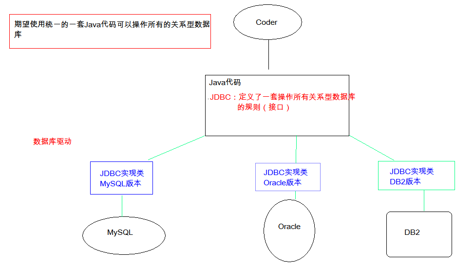

# JDBC 基础

---

## 目录

1. JDBC基本概念
2. 抽取JDBC工具类：JDBCUtils
3. JDBC各接口、类详解

---

## 1. JDBC

### 1.1 JDBC简介

* 概念：(Java DataBase Connectivity)  Java 数据库连接， Java语言操作数据库
* ==JDBC本质==：是官方（sun公司）定义的一套操作所有关系型数据库的规则，即接口。各个数据库厂商去实现这套接口，提供数据库驱动jar包。我们可以使用这套接口（JDBC）编程，真正执行的代码是驱动jar包中的实现类。

### 1.2 快速入门

* 步骤
  1. 导入驱动jar包 mysql-connector-java-5.1.37-bin.jar
     1. 复制mysql-connector-java-5.1.37-bin.jar到项目的 libs 目录下
     2. 右键新建的 libs 目录 --> Add As Library
  2.  注册驱动
  3. 获取数据库连接对象 Connection【连接本地Java代码与数据库的桥梁】
  4. 定义sql语句
  5. 获取执行sql语句的对象 Statement
  6. 执行sql，接收返回结果
  7. 处理结果
  8. 释放资源
* 代码实现：

~~~java
    // 1. 导入驱动jar包
    // 2.注册驱动
    Class.forName("com.mysql.cj.jdbc.Driver");    // mysql-8.0+
    Class.forName("com.mysql.jdbc.Driver");     // mysql-5.0+
    // 3.获取数据库连接对象
    Connection connection = DriverManager.getConnection("jdbc:mysql://localhost:3306/db3", "root", "123456");
    // 4.定义sql语句
    //String sql = "update account set balance = 500 where id = 1";
    String sql = "UPDATE account SET balance = 500 WHERE id = 1";
    // 5.获取执行sql的对象 Statement
    Statement statement = connection.createStatement();
    // 6.执行sql
    int sqlResult = statement.executeUpdate(sql);
    // 7.处理结果
    System.out.println(sqlResult);
    // 8.释放资源
    statement.close();
    connection.close();
~~~

### 1.3 详解对象

####1.3.1 **DriverManager**：驱动管理对象

*  功能：

  1. 注册驱动：告诉程序该使用哪一个数据库驱动jar

     ~~~java
     static void registerDriver(Driver driver) :注册与给定的驱动程序 DriverManager 。 
     写代码使用：  
     	Class.forName("com.mysql.cj.jdbc.Driver");    // mysql-8.0+
     	Class.forName("com.mysql.jdbc.Driver");      // mysql-5.0+
     通过查看源码发现：在com.mysql.(cj.)jdbc.Driver类中存在静态代码块
     	// mysql-connector-8.0.26
         static {
             try {
                 DriverManager.registerDriver(new Driver());
             } catch (SQLException var1) {
                 throw new RuntimeException("Can't register driver!");
             }
         }    
         // mysql-connector-5.0+
         static {
             try {
                 java.sql.DriverManager.registerDriver(new Driver());
             } catch (SQLException E) {
                 throw new RuntimeException("Can't register driver!");
             }
         }
     ~~~
  
     * 注意：mysql5之后的驱动jar包可以省略注册驱动的步骤。
  
  2. 获取数据库连接：
  
     * 方法：static Connection getConnection(String url, String user, String password) 
     * 参数：
       * url：指定连接的路径
         * 语法：jdbc:mysql://ip地址(域名):端口号/数据库名称
         
         > IP 可以找到某台计算机；
         >
         > 端口号可以找到目标计算器安装的 mysql 服务器
         
         * 例子：jdbc:mysql://localhost:3306/db3
         * 细节：如果连接的是本机mysql服务器，并且mysql服务默认端口是3306，则url可以【省略IP和端口号】简写为：jdbc:mysql:///数据库名称
       * user：用户名
       * password：密码 

#### 1.3.2 **Connection**：数据库连接对象

1. 功能：
   1. 获取执行 sql 的对象
      * Statement createStatement()
      * PreparedStatement prepareStatement(String sql)  
   2. 管理事务：
      * 开启事务：setAutoCommit(boolean autoCommit) ：调用该方法设置参数为false，即开启事务
      * 提交事务：commit() 
      * 回滚事务：rollback() 

#### 1.3.3 **Statement**：执行sql的对象

1. 执行sql

   1. boolean execute(String sql) ：可以执行任意的sql 【了解 】
   2. int executeUpdate(String sql) ：执行DML（insert、update、delete）语句、DDL(create，alter、drop)语句
      * 返回值：影响的行数，可以通过这个影响的行数判断DML语句是否执行成功 返回值>0的则执行成功，反之，则失败。
   3. ResultSet executeQuery(String sql)  ：执行DQL（select)语句

2. 练习：

   1. account表 添加一条记录
   2. account表 修改记录
   3. account表 删除一条记录

   代码：

   ~~~java
       // 资源变量声明
       Connection connection = null;
       Statement statement = null;
       try {
           // 1.注册驱动
           Class.forName("com.mysql.cj.jdbc.Driver");
           // 2.定义sql
           String sql = "INSERT INTO account VALUES(null, '王五', 3000)";
           /*
               String sql = "UPDATE account SET balance = 1500 WHERE id = 3";
               String sql = "DELETE FROM account WHERE id = 3";
           */
           // 3.获取Connection对象
           connection = DriverManager.getConnection("jdbc:mysql://localhost:3306/db3", "root", "123456");
           // 4.获取执行sql的对象 Statement
           statement = connection.createStatement();
           // 5.执行sql
           int count = statement.executeUpdate(sql);   // 影响的行数
           // 6.处理结果
           System.out.println(count);
           if (count > 0) {
               System.out.println("添加成功");
           } else {
               System.out.println("添加失败");
           }
       } catch (ClassNotFoundException e) {
           e.printStackTrace();
       } catch (SQLException throwables) {
           throwables.printStackTrace();
       } finally {
           // 7.释放资源
           if (statement != null) {    // 避免空指针异常
               try {
                   statement.close();
               } catch (SQLException e) {
                   e.printStackTrace();
               }
           }
           if (connection != null) {    // 避免空指针异常
               try {
                   connection.close();
               } catch (SQLException e) {
                   e.printStackTrace();
               }
           }
       }
   ~~~

#### 1.3.4 **ResultSet**：结果集对象,封装查询结果

* boolean next(): 游标向下移动一行，判断当前行是否是最后一行末尾(是否有数据)，如果是，则返回false，如果不是则返回true

* getXxx(参数):获取数据

  * Xxx：代表数据类型   如： int getInt() ,	String getString()
  * 参数
    1. int：代表列的编号,**从1开始**   如： getString(1)
    2. String：代表列名称。 如： getDouble("balance")

* 注意：

  * 使用步骤：

    1. 游标向下移动一行
    2. 判断是否有数据
    3. 获取数据

    ~~~java
        //循环判断游标是否是最后一行末尾。
        while (resultSet.next()) {
            //获取数据
            int id = resultSet.getInt(1);
            String name = resultSet.getString("name");
            double balance = resultSet.getDouble(3);
    
            System.out.println(id + " --- " + name + " --- " + balance);
        }
    ~~~
  
* 练习：

  * 定义一个方法，查询emp表的数据将其封装为对象，然后装载集合，返回。
    1. 定义Emp类
    2. 定义方法 public List<Emp> findAll(){}
    3. 实现方法 select * from emp;

#### 1.3.5 ==**PreparedStatement**==：执行sql的对象

1. SQL注入问题：在拼接sql时，有一些sql的特殊关键字参与字符串的拼接。会造成**安全性问题**

   1. 输入用户随便，输入密码：a' or 'a' = 'a
   2. sql：select * from user where username = 'fhdsjkf' and password = 'a' or 'a' = 'a' 

   > 该sql语句是一个恒为true的语句，将查询并返回该表所有的字段

2. 解决sql注入问题：**使用 PreparedStatement 对象来解决**

3. 预编译的SQL：参数使用 ? 作为占位符

4. ==步骤==：

   1. 导入驱动 jar 包，如mysql-connector-java-5.1.37-bin.jar

   2. 注册驱动

   3. 获取数据库连接对象 Connection

   4. 定义sql

      * 注意：sql的参数使用？作为占位符。 如：

        ~~~mysql
        SELECT * FROM user WHERE username = ? AND password = ?;
        ~~~

   5. 调用方法获取执行sql语句的对象 **PreparedStatement  Connection.prepareStatement(String sql)** 

   6. 给 ？赋值：

      * 方法： setXxx(参数1,参数2)
        * 参数1：？的位置编号 从1 开始
        * 参数2：？的值

   7. 执行sql，接受返回结果，不需要传递sql语句

   8. 处理结果

   9. 释放资源

5. **注意**：==后期都会使用 **PreparedStatement** 来完成增删改查的所有操作==

   1. 可以防止SQL注入
   2. 效率更高

---

## 2. 抽取JDBC工具类 ： JDBCUtils

### 2.1 JDBCUtils 简介

* 目的：简化书写

* 分析：

  1. 注册驱动抽取

  2. 抽取一个方法获取连接对象

     * 需求：不想传递参数（麻烦），同时要保证工具类的通用性。

     * 解决方案：**配置文件**

       jdbc.properties
       				url =
       				user =
       				password =

  3. 抽取一个方法释放资源

### 2.2 代码实现

~~~java
import java.io.FileReader;
import java.io.IOException;
import java.net.URL;
import java.sql.*;
import java.util.Properties;

public class JDBCUtils {
    private static String url;  // 数据库URL
    private static String user; // 数据库用户
    private static String password; // 登录密码
    private static String driver;   // 驱动路径

    /**
     * 使用静态代码块，令文件读取操作只执行一次
     */
    static {
        // 读取资源文件，获取值

        try {
            // 1.创建Properties集合类
            Properties properties = new Properties();
            // 获取src路径下的文件方式-->ClassLoader
            ClassLoader classLoader = JDBCUtils.class.getClassLoader();
            URL resource = classLoader.getResource("jdbc.properties");
            String path = resource.getPath();
            System.out.println(path);
            // 2.加载文件
            //properties.load(new FileReader("src/jdbc.properties"));
            properties.load(new FileReader(path));
            // 3.获取数据，赋值
            url = properties.getProperty("url");
            user = properties.getProperty("user");
            password = properties.getProperty("password");
            driver = properties.getProperty("driver");
            // 4.注册驱动
            Class.forName(driver);
        } catch (IOException e) {
            e.printStackTrace();
        } catch (ClassNotFoundException e) {
            e.printStackTrace();
        }
    }

    /**
     * 获取连接
     * @return 数据库连接对象
     */
    public static Connection getConnection() throws SQLException {
        return DriverManager.getConnection(url, user, password);
    }

    /**
     * 释放资源
     * @param statement 执行sql对象
     * @param connection 数据库连接对象
     */
    public static void close(Statement statement, Connection connection) {

        if (statement != null) {
            try {
                statement.close();
            } catch (SQLException e) {
                e.printStackTrace();
            }
        }
        if (connection != null) {
            try {
                connection.close();
            } catch (SQLException e) {
                e.printStackTrace();
            }
        }
    }

    /**
     * 释放资源
     * @param statement 执行sql对象
     * @param connection 数据库连接对象
     */
    public static void close(ResultSet resultSet,Statement statement, Connection connection) {
        if (resultSet != null) {
            try {
                resultSet.close();
            } catch (SQLException e) {
                e.printStackTrace();
            }
        }
        if (statement != null) {
            try {
                statement.close();
            } catch (SQLException e) {
                e.printStackTrace();
            }
        }
        if (connection != null) {
            try {
                connection.close();
            } catch (SQLException e) {
                e.printStackTrace();
            }
        }
    }
}
~~~

### 2.3 练习

* 需求

  1. 通过键盘录入用户名和密码
  2. 判断用户是否登录成功
     * SELECT * FROM user WHERE username = "..." AND password = "...";
     * 如果这个sql有查询结果，则成功，反之，则失败

* 步骤：

  1. 创建数据库表 user

  ~~~mysql
  CREATE TABLE user(
      id INT PRIMARY KEY AUTO_INCREMENT,
      username VARCHAR(32),
      password VARCHAR(32)
  );
  
  INSERT INTO user VALUES(NULL, 'Anthony', '123');
  INSERT INTO user VALUES(NULL, 'Pure', '456');
  ~~~
  
  2. 代码实现：
  
  ~~~java
  import com.anthony.util.JDBCUtils;
  
  import java.sql.*;
  import java.util.Scanner;
  
  /**
   * 需求
       * 1. 通过键盘录入用户名和密码
       * 2. 判断用户是否登录成功
   */
  public class JDBCDemo9 {
      public static void main(String[] args) {
          // 1.键盘录入，接受用户名和密码
          Scanner in = new Scanner(System.in);
          System.out.println("请输入用户名：");
          String username = in.nextLine();
          System.out.println("请输入密码：");
          String password = in.nextLine();
          // 2.调用方法
          boolean flag = new JDBCDemo9().loginSafely(username, password);
          // 3.判断结果，输出不同语句
          if (flag) {
              // 登录成功
              System.out.println("登录成功！");
          } else {
              System.out.println("用户名或密码错误！");
          }
      }
  
      /**
       * 登录方法
       */
      public boolean login(String username, String password) {
          if (username == null || password == null) {
              return false;
          }
          // 声明连接资源
          Connection connection = null;
          Statement statement = null;
          ResultSet resultSet = null;
          try {
              // 1.获取连接
              connection = JDBCUtils.getConnection();
              // 2.定义sql
              String sql = "SELECT * FROM user WHERE username = '" + username +
                      "'AND password = '" + password + "'";
              // 3.获取执行sql的对象
              statement = connection.createStatement();
              // 4.执行查询
              resultSet = statement.executeQuery(sql);
              //5.判断
              return resultSet.next();
          } catch (SQLException e) {
              e.printStackTrace();
          } finally {
              JDBCUtils.close(resultSet, statement, connection);
          }
          return false;
      }
  
      /**
       * 登录方法，使用PreparedStatement实现
       */
      public boolean loginSafely(String username, String password) {
          if (username == null || password == null) {
              return false;
          }
          // 声明连接资源
          Connection connection = null;
          PreparedStatement preparedStatement = null;
          ResultSet resultSet = null;
          try {
              // 1.获取连接
              connection = JDBCUtils.getConnection();
              // 2.定义sql
              String sql = "SELECT * FROM user WHERE username = ? AND password = ?";
              // 3.获取执行sql的对象
              preparedStatement = connection.prepareStatement(sql);
              // 4.给 ？ 赋值
              preparedStatement.setString(1, username);
              preparedStatement.setString(2, password);
              // 5.执行查询[不需要传递sql参数]
              resultSet = preparedStatement.executeQuery();
              // 6.判断
              return resultSet.next();
          } catch (SQLException e) {
              e.printStackTrace();
          } finally {
              JDBCUtils.close(resultSet, preparedStatement, connection);
          }
          return false;
      }
  }       
  ~~~

---

## 3. JDBC控制事务

### 3.1 事务的概念

* 事务：一个包含多个步骤的业务操作。如果这个业务操作被事务管理，则这多个步骤要么同时成功，要么同时失败。

### 3.2 操作

1.  开启事务
2. 提交事务
3. 回滚事务

### 3.3 使用 Connection对象来管理事务

* 开启事务：setAutoCommit(boolean autoCommit) ：调用该方法设置参数为false，即开启事务
  * 在执行sql之前开启事务
* 提交事务：commit() 
  *  当所有sql都执行完提交事务
* 回滚事务：rollback() 
  * 在catch中回滚事务

### 3.4 代码实现

~~~java
import com.anthony.util.JDBCUtils;

import java.sql.Connection;
import java.sql.PreparedStatement;
import java.sql.SQLException;

/**
 * 事务操作
 */
public class JDBCDemo10 {
    public static void main(String[] args) {
        Connection connection = null;
        PreparedStatement preparedStatement1 = null;
        PreparedStatement preparedStatement2 = null;

        try {
            // 1.获取连接
            connection = JDBCUtils.getConnection();

            // 【执行sql之前】开启事务
            connection.setAutoCommit(false);

            // 2.定义sql
            // 2.1 张三 - 500
            String sql1 = "UPDATE account SET balance = balance - ? WHERE id = ?";
            // 2.2 李四 + 500
            String sql2 = "UPDATE account SET balance = balance + ? WHERE id = ?";
            // 3.获取执行sql对象
            preparedStatement1 = connection.prepareStatement(sql1);
            preparedStatement2 = connection.prepareStatement(sql2);
            // 4.设置参数
            preparedStatement1.setDouble(1,500);
            preparedStatement1.setInt(2,1);

            preparedStatement2.setDouble(1,500);
            preparedStatement2.setInt(2,2);
            // 5.执行sql
            preparedStatement1.executeUpdate();

            // 手动制造异常
            int i = 3/0;

            preparedStatement2.executeUpdate();

            // 【所有sql都执行后】提交事务
            connection.commit();

        } catch (Exception e) {
            // 【出现异常时，在catch块内】回滚事务
            try {
                if (connection != null) {
                    connection.rollback();
                }
            } catch (SQLException e1) {
                e1.printStackTrace();
            }
            e.printStackTrace();
        } finally {
            JDBCUtils.close(preparedStatement1, connection);
            JDBCUtils.close(preparedStatement2,null);
        }
    }
}
~~~

