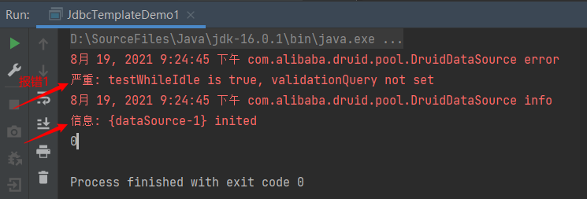
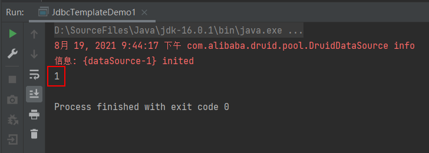

# 数据库连接池&JDBCTemplate

---

## 目录

1. 数据库连接池
2. Spring JDBC : JDBC Template

---

## 1. 数据库连接池

### 1.1 概念

* 概念：其实就是一个容器(集合)，存放数据库连接的容器。
  * 当系统初始化好后，容器被创建，容器中会申请一些连接对象，当用户来访问数据库时，从容器中获取连接对象，用户访问完之后，会将连接对象归还给容器。

### 1.2 好处

1. 节约资源
2. 用户访问高效

### 1.3 实现

1. 标准接口：**DataSource   javax.sql 包下**
   1. 方法：
      *  获取连接：**getConnection()**
      * 归还连接：**Connection.close()**。如果连接对象Connection是从连接池中获取的，那么调用Connection.close()方法，则不会再关闭连接了。而是归还连接
2. 一般使用者不去实现它，由数据库厂商来实现
   1. C3P0：数据库连接池技术
   2. Druid：数据库连接池实现技术，由阿里巴巴提供的

### 1.4 C3P0：数据库连接池技术

* 步骤：
  1. 在项目【模块】根目录下创建libs目录并导入jar包 (两个) **c3p0-0.9.5.2.jar**, 和 **mchange-commons-java-0.2.12.jar** ，
     * 不要忘记将数据库连接驱动jar包 **mysql-connector-java-8.0.26.jar** 导入libs目录
  2. 定义配置文件：
     * 名称： **c3p0.properties** 或者 **c3p0-config.xml**
     * 路径：直接将文件放在src目录下即可。
  3. 创建核心对象 数据库连接池对象 ComboPooledDataSource
  4. 获取连接： getConnection
* 代码

~~~java
    // 1.创建数据库连接池对象
    DataSource dataSource = new ComboPooledDataSource();
    // 2.获取连接对象
    Connection connection = dataSource.getConnection();
~~~

### 1.5 Druid：数据库连接池实现技术，由阿里巴巴提供

1. 步骤：

   1. 导入jar包 **druid-1.0.9.jar**
   2. 定义配置文件：
      * 是**properties形式**的
      * 可以叫**任意名称**，可以放在**任意目录**下
   3. 加载配置文件。Properties
   4. 获取数据库连接池对象：通过工厂来来获取  DruidDataSourceFactory
   5. 获取连接：getConnection

   * 代码

   ~~~java
       // 1.导入jar包
       // 2.定义配置文件
       // 3.获取连接池对象
       Properties properties = new Properties();
       InputStream inputStream = DruidDemo.class.getClassLoader().getResourceAsStream("druid.properties");
       properties.load(inputStream);
       // 4.获取连接池对象
       DataSource dataSource = DruidDataSourceFactory.createDataSource(properties);
       Connection connection = dataSource.getConnection();
   ~~~

2. 定义工具类

   1. 定义一个类 JDBCUtils
   2. 提供静态代码块加载配置文件，初始化连接池对象
   3. 提供方法
      1. 获取连接方法：通过数据库连接池获取连接
      2. 释放资源
      3. 获取连接池的方法

   * 代码：

   ~~~java
   package com.anthony.javaweb.day06_datasource.utils;
   
   import com.alibaba.druid.pool.DruidDataSourceFactory;
   
   import javax.sql.DataSource;
   import java.io.IOException;
   import java.sql.Connection;
   import java.sql.ResultSet;
   import java.sql.SQLException;
   import java.sql.Statement;
   import java.util.Properties;
   
   /**
    * Druid连接池的工具类
    */
   public class JDBCUtils {
       // 1.定义成员变量 DataSource
       private static DataSource dataSource;
   
       static {
           try {
               // 1.加载配置文件
               Properties properties = new Properties();
               properties.load(JDBCUtils.class.getClassLoader().getResourceAsStream("druid.properties"));
               // 2.获取DataSource
               dataSource = DruidDataSourceFactory.createDataSource(properties);
           } catch (IOException e) {
               e.printStackTrace();
           } catch (Exception e) {
               e.printStackTrace();
           }
       }
   
       /**
        * 获取连接
        */
       public static Connection getConnection() throws SQLException {
           return dataSource.getConnection();
       }
   
       /**
        * 释放资源
        * @param statement 数据库操作对象
        * @param connection 数据库连接对象
        */
       public static void close(Statement statement, Connection connection) {
           close(null,statement, connection);
       }
   
       /**
        * 释放资源
        * @param resultSet 【查询】结果集对象
        * @param statement 数据库操作对象
        * @param connection 数据库连接对象
        */
       public static void close(ResultSet resultSet , Statement statement, Connection connection) {
           if (resultSet != null) {
               try {
                   resultSet.close();
               } catch (SQLException e) {
                   e.printStackTrace();
               }
           }
           if (statement != null) {
               try {
                   statement.close();
               } catch (SQLException e) {
                   e.printStackTrace();
               }
           }
   
           if (connection != null) {
               try {
                   connection.close(); // 归还连接
               } catch (SQLException e) {
                   e.printStackTrace();
               }
           }
       }
   
       /**
        * 获取连接池方法
        */
       public static DataSource getDataSource() {
           return dataSource;
       }
   }
   ~~~

#### Druid 工具类的使用

~~~java
package com.anthony.javaweb.day06_datasource.druid;

import com.anthony.javaweb.day06_datasource.utils.JDBCUtils;

import java.sql.Connection;
import java.sql.PreparedStatement;
import java.sql.SQLException;

/**
 * 使用Druid工具类
 */
public class DruidDemo2 {
    public static void main(String[] args) {
        /*
            实现添加操作，给account表添加一条记录
        */
        Connection connection = null;
        PreparedStatement preparedStatement = null;

        try {
            // 1.获取连接
            connection = JDBCUtils.getConnection();
            // 2.定义sql
            String sql = "INSERT INTO account VALUES(null, ?, ?)";
            // 3.获取PreparedStatement对象
            preparedStatement = connection.prepareStatement(sql);
            // 4.给？赋值
            preparedStatement.setString(1, "Anthony");
            preparedStatement.setDouble(2, 3000);
            // 5.执行sql
            int count = preparedStatement.executeUpdate();
            System.out.println(count);
        } catch (SQLException e) {
            e.printStackTrace();
        } finally {
            // 6.释放资源
            JDBCUtils.close(preparedStatement, connection);
        }
    }
}
~~~

---

## 2. SpringJDBC

* Spring框架对JDBC的简单封装。提供了一个JDBCTemplate对象简化JDBC的开发

* 步骤

  1. 导入jar包

  2. 创建JdbcTemplate对象。依赖于数据源DataSource

     * JdbcTemplate template = new JdbcTemplate(ds);

  3. 调用JdbcTemplate的方法来完成CRUD的操作

     * **update()**: 执行DML语句。增、删、改语句
     * **queryForMap()**: 查询结果将结果集封装为map集合，将==列名作为key==，将==值作为value== 将这条记录封装为一个map集合
       * 注意：==这个方法查询的结果集长度只能是1==
     * **queryForList()**: 查询结果将结果集封装为list集合
       * 注意：==将每一条记录封装为一个Map集合，再将Map集合装载到List集合中==
     * **query()**: 查询结果，将结果封装为JavaBean对象
       * **query()** 的参数：**RowMapper**
         * 一般我们使用BeanPropertyRowMapper实现类。可以实现数据到JavaBean的自动封装
         * **new BeanPropertyRowMapper<类型>(类型.class)**
     * **queryForObject()** ：查询结果，将结果封装为对象
       * ==一般用于聚合函数的查询==

  * 附：框架使用问题汇总（使用JDK16.0.1，MySQL8.0.25，Druid1.0.9,jar ）

  初始化第一次运行报错如下

  

  * 这两行报错，是因为**没有SpringBoot框架xml配置**。在不使用框架的情况下，解决办法如下：

    1. 报错1：**严重: testWhileIdle is true, validationQuery not set**  原来的 druid.properties 文件配置如下

       ~~~properties
       driverClassName=com.mysql.cj.jdbc.Driver
       url=jdbc:mysql://127.0.0.1:3306/db3
       username=root
       password=123456
       # ??????
       initialSize=5
       # ?????
       maxActive=10
       # ??????
       maxWait=3000
       ~~~

       在 druid.properties 配置文件下添加一些配置；

       ~~~properties
       filters=stat
       timeBetweenEvictionRunsMillis=60000
       minEvictableIdleTimeMillis=300000
       validationQuery=SELECT 1
       testWhileIdle=true
       testOnBorrow=false
       testOnReturn=false
       poolPreparedStatements=false
       maxPoolPreparedStatementPerConnectionSize=200
       ~~~

       修改配置后重新运行，连接成功。

       

    2. 提示信息: **{dataSource-1} inited**

    * 这是日志信息。Druid采用了日志打印机制，不是报错；
    * 连接池采用了懒加载，真正用到的时候才初始化；

  * 附：（名词解释）

    *  validationQuery = "SELECT 1"  验证连接是否可用，使用的SQL语句
    *  testWhileIdle = "true"    指明连接是否被空闲连接回收器(如果有)进行检验.如果检测失败,则连接将被从池中去除.
    * testOnBorrow = "false"  借出连接时不要测试，否则很影响性能
    * timeBetweenEvictionRunsMillis = "30000"  每30秒运行一次空闲连接回收器
    * minEvictableIdleTimeMillis = "1800000"  池中的连接空闲30分钟后被回收,默认值就是30分钟。
    * numTestsPerEvictionRun="3" 在每次空闲连接回收器线程(如果有)运行时检查的连接数量，默认值就是3.

  

  * **练习**

  * 需求：
    1. 修改1号数据的 salary 为 10000
    2. 添加一条记录
    3. 删除刚才添加的记录
    4. 查询id为1的记录，将其封装为Map集合
    5. 查询所有记录，将其封装为List
    6. 查询所有记录，将其封装为Emp对象的List集合
    7. 查询总记录数

  * 代码

  ~~~java
  package com.anthony.javaweb.day06_datasource.jdbctemplate;
  
  import com.anthony.javaweb.day06_datasource.domain.Emp;
  import com.anthony.javaweb.day06_datasource.utils.JDBCUtils;
  import org.junit.Test;
  import org.springframework.jdbc.core.BeanPropertyRowMapper;
  import org.springframework.jdbc.core.JdbcTemplate;
  import org.springframework.jdbc.core.RowMapper;
  
  import java.sql.ResultSet;
  import java.sql.SQLException;
  import java.util.Date;
  import java.util.List;
  import java.util.Map;
  
  public class JdbcTemplateDemo2 {
  
      // Junit单元测试，独立执行方法
      // 1. 获取JDBCTemplate对象
      private JdbcTemplate jdbcTemplate = new JdbcTemplate(JDBCUtils.getDataSource());
  
      /**
       * 1. 修改1号数据的 salary 为 10000
       */
      @Test
      public void test1() {
          // 2. 定义sql
          String sql = "UPDATE emp SET salary = 10000 WHERE id = 1001";
          // 3. 执行sql
          int count = jdbcTemplate.update(sql);
          System.out.println(count);
      }
  
      /**
       * 2. 添加一条记录
       */
      @Test
      public void test2(){
          String sql = "INSERT INTO emp(id,ename,dept_id) VALUES(?, ?, ?)";
          int count = jdbcTemplate.update(sql, 1015, "郭靖", 10);
          System.out.println(count);
  
      }
  
      /**
       * 3.删除刚才添加的记录
       */
      @Test
      public void test3(){
          String sql = "DELETE FROM emp WHERE id = ?";
          int count = jdbcTemplate.update(sql, 1015);
          System.out.println(count);
      }
  
      /**
       * 4.查询id为1001的记录，将其封装为Map集合
       * 注意：这个方法查询的结果集长度只能是1
       */
      @Test
      public void test4(){
          String sql = "SELECT * FROM emp WHERE id = ?";
          Map<String, Object> map = jdbcTemplate.queryForMap(sql, 1001);
          System.out.println(map);
          //{id=1001, ename=孙悟空, job_id=4, mgr=1004, joindate=2000-12-17, salary=10000.00, bonus=null, dept_id=20}
  
      }
  
      /**
       * 5. 查询所有记录，将其封装为List
       */
      @Test
      public void test5(){
          String sql = "SELECT * FROM emp";
          List<Map<String, Object>> list = jdbcTemplate.queryForList(sql);
  
          for (Map<String, Object> stringObjectMap : list) {
              System.out.println(stringObjectMap);
          }
      }
  
      /**
       * 6. 查询所有记录，将其封装为Emp对象的List集合
       */
  
      @Test
      public void test6(){
          String sql = "SELECT * FROM emp";
          List<Emp> list = jdbcTemplate.query(sql, new RowMapper<Emp>() {
              @Override
              public Emp mapRow(ResultSet resultSet, int i) throws SQLException {
                  Emp emp = new Emp();
                  int id = resultSet.getInt("id");
                  String ename = resultSet.getString("ename");
                  int job_id = resultSet.getInt("job_id");
                  int mgr = resultSet.getInt("mgr");
                  Date joindate = resultSet.getDate("joindate");
                  double salary = resultSet.getDouble("salary");
                  double bonus = resultSet.getDouble("bonus");
                  int dept_id = resultSet.getInt("dept_id");
  
                  emp.setId(id);
                  emp.setEname(ename);
                  emp.setJob_id(job_id);
                  emp.setMgr(mgr);
                  emp.setJoinDate(joindate);
                  emp.setSalary(salary);
                  emp.setBonus(bonus);
                  emp.setDept_id(dept_id);
  
                  return emp;
              }
          });
          for (Emp emp : list) {
              System.out.println(emp);
          }
      }
  
      /**
       * 6. 查询所有记录，将其封装为Emp对象的List集合
       */
  
      @Test
      public void test6_2(){
          String sql = "select * from emp";
          List<Emp> list = jdbcTemplate.query(sql, new BeanPropertyRowMapper<Emp>(Emp.class));
          for (Emp emp : list) {
              System.out.println(emp);
          }
      }
  
      /**
       * 7. 查询总记录数
       */
  
      @Test
      public void test7(){
          String sql = "SELECT COUNT(id) FROM emp";
          Long total = jdbcTemplate.queryForObject(sql, Long.class);
          System.out.println(total);
      }
  }
  ~~~

  

