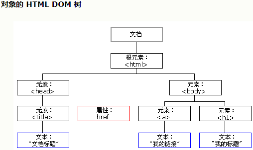

# JavaScript_2

---

## 目录

1. DOM入门
2. 事件入门
3. BOM
4. DOM
5. 事件监听机制

---

## 1. DOM入门

* 功能：控制 html 文档的内容

* 代码：获取页面标签(元素)对象——Element

  * document.getElementById("id值"):通过元素的id获取元素对象

* 操作 Element 对象：

  1. **修改属性值**：

     1. 明确获取的对象是哪一个
     2. 查看API文档，找其中有哪些属性可以设置
     
  2. **修改标签体内容**：

     * 属性：**innerHTML**

     1. 获取元素对象
     2. 使用innerHTML属性修改标签体内容

---

## 2. 事件入门

### 2.1 事件的功能

* 功能： 某些组件被执行了某些操作后，触发某些代码的执行。

  * 造句：  xxx被xxx,我就xxx
    * 我方水晶被摧毁后，我就责备队友。
    * 敌方水晶被摧毁后，我就夸奖自己。

### 2.2 如何绑定事件

  1. 直接在html标签上，指定事件的属性(操作)，属性值就是js代码
     1. 事件：onclick--- 单击事件
  2. 通过js获取元素对象，指定事件属性，设置一个函数。代码如下

  ~~~html
  <body>
      
      
  </body>
  ~~~

### 2.3 案例1：电灯开关

~~~javascript
<!DOCTYPE html>
    <html lang="en">
        <head>
        <meta charset="UTF-8">
            <title>电灯开关</title>

</head>
<body>

            

                
</body>
</html>        
~~~

---

## 3. BOM

### 3.1 概念

* 概念：**Browser Object Model** 浏览器对象模型
  * **将浏览器的各个组成部分封装成对象**。

### 3.2 组成

* **Window**：窗口对象
* **Navigator**：浏览器对象
* **Screen**：显示器屏幕对象
* **History**：历史记录对象
* **Location**：地址栏对象

### 3.3 Window：窗口对象

1. 创建
2. 方法
   1. 与弹出框有关的方法：
      1. **alert()**	显示带有一段消息和一个确认按钮的警告框。
      2. **confirm()**	显示带有一段消息以及确认按钮和取消按钮的对话框。
         * 如果用户点击**确定**按钮，则方法**返回true**
         * 如果用户点击**取消**按钮，则方法**返回false**
      3. **prompt()**	显示可提示用户输入的对话框。
         * 参数：字符串，显示输入框的提示信息
         * 返回值：获取用户输入的值
   2. 与打开关闭有关的方法：
      1. **close()**	关闭浏览器窗口。
         * 谁调用我 ，我关谁
      2. **open()**	打开一个新的浏览器窗口
         * 返回新的Window对象
   3. 与定时器有关的方式
      1. **setTimeout()**	在指定的毫秒数后调用函数或计算表达式。
         * 参数：
           1. 【参数1】js代码或者方法对象
           2. 【参数2】毫秒值
         * 返回值：**唯一标识，用于取消定时器**
         
         ~~~java
         setTimeout(fun(), 2000);
         // var id = setTimeout(fun,2000);
         // clearInterval(id);
         void function fun(){
         alert('boom~~');
         }
         ~~~
         
      2. **clearTimeout()**	取消由 setTimeout() 方法设置的 timeout。
      
      3. **setInterval()**	按照指定的**周期**（以毫秒计）来调用函数或计算表达式。
      
      4. **clearInterval()**	取消由 setInterval() 设置的 timeout。
3. 属性：
   1. 获取其他BOM对象：
      1. **history**
      
         ~~~javascript
         var h1 =  window.history;
         var h2 = history;
         ~~~
      
      2. **location**
      
      3. **Navigator**
      
      4. **Screen**
   2. 获取DOM对象
      1. document
      
         ~~~javascript
         var openBtn = window.document.getElementById("openBtn");
         var openBtn = document.getElementById("openBtn");
         ~~~
4. 特点
   * Window对象不需要创建可以直接使用 window使用。 window.方法名();
   * window引用可以省略。  方法名();

### 3.4 Location：地址栏对象

1. 创建(获取)：
   1. window.location
   2. location
2. 方法：
   * **reload()**	重新加载当前文档。【刷新】
3. 属性
   * **href**	设置或返回完整的 URL。

### 3.5 History：历史记录对象

1. 创建(获取)：
   1. window.history
   2. history
2. 方法：
   * back()	加载 history 列表中的前一个 URL。
   * forward()	加载 history 列表中的下一个 URL。
   * go(参数)	加载 history 列表中的某个具体页面。
     * 参数：
       * 正数：前进几个历史记录
       * 负数：后退几个历史记录
3. 属性：
   * length	返回当前窗口历史列表中的 URL 数量。

---

## 4. DOM

### 4.1 DOM 概念

* 概念： **Document Object Model** 文档对象模型
  * 将标记语言文档的各个组成部分，封装为对象。可以使用这些对象，对标记语言文档进行CRUD的动态操作

### 4.2  W3C  DOM 标准三个部分

* 核心 DOM - 针对任何结构化文档的标准模型
  * Document：文档对象
  * Element：元素对象
  * Attribute：属性对象
  * Text：文本对象
  * Comment:注释对象
* XML DOM - 针对 XML 文档的标准模型
* HTML DOM - 针对 HTML 文档的标准模型

### 4.3 核心DOM模型

* **Document**：文档对象

  1. 创建(获取)：在html dom模型中可以使用window对象来获取
     1. window.document
     2. document
  2. 方法：
     1. **获取**Element对象：
       
        1. **getElementById()**： 根据id属性值获取元素对象。id属性值一般唯一
        
        2. **getElementsByTagName()**：根据元素名称获取元素对象们。返回值是一个数组
        
           > 如：一个html页面可定义很多个
标签、很多个<input>标签。
        
        3. **getElementsByClassName()**: 根据Class属性值获取元素对象们。返回值是一个数组
        
        4. **getElementsByName()**: 根据name属性值获取元素对象们。返回值是一个数组
     2. **创建**其他DOM对象：
       
        1. createAttribute(name) 创建属性
        2. createComment() 创建注释
        3. createElement() 创建元素
        4. createTextNode() 创建文本节点
     3. 属性

* **Element**：元素对象

  1. 获取/创建：通过document来获取和创建
  2. 方法：
     1. **removeAttribute()**：**删除属性**
     2. **setAttribute()**：**设置属性**

* **Node**：节点对象，其他5个的父对象

  * 特点：所有dom对象都可以被认为是一个节点
  * 方法：
    * CRUD dom 树：
      * **appendChild()**：向节点的子节点列表的结尾添加新的子节点。
      * **removeChild()**：删除（并返回）当前节点的指定子节点。
      * replaceChild()：用新节点替换一个子节点。
  * 属性：
    * parentNode 返回节点的父节点。

  ### 4.4 HTML DOM

  1. 标签体的设置和获取：innerHTML

  2. 使用html元素对象的属性

  3. 控制元素样式

     1. 使用元素的style属性来设置。如：

     ~~~javascript
     //修改样式方式1
     div1.style.border = "1px solid red";
     div1.style.width = "200px";
     //font-size--> fontSize
     div1.style.fontSize = "20px";
     ~~~

     2. 提前定义好类选择器的样式，通过元素的className属性来设置其class属性值。
     
     ~~~html
     <!DOCTYPE html>
     <html lang="en">
     <head>
         <meta charset="UTF-8">
         <title>控制样式</title>
     
         
     
     </head>
     <body>
     
         

             div2
         

     
     
     
     </body>
     </html>

---

## 5. 事件监听机制

### 5.1 概念

* 概念：某些组件被执行了某些操作后，触发某些代码的执行。	
  * 事件：某些操作。如： 单击，双击，键盘按下，鼠标移动
  * 事件源：组件。如： 按钮 文本输入框 ...
  * 监听器：代码实现。
  * 注册监听：将事件，事件源，监听器结合在一起。 当事件源上发生了某个事件，则触发执行某个监听器代码。

### 5.2 常见事件

1. 点击事件：
   1. **onclick**：单击事件
   2. **ondblclick**：双击事件
2. 焦点事件
   1. **onblur**：失去焦点【闪动光标】
      * 一般用于表单验证【验证输入内容是否符合规范】
   2. **onfocus**:元素获得焦点。
3. 加载事件：
   1. **onload**：一张页面或一幅图像完成加载。
4. 鼠标事件：
   1. **onmousedown**	鼠标按钮被按下。
      * 定义方法时，定义一个形参，接收 event 对象
      * event 对象的 button 属性可以获取鼠标被点击的结构【左键0、滚轮1或右键2】。
   2. **onmouseup**	鼠标按键被松开。
   3. **onmousemove**	鼠标被移动。
   4. **onmouseover**	鼠标移到某元素之上。
   5. **onmouseout**	鼠标从某元素移开。
5. 键盘事件：
   1. **onkeydown**	某个键盘按键被按下。	
   2. **onkeyup**		某个键盘按键被松开。
   3. **onkeypress**	某个键盘按键被按下并松开。
6. 选择和改变
   1. **onchange**	域的内容被改变。
   2. **onselect**	文本被选中。
7. 表单事件：
   1. **onsubmit**	确认按钮被点击。
   2. **onreset**	重置按钮被点击。

****
