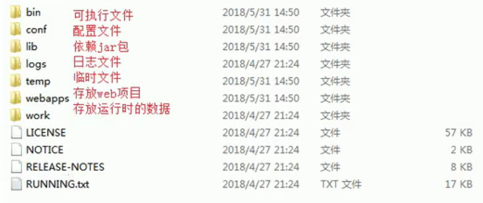
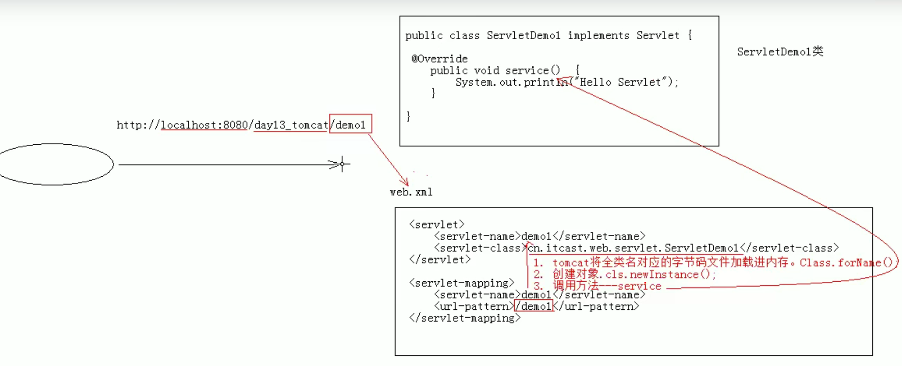

# Tomcat&Servlet

---

## 综述

* **Tomcat** 是 **Web应用服务器**，是一个**Servlet/JSP容器**。Tomcat 作为Servlet容器，负责处理客户请求，把请求传送给Servlet，并将Servlet 的响应传送回给客户
* 而 **Servlet** 是一种运行在支持 Java 语言的**服务器上的组件**。Servlet 最常见的用途是**扩展 Java Web 服务器功能**，提供非常安全的，可移植的，易于使用的CGI替代品.

---

## 目录

1. web相关概念回顾
2. web服务器软件：Tomcat
3. Servlet入门学习
4. IDEA与Tomcat相关配置

---

## 1. web相关概念回顾

### 1.1 软件架构

1. C/S：客户端/服务器端
2. B/S：浏览器/服务器端

### 1.2 资源分类

1. **静态资源**：所有用户访问后，得到的结果都是一样的，称为静态资源.静态资源可以直接被浏览器解析
   * 如： HTML, CSS, JavaScript
2. **动态资源**：每个用户访问相同资源后，得到的结果可能不一样。称为动态资源。动态资源被访问后，需要先转换为静态资源，再返回给浏览器
   *  如：Servlet / JSP, PHP, ASP....

### 1.3 网络通信三要素

1. **IP**：电子设备【计算机】在网络中的唯一标识。

2. **端口号**：应用程序在计算机中的唯一标识。 0~65536

   > 自己开发时，尽量不要使用1024以内的端口，以防该端口已被操作系统占用

3. **传输协议**：规定了数据传输的规则

   1. 基础协议：
      1. **TCP**：安全协议，三次握手。 速度稍慢
      2. **UDP**：不安全协议。 速度快

---

## 2. web服务器软件

### 2.1 相关概念

* **服务器**：安装了服务器软件的计算机
* **服务器软件**：接收用户的请求，处理请求，做出响应
* **Web 服务器软件**：接收用户的请求，处理请求，做出响应。
  * 在 Web 服务器软件中，可以部署 Web 项目，让用户通过浏览器来访问这些项目
  * 有时被称为 Web 容器
* 常见的 Java 相关的 Web 服务器软件：
  * webLogic：oracle公司，大型的JavaEE服务器，支持所有的JavaEE规范，收费的。
  * webSphere：IBM公司，大型的JavaEE服务器，支持所有的JavaEE规范，收费的。
  * JBOSS：JBOSS公司的，大型的JavaEE服务器，支持所有的JavaEE规范，收费的。
  * **Tomcat**：Apache基金组织，中小型的JavaEE服务器，仅仅支持少量的JavaEE规范 **Servlet** / **jsp** 。开源的，免费的。
* **JavaEE**：**Java语言在企业级开发中使用的技术规范的总和**，一共规定了13项大的规范

### 2.2 Tomcat：Web 服务器软件

1. 下载：http://tomcat.apache.org/

2. 安装：解压压缩包即可。

   * 注意：安装目录建议不要有中文和空格

   > Tomcat 的目录结构及说明如下：
   >
   > 

3. 卸载：删除目录即可

4. 启动：

   * bin/startup.bat ,双击运行该文件即可

   * 访问：浏览器输入：http://localhost:8080 回车访问自己

     ​								http://别人的ip:8080 访问别人

   * 可能遇到的问题：

     1. 黑窗口一闪而过：

        * 原因： 没有正确配置JAVA_HOME和JRE_HOME环境变量
     
        * 解决方案：正确配置JAVA_HOME和JRE_HOME环境变量
     
          > 参考[如何解决tomcat启动闪退问题](https://blog.csdn.net/cs15229216584/article/details/53910422)
     
     2. 启动报错：
     
        1. 暴力：找到占用的端口号，并且找到对应的进程，杀死该进程
     
           * netstat -ano
     
        2. 温柔：修改自身的端口号
     
           * conf/server.xml
     
           * <Connector port="8888" protocol="HTTP/1.1"
     
             connectionTimeout="20000"
     
             redirectPort="8445" />
     
           * 一般会将tomcat的默认端口号修改为80。80端口号是http协议的默认端口号。
     
             * 好处：在访问时，就不用输入端口号

5. 关闭：

   1. 正常关闭：
      *  bin/shutdown.bat
      * ctrl+c
   2. 强制关闭
      * 点击启动窗口的×

6. 配置

   * 部署项目的方式：【三种】

     1. **直接将项目放到webapps目录下即可**。

        * /hello：项目的访问路径-->**虚拟目录**
        * 简化部署：将项目打成一个war包，再将war包放置到webapps目录下。
          *  war包会自动解压缩

     2. **配置conf/server.xml文件**

        在<Host>标签体中配置

        <Context docBase="D:\hello" path="/hehe" />

        * docBase:项目存放的路径
        * path：虚拟目录
        * 缺点：修改Tomcat整体的配置文件很不安全

     3. **在conf\Catalina\localhost创建任意名称的xml文件。在文件中编写**

        <Context docBase="D:\hello" />

        * 虚拟目录：xml文件的名称

   * 静态项目和动态项目：

     * 目录结构

       * java动态项目的目录结构：

         -- 项目的根目录

         ​	-- WEB-INF目录：

         ​		-- web.xml：web项目的核心配置文件

         ​		-- classes目录：放置字节码文件的目录

         ​		-- lib目录：放置依赖的jar包

   * 将Tomcat集成到IDEA中，并且创建JavaEE的项目，部署项目。

---

## 3. Servlet：  Server Applet

### 3.1 概念

* 概念：运行在服务器端的小程序
  * Servlet就是一个接口，定义了Java 类被浏览器访问到(tomcat识别)的规则。
  * 开发者根据规则实现一个类，即实现Servlet接口，复写方法，即可被浏览器访问到【被Tomcat识别到】。

### 3.2 快速入门

1. 创建JavaEE项目

2. 定义一个类，实现Servlet接口

   ~~~java
   public class ServletDemo1 implements Servlet
   ~~~

3. 实现接口中的抽象方法

4. 配置Servlet

    在web.xml中配置：

   ~~~xml
   <?xml version="1.0" encoding="UTF-8"?>
   <web-app xmlns="http://xmlns.jcp.org/xml/ns/javaee"
        xmlns:xsi="http://www.w3.org/2001/XMLSchema-instance"
        xsi:schemaLocation="http://xmlns.jcp.org/xml/ns/javaee http://xmlns.jcp.org/xml/ns/javaee/web-app_4_0.xsd"
        version="4.0">
   
   <!--配置Servlet-->
   <servlet>
       <servlet-name>demo1</servlet-name>
       <servlet-class>com.anthony.day13_tomcat.web.servlet.ServletDemo1</servlet-class>
   </servlet>
   <servlet-mapping>
       <servlet-name>demo1</servlet-name>
       <url-pattern>/</url-pattern>
   </servlet-mapping>
   
   </web-app>
   ~~~

### 3.3 执行原理

1. 当服务器接受到客户端浏览器的请求后，会解析请求URL路径，获取访问的Servlet的资源路径

2. 查找web.xml文件，是否有对应的<url-pattern>标签体内容。

3. 如果有，则在找到对应的<servlet-class>全类名

4. tomcat会将字节码文件加载进内存，并且创建其对象

   > 1. Tomcat将全类名对应的字节码文件加载进内存。 Class.forName();
   > 2. 创建对象。 cls.newInstance();

5. 调用其方法

### 3.4 Servlet中的生命周期方法

1. 被创建：执行**init()**方法，只执行一次，用于**申请资源**
   * Servlet什么时候被创建？
     * 默认情况下，第一次被访问时，Servlet被创建
     * 可以配置执行Servlet的创建时机。
       * 在<servlet>标签下配置
         1. **第一次被访问**时，创建
            * <load-on-startup>的值为负数
         2. 在**服务器启动时**，创建
            * <load-on-startup>的值为0或正整数
     * Servlet的**init()**方法，只执行一次，说明一**个Servlet在内存中只存在一个对象，Servlet是单例的**
     * 多个用户同时访问时，可能存在线程安全问题。
     * 解决：尽量不要在Servlet中定义成员变量。即使定义了成员变量，也不要对修改值
2. **提供服务**：执行**service()**方法，执行多次
   * 每次访问Servlet时，Service方法都会被调用一次。
3. 被销毁：执行**destroy()**方法，只执行一次
   * Servlet被销毁时执行。服务器关闭时，Servlet被销毁
   * 只有服务器正常关闭时，才会执行destroy方法。
   * destroy方法在Servlet被销毁之前执行，一般**用于释放资源**

### 3.5 Servlet3.0

* 优点

  * 支持注解配置。可以不需要web.xml了。

* 步骤：

  1. 创建JavaEE项目，选择Servlet的版本3.0以上，可以不创建web.xml
  2. 定义一个类，实现Servlet接口
  3. 复写方法
  4. 在类上使用==**@WebServlet注解**==，进行配置
     * @WebServlet("资源路径")

  ~~~java
  // 注解@WebServlet("资源路径")定义如下
  package javax.servlet.annotation;
  
  import java.lang.annotation.Documented;
  import java.lang.annotation.ElementType;
  import java.lang.annotation.Retention;
  import java.lang.annotation.RetentionPolicy;
  import java.lang.annotation.Target;
  
  @Target({ElementType.TYPE})
  @Retention(RetentionPolicy.RUNTIME)
  @Documented
  public @interface WebServlet {
      String name() default "";
  
      String[] value() default {};
  
      String[] urlPatterns() default {};
  
      int loadOnStartup() default -1;
  
      WebInitParam[] initParams() default {};
  
      boolean asyncSupported() default false;
  
      String smallIcon() default "";
  
      String largeIcon() default "";
  
      String description() default "";
  
      String displayName() default "";
  }
  
  // 注解@WebServlet("资源路径")使用方法r
  package com.anthony.day13_servlet.web.servlet;
  
  import javax.servlet.*;
  import javax.servlet.annotation.WebServlet;
  import java.io.IOException;
  
  @WebServlet(urlPatterns = {"/demo"})
  public class ServletDemo implements Servlet {
      @Override
      public void init(ServletConfig servletConfig) throws ServletException {
  
      }
  
      @Override
      public ServletConfig getServletConfig() {
          return null;
      }
  
      @Override
      public void service(ServletRequest servletRequest, ServletResponse servletResponse) throws ServletException, IOException {
          System.out.println("Servlet4.0...");
      }
  
      @Override
      public String getServletInfo() {
          return null;
      }
  
      @Override
      public void destroy() {
  
      }
  }
  ~~~

---

## 4. IDEA与tomcat的相关配置

1. IDEA会为每一个tomcat部署的项目单独建立一份配置文件
   * 查看控制台的log：Using CATALINA_BASE:   "C:\Users\fqy\.IntelliJIdea2018.1\system\tomcat\_itcast"
2. 工作空间项目    和     tomcat部署的web项目
   * tomcat真正访问的是“tomcat部署的web项目”，"tomcat部署的web项目"对应着"工作空间项目" 的web目录下的所有资源
   * WEB-INF目录下的资源不能被浏览器直接访问。
3. 断点调试：使用"小虫子"启动 dubug 启动

### IDEA需要配置的内容

1. 添加Tomcat【Run -> Edit Configurations -> Application -> '+' -> Tomcat Server -> Local】
2. 配置Tomcat信息
   * Server部分默认即可
   * Deployment部分添加并选择要运行的Artifacts
     * 虚拟路径 Application context 选择了Deployment后会自动填充为项目名
3. 配置Artifacts【单击加号，选择Web Application Exploded，然后再选择要配置的 Mudules】

