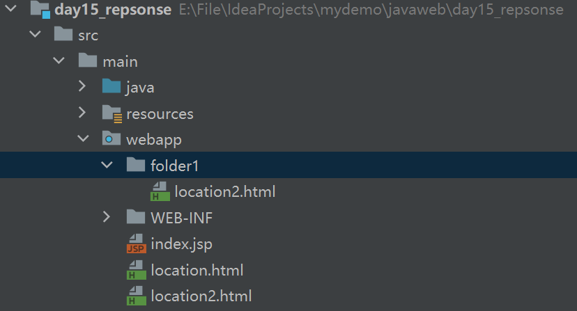
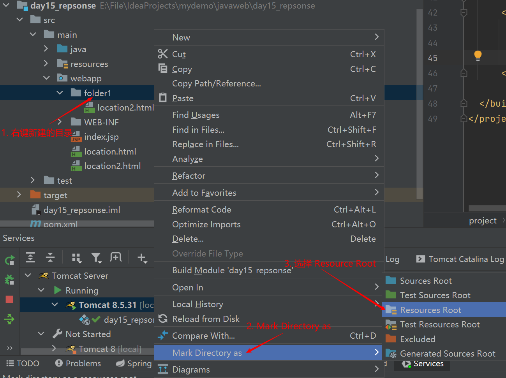

# Response

---

## 目录

1. HTTP协议：响应消息
2. Response对象
3. ServletContext对象

---

## 1. HTTP协议

### 1.1 请求消息

请求消息：客户端发送给服务器端的数据

* 数据格式：
  1. 请求行
  2. 请求头
  3. 请求空行
  4. 请求体

### 1.2 响应消息

响应消息：服务器端发送给客户端的数据

* 数据格式：

  1. **响应行**
     1. 组成：**协议/版本 响应状态码 状态码描述**
     2. 响应状态码：**服务器告诉客户端浏览器本次请求和响应的一个状态。**
        1. 状态码都是3位数字 
        2. 分类：
           1. **1**xx：服务器接收客户端消息，但没有接受完成，**等待**一段时间后，发送1xx多状态码
           2.  **2**xx：**成功**。代表：200
           3. **3**xx：**重定向**。代表：302(重定向)，304(访问缓存)
           4. **4**xx：客户端错误。
              * 代表：
                * 404（请求路径没有对应的资源） 
                * 405：请求方式没有对应的doXxx方法
              * **出现时要检查访问路径或代码**
           5. **5**xx：服务器端错误。代表：500(服务器内部出现异常)
              * **出现时要检查服务器端代码**
  2. **响应头**
     1. 格式：头名称： 值
     2. 常见的响应头：
        1. **Content-Type**：服务器告诉客户端本次响应体数据格式以及编码格式
        2. **Content-disposition**：服务器告诉客户端以什么格式打开响应体数据
           * 值：
             * in-line：默认值,在当前页面内打开
             * attachment;filename=xxx：以附件形式打开响应体。文件下载
  3. **响应空行**
  4. **响应体**：传输的数据

* 响应字符串格式

  ​	HTTP/1.1 200 OK

  ​	Content-Type: text/html;charset=UTF-8

  ​	Content-Length: 101

  ​	Date: Wed, 06 Jun 2018 07:08:42 GMT

~~~html
<html>
    <head>
        <title>$Title$</title>
    </head>
    <body>
        hello , response
    </body>
</html>
~~~

---

## 2. Response对象

### 2.1 功能

1. **设置响应行**
   1. 格式：HTTP/1.1 200 OK
   2. 设置状态码：**setStatus(int sc)** 
2. **设置响应头**：**setHeader(String name, String value)** 
3. **设置响应体**：
   * 使用步骤：
     1. 获取输出流
        * 字符输出流：**PrintWriter getWriter()**
        * 字节输出流：**ServletOutputStream getOutputStream()**
     2. 使用输出流，将数据输出到客户端浏览器

### 2.2 案例

1. **完成重定向**

   * 重定向：资源跳转的方式
   * 代码实现：

   ~~~java
   // 1. 设置状态码为302
   response.setStatus(302);
   // 2.设置响应头location
   response.setHeader("location","/day15/responseDemo2");
   
   // 简化的重定向方法
   response.sendRedirect("/day15/responseDemo2");
   ~~~

   * 重定向的特点：redirect
     1. 地址栏发生变化
     2. 重定向可以访问其他站点(服务器)的资源
     3. 重定向是两次请求。不能使用request对象来共享数据
   * 转发的特点：forward
     1. 转发地址栏路径不变
     2. 转发只能访问当前服务器下的资源
     3. 转发是一次请求，可以使用request对象来共享数据
   * forward 和  redirect 区别
   * 路径写法：
     1. 路径分类
        1. 相对路径：通过相对路径不可以确定唯一资源
           * 如：./index.html
           * 不以 **/** 开头，以 **.** 开头路径
           * 规则：找到当前资源和目标资源之间的相对位置关系
             * ./：当前目录
             * ../:后退一级目录
        2. **绝对路径**【推荐使用】：通过绝对路径可以**确定唯一资源**
          
           * 如：http://localhost/day15/responseDemo2		/day15/responseDemo2
           * 以/开头的路径
           * 规则：判断定义的路径是给谁用的？判断请求将来从哪儿发出
             * 给客户端浏览器使用：需要加虚拟目录(项目的访问路径)
               * **建议虚拟目录动态获取**：
               
                 ~~~java
                 String contextPath = request.getContextPath()
                 ~~~
               
               * 给客户端使用的路径：<a>标签 , <form>表单，重定向 ... 等等
             * 给服务器使用：不需要加虚拟目录
               * **转发路径**
               
                 ~~~java
                 // 转发资源
                 request.getRequestDispatcher("/responseDemo2").forward(request, response);
                 ~~~
               
                 

2. **服务器输出字符数据到浏览器**

   * 步骤：

     1. 获取字符输出流
     2. 输出数据

   * 注意：

     * 乱码问题：

       1. PrintWriter pw = response.getWriter();获取的流的默认编码是ISO-8859-1
       2. 设置该流的默认编码
       3. 告诉浏览器响应体使用的编码

       ~~~java
       // 简单的形式，设置编码 【在获取流之前设置】
       response.setContentType("text/html;charset=utf-8");
       ~~~

3. **服务器输出字节数据到浏览器**

   * 步骤
     1. 获取字节输出流
     2. 输出数据

4. 验证码

   1. 本质：图片
   2. 目的：防止恶意表单注册

---

## 3. ServletContext对象

### 3.1 概念

* 概念：代表整个web应用，可以和程序的容器(服务器)来通信

### 3.2 获取

1. 通过 request 对象获取

   ​	**request.getServletContext();**

2. 通过 HttpServlet 获取

   ​	**this.getServletContext();**

### 3.3 功能

1. 获取MIME类型：

   * MIME类型：在互联网通信过程中定义的一种文件数据类型
     * 格式： 大类型/小类型   text/html		image/jpeg
   * 获取：String getMimeType(String file)  

   > **MIME(Multipurpose Internet Mail Extensions)**多用途互联网邮件扩展类型。

2. ServletContext对象是一个**域对象**：具有**共享数据**的功能

   1. setAttribute(String name,Object value)
   2. getAttribute(String name)
   3. removeAttribute(String name)

   * ServletContext 对象**范围**：==**所有用户所有请求的数据**==，共享所有用户数据。

3. 获取文件的真实(服务器)路径

   1. 方法：**String getRealPath(String path)**  

   ~~~java
   String b = context.getRealPath("/b.txt");	// web目录下资源访问
   System.out.println(b);
   
   String c = context.getRealPath("/WEB-INF/c.txt");	// WEB-INF目录下的资源访问
   System.out.println(c);
   
   String a = context.getRealPath("/WEB-INF/classes/a.txt");	// src目录下的资源访问
   System.out.println(a);
   ~~~

---

## 案例

* 文件下载需求：
  1. 页面显示超链接
  2. 点击超链接后弹出下载提示框
  3. 完成图片文件下载
* 分析：
  1. 超链接指向的资源如果能够被浏览器解析，则在浏览器中展示，如果不能解析，则弹出下载提示框。不满足需求
  2. 任何资源都必须弹出下载提示框
  3. 使用响应头设置资源的打开方式：
     * content-disposition:attachment;filename=xxx
* 步骤：
  1. 定义页面，编辑超链接href属性，指向Servlet，传递资源名称filename
  2. 定义Servlet
     1. 获取文件名称
     2. 使用字节输入流加载文件进内存
     3. 指定response的响应头： content-disposition:attachment;filename=xxx
     4. 将数据写出到response输出流
* 问题：
  * 中文文件问题
    * 解决思路：
      1. 获取客户端使用的浏览器版本信息
      2. 根据不同的版本信息，设置filename的编码方式不同

---

## 遇到的问题及解决办法

### 1. 关于无法访问 webapp 子目录下 html 文件的解决办法

* 文件目录结构如图所示

  

  在webapp下新建 /folder/location2.html，但在浏览器中无法直接访问。

* **解决办法**

  * 右键 webapp 下自己新建的子目录 --> Mark Directory as --> Resource Root

    

  * 标记为 Resource Root 后可以正常访问

  * 附：[解决办法参考链接](https://blog.csdn.net/weixin_42220532/article/details/104459421)
