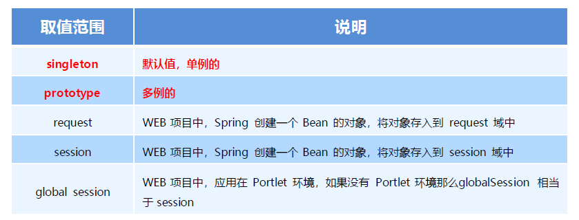

# Spring-IoC-DI

## 1. Spring简介

### 1.1 Spring是什么

Spring是分层的Java SE/EE应用full-stack 轻量级开源框架，以**IoC**（Inverse Of Control：反转控制）和**AOP**（Aspect Oriented Programming：面向切面编程）为内核。

提供了展现层 SpringMVC和持久层 Spring JDBCTemplate以及业务层事务管理等众多的企业级应用技术，还能整合开源世界众多著名的第三方框架和类库，逐渐成为使用最多的Java EE 企业应用开源框架。

> **full-stack**	
>
> * 全栈，指的是Spring在Web层、业务层、DAO层都具有解决方案。
>   * Web层：Spring MVC
>   * DAO层：JDBC模板、Spring Data 相关内容
>   * 等等...

> **IoC**	反转控制，简而言之——反转Bean的控制权。

  

### 1.2 Spring发展历程

1997 年，IBM提出了EJB 的思想
1998 年，SUN制定开发标准规范EJB1.0
1999 年，EJB1.1 发布
2001 年，EJB2.0 发布
2003 年，EJB2.1 发布
2006 年，EJB3.0 发布

Rod Johnson （Spring 之父）
Expert One-to-One J2EE Design and Development(2002)
阐述了J2EE 使用EJB 开发设计的优点及解决方案
Expert One-to-One J2EE Development without EJB(2004)
阐述了J2EE 开发不使用EJB的解决方式（Spring 雏形）
2017 年9 月份发布了Spring 的最新版本Spring5.0 通用版（GA）

  

### 1.3 Spring的优势

1. 方便解耦，简化开发
   * 通过Spring 提供的IoC容器，可以将对象间的依赖关系交由Spring 进行控制，避免硬编码所造成的过度耦合。
     * 比如DAO层的对象创建交给Spring框架完成，业务层需要时直接从IoC容器中获取。
   * 用户也不必再为单例模式类、属性文件解析等这些很底层的需求编写代码，可以更专注于上层的应用。
2. AOP 编程的支持
   * 通过Spring的AOP 功能，方便进行面向切面编程，许多不容易用传统OOP 实现的功能可以通过AOP 轻松实现。
3. 声明式事务的支持
   * 可以将我们从单调烦闷的事务管理代码中解脱出来，通过声明式方式灵活的进行事务管理，提高开发效率和质量。
4. 方便程序的测试
   * 可以用非容器依赖的编程方式进行几乎所有的测试工作，测试不再是昂贵的操作，而是随手可做的事情。
   * Spring可集成JUnit，让测试更方便
5. 方便集成各种优秀框架
   * Spring对各种优秀框架（Struts、Hibernate、Hessian、Quartz等）的支持。
6. 降低JavaEEAPI 的使用难度
   * Spring对JavaEEAPI（如JDBC、JavaMail、远程调用等）进行了薄薄的封装层，使这些API 的使用难度大为降低。
7. Java 源码是经典学习范例
   * Spring的源代码设计精妙、结构清晰、匠心独用，处处体现着大师对Java 设计模式灵活运用以及对Java技术的高深
     造诣。它的源代码无意是Java 技术的最佳实践的范例。

  

### 1.4 Spring的体系结构

* Test层：一切皆可测试
* Core Container：核心容器
  * Beans容器：主要用于产生对象
  * Core：核心
  * Context：上下文
  * SpEL：（Spring Express Language）
* AOP：
* Aspect：切面
* Data Access：数据访问层（DAO层）
* Web：（Web层）

    

## 2. Spring快速入门

### 2.1 Spring程序开发步骤

   

1. 导入Spring 开发的基本包坐标
2. 编写Dao 接口和实现类
3. 创建Spring 核心配置文件
4. 在Spring 配置文件中配置UserDaoImpl
5. 使用Spring 的API 获得Bean 实例

  

### 2.2 导入Spring开发的基本包坐标

pom.xml添加spring依赖

~~~xml
<!--spring-->
<dependency>
    <groupId>org.springframework</groupId>
    <artifactId>spring-context</artifactId>
    <version>5.0.5.RELEASE</version>
</dependency>
~~~

  

### 2.3 编写Dao接口和实现类

Dao接口：`com.anthonycj.dao.UserDao`

~~~java
package com.anthonycj.dao;

public interface UserDao {
    public void save();
}
~~~

实现类：`com.anthonycj.dao.impl.UserDaoImpl`

~~~java
package com.anthonycj.dao.impl;

import com.anthonycj.dao.UserDao;

public class UserDaoImpl implements UserDao {
    @Override
    public void save() {
        System.out.println("save running...");
    }
}
~~~

  

### 2.4 创建Spring核心配置文件

在`src.main.resources`目录下创建Spring核心配置文件，一般命名为`applicationContext.xml`

~~~xml
<?xml version="1.0" encoding="UTF-8"?>
<beans xmlns="http://www.springframework.org/schema/beans"
       xmlns:xsi="http://www.w3.org/2001/XMLSchema-instance"
       xsi:schemaLocation="http://www.springframework.org/schema/beans http://www.springframework.org/schema/beans/spring-beans.xsd">

</beans>
~~~

  

### 2.5 在Spring配置文件中配置UserDaoImpl

为DAO层实现类配置id

~~~xml
<?xml version="1.0" encoding="UTF-8"?>
<beans xmlns="http://www.springframework.org/schema/beans"
       xmlns:xsi="http://www.w3.org/2001/XMLSchema-instance"
       xsi:schemaLocation="http://www.springframework.org/schema/beans http://www.springframework.org/schema/beans/spring-beans.xsd">

    <bean id="userDao" class="com.anthonycj.dao.impl.UserDaoImpl"></bean>

</beans>
~~~

  

### 2.6 使用Spring的API获得Bean实例

~~~java
ApplicationContext app = new ClassPathXmlApplicationContext("applicationContext.xml");
UserDao userDao = (UserDao) app.getBean("userDao");
~~~

  

### 

  

## 3. Spring配置文件

**Spring的重点配置**

* `<bean>`标签
  * `id`属性:在容器中Bean实例的唯一标识，不允许重复
  * `class`属性:要实例化的Bean的全限定名
  * `scope`属性:Bean的作用范围，常用是`singleton`(默认)和`prototype`
  * `<property>`标签：属性注入
    * `name`属性：要注入的属性所对应的属性名称
    * `value`属性：注入的普通属性值
    * `ref`属性：注入的对象引用值
    * `<list>`标签
      * `<value>aaa</value>`
      * `<ref bean="u1"/>`
    * `<map>`标签
      * `<entry key="u1" value-ref="user1"></entry>`
    * `<properties>`标签
  * `<constructor-arg>`标签：一个标签对应构造方法的一个参数
    * `name`属性：构造参数名称
    * `ref`属性：引用容器中bean的id
* `<import>`标签:导入其他的Spring的分文件
  * `<import resource="applicationContext-user.xml"/>`

### 3.1 Bean标签基本配置

用于配置对象交由Spring来创建。

默认情况下它调用的是类中的无参构造函数，如果没有无参构造函数则不能创建成功。

基本属性：

* id：Bean实例在Spring容器中的唯一标识 
* class：Bean的全限定名称

  

### 3.2 Bean标签范围配置

scope：指对象的作用范围，取值如下：

1. **当scope的取值为singleton时**

   Bean的实例化个数：1个

   Bean的实例化时机：当Spring核心配置文件被加载时，实例化配置的Bean实例

   Bean的生命周期：

   * 对象创建：当应用加载，创建容器时，对象被创建
   * 对象运行：只要容器在，对象一直存活
   * 对象销毁：当应用卸载，销毁容器时，对象被销毁

2. **当scope的取值为prototype时**

   Bean的实例化个数：多个

   Bean的实例化时机：当调用getBean()方法时实例化Bean

   * 对象创建：当使用对象时，创建新的对象实例
   * 对象运行：只要对象在使用中，就一直活着
   * 对象销毁：当对象长时间不用时，被Java 的垃圾回收器回收了

   

  

### 3.3 Bean生命周期配置

* **init-method**：指定类中的初始化方法名称
* **destroy-method**：指定类中销毁方法名称

~~~java
<bean id="userDao" class="com.anthonycj.dao.impl.UserDaoImpl" scope="singleton" init-method="init" destroy-method="destroy"></bean>
~~~

  

### 3.4 Bean实例化三种方式

* 无参构造方法实例化
* 工厂静态方法实例化
* 工厂实例方法实例化

 

1. **使用无参构造方法实例化**
   它会根据默认无参构造方法来创建类对象，如果bean中没有默认无参构造函数，将会创建失败

~~~xml
<bean id="userDao" class="com.itheima.dao.impl.UserDaoImpl"/>
~~~

2. **工厂静态方法实例化**
   工厂的静态方法返回Bean实例

~~~java
public class StaticFactoryBean {
    public static UserDao createUserDao(){
        return new UserDaoImpl();
    }
}
~~~

~~~xml
<bean id="userDao" class="com.itheima.factory.StaticFactoryBean"
factory-method="createUserDao" />
~~~

3. **工厂实例方法实例化**
   工厂的非静态方法返回Bean实例

~~~java
public class DynamicFactoryBean {
    public UserDao createUserDao() {
        return new UserDaoImpl();
    }
}
~~~

~~~xml
<bean id="factoryBean" class="com.itheima.factory.DynamicFactoryBean"/>
<bean id="userDao" factory-bean="factoryBean" factory-method="createUserDao"/>
~~~

  

### 3.5 Bean的依赖注入入门

1. 创建UserService，UserService 内部在调用UserDao的save() 方法

~~~java

~~~

2. 将UserServiceImpl 的创建权交给Spring

~~~xml
<bean id="userService" class="com.itheima.service.impl.UserServiceImpl"/>
~~~

3. 从Spring 容器中获得UserService 进行操作

~~~java
ApplicationContextapplicationContext= new ClassPathXmlApplicationContext("applicationContext.xml");
UserService userService = (UserService) applicationContext.getBean("userService");
userService.save();
~~~

  

### 3.6 Bean的依赖注入分析

目前UserService实例和UserDao实例都存在与Spring容器中，当前的做法是在容器外部获得UserService实例和UserDao实例，然后在程序中进行结合。

因为UserService和UserDao都在Spring容器中，而最终程序直接使用的是UserService，所以可以在Spring容器中，将UserDao设置到UserService内部。

  

### 3.7 Bean的依赖注入概念
依赖注入（**Dependency Injection**）：它是Spring 框架核心IOC 的具体实现。

在编写程序时，通过控制反转，把对象的创建交给了Spring，但是代码中不可能出现没有依赖的情况。
IOC 解耦只是降低他们的依赖关系，但不会消除。例如：业务层仍会调用持久层的方法。

那这种业务层和持久层的依赖关系，在使用Spring 之后，就让Spring 来维护了。
简单的说，就是坐等框架把持久层对象传入业务层，而不用我们自己去获取。

  

### 3.8 Bean的依赖注入方式

怎么将UserDao怎样注入到UserService内部呢？

* **构造方法**
* **set方法**

 

1. set方法注入

在UserServiceImpl中添加setUserDao方法

~~~java
/*通过set方法在容器中调用，注入DAO层对象*/
public void setUserDao(UserDao userDao) {
    this.userDao = userDao;
}
~~~

配置Spring容器调用set方法进行注入

~~~xml
<bean id="userDao" class="com.itheima.dao.impl.UserDaoImpl"/>
<bean id="userService" class="com.itheima.service.impl.UserServiceImpl"> 
    <property name="userDao" ref="userDao"/>
</bean>
~~~

P命名空间注入本质也是set方法注入，但比起上述的set方法注入更加方便，可以省掉配置文件中的`<property>`标签 ，使用方法如下：
首先，需要引入P命名空间：

~~~xml
xmlns:p="http://www.springframework.org/schema/p"
~~~

其次，需要修改注入方式

~~~xml
<bean id="userService" class="com.itheima.service.impl.UserServiceImpl" p:userDao-
ref="userDao"/>
~~~

2. 构造方法注入

创建有参构造

~~~java
public UserServiceImpl(UserDao userDao) {
    this.userDao = userDao;
}
~~~

配置Spring容器调用有参构造时进行注入

~~~xml
<bean id="userDao" class="com.itheima.dao.impl.UserDaoImpl"/>
<bean id="userService" class="com.anthonycj.service.impl.UserServiceImpl">
    <constructor-arg name="userDao" ref="userDao"></constructor-arg>
</bean>
~~~

  

### 3.9 Bean的依赖注入的数据类型

上面的操作，都是注入的引用Bean，处了对象的引用可以注入，普通数据类型，集合等都可以在容器中进行注入。

注入数据的三种数据类型

* 普通数据类型
* 引用数据类型
* 集合数据类型

其中引用数据类型，此处就不再赘述了，之前的操作都是对UserDao对象的引用进行注入的，下面将以set方法注入为例，演示普通数据类型和集合数据类型的注入。

（1）普通数据类型的注入

~~~java
public class UserDaoImpl implements UserDao {

    private String username;
    private int age;

    public void setUsername(String username) {
        this.username = username;
    }

    public void setAge(int age) {
        this.age = age;
    }
}
~~~

~~~xml
<bean id="userDao" class="com.itheima.dao.impl.UserDaoImpl">
    <property name="company" value="传智播客"></property>
    <property name="age" value="15"></property>
</bean>
~~~

（2）集合数据类型（List<String>）的注入

~~~java
private List<String> stringList;

public void setStringList(List<String> stringList) {
    this.stringList = stringList;
}
~~~

~~~xml
<bean id="userDao" class="com.anthonycj.dao.impl.UserDaoImpl">
    <property name="stringList">
        <list>
            <value>aaa</value>
            <value>bbb</value>
            <value>ccc</value>
        </list>
    </property>
</bean>
~~~

（3）集合数据类型（List<User>）的注入

~~~java
private List<User> stringList;

public void setStringList(List<User> stringList) {
    this.stringList = stringList;
}
~~~

~~~xml
<bean id="u1" class="com.anthonycj.domain.User"/>
<bean id="u2" class="com.anthonycj.domain.User"/>
<bean id="userDao" class="com.anthonycj.dao.impl.UserDaoImpl">
    <property name="userList">
        <list>
            <bean class="com.anthonycj.domain.User"/>
            <bean class="com.anthonycj.domain.User"/>
            <ref bean="u1"/>
            <ref bean="u2"/>
        </list>
    </property>
</bean>
~~~

（4）集合数据类型（Map<String,User>）的注入

~~~xml
<bean id="userDao" class="com.anthonycj.dao.impl.UserDaoImpl">
	<!--key随便定义，是一个字符串即可；value如果为对象，则需引用其id-->
    <property name="userMap">
        <map>
            <entry key="u1" value-ref="user1"></entry>
            <entry key="u2" value-ref="user2"></entry>
        </map>
    </property>
</bean>

<bean id="user1" class="com.anthonycj.domain.User">
    <property name="name" value="Tom"/>
    <property name="address" value="KingStreet"/>
</bean>

<bean id="user2" class="com.anthonycj.domain.User">
    <property name="name" value="Lucy"/>
    <property name="address" value="WashingTon"/>
</bean>
~~~

（5）集合数据类型（Properties）的注入

~~~xml
<bean id="userDao" class="com.anthonycj.dao.impl.UserDaoImpl">
    <property name="properties">
        <props>
            <prop key="p1">property1</prop>
            <prop key="p2">property2</prop>
            <prop key="p3">property3</prop>
        </props>
    </property>
</bean>
~~~

  

### 3.10 引入其他配置文件（分模块开发）

实际开发中，Spring的配置内容非常多，这就导致Spring配置很繁杂且体积很大，所以，可以将部分配置拆解到其他配置文件中，而在Spring主配置文件通过import标签进行加载

~~~xml
<import resource="applicationContext-xxx.xml"/>
<!--引用其它配置文件-->
<import resource="applicationContext-user.xml"/>
<import resource="applicationContext-brand.xml"/>
~~~

    

## 4. Spring相关API

### 4.1 ApplicationContext的继承体系

**applicationContext**：接口类型，代表应用上下文，可以通过其实例获得Spring 容器中的Bean 对象

  

### 4.2 ApplicationContext的实现类

1. `ClassPathXmlApplicationContext`
   * 从类的根路径下加载配置文件【推荐使用这种方法】
2. `FileSystemXmlApplicationContext`
   * 它是从磁盘路径上加载配置文件，配置文件可以在磁盘的任意位置
3. `AnnotationConfigApplicationContext`
   * 当使用注解配置容器对象时，需要使用此类来创建spring 容器。它用来读取注解

  

### 4.3 getBean()方法使用

~~~java
public Object getBean(String name) throws BeansException {
    assertBeanFactoryActive();
    return getBeanFactory().getBean(name);
}

public <T> T getBean(Class<T> requiredType) throws BeansException {
    assertBeanFactoryActive();
    return getBeanFactory().getBean(requiredType);
}
~~~

* 当参数的数据类型是字符串时，表示根据Bean的id从容器中获得Bean实例，返回是Object，需要强转。
* 当参数的数据类型是Class类型时，表示根据类型从容器中匹配Bean实例，当容器中相同类型的Bean有多个时，则此方法会报错。

  

### 4.4 知识要点

Spring的重点API

~~~java
ApplicationContext app = newClasspathXmlApplicationContext("xml文件");	// 通过类路径下的xml文件创建应用上下文对象、
// 通过应用上下文对象从容器中获取对象
app.getBean("id");
app.getBean(Class);
~~~

  

