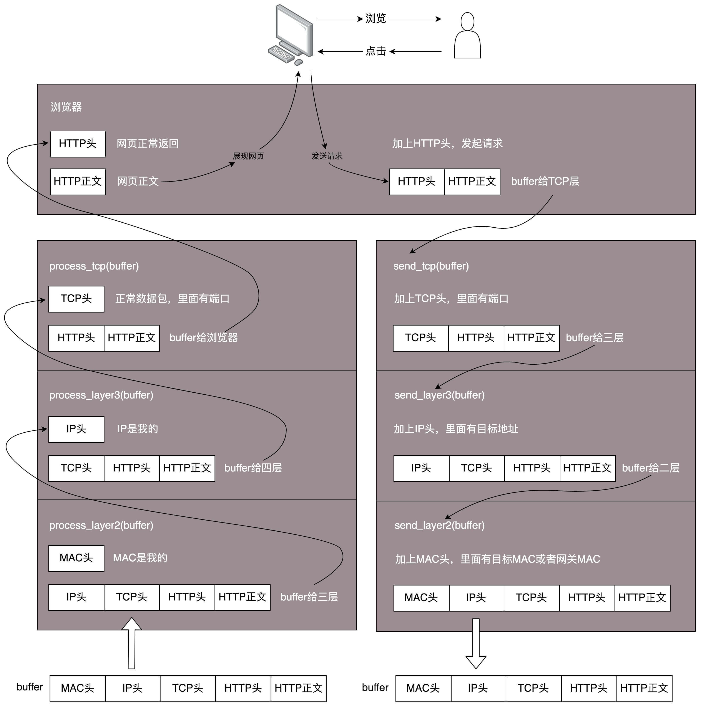

网络分层的真实含义。

<!-- more -->

## 1. 四个问题

 

* **问题一、TCP进行三次握手的时候，IP层和MAC层对应有哪些操作？**

学习第三层【网络层】时会涉及，IP协议包含目标地址和源地址。第三层还包括路由协议。路由类似中转站，从原始地址A到目标地址D，中间经过两个中转站 A->B->C->D，都是通过路由转发的。

* **问题二、A 知道自己的下一个中转站是 B，那从 A 发出来的包，应该把 B 的 IP 地址放在哪里？如果目标地址放在 IP 协议中，那么包到了中转站，怎么知道最终的目的地址是 D ？**

> **二层设备【交换机】、三层设备【交换机】**
>
> 从ISO/OSI的分层结构上说，交换机可分为二层交换机、三层交换机等。二层交换机指的就是传统的工作在OSI参考模型的第二层--数据链路层上交换机，主要功能包括物理编址、错误校验、帧序列以及流控。 一个纯第二层的解决方案，是最便宜的方案，但它在划分子网和广播限制等方面提供的控制最少。传统的路由器与外部的交换机一起使用也能解决这个问题，但现在路由器的处理速度已跟不上带宽要求。因此三层交换机、Web交换机等应运而生。
>
> 三层交换机是一个具有三层交换功能的设备，即带有第三层路由功能的第二层交换机，但它是二者的有机结合，并不是简单地把路由器设备的硬件及软件叠加在局域网交换机上。

* **问题三、发送一个 HTTP 的包，是在第七层工作的，那是不是不需要经过二层设备？或者即便经过了，二层设备也不处理呢？或者换一种问法，二层设备处理的包里，有没有 HTTP 层的内容？**

* **问题四、从个人PC，通过 SSH 登录到公有云主机里面，都需要经历哪些过程？或者说用户打开一个电商网站，都需要经历哪些过程？**

学习网络的过程中，要尝试了解一个操作背后的完整流程，以及各步骤中的实现细节。能详略自如地回答类似上述问题，是我们学习的目标。

   

## 2. 网络为什么要分层

* 答：因为复杂的程序都要分层。

可以将网络包想象成一段 Buffer，或一段内存，是有格式的。一个处理网络包的程序【可以跑在电脑、服务器、交换机上，也可以跑在路由器上】，有很多的网口，从某个口拿进一个网络包来，用自己的程序处理一下，再从另一个网口发送出去。

网络包的格式很复杂，这个程序也很复杂。**复杂的程序都要分层，这是程序设计的要求。**比如，复杂的电商还会分数据库层、缓存层、Compose 层、Controller 层和接入层，每一层专注做本层的事情。

   

## 3. 程序如何工作

一个简单的程序工作流程如下图所示。

当一个网络包从一个网口经过时，首先要查看并决定是否将其接收并处理。

> 有的网口配置了混杂模式，所有网络包都会接收进入程序。

### 3.1 查看MAC头确认是否接收网络包

将网络包载入后，要交给一段程序处理——于是调用`process_layer2(buffer)`【这并不是一个真实的函数，仅用于表示该过程】。该函数从 `Buffer` 中摘掉第二层【链路层】的头，看一看应该根据头内部的内容做什么操作。

如果这个包的MAC地址与自己的相符，说明该网络包就是发送给自己的，于是需要调用`process_layer2(buffer)`。这个时候【即在嗲用process_layer2(buffer)之前】， `Buffer` 内往往就没有第二层的头了，因为已在上一个函数的处理过程中被拿掉，或者将开始的偏移量移动了一下。在这个函数里面，将摘掉三层的头，查看该包时发送给自己的，还是希望自己转发出去的。

### 3.2 查看IP头决定继续接收还是转发

如果IP地址不是自己的，就应该转发出去；如果IP地址是自己的，就说明自己的IP为目标IP，此时拿掉三层的头，进行下一层的处理。

### 3.3 查看TCP头确认TCP/UDP

假设这个地址是 TCP 的，则会调用 `process_tcp(buffer)`。这时候，如果 Buffer 里面没有第三层【TCP层】的头，就需要查看四层【HTTP】的头，看这是一个发起`POST`，还是一个应答`REQUEST`，又或者是一个正常的数据包，然后分别由不同的逻辑进行处理。如果是发起或者应答，接下来可能要发送一个回复包；如果是一个正常的数据包，就需要继续交给上层处理。

### 3.4 处理数据

查看第四层【HTTP】的头后，应该交给应用去处理。交给哪个应用由第四层的头包含的端口号决定，不同的应用监听不同的端口号。如果发现浏览器应用在监听这个端口，那么发给浏览器即可。至于浏览器怎么处理，与接收程序无关。

浏览器解析 HTML，渲染页面。用户浏览页面，点击鼠标。点击鼠标的动作被浏览器捕获。浏览器知道，又要发起另一个 HTTP 请求了，于是使用端口号，将请求发给了处理程序。

### 3.5 将本地发出的请求打包

调用 `send_tcp(buffer)`。`Buffer` 里面就是 HTTP 请求的内容。这个函数里面加一个 TCP 的头，记录下源端口号。浏览器会给你目的端口号，一般为80端口。

然后调用 `send_layer3(buffer)`。`Buffer` 里面已经有了 HTTP 的头和内容，以及 TCP 的头。在这个函数里面加一个 IP 的头，记录下源 IP 地址和目标 IP 地址。

然后调用 `send_layer2(buffer)`。`Buffer` 里面已经有了 HTTP 的头和内容、TCP 的头，以及 IP 的头。这个函数里面要加一下 MAC 的头，记录下源 MAC 地址，得到的就是本机器的 MAC 地址和目标的 MAC 地址。不过，这个要看当前是否知道，知道就直接加上；如果不知道，要通过一定的协议处理过程，找到 MAC 地址。目标地址一定会填写，不会留空。

此时，只要 Buffer 里面的内容完整，就可以从网口发出，作为一个程序的任务自此告一段落。

   

## 4. 层与层之间的关系

层与层之间有一个重要的关系：即**封装的关系**。

 **TCP 在三次握手的时候，IP 层和 MAC 层在做什么？**答案是： TCP 发送每一个消息，都会带着 IP 层和 MAC 层。TCP 每发送一个消息，IP 层和 MAC 层的所有机制都要运行一遍。在 TCP 三次握手的同时，IP 层和 MAC 层也在同时做相应的工作。

> **要牢记**	只要是在网络上跑的包，都是完整的。可以有下层没上层，绝对不可能有上层没下层。

**对 TCP 协议来说，三次握手也好，重试也好，只要想发出去包，就要有 IP 层和 MAC 层，不然是发不出去的。**

如果一个 HTTP 协议的包跑在网络上，无论这个包经过哪些设备，它一定是完整的。

所谓的二层设备、三层设备，都是这些设备上跑的程序不同而已。一个 HTTP 协议的包经过一个二层设备，二层设备收进去的是整个网络包。网络包中 HTTP、TCP、 IP、 MAC 都有。

* **二层设备**会只将 MAC 头取下，查看后决定到底是丢弃、转发，还是自己保留。
* **三层设备**将 MAC 头取下之后，会继续将 IP 头取下，查看后决定是丢弃、转发，还是自己保留。

   

## 5. 小结

网络协议的工作模式有两个规律：

* 处理网络包的程序：拿到网络包，要根据规则逐层解析进行处理，根据规则逐层打包发送；
* 一个原则：只要是在网络上跑的包，都是完整的。可以有下层没上层，绝对不可能有上层没下层。

   

## 附：遗留问题

* 如何用恰当的例子类比网络分层
* 如何查看IP地址

> **类比网络分层**	通信协议就像没有天桥的双子楼，要从A座的24层到达B座24层就得先下楼梯再上楼梯，其他协议也是如此，比如4G

