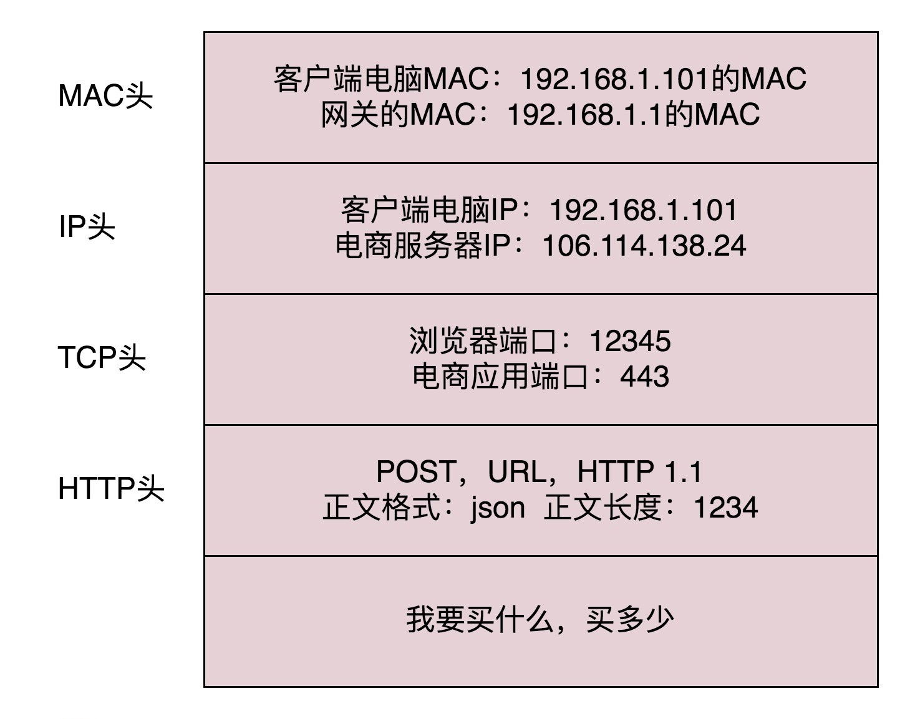
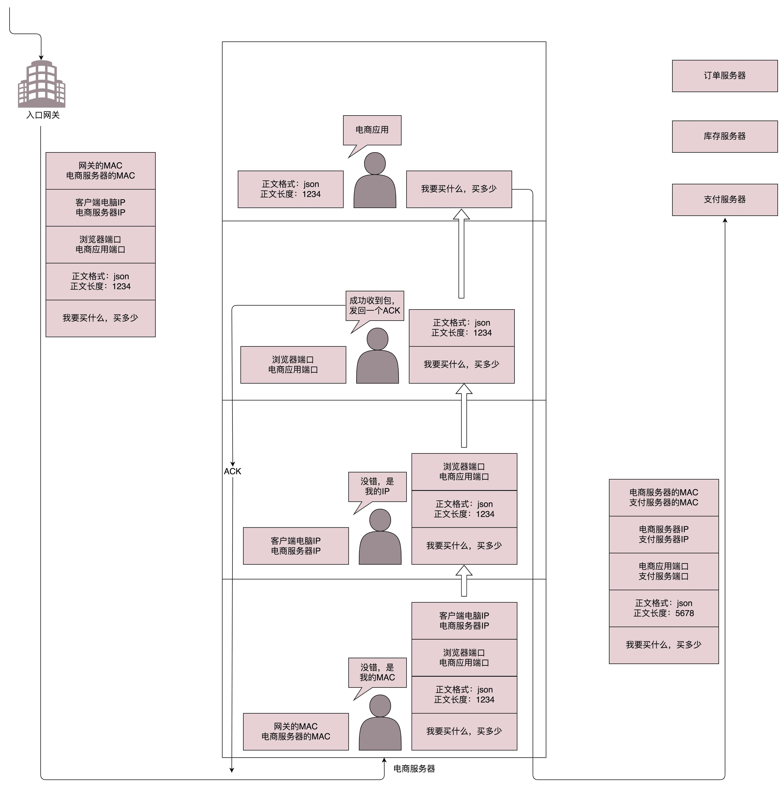

网络协议综述、网络协议的基本概念。

<!-- more -->

## 1. 协议三要素

* **语法**。一段内容要符合一定的规则和格式。例如，括号要成对，结束要使用分号等。
* **语义**。一段内容要代表某种意义。例如数字减去数字是有意义的，数字减去文本一般来说就没有意义。
* **顺序**。即先干什么，后干什么。例如，可以先加上某个数值，然后再减去某个数值。

网络协议，即计算机通过网络进行通信的规约。只有通过网络协议，才能使一大片机器互相协作、共同完成一件事。

网络协议举例：

~~~html
HTTP/1.1 200 OK	
Date: Tue, 27 Mar 2018 16:50:26 GMT
Content-Type: text/html;charset=UTF-8
Content-Language: zh-CN

<!DOCTYPE html>
<html>
<head>
<base href="https://pages.kaola.com/" />
<meta charset="utf-8"/> <title>网易考拉3周年主会场</title>
~~~

**分析**

这是一段HTTP协议，先是状态，然后是首部，然后是内容。

   

## 2. 常用的网络协议

以一个例子串起相关概念。

  

### 2.1 应用层：DNS、HTTP、HTTPS

 

#### 2.1.1 解析域名：DNS

在浏览器输入某个`URL`，如 `https://www.kaola.com`，这是一个 `URL`。浏览器只知道名字是“www.kaola.com”，但是不知道具体的地点，所以不知道应该如何访问。于是，它打开地址簿去查找。可以使用一般的地址簿协议 **DNS** 去查找，还可以使用另一种更加精准的地址簿查找协议 `HTTPDNS`。

> **URL**	**统一资源定位符**（**U**niform **R**esource **L**ocator），或称统一资源定位器、定位地址、URL地址[[1\]](https://zh.wikipedia.org/wiki/统一资源定位符#cite_note-1)）俗称网页地址，简称**网址**，是[因特网](https://zh.wikipedia.org/wiki/因特网)上标准的资源的地址（Address），如同在网络上的门牌。
>
> 统一资源定位符的标准格式如下：
> `[协议类型]://[服务器地址]:[端口号]/[资源层级UNIX文件路径][文件名]?[查询]#[片段ID]`
> 其中[访问凭证信息]、[端口号]、[查询]、[片段ID]都属于选填项。

> **DNS**	**域名系统**（**D**omain **N**ame **S**ystem）是互联网的一项服务。它作为将[域名](https://zh.wikipedia.org/wiki/域名)和[IP地址](https://zh.wikipedia.org/wiki/IP地址)相互[映射](https://zh.wikipedia.org/wiki/映射)的一个[分布式数据库](https://zh.wikipedia.org/wiki/分布式数据库)，能够使人更方便地访问[互联网](https://zh.wikipedia.org/wiki/互联网)。DNS使用[TCP](https://zh.wikipedia.org/wiki/传输控制协议)和[UDP](https://zh.wikipedia.org/wiki/用户数据报协议)[端口](https://zh.wikipedia.org/wiki/TCP/UDP端口列表)53[[1\]](https://zh.wikipedia.org/wiki/域名系统#cite_note-1)。当前，对于每一级域名长度的限制是63个字符，域名总长度则不能超过253个字符。

 

经过查找，最终都会得到这个地址：`106.114.138.24`。这个是 `IP` 地址，是互联网世界的“门牌号”。

> **IP**	**IP地址**（**I**nternet **P**rotocol Address），又译为**网际协议地址**、**互联网协议地址**。是[网际协议](https://zh.wikipedia.org/wiki/网际协议)中用于标识**发送**或**接收[数据报](https://zh.wikipedia.org/wiki/数据报)**的设备的一串数字。
> IP地址的两个主要功能：
>
> * **标识主机：**更具体地说，标识其网络接口，并且提供主机在网络中的位置；
> * **网络寻址：**网络协议的一个重要机制就是网络寻址（internet address）。该功能的目的是将 [数据报](https://zh.wikipedia.org/wiki/数据报) 从一个网络模块送到目的地。在发送的整个过程，IP地址（address）充当着目的地的位置，[域名](https://zh.wikipedia.org/wiki/域名)（name）意味着我们要找什么，[路由](https://zh.wikipedia.org/wiki/路由)（route）代表着如何到达目的地的这个过程。[[3\]](https://zh.wikipedia.org/wiki/IP地址#cite_note-3) 每个[IP数据包](https://zh.wikipedia.org/wiki/网际协议)的标头包含了发送主机的IP地址和目的主机的IP地址。

 

#### 2.1.2 打包请求：HTTP、HTTPS

知道了目标地址，浏览器就开始打包它的请求。对于普通的浏览请求，往往会使用 **HTTP 协议**；但是对于购物的请求，往往需要进行加密传输，因而会使用 **HTTPS 协议**。无论是什么协议，里面都会写明“你要买什么和买多少”。

  

### 2.2 传输层：TCP、UDP

 

#### 2.2.1 封装端口信息：TCP、UDP

DNS、HTTP、HTTPS 所在的层称为**应用层**。经过应用层封装后，浏览器会将应用层的包交给下一层去完成【**该过程通过 socket 编程实现**】。下一层是**传输层**。传输层有两种协议，一种是无连接的协议 **UDP**，一种是面向连接的协议 **TCP**。对于支付来讲，往往使用 TCP 协议。

> **面向连接**	TCP 会保证这个包能够到达目的地。如果不能到达，就会重新发送，直至到达。

TCP 协议里面有两个端口，一个是浏览器监听的端口，一个是电商的服务器监听的端口。**操作系统往往通过端口来判断，它得到的包应该给哪个进程。**

  

### 2.3 网络层：IP

 

#### 2.3.1 封装源、目的IP地址：IP协议

传输层封装完毕后，浏览器会将包交给操作系统的**网络层**。网络层的协议是 **IP 协议**。在 IP 协议里面会有

* 源 IP 地址——浏览器所在机器的 IP 地址
* 目标 IP 地址——电商网站所在服务器的 IP 地址。

  

### 2.4 链路层：ARP

操作系统拿到目标IP地址后， 开始尝试根据IP地址找到目标机。操作系统可以根据目标IP判断目标机是本地还是在外地。离开本机就需要经过**网关**。操作系统启动的时候，就会被 DHCP协议 配置IP地址，以及默认的网关的IP地址 `192.168.1.1` 。

操作系统通过 **ARP协议** 将IP地址发给网关，网关的本地地址就是 MAC 地址。

于是操作系统将 IP 包交给下一层，即 **MAC 层**。网卡再将包发出去。该包已包含 MAC 地址，因此它能够到达网关。

网关收到包之后，会根据自己的知识，判断数据包下一步如何走。网关往往是一个路由器，到某个 IP 地址应该怎么走，这个称为路由表。

> **路由表（routing table）**	或称**路由择域信息库**（RIB, Routing Information Base），是一个存储在[路由器](https://zh.wikipedia.org/wiki/路由器)或者联网计算机中的电子表格（文件）或[类数据库](https://zh.wikipedia.org/w/index.php?title=类数据库&action=edit&redlink=1)。路由表存储着指向特定网络地址的路径（在有些情况下，还记录有路径的[路由度量值](https://zh.wikipedia.org/w/index.php?title=路由度量值&action=edit&redlink=1)）。路由表中含有网络周边的[拓扑](https://zh.wikipedia.org/wiki/拓扑)信息。路由表创建的主要目标是为了实现[路由协议](https://zh.wikipedia.org/wiki/路由协议)和静态路由选择。
>
> 在现代路由器构造中，路由表不直接参与[数据包](https://zh.wikipedia.org/wiki/数据包)的传输，而是用于生成一个小型指向表，这个指向表仅仅包含由路由算法选择的数据包传输优先路径，这个表格通常为了优化硬件存储和查找而被压缩或提前编译。

 

每经过一个路由器，就需要拿出IP头来，里面写着源IP地址和目标IP地址。路由器会给出相应的指示。

* 去IP段1，走网口1，下一跳为路由器A
* 去IP段2，走网口2，下一跳为路由器B
* 去IP段3，走网口3，下一跳为路由器C
* ……

在数据包的传输途中，会经过多个路由器。相邻的路由器之间会经常沟通。到哪里应该怎么走，这种沟通的协议称为**路由协议**，常用的有 **OSPF** 和 **BGP**。

路由器与路由器之间是一个局域网，**当网络包知道了下一步去哪个路由器，还是要使用局域网内部的 MAC 地址，通过下一个路由器的 MAC 地址，找到下一个路由器**，然后再问下一步的路怎么走，一直到走出最后一个路由器。

 

**最后一个路由器知道这个网络包要去的地方。于这个局域网请求目标 IP ，目标服务器就会回复一个 MAC 地址。**网络包通过网关后，通过这个 MAC 地址就能找到目标服务器。

  

### 2.5 到达目标服务器后的流程

 

#### 2.5.1 验证MAC头

目标服务器发现 MAC 地址对上了，取下 MAC 头来，发送给操作系统的网络层。

 

#### 2.5.2 验证IP头

发现 IP 也对上了，就取下 IP 头。IP 头里会写上一层封装的是 TCP 协议，然后将其交给传输层，即 **TCP 层**。

 

#### 2.5.3 TCP层校验数据包完整性

为防止丢包，在 TCP层 里，对于收到的每个包，都会有一个回复的包说明收到了。这个回复的包仅仅是 TCP 层的一个说明，即收到之后的回复。这个回复，会沿着原路径返回。

如果过一段时间还是没到，发送端的 TCP 层会重新发送这个包，重复上述流程，直到收到正常到达的回复。**这个重试并非客户浏览器重新将下单这个动作重新请求一次**。对于浏览器来讲，只发送了一次下单请求，TCP 层不断自行重试。除非 TCP 这一层出了问题，例如连接断开，才轮到浏览器的应用层重新发送下单请求。

当网络包平安到达 TCP 层之后，TCP 头中有目标端口号，通过这个端口号，可以找到电商网站的进程【假设为一个 Tomcat】正在监听这个端口号，然后将这个包发给电商网站。

 

#### 2.5.4 HTTP层获取、处理请求内容

电商网站的进程得到 HTTP 请求的内容，知道了要买东西，买多少。

> **业务分离**	电商网站的接受请求、支付、库存、订单处理模块是可以运行在不同服务器上的。往往一个电商网站最初接待请求的这个 Tomcat 只负责统筹处理这个请求，而不是涉及其他业务。例如，这个接待员要通知专门管理订单的进程，登记要买某个商品，买多少；要通知管理库存的进程，库存要减少多少；要告诉支付的进程，应该付多少钱，等等。

将信息告知其他相关进程【支付、库存等】的方法是通过 **RPC调用**（远程过程调用）来实现的。

> **远程过程调用**	远程过程调用就是当告诉管理订单进程的时候，接待员不用关心中间的网络互连问题，会由 RPC 框架统一处理。RPC 框架有很多种，有基于 HTTP 协议放在 HTTP 的报文中，有直接封装在 TCP 报文中。

 

当接待员发现相应的部门都处理完毕，就回复一个 HTTPS 的包，告知下单成功。这个 HTTPS 的包，会像来的时候一样，经过网关和多个路由器的中转到达你的个人PC，最终进入浏览器，显示支付成功。

   

## 3. 小结

无论是一个订单的下单过程，还是云计算、容器、微服务等技术，都需要各种协议的支持，来实现大规模机器之间的合作。

表1-1 为各层中重要的网络协议。

**表1-1 网络分层和协议**

|  分层  |                            协议                             |
| :----: | :---------------------------------------------------------: |
| 应用层 | `DHCP`、`HTTP`、`HTTPS`、`RTMP`、`P2P`、`DNS`、`GTP`、`RPC` |
| 传输层 |                       `UDP`、`TCP`、                        |
| 网络层 |         `ICMP`、`IP`、`OSFP`、`BGP`、`IPSec`、`GRE`         |
| 链路层 |                   `ARP`、`VLAN`、`STP`、                    |
| 物理层 |                         `网络跳线`                          |

   

## 附：遗留问题

* 当网络包到达一个路由器的时候，可以通过路由表得到下一个路由器的 IP 地址，直接通过 IP 地址找就可以了，为什么还要通过本地的 MAC 地址？
* IP 地址和 MAC 地址的区别和联系是什么？

> **综述**
>
> **MAC**好比人的**身份ID**，**IP**好比他的**住址**。住址可以变，人的身份ID不会变。

> **MAC地址——设备身份证【验证身份】、IP地址——设别现居地址【定位位置】**
>
> MAC地址是唯一的，但可以修改。可以类比身份证，身份证号是唯一的，不能改变，但是可以造假。MAC地址全球唯一，它是固化在网卡里的。网卡毕竟是个硬件，需要软件支持，既操作系统识别。重点：操作系统识别出来的MAC地址是可以更改的，它只不过是一个字符串。我们常说的修改MAC指的是修改电脑中记录的既注册表中的记录。
>
> 有了MAC地址为什么还要有IP地址。举个例子，身份证号是一个人的唯一标识，不会重复，一落户就有（网卡一出厂就有MAC地址）。现在我要写信给你，地址用你的姓名 + 身份证，信显然不能成功送到目的地。身份证号前六位能定位你出生的县。MAC地址前几位也可以定位生产厂家。但是你出生后会离开这个县（哪怕在这个县，也不能具体找到你）。所以确定一个人就要有 **出生地** 和 **现居地址**；寻找一台设备设备就需要 **MAC地址** 和 **IP地址**。

> **局域网、广域网、历史遗留问题**
>
> 局域网内IP地址是动态分配的，假如我是192.168.2.100，如果我下线了，可能IP就分配给了另一台电脑。IP和设备并不总是对应的，这对通信就产生了问题，但是MAC地址不同，MAC地址和设备是一一对应且全球唯一的。所以局域网使用MAC地址通信没有问题。
>
> 历史遗留问题：早期的以太网只有交换机，没有路由器，以太网内通过MAC地址通信。后来才有了互联网，为了兼容原本的模式，采用了IP+MAC地址通信的方式。所以是先有MAC地址后有的IP，IP的提出主要还是因为MAC地址本身的缺陷，这个问题换成有了MAC为何还要IP地址也很有意思。
>
> 第一：MAC地址本身的缺陷——因为MAC地址是硬件提供商写在网卡中的，MAC地址虽然唯一但是不能表明用户在整个互联网中的位置，除非维护一个超级大MAC地址对应表，那样寻址效率会骤降。但是IP地址解决了这个问题，因为IP地址是网络提供商给你的，所以你在哪里整个网络都是知道的。第二：安全问题——获取MAC地址是通过ARP协议来完成的，如果只用MAC地址通信，那么广播风暴将是个难题。

