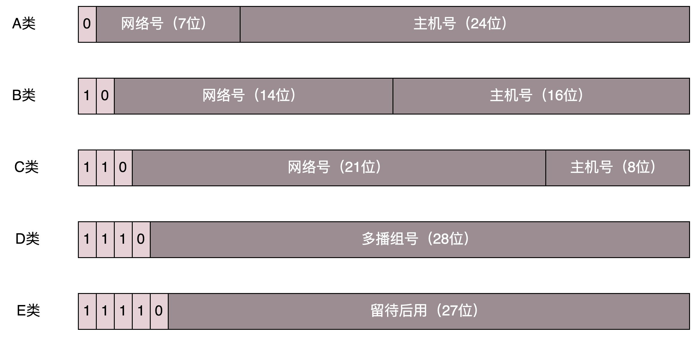
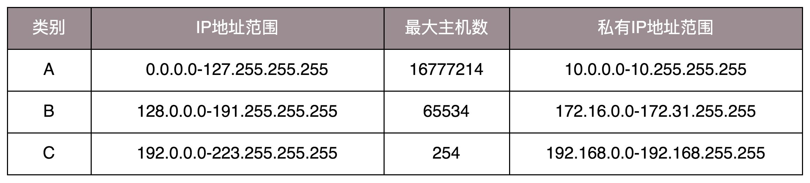
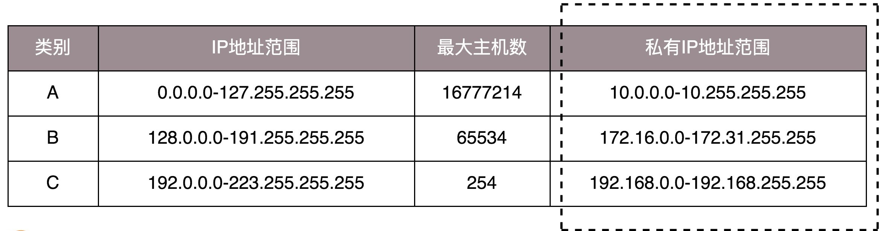

从ipconfig命令出发，解析相关概念。

<!-- more -->

## 1. 查看IP地址的方法

* 在 Windows 上是 `ipconfig`
* 在 Linux 上是 `ifconfig` 和 `ip addr`

> **Linux系统没有 ifconfig 和 ip addr 命令的解决办法**	自行安装 net-tools 和 iproute2 这两个工具。大多数情况这两个命令是系统自带的。

执行 `ip addr` 命令后，输出如下：

~~~bash
root@test:~# ip addr
1: lo: <LOOPBACK,UP,LOWER_UP> mtu 65536 qdisc noqueue state UNKNOWN group default 
    link/loopback 00:00:00:00:00:00 brd 00:00:00:00:00:00
    inet 127.0.0.1/8 scope host lo
       valid_lft forever preferred_lft forever
    inet6 ::1/128 scope host 
       valid_lft forever preferred_lft forever
2: eth0: <BROADCAST,MULTICAST,UP,LOWER_UP> mtu 1500 qdisc pfifo_fast state UP group default qlen 1000
    link/ether fa:16:3e:c7:79:75 brd ff:ff:ff:ff:ff:ff
    inet 10.100.122.2/24 brd 10.100.122.255 scope global eth0
       valid_lft forever preferred_lft forever
    inet6 fe80::f816:3eff:fec7:7975/64 scope link 
       valid_lft forever preferred_lft forever
~~~

该命令显示了这台机器上所有的网卡。大部分的网卡都会有一个 IP 地址【非必需，存在没有 IP 地址的情况】。

**IP 地址是一个网卡在网络世界的通讯地址，相当于我们现实世界的门牌号码。**

> **IP冲突**	有时电脑弹出网络地址冲突，出现上不去网的情况，很可能是 IP 地址冲突。

在上方输出结果中，`10.100.122.2` 就是一个 IP 地址。这个地址被点分隔为四个部分，每个部分 8 个 bit，所以 IP 地址总共是 32 位。这样产生的 IP 地址的数量随着计算机数量的增加而不足。因此，后来有了 IPv6，也即上面输出结果中的 `inet6 fe80::f816:3eff:fec7:7975/64`。有 128 位。

32为的IP地址被分为5类，结构如下图。

对于 A、B、 C 类主要分两部分，前面一部分是网络号，后面一部分是主机号。下图展示了 A、B、C 三类地址所能包含的主机的数量。

如上所示， C 类地址能包含的最大主机数量过少，只有 254 个；而 B 类地址能包含的最大主机数量过多。6 万台机器放在一个网络下面，一般的企业基本无法达到这个规模，空闲地址是一种资源浪费。

   

## 2. 无类型域间选路（CIDR）

为了使主机号位数适当，有了一个折中的方式称为无类型域间选路，简称 **CIDR**。这种方式打破了原来设计的几类地址的做法，将 32 位的 IP 地址一分为二，前面是**网络号**，后面是**主机号**。分割线为地址中的 `/`。观察 `10.100.122.2/24`， IP 地址中有一个斜杠，斜杠后有个数字 24。这种地址表示形式，就是 CIDR。后面 24 的意思是，32 位中，前 24 位是网络号，后 8 位是主机号。

有两个地址伴随着 CIDR 存在：

* **广播地址**：`10.100.122.255` 如果发送这个地址，所有 10.100.122 网络里面的机器都可以收到
  * 广播地址网络号部分不变，主机号部分全1

* **子网掩码**：`255.255.255.0`
  * 子网掩码网络号部分全1，主机号部分全0

将子网掩码和 IP 地址进行 AND 计算。前三个数不变，为 `10.100.122`。后面一个 0，和任何数值取 AND，都是 0，因而最后一个数变为 0，合起来就是 `10.100.122.0`。这就是**网络号**。

* 将子网掩码和 IP 地址按位计算 AND，就可得到网络号。

   

## 3. 公有 IP 地址和私有 IP 地址

上最右列是私有 IP 地址段。平时我们看到的数据中心中，办公室、家里或学校的 IP 地址，一般都是**私有 IP 地址段**。因为这些地址允许组织内部的 IT 人员自己管理、自己分配，而且**可以重复**。因此，两个不同学校可以存在相同的私有 IP 地址段。

类比每个小区有自己的楼编号和门牌号，不同小区都可以有 6 栋，但是出了小区，就需要使用**公有 IP 地址**进行区分。

公有 IP 地址有个组织统一分配，需要购买。如果搭建一个网站，给学校的人使用，学校的 IT 人员提供一个 IP 地址即可。但是假如要做一个类似网易 163 这样的网站，就需要有公有 IP 地址，这样全世界的人才能访问。

表格中的 `192.168.0.x` 是最常用的私有 IP 地址。你家里有 Wi-Fi，对应就会有一个 IP 地址。一般你家里地上网设备不会超过 256 个，所以 /24 基本就够了。有时候我们也能见到 /16 的 CIDR，这两种是最常见的，也是最容易理解的。

不需要将十进制转换为二进制 32 位，就能明显看出 `192.168.0` 是网络号，后面是主机号。而整个网络里面的第一个地址 `192.168.0.1`，往往就是你这个私有网络的出口地址。例如，家中Wi-Fi 路由器的地址就是 `192.168.0.1`，而 `192.168.0.255` 就是广播地址。一旦发送这个地址，整个 192.168.0 网络里面的所有机器都能收到。

但是也不总都是这样的情况。因此，其他情况往往就会很难理解，还容易出错。

   

## 4. 举例：一个容易“犯错”的 CIDR

考虑 `16.158.165.91/22` 这个 CIDR。求一下这个网络的**第一个地址**、**子网掩码**和**广播地址**。

注意：网络的第一个地址容易误认为是 16.158.165.1。

/22 不是 8 的整数倍，不好办，只能先变成二进制来看。16.158 的部分不会动，它占了前 16 位。中间的 165，变为二进制为‭10100101‬。网络号共22位，除去前 16 位，还剩 6 位。所以，这 8 位中前 6 位是属于网络号，即完整网络号为`16.158.<101001>`，而 `<01>.91` 是机器号。

综上所述：

* **第一个地址**： `16.158.<101001><00>.1` 【主机号从1开始】，即 `16.158.164.1`。
* **子网掩码**： `255.255.<111111><00>.0`，即 `255.255.252.0`。
* **广播地址**： `16.158.<101001><11>.255`，即 `16.158.167.255`。

> **注意**	IP地址中的 `.` 本质是对每16位2进制数进行分隔，用于方便查看数值。而IP地址的常见表示形式为10进制数表示2进制数。所以IP地址中的数字仅能表示数值，具体网络号、主机号的值，需要展开为2进制后，根据位数进行判断。

 

这五类地址中，还有一类 D 类是组播地址。使用这一类地址，属于某个组的机器都能收到。这有点类似在公司里面大家都加入了一个邮件组。发送邮件，加入这个组的都能收到。组播地址与在 VXLAN 协议相关。

在 IP 地址的后面是 scope（范围） 。`scope global eth0` 表示对于 `eth0` 这张网卡来讲，是 `global`，说明这张网卡是**可以对外**的，可以接收来自各个地方的包。对于 `lo` 来讲，是 `host`，说明这张网卡仅仅可以供**本机相互通信**。

`lo` 全称是 **`loopback`**，又称环回接口，往往会被分配到 `127.0.0.1` 这个地址。这个地址用于本机通信，经过内核处理后直接返回，不会在任何网络中出现。

   

## 5. MAC地址

在 IP 地址的上一行是：

~~~bash
link/ether fa:16:3e:c7:79:75 brd ff:ff:ff:ff:ff:ff
~~~

这个被称为 **MAC 地址**，是一个**网卡的物理地址**，用十六进制，6 个 byte 表示。

MAC 地址是一个容易让人“误解”的地址。因为 MAC 地址号称全局唯一，不会有两个网卡有相同的 MAC 地址，而且网卡自生产出来，就带着这个地址。在互联网的通信中，只要知道了对方的 MAC 地址，就可以把信息传过去吗？

答案为否定。 一个网络包要从一个地方传到另一个地方，除了要有确定的地址，还需要有定位功能。 而有门牌号码属性的 IP 地址，才是有远程定位功能的。

**MAC 地址更像是身份证，是一个唯一的标识。**它的唯一性设计是为了组网的时候，不同的网卡放在一个网络里面的时候，可以不用担心冲突。**从硬件角度**，保证不同的网卡有不同的标识。

MAC 地址有一定的定位功能，但范围非常有限——局限在一个子网里面。例如，从 `192.168.0.2/24` 访问 `192.168.0.3/24` 是可以用 MAC 地址的。一旦跨子网，即从 `192.168.0.2/24` 到 `192.168.1.2/24`，就需要 IP 地址起作用了。

   

## 6. 网络设备的状态标识

 `<BROADCAST,MULTICAST,UP,LOWER_UP>` 是**net_device flags**，**网络设备的状态标识**。

`UP` 表示网卡处于启动的状态；`BROADCAST` 表示这个网卡有广播地址，可以发送广播包；MULTICAST 表示网卡可以发送多播包；LOWER_UP 表示 L1 是启动的，也即网线插着呢。MTU1500 是指什么意思呢？是哪一层的概念呢？最大传输单元 MTU 为 1500，这是以太网的默认值。

上一节，我们讲过网络包是层层封装的。MTU 是二层 MAC 层的概念。MAC 层有 MAC 的头，以太网规定正文部分不允许超过 1500 个字节。正文里面有 IP 的头、TCP 的头、HTTP 的头。如果放不下，就需要分片来传输。

qdisc pfifo_fast 是什么意思呢？qdisc 全称是 **queueing discipline**，中文叫**排队规则**。内核如果需要通过某个网络接口发送数据包，它都需要按照为这个接口配置的 qdisc（排队规则）把数据包加入队列。

最简单的 qdisc 是 pfifo，它不对进入的数据包做任何的处理，数据包采用先入先出的方式通过队列。pfifo_fast 稍微复杂一些，它的队列包括三个波段（band）。在每个波段里面，使用先进先出规则。

三个波段（band）的优先级也不相同。band 0 的优先级最高，band 2 的最低。如果 band 0 里面有数据包，系统就不会处理 band 1 里面的数据包，band 1 和 band 2 之间也是一样。

数据包是按照服务类型（**Type of Service，TOS**）被分配到三个波段（band）里面的。TOS 是 IP 头里面的一个字段，代表了当前的包是高优先级的，还是低优先级的。

