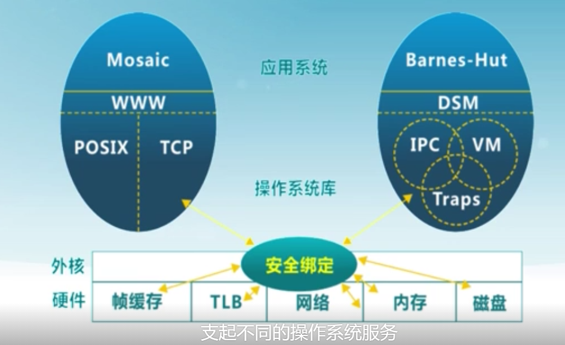

# 操作系统

---

## 1. 操作系统概述

### 1.3 什么是操作系统

#### 1.3.1 操作系统的概念

* 没有公认的精确定义
* 操作系统是一个**控制程序**
  * 一个系统软件
  * 控制程序执行过程，防止错误和计算机的不当使用
  * 执行用户程序，给用户程序提供各种服务
  * 方便你用户使用计算机系统
* 操作系统是一个**资源管理器**
  * 应用程序域硬件之间的中间层
  * 管理各种计算机软硬件资源
  * 提供访问计算机软硬件资源的高效手段
  * 解决资源访问冲突，确保资源公平使用

#### 1.3.2 操作系统软件的分类

#### 1.3.3 操作系统软件的组成

* Shell——命令行接口
  * 通过键盘操纵
  * 方便用户进行命令输入
* GUI——图形用户接口
  * WIMP(视窗（Window)、图标（Icon）、选单（Menu）、指标（Pointer））
  * 直接操作、所见即所得
* Kernel——操作系统的内部
  * 执行各种资源管理等功能

#### 1.3.4 操作系统的内核特征

* 并发

  * 计算机系统中同时存在多个运行的程序，需要OS管理和调度

* 共享

  * “同时”访问

    > 宏观上要体现出同时访问的情况

  * 互斥共享

    > 微观上实现互斥访问

* 虚拟

  * 利用多道程序设计技术，让每个用户都觉得有一个计算机为他服务

* 异步

  * 程序的执行不是一贯到底，向前推进的速度不可预知
  * 只要运行环境相同，OS要保证运行的结果也相同

#### 1.4 为什么学习操作系统，如何学习操作系统

重视实践。

  

### 1.5 操作系统实例

* 开放式：Linux
* UNIX家族
  * SVR4,BSD, Solaris, AIX, HP_UX；
* 封闭式：Windows系列
  * DOS、Windows3.0x、Window 95、Windows NT, Windows XP、Win7、Win10
* 移动端
  * Android

  

### 1.6 操作系统的演变

 

#### 1.6.1 操作系统为什么改变

* 主要功能：硬件抽象和协调管理
* 原则：设计随着各种相关技术的改变而做出一定的改变
* 在过去二十年底层技术有着极大的改变

 

#### 1.6.2 操作系统的演变

* 单用户系统
  * 能够完成单用户作业即可
  * 操作系统 = 装载器 + 通用子程序库
  * 问题：昂贵组件的低利用率
* 批处理系统
  * 提高利用效率
  * 顺序执行与批处理
* 多道程序系统
  * 提高利用效率
  * 保持多个工作在内存中并且在各工作间复用CPU
    * 内存中由原来的程序执行变成了多道程序的交替执行【**交替的条件**是前一个正在执行的程序主动让出CPU的使用权】
* 分时
  * 使前一个作业未结束时，后一个作业能够开始作业并交替运行
  * **定时中断**用于工作对CPU的复用
    * 可以让短的作业不必排在长作业后等待过久时间
* 个人计算机：每个用户一个系统
  * 易用性
    * 单用户
    * 利用率已不再是关注点，重点是用户界面和多媒体功能
    * 很多老的服务和功能不存在
  * 演变
    * 最初：操作系统作为一个简单的服务提供者（简单库）
    * 现在：支持协调和沟通的多应用系统
    * 越来越多的安全问题（如，电子商务、医疗记录）
* 分布式计算：每个用户多个系统
  * 安全性、高可靠性
  * 网络支持成为一个重要功能
  * 通常支持分布式服务
    * 跨多系统的数据共享和协调
  * 可能使用多个处理器
    * 松、紧耦合系统
  * 高可用性与可靠性的要求

  

### 1.7 操作系统结构

 

#### 1.7.1 简单结构

* MS-DOS——在最小的空间，设计用于提供大部分功能（1981~1994）
  * 没有拆分为模块
  * MS-DOS在接口和功能水平没有很好地分离，主要用汇编编写

 

#### 1.7.2 分层结构

* 操作系统分为很多层（levels）
  * 每层建立在低层之上
  * 最底层（layer0），是硬件
  * 最高层（layerN）是用户界面
* 使用模块化，每一层仅使用更低一层的功能（操作）和服务
  * 底层汇编编写，链接

 

#### 1.7.3 微内核结构（Microkernel）

分层结构层次多，效率低，因而采用微内核结构作为一种改进办法。

尝试把一些操作系统内核提供的服务放到用户态。

* 尽可能把内核功能移到用户空间
* 用户模块间的通信使用消息传递

好处：灵活/安全

缺点：性能

 

#### 1.7.4 外核结构（Exokernel）

是对微内核结构的进一步改进，它尝试在内核中放更少的东西，让内核只起到资源保护、隔离的作用。把资源的管理的任务交给应用态的代码完成。

原来操作系统的功能通过用户态的函数库提供。

这种情况下，操作系统的硬件资源上只有很薄的一层安全绑定，在安全绑定中，控制哪一个资源归哪一个系统使用，相应的资源管理由各自的系统自己维护。这种情况下，就可以在一个系统上支起不同的操作系统服务。

从某种角度来说，这类似一个虚拟机的结构。

 

#### 1.7.5 （VMM）虚拟机管理器结构

在计算机的硬件之上架了一个VMM（虚拟机管理器），负责把真实的硬件虚拟成若干个虚拟的硬件，操作系统在其之上实现传统操作系统的功能	

* 虚拟机管理器将单独的机器接口转换成很多的虚拟机，每个虚拟机都是一个原始计算机系统的有效副本，并能完成所有的处理器指令。
* 虚拟机管理器决定每一个虚拟机可以使用哪些硬件资源。

有了这样一个管理器之后，传统的操作系统与硬件的关系和应用之间的关系发生变化——虚拟机管理器负责资源的隔离，操作系统负责资源的管理。

