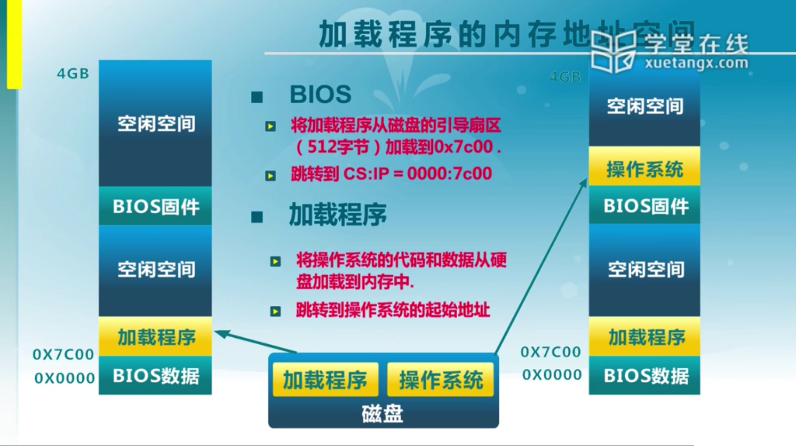

# 2-启动、中断、异常和系统调用

  

## 摘要

* 启动
  * 计算机体系结构概述
  * 计算机内存和硬盘布局
  * 系统启动流程
* 中断、异常和系统调用

  

## 2.1 BIOS

 

#### 2.1.1 启动时计算机内存和磁盘布局

 

BIOS启动固件：

* 基本输入输出的程序
  * 完成从磁盘读数据，从键盘读用户的输入，从显示器显示相应的输出
* 系统设置（配置）信息
  * 如启动方式的选择（从硬盘启动、从网络启动、从光盘启动），它是由BIOS内部的设置决定的
  * 依据这些设置，系统执行它的启动程序（从硬盘将加载程序和操作系统内容加载到系统中）
* 开机后自检程序
* 系统自启动程序

 

具体过程如下：

* BIOS
  * 将加载程序从磁盘的引导扇区（512字节）加载到0x7c00
  * 跳转到CS:IP = 0000:7c00（将控制权交给加载程序）
* 加载程序
  * 将操作系统的代码和数据从硬盘加载到内存中
  * 跳转到操作系统的起始地址（将控制权交给操作系统）

> **为什么要通过加载程序，而不是直接从BIOS将操作系统的内核映像读入内存？**
>
> 因为存在一些问题：磁盘上有文件系统，且文件系统是多种多样的。机器出场时，不可以直接限制机器只能用某一种特定的文件系统。为了保证灵活性，且无法确保BIOS认识所有文件系统代码，所以设置了一个基本约定——无需认识格式，也可以读取内存中的第一块内容【即加载程序所处位置】，读取了加载程序后，通过加载程序来识别磁盘上的文件系统。此时，认识了文件系统之后，就可以读取内核的镜像，并将其加载进内存。

 

#### 2.1.2 BIOS系统调用

* BIOS以中断调用的方式 提供了基本的I/O功能
  * INT 10h：字符显示
  * INT 13h：磁盘扇区读写
  * INT 15h：检测内存大小
  * INT 16h：键盘输入
* 只能在x86的实模式下访问

  

## 2.2 系统启动流程

* BIOS
  * 系统加电，BIOS初始化硬件
* 主引导记录
  * BIOS读取主引导扇区代码【硬盘包含多个分区，由主引导记录指引读取该扇区的加载程序】
* 活动分区
  * 主引导扇区代码读取活动分区的引导扇区代码
* 加载程序
  * 活动分区的引导扇区来加载加载程序
  * 加载程序是指引导扇区代码读取的文件系统的加载程序

 

### 2.2.1 CPU初始化

CPU加电稳定后从0XFFFF0读取第一条指令

* CS:IP=0xf000:fff0
* 第一条指令是跳转指令

CPU初始状态为16位实模式

* CS:IP是16位寄存器
* 指令指针PC=16*CS+IP
* 最大地址空间为1MB【原因是此时只有20位的地址】

 

### 2.2.2 BIOS初始化过程

> **BIOS**	（**B**asic **I**nput/**O**utput **S**ystem），**基本输入输出系统**，亦称为ROM BIOS、System BIOS、PC BIOS，是在通电引导阶段运行硬件初始化，以及为操作系统提供运行时服务的[固件](https://zh.wikipedia.org/wiki/韌體)。BIOS最早随着[CP/M](https://zh.wikipedia.org/wiki/CP/M)操作系统的推出在1975年出现。BIOS预安装在[个人电脑](https://zh.wikipedia.org/wiki/個人電腦)的[主板](https://zh.wikipedia.org/wiki/主機板)上，是[个人电脑](https://zh.wikipedia.org/wiki/个人电脑)启动时加载的第一个软件。
>
> 现在，BIOS的作用是初始化和测试[硬件](https://zh.wikipedia.org/wiki/硬體)组件，以及从大容量存储设备（如[硬盘](https://zh.wikipedia.org/wiki/硬碟)）加载[引导程序](https://zh.wikipedia.org/wiki/啟動程式)，并由[引导程序](https://zh.wikipedia.org/wiki/啟動程式)加载操作系统；当加载[操作系统](https://zh.wikipedia.org/wiki/作業系統)后，BIOS通过[系统管理模式](https://zh.wikipedia.org/wiki/系统管理模式)为[操作系统](https://zh.wikipedia.org/wiki/作業系統)提供[硬件抽象](https://zh.wikipedia.org/wiki/硬體抽象)。在DOS时代，BIOS为[DOS](https://zh.wikipedia.org/wiki/DOS)操作系统提供键盘、显示及其他[I/O](https://zh.wikipedia.org/wiki/I/O)设备的[硬件抽象层](https://zh.wikipedia.org/wiki/硬體抽象層)。
>
> 许多BIOS程序都只能在特定电脑型号或特定主板型号上运行。早年，BIOS存储于[ROM](https://zh.wikipedia.org/wiki/ROM)芯片上；现在的BIOS多存储于[闪存](https://zh.wikipedia.org/wiki/快閃記憶體)芯片上，这方便了BIOS的更新。

* 硬件自检POST
* 检测系统中内存和显卡等关键部件的存在和工作状态；
* 查找并执行显卡等接口卡BIOS，进行设备初始化；
* 执行系统BIOS，进行系统检测；
  * 检测和配置系统中安装的即插即用设备
* 更新CMOS中的扩展系统配置数据ESCD

> ESCD	扩展系统配置数据。通过该数据，可以知道当前系统有什么设备。【每次加电后可能会插上新的卡，或拔掉已有的卡，会导致该数据变化。所以每次更新ESCD的动作是必要的。】

* 按指定启动顺序从软盘、硬盘或光驱启动

 

### 2.2.3 主引导记录MBR格式

* 启动代码：446字节
  * 检查分区表正确性
  * 加载并跳转到磁盘上的引导程序
* 硬盘分区表：64字节
  * 描述分区状态和位置
  * 每个分区描述信息占据16字节
* 结束标志字：2字节（55AA）
  * 主引导记录的有效标志

<b>

### 2.2.4 分区引导扇区格式

* 跳转指令：跳转到启动代码
  * 该代码与平台相关
* 文件卷头：文件系统描述信息
* 启动代码：跳转到加载程序
  * 这里的加载程序可位于分区中的任意位置，只需要启动代码所给出的地址与之匹配即可
* 结束标志：55AA

 

### 2.2.5 加载程序

加载程序不直接加载内核，而是从文件系统中读取**启动配置文件**，依据配置加载指定内核并跳转到内核执行。

 

### 2.2.6 系统启动规范

* BIOS
  * 固化到计算机主板上的程序
  * 包括系统设置、自检程序和系统自启动程序
  * BIOS-MBR、BIOS-GPT、PXE
* UEFI
  * 接口标准
  * 在所有平台上一致的操作系统启动服务

  

## 2.3 中断、异常和系统调用比较

摘要：

* 背景
* 中断、异常和系统调用相比较
* 中断和异常处理机制
* 系统调用的概念和实现
* 程序调用与系统调用的不同之处
* 开销
* 系统调用实例

 

### 2.3.1 背景

为什么需要中断、异常和系统调用

* 在计算机中，内核是被信任的第三方
* 只有内核可以执行特权指令
* 方便应用程序

**中断和异常希望解决的问题**

* 当**外设**连接计算机时，会出现什么现象？
* 当应用程序处理意想不到的行为时，会出现什么现象？

**系统调用希望解决的问题**

* 用户应用程序是如何得到系统服务？
* 系统调用和功能调用的不同之处是什么？

 

### 2.3.2 中断、异常、系统调用的定义

* **系统该调用（system call）**：应用程序**主动**向操作系统发出的服务请求。
* **异常（exception）**：非法指令或者其他原因导致当前**指令执行失败**后的处理请求。
  * 如：内存出错后的处理请求。
* **中断（hardware interrupt）**：来自硬件设备的处理请求。

 

### 2.3.3 中断、异常、系统调用比较

1. **源头**
   * 中断：外设
   * 异常：应用程序意想不到的行为
   * 系统调用：应用程序请求操作系统提供服务
2. **响应方式**
   * 中断：异步
   * 异常：同步
   * 系统调用：异步或同步
3. **处理机制**
   * 中断：持续，对用户应用程序是透明的
   * 异常：杀死或重新执行意想不到的应用程序指令
   * 系统调用：等待和持续

 

### 2.3.4 中断、异常的处理机制

**硬件处理**

在CPU初始化时设置中断使能标志

* 依据内部或外部事件
* 依据中断向量调用相应中断服务例程

**软件处理**

* 现场保存（编译器）
* 终端服务处理（服务例程）
* 清除终端标记（服务例程）
* 现场恢复（编译器）

  

## 2.4 系统调用

### 2.4.1 标准C库的例子

应用程序调用`printf()`时，会触发系统调用`write()`。

 

### 2.4.2 系统调用

* **操作系统服务的编程接口**
* 通常由高级语言编写（C或C++）
* **程序访问**通常是通过高层次的`API`接口而不是直接进行系统调用
  * 比如把系统调用封装到一个库中（如标准C库），应用程序调用库中的库函数进行系统调用
* 三种最常用的应用程序编程接口（API）
  * Win32 API 用于 Windows
  * POSIX API 用于 POSIX-based systems（包括UNIX、LINUX、Mac OS X的所有版本）
  * Java API 用于 Java虚拟机

 

### 2.4.3 系统调用的实现

* 每个系统调用对应一个**系统调用号**
  * 系统调用接口根据系统调用号维护表的索引
* 系统调用接口调用内核态中的系统调用功能实现，并返回系统调用的状态和结果

