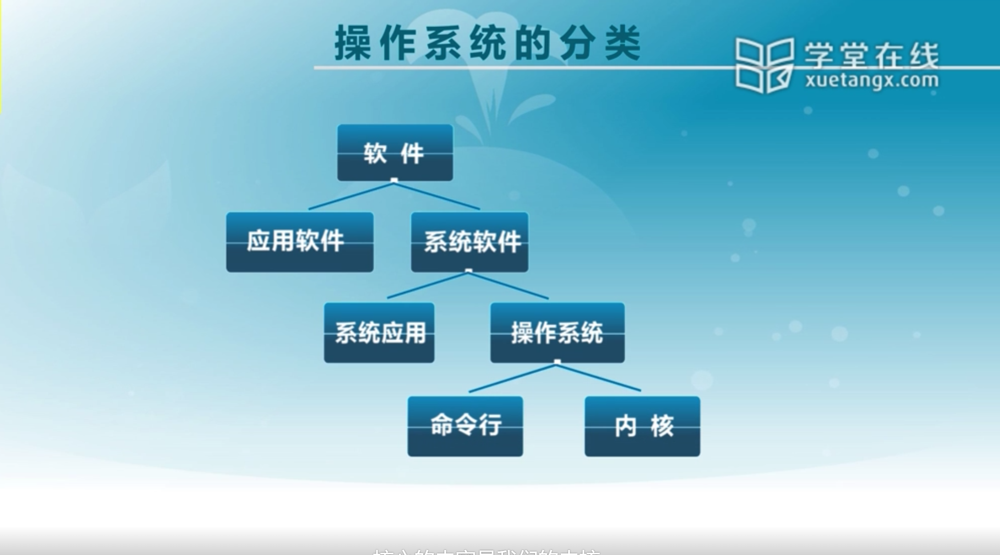

# 操作系统

---

# 目录

---

# 操作系统概述

## 1.3 什么是操作系统

### 1.3.1 操作系统的概念

* 没有公认的精确定义
* 操作系统是一个**控制程序**
  * 一个系统软件
  * 控制程序执行过程，防止错误和计算机的不当使用
  * 执行用户程序，给用户程序提供各种服务
  * 方便你用户使用计算机系统
* 操作系统是一个**资源管理器**
  * 应用程序域硬件之间的中间层
  * 管理各种计算机软硬件资源
  * 提供访问计算机软硬件资源的高效手段
  * 解决资源访问冲突，确保资源公平使用

### 1.3.2 操作系统软件的分类

### 1.3.3 操作系统软件的组成

* Shell——命令行接口
  * 通过键盘操纵
  * 方便用户进行命令输入
* GUI——图形用户接口
  * WIMP(视窗（Window)、图标（Icon）、选单（Menu）、指标（Pointer））
  * 直接操作、所见即所得
* Kernel——操作系统的内部
  * 执行各种资源管理等功能

### 1.3.4 操作系统的内核特征

* 并发

  * 计算机系统中同时存在多个运行的程序，需要OS管理和调度

* 共享

  * “同时”访问

    > 宏观上要体现出同时访问的情况

  * 互斥共享

    > 微观上实现互斥访问

* 虚拟

  * 利用多道程序设计技术，让每个用户都觉得有一个计算机为他服务

* 异步

  * 程序的执行不是一贯到底，向前推进的速度不可预知
  * 只要运行环境相同，OS要保证运行的结果也相同

### 1.4 为什么学习操作系统，如何学习操作系统

# 操作系统结构

---

# 中断及系统调用

---

# 内存管理

----

# 进程及线程

---

# 处理机调度

---

# 同步互斥

---

# 文件系统

---

# I/0子系统

